# Part 0: The Map

Before you start learning the details, you need **the big picture**. This chapter is your map—it shows what we're building, how the pieces connect, and where your data travels.

Think of this as looking at a city map before exploring the streets. You'll return to this chapter often as you build each piece.

---

## What We're Building

**SwatNotes** is a production-grade desktop notes application. "Production-grade" means it's not a toy—it has:

- ✅ Rich text editing with formatting, images, and attachments
- ✅ Encrypted backups with AES-256-GCM
- ✅ System tray integration and global hotkeys
- ✅ Time-based reminders with notifications
- ✅ Auto-updates
- ✅ Full-text search across thousands of notes
- ✅ Collections/folders for organization
- ✅ Content-addressed storage (no duplicate files)
- ✅ OneNote import (sections → collections)

All of this runs **locally** on your machine—no servers, no cloud, complete privacy.

---

## The 10,000-Foot View

Here's the entire system in one diagram:


**What this means:**

1. **User** interacts with a web interface (HTML/CSS/JS)
2. **Tauri** embeds this interface in a native window (like Chrome but tiny)
3. **IPC Bridge** lets JavaScript call Rust functions (and vice versa)
4. **Rust Backend** handles all business logic, security, and storage
5. **Persistent Storage** keeps everything safe between app restarts

**Key Insight**: The frontend (JavaScript) **never** touches the database or filesystem directly. It **always** goes through Rust commands. This is how we maintain security and data integrity.

---

## Technology Stack Deep Dive


### Why These Technologies?

| Technology | Purpose | Why Not Alternatives? |
|-----------|---------|---------------------|
| **Rust** | Backend language | Memory safety without garbage collection. No runtime crashes. |
| **Tauri v2** | Desktop framework | Smaller than Electron (5MB vs 150MB). Native performance. |
| **SQLite** | Database | Zero-config. Embedded. ACID guarantees. Reliable. |
| **SQLx** | Database library | Compile-time SQL checking. No runtime SQL errors. |
| **DaisyUI** | UI components | Beautiful themes out-of-box. Built on Tailwind. |
| **Quill.js** | Rich text editor | Mature, extensible, Delta format for data. |
| **Tokio** | Async runtime | Standard in Rust. Efficient concurrency. |

---

## System Architecture

Let's zoom into the Rust backend's layers:


### Architectural Principles

1. **Separation of Concerns**
   - Commands = thin HTTP-like handlers
   - Services = business logic
   - Repository = data access only
   - Each layer has one job

2. **Dependency Flow**
   - Always flows inward: UI → Commands → Services → Data
   - Never backwards (Data doesn't know about UI)

3. **Error Handling**
   - Every layer can fail
   - Errors bubble up using `Result<T, AppError>`
   - Logged at every boundary

4. **State Management**
   - Shared `AppState` holds all services
   - Accessed via Tauri's state management
   - Thread-safe with `Arc` and interior mutability

---

## End-to-End Data Flow: Creating a Note

Let's follow **one piece of data** through the entire system. This is the "running example" we'll reference throughout the book.

**Scenario**: User types "Buy groceries" in the editor and the app autosaves.


### What Just Happened?

1. **User types** → Quill emits a change event
2. **Debounce** → Wait 500ms (don't save on every keystroke!)
3. **Invoke Tauri command** → `create_note` called from TypeScript
4. **Service layer** → Validates, generates UUID
5. **Repository** → Executes SQL INSERT in transaction
6. **FTS indexing** → Makes note searchable
7. **Response bubbles back** → Through every layer
8. **UI updates** → Silently, no jarring feedback

**Why this architecture?**
- **Separation**: Frontend doesn't know SQL, backend doesn't know DOM
- **Testability**: Each layer can be tested independently
- **Safety**: Rust's type system prevents many bugs
- **Performance**: Debouncing prevents 100 writes/second

---

## Key Data Models

These are the core types you'll work with:


### Data Model Insights

| Model | Purpose | Key Fields | Storage Location |
|-------|---------|-----------|-----------------|
| **Note** | Core entity | `content_json` (Quill Delta) | SQLite `notes` table |
| **Attachment** | File linked to note | `blob_hash` (SHA-256) | SQLite + blob files |
| **Collection** | Folder/tag | `sort_order` | SQLite `collections` table |
| **Reminder** | Time-based alert | `trigger_time`, `triggered`, notification settings | SQLite `reminders` table |
| **Backup** | Snapshot | `manifest_hash` | SQLite + ZIP file |

**Why JSON for content?**  
Quill uses the Delta format—a structured representation of rich text. Storing as JSON lets us query and index text while preserving formatting.

**Why SHA-256 for blobs?**  
Content-addressed storage. If two notes have the same image, we store it once. Hash = fingerprint.

---

## Directory Structure

Where does everything live?

```
SwatNotes/
├── src/                          # Frontend (TypeScript)
│   ├── main.ts                   # App entry point
│   ├── types.ts                  # TypeScript interfaces
│   ├── config.ts                 # Frontend configuration
│   ├── components/               # UI components
│   │   ├── noteEditor.ts         # Quill integration
│   │   └── notesList.ts          # Note list rendering
│   ├── utils/                    # API wrappers
│   │   ├── notesApi.ts           # Notes CRUD
│   │   ├── backupApi.ts          # Backup operations
│   │   ├── attachmentsApi.ts     # Attachment handling
│   │   ├── collectionsApi.ts     # Collections CRUD
│   │   ├── remindersApi.ts       # Reminders CRUD
│   │   └── updateApi.ts          # Auto-update checks
│   ├── events/
│   │   └── handlers.ts           # Event handlers
│   ├── ui/
│   │   ├── backup.ts             # Backup UI logic
│   │   └── theme.ts              # Theme management
│   ├── state/
│   │   └── appState.ts           # Global state
│   └── styles/
│       └── main.css              # Tailwind + DaisyUI
│
├── src-tauri/                    # Rust Backend
│   ├── src/
│   │   ├── main.rs               # Entry point
│   │   ├── lib.rs                # Public library
│   │   ├── app.rs                # AppState setup
│   │   ├── config.rs             # Backend configuration
│   │   ├── commands/             # Tauri commands
│   │   │   ├── mod.rs            # Command exports
│   │   │   ├── notes.rs          # Note commands
│   │   │   ├── backup.rs         # Backup commands
│   │   │   ├── attachments.rs    # Attachment commands
│   │   │   ├── collections.rs    # Collection commands
│   │   │   ├── reminders.rs      # Reminder commands
│   │   │   ├── settings.rs       # Settings commands
│   │   │   ├── windows.rs        # Window management
│   │   │   └── updater.rs        # Auto-update commands
│   │   ├── services/             # Business logic
│   │   │   ├── mod.rs            # Service exports
│   │   │   ├── notes.rs          # NotesService
│   │   │   ├── backup.rs         # BackupService
│   │   │   ├── attachments.rs    # AttachmentsService
│   │   │   ├── reminders.rs      # RemindersService
│   │   │   ├── settings.rs       # SettingsService
│   │   │   └── scheduler.rs      # SchedulerService
│   │   ├── database/             # Data layer
│   │   │   ├── schema.rs         # Migrations
│   │   │   ├── repository.rs     # SQL operations
│   │   │   └── models.rs         # Data models
│   │   ├── storage/
│   │   │   └── blob_store.rs     # File storage
│   │   ├── crypto.rs             # Encryption
│   │   └── error.rs              # Error types
│   ├── Cargo.toml                # Rust dependencies
│   └── tauri.conf.json           # Tauri config
│
├── public/                       # Static assets
├── dist/                         # Built frontend (generated)
├── target/                       # Compiled Rust (generated)
│
└── docs/                         # This book!
    ├── README.md
    ├── SUMMARY.md
    ├── PROGRESS.md
    └── chapters/
        ├── 00-the-map.md
        ├── 01-first-principles.md
        └── ...
```

**Mental Model**: Think of `src/` as the **skin** (what users see) and `src-tauri/` as the **organs** (what does the work).

---

## App Data Directory

At runtime, SwatNotes stores data in:

- **Windows**: `C:\Users\<user>\AppData\Roaming\swatnotes\`

Inside this directory:

```
swatnotes/
├── db.sqlite              # Main database
├── db.sqlite-wal          # Write-Ahead Log (SQLite)
├── db.sqlite-shm          # Shared memory (SQLite)
├── blobs/                 # Content-addressed files
│   ├── ab/
│   │   └── cd/
│   │       └── abcd1234...ef (SHA-256 hash as filename)
├── backups/               # Encrypted ZIP files
│   ├── backup_2026-01-27_143022.zip
│   └── ...
└── logs/
    └── swatnotes.log      # Application logs
```

**Why this structure?**
- SQLite WAL mode = better concurrency and crash safety
- Blob sharding (`ab/cd/`) = avoids filesystem limits (too many files in one folder)
- Separate backups folder = easy to browse/copy

---

## Communication Patterns

### 1. Frontend → Backend (Commands)


**Key Points**:
- Frontend **calls** backend (never the other way)
- All calls are **async** (use `await`)
- Type-safe: TypeScript types match Rust structs

### 2. Backend → Frontend (Events)


**When to use**:
- Background tasks (reminders, auto-backup)
- Server-initiated updates
- Progress reporting (e.g., download progress)

---

## Error Flow

Errors can happen anywhere. Here's how they propagate:

```mermaid
graph TD
    UserAction["User Action"]
    Frontend["Frontend (TypeScript)"]
    Command["Tauri Command"]
    Service["Service Layer"]
    Repository["Repository"]
    DB["SQLite"]
    
    UserAction -->|"Click 'Save'"| Frontend
    Frontend -->|"invoke('update_note')"| Command
    Command -->|"service.update_note()"| Service
    Service -->|"repo.update_note()"| Repository
    Repository -->|"SQL UPDATE"| DB
    
    DB -.->|"❌ UNIQUE constraint failed"| Repository
    Repository -.->|"Err(DatabaseError)"| Service
    Service -.->|"Err(AppError)"| Command
    Command -.->|"Err(serialized)"| Frontend
    Frontend -.->|"Show alert"| UserAction
    
    style DB fill:#ffe1e1
    style UserAction fill:#e1f5ff
```



**Error Handling Rules**:
1. **Rust**: Use `Result<T, AppError>` everywhere
2. **Never panic** in production code
3. **Log** errors at the boundary
4. **Convert** to user-friendly messages in frontend

---

## Concurrency Model

SwatNotes uses **async Rust** with Tokio:


**Mental Model**:
- Think of async as "waiting without blocking"
- Like ordering food: you don't stand at the counter waiting—you sit down and they call you
- Tokio manages the "waiters" (threads) efficiently

---

## Security Boundaries

Where security matters:

```mermaid
graph LR
    subgraph "Untrusted Zone"
        User["User Input"]
        Clipboard["Clipboard Data"]
        Files["Dropped Files"]
    end
    
    subgraph "Trusted Zone"
        Validation["Input Validation<br/>(commands layer)"]
        Sanitization["SQL Parameterization<br/>(SQLx)"]
        Encryption["AES-256-GCM<br/>(backups)"]
    end
    
    subgraph "Storage"
        DB[(Encrypted Backups)]
        Plaintext[(Plaintext DB)]
    end
    
    User --> Validation
    Clipboard --> Validation
    Files --> Validation
    
    Validation --> Sanitization
    Sanitization --> Plaintext
    
    Validation --> Encryption
    Encryption --> DB
    
    style "Untrusted Zone" fill:#ffe1e1
    style "Trusted Zone" fill:#fff4e1
    style Storage fill:#e1ffe1
```

**Security Principles**:
1. **Never trust user input** (validate everything)
2. **Use parameterized queries** (prevent SQL injection)
3. **Encrypt backups** (but not the working DB—trade-off for speed)
4. **Store passwords in OS keyring** (never in DB)

---

## Build and Runtime Flow

How does code become an app?


**Development vs Production**:
- **Dev**: Hot-reload, unoptimized, debug logs
- **Prod**: Minified JS, optimized Rust (LTO), stripped binaries

---

## What's Next?

You now have the map. You know:

✅ What SwatNotes does  
✅ How the pieces connect  
✅ Where data flows  
✅ Which technologies we use  

Next steps:

1. **Chapter 1**: Learn Rust fundamentals with real-life analogies
2. **Chapter 2**: Set up your environment
3. **Chapter 3**: Build your first Tauri command

Keep this chapter open in another tab. You'll reference these diagrams constantly.

---

## Quick Reference: The Layers

| Layer | Purpose | Example Files | Language |
|-------|---------|--------------|----------|
| **UI** | User interface | `noteEditor.ts`, `main.css` | TypeScript, CSS |
| **API Wrappers** | Type-safe calls to backend | `notesApi.ts` | TypeScript |
| **Commands** | Thin HTTP-like handlers | `commands/notes.rs` | Rust |
| **Services** | Business logic | `services/notes.rs` | Rust |
| **Repository** | Data access | `database/repository.rs` | Rust |
| **Storage** | Persistence | SQLite, files | SQL, binary |

**Mantra**: *UI knows nothing about storage. Storage knows nothing about UI. Services coordinate.*

---

[Next: Chapter 1 - First Principles →](01-first-principles.md)
