# Chapter 2: Setting Up Your Environment

Before you can build anything with Rust and Tauri, you need the right tools. This chapter walks you through installing everything step-by-step.

**Time Required**: 30-60 minutes (mostly downloads)

**What You'll Install**:
- Rust (programming language and toolchain)
- Node.js (for frontend build tools)
- Platform-specific dependencies (OS libraries)
- VS Code with extensions (recommended editor)

By the end, you'll have a working development environment and understand what each tool does.

---

## Overview: The Tool Stack

**Mental Model**: Think of building a house. You need different tools for different jobs:

- **Rust** = Your power tools (compiler, package manager)
- **Node.js** = Your hand tools (JavaScript build system)
- **System Libraries** = The foundation and materials (OS-specific requirements)
- **VS Code** = Your workbench (where you organize everything)


**Why Both Rust AND Node.js?**

- **Rust**: Compiles your backend (database, file operations, encryption)
- **Node.js**: Bundles your frontend (HTML, CSS, JavaScript with Vite)

Tauri combines both into a single desktop app.

---

## Step 1: Install Rust

Rust comes with **rustup**, a version manager and installer.

### Windows

1. **Download rustup-init.exe**:
   - Visit [https://rustup.rs/](https://rustup.rs/)
   - Click "Download rustup-init.exe (64-bit)"

2. **Run the installer**:
   - Double-click `rustup-init.exe`
   - You'll see: `1) Proceed with installation (default)`
   - Press **Enter**

3. **Wait for installation** (5-10 minutes):
   - Downloads Rust compiler, Cargo, standard library
   - Configures PATH automatically

4. **Restart your terminal**:
   - Close and reopen PowerShell/Command Prompt
   - PATH changes won't take effect until restart

### Verify Installation

Open a **new** terminal and run:

```bash
rustc --version
cargo --version
```

You should see something like:
```
rustc 1.70.0 (90c541806 2023-05-31)
cargo 1.70.0 (ec8a8a0ca 2023-04-25)
```

**What Did We Just Install?**

| Tool | Purpose |
|------|---------|
| **rustc** | Rust compiler (turns `.rs` files into machine code) |
| **cargo** | Package manager and build tool (like npm for Rust) |
| **rustup** | Toolchain manager (keeps Rust updated) |

💡 **Tip**: Run `rustup update` every few months to get the latest Rust version.

---

## Step 2: Install Node.js

Node.js provides `npm` (package manager) and build tools for the frontend.

### Windows

1. **Download Node.js**:
   - Visit [https://nodejs.org/](https://nodejs.org/)
   - Download **LTS** version (e.g., 20.x)
   - Run the `.msi` installer

2. **Follow installer**:
   - Accept defaults
   - Check "Automatically install necessary tools"
   - Wait 5 minutes

3. **Restart terminal**

### Verify Installation

```bash
node --version
npm --version
```

Expected output:
```
v20.11.0
10.2.4
```

**SwatNotes Requirement**: Node.js 18+ (from [package.json](../../package.json))

---

## Step 3: Platform-Specific Dependencies

Tauri needs OS-specific libraries to create native windows and render web content.

### Windows

**WebView2**: Usually pre-installed on Windows 10/11.

**If missing**, download from:
[https://developer.microsoft.com/microsoft-edge/webview2/](https://developer.microsoft.com/microsoft-edge/webview2/)

**Visual Studio Build Tools** (for compiling native code):

Option A - Quick (via rustup):
```powershell
# When you installed Rust, rustup may have offered to install VS Build Tools
# If not, run:
rustup toolchain install stable-msvc
```

Option B - Manual:
1. Download [Visual Studio Build Tools](https://visualstudio.microsoft.com/downloads/#build-tools-for-visual-studio-2022)
2. Install "Desktop development with C++"

---

## Step 4: Install VS Code (Recommended)

While you can use any editor, **VS Code** has excellent Rust and Tauri support.

### Download and Install

1. Visit [https://code.visualstudio.com/](https://code.visualstudio.com/)
2. Download for your OS
3. Install with defaults

### Essential Extensions

Open VS Code → Extensions (Ctrl+Shift+X) → Search and install:

#### 1. **rust-analyzer**

- **Purpose**: Rust language support
- **Features**:
  - Code completion
  - Error checking (as you type!)
  - Inline documentation
  - Refactoring tools

**Install**:
```
Ctrl+Shift+X → Search "rust-analyzer" → Install
```

⚠️ **Not "Rust" extension** — Use **rust-analyzer** (it's newer and better).

#### 2. **Tauri** (Optional but helpful)

- **Purpose**: Tauri-specific snippets and helpers
- **Search**: "tauri" by Tauri Contributors

#### 3. **Even Better TOML** (Optional)

- **Purpose**: Syntax highlighting for `Cargo.toml`
- **Search**: "Even Better TOML"

### Configure rust-analyzer

Create `.vscode/settings.json` in your project:

```json
{
  "rust-analyzer.check.command": "clippy",
  "rust-analyzer.cargo.features": "all"
}
```

This enables **Clippy** (Rust's linter) for better error messages.

---

## Step 5: Create Your First Tauri Project

Now let's verify everything works by creating a test project.

### Install Tauri CLI

The Tauri CLI creates and manages projects:

```bash
npm install -g @tauri-apps/cli
```

(Or use `cargo install tauri-cli` for the Rust version)

### Create a Test Project

```bash
# Navigate to a folder where you keep projects
cd ~/projects  # or C:\Users\YourName\projects on Windows

# Create a new Tauri app
npm create tauri-app@latest
```

**You'll be prompted**:

1. **Project name**: `my-first-tauri-app`
2. **Choose package manager**: `npm` (press Enter)
3. **Choose UI template**: `Vanilla` (simplest)
4. **Choose UI flavor**: `TypeScript`

### Project Structure

Your new project looks like this:

```
my-first-tauri-app/
├── src/                    # Frontend code
│   ├── main.ts
│   ├── styles.css
│   └── ...
├── src-tauri/              # Rust backend
│   ├── src/
│   │   └── main.rs         # Entry point
│   ├── Cargo.toml          # Rust dependencies
│   └── tauri.conf.json     # Tauri config
├── package.json            # Node dependencies
└── index.html              # Main HTML file
```

**Mental Model**: This mirrors SwatNotes structure (frontend in `src/`, backend in `src-tauri/`).

### Run the App

```bash
cd my-first-tauri-app
npm install              # Install frontend dependencies
npm run tauri dev        # Start development server
```

**What Happens**:

1. **Vite** bundles your frontend (HTML/CSS/JS)
2. **Cargo** compiles your Rust backend
3. **Tauri** launches a native window with your app

**First run takes 5-10 minutes** (compiling all dependencies). Subsequent runs are much faster (~10 seconds).

**Expected Result**: A small window appears with "Welcome to Tauri!"

🎉 **Success!** If you see the window, your environment is correctly set up.

### Troubleshooting

**Error: "cargo not found"**
- Restart terminal (PATH not updated)

**Error: "WebView2 not installed"**
- Download from [Microsoft WebView2](https://developer.microsoft.com/microsoft-edge/webview2/)

**Slow compile times**:
- Normal for first build (compiling 200+ crates)
- Subsequent builds are incremental (faster)

---

## Understanding Your Setup

Let's map what you installed to what SwatNotes uses:


### Dependency Verification

Let's check what versions SwatNotes actually uses.

**From [src-tauri/Cargo.toml](../../src-tauri/Cargo.toml)**:
- Rust edition: **2021** (requires Rust 1.56+)
- Tauri: **2.0**
- SQLx: **0.8**
- Tokio: **1** (async runtime)

**From [package.json](../../package.json)**:
- Node.js: **18+** (required by Vite 7)
- Vite: **7.3.1**
- Quill: **2.0.2**
- DaisyUI: **4.12.14**

💡 **Tip**: Run `rustc --version` and `node --version` to confirm you meet these requirements.

---

## Common Environment Issues

### Issue 1: "rustc: command not found"

**Cause**: PATH not updated after Rust installation.

**Fix**: Restart your terminal or computer. PATH changes take effect after restart.

### Issue 2: "npm install" fails with permissions error

**Cause**: Global npm packages require admin rights.

**Fix**: Run as Administrator or use `npx` instead of global install.

### Issue 3: Rust version too old

**Cause**: Outdated Rust installation.

**Fix**:
```bash
rustup update stable
rustc --version  # Should be 1.70+
```

### Issue 4: "Unable to find vcvarsall.bat"

**Cause**: Missing Visual Studio Build Tools.

**Fix**: Install from [Visual Studio Downloads](https://visualstudio.microsoft.com/downloads/#build-tools-for-visual-studio-2022)

---

## Development Workflow Preview

Now that your environment is set up, here's how you'll work daily:

```mermaid
sequenceDiagram
    actor Dev as Developer
    participant Editor as VS Code
    participant Terminal as Terminal
    participant Rust as Rust Compiler
    participant Node as Vite/Node
    participant App as Running App
    
    Dev->>Editor: Open project folder
    Dev->>Terminal: npm run tauri dev
    
    Terminal->>Node: Start Vite dev server
    Terminal->>Rust: Compile Rust code
    
    Node-->>Terminal: ✓ Frontend ready (localhost:5173)
    Rust-->>Terminal: ✓ Backend compiled
    
    Terminal->>App: Launch app window
    
    Dev->>Editor: Edit main.ts
    Editor->>Node: File changed
    Node->>App: Hot-reload UI (instant!)
    
    Dev->>Editor: Edit main.rs
    Editor->>Rust: File changed
    Rust->>App: Recompile + restart (~5s)
    
    Note over Dev,App: Frontend changes = instant<br/>Backend changes = 5-10s rebuild
```



**Key Insight**:
- **Frontend edits** (TypeScript, CSS) → Hot-reload (instant)
- **Backend edits** (Rust) → Recompile (5-10 seconds)

This is why we separate frontend and backend clearly.

---

## Configuring Your Editor

### VS Code Workspace Settings

Create `.vscode/settings.json` in SwatNotes root:

```json
{
  "rust-analyzer.check.command": "clippy",
  "rust-analyzer.cargo.allFeatures": true,
  "editor.formatOnSave": true,
  "editor.defaultFormatter": "rust-lang.rust-analyzer",
  "[typescript]": {
    "editor.defaultFormatter": "esbenp.prettier-vscode"
  },
  "files.exclude": {
    "**/target": true,
    "**/node_modules": true,
    "**/.vite": true
  }
}
```

**What this does**:
- Enables Clippy (Rust linter)
- Auto-format on save
- Hides build folders (`target/`, `node_modules/`)

### Recommended Extensions (Beyond Basics)

- **Error Lens**: Shows errors inline (very helpful for Rust)
- **Prettier**: Auto-formats TypeScript/CSS
- **DaisyUI IntelliSense**: Component autocomplete
- **SQLite Viewer**: View database files

---

## Testing Your Setup with SwatNotes

Let's verify you can build SwatNotes itself:

### 1. Clone the Repository

```bash
git clone <your-swatnotes-repo-url>
cd SwatNotes
```

### 2. Install Dependencies

```bash
# Install frontend dependencies
npm install

# This downloads ~500MB of packages (one-time)
```

### 3. Build and Run

```bash
npm run tauri dev
```

**First build**: 10-15 minutes (compiling Rust dependencies)  
**Subsequent builds**: 10-30 seconds

**Expected Result**: SwatNotes window opens with note list and editor.

### 4. Verify Features Work

- ✅ Create a note
- ✅ Edit with formatting
- ✅ Search notes
- ✅ Change theme (dropdown in corner)

If all work, your environment is **fully** configured! 🎉

---

## Build Artifacts (What Gets Created)

When you run `npm run tauri dev` or `npm run tauri build`:

```
SwatNotes/
├── target/                          # Rust build output
│   ├── debug/                       # Development builds
│   │   └── swatnotes.exe            # Executable
│   └── release/                     # Production builds
│       ├── swatnotes.exe
│       └── bundle/                  # Installers
│           └── nsis/                # Windows installer (setup.exe)
│
├── dist/                            # Frontend build output
│   ├── index.html
│   ├── assets/
│   │   ├── main-[hash].js
│   │   └── main-[hash].css
│   └── ...
│
└── node_modules/                    # npm packages (not committed)
    └── ...
```

**Mental Model**: 
- `target/` = Rust's output (compiled binary)
- `dist/` = Vite's output (bundled web files)
- Tauri **combines** both into one app

---

## Performance Tips

### Speed Up Rust Compilation

Add to your Cargo config (create `%USERPROFILE%\.cargo\config.toml` if missing):

```toml
[build]
# Parallel compilation
jobs = 4  # Adjust to your CPU cores

[profile.dev]
# Optimize dependencies even in debug mode
opt-level = 1
```

### Speed Up npm install

```bash
# Use pnpm (faster alternative to npm)
npm install -g pnpm

# Then use pnpm instead of npm:
pnpm install
pnpm run tauri dev
```

### Clear Build Cache (If Stuck)

```powershell
# Clear Rust cache
cargo clean

# Clear npm cache
Remove-Item -Recurse -Force node_modules
npm install

# Clear Tauri cache
Remove-Item -Recurse -Force target
```

---

## Environment Checklist

Before moving to Chapter 3, verify:

- ✅ `rustc --version` shows 1.70+
- ✅ `cargo --version` works
- ✅ `node --version` shows 18+
- ✅ `npm --version` works
- ✅ WebView2 installed (Windows 10/11 has it by default)
- ✅ Visual Studio Build Tools installed
- ✅ VS Code with rust-analyzer installed
- ✅ Test Tauri app runs successfully
- ✅ SwatNotes builds and runs (optional but recommended)

**All checked?** You're ready to write your first Tauri command!

---

## What We Accomplished

You now have:

1. **Rust toolchain** (compiler, Cargo, rustup)
2. **Node.js ecosystem** (npm, Vite)
3. **Windows dependencies** (WebView2, Visual Studio Build Tools)
4. **VS Code** configured for Rust development
5. **Working Tauri app** (proof of setup)

**Mental Model Updated**:

```
Your Machine:
  ✓ Rust (compiles backend)
  ✓ Node (builds frontend)
  ✓ System libs (native features)
  ✓ Editor (writes code)
  
↓ Combines into ↓

Tauri Desktop App:
  ✓ Fast (Rust performance)
  ✓ Small (5MB vs 150MB Electron)
  ✓ Native (real OS integration)
  ✓ Secure (Rust safety)
```

---

## Common Questions

**Q: Do I need both Rust AND Node.js?**  
**A**: Yes. Rust compiles the backend, Node.js builds the frontend. Tauri merges them.

**Q: Can I use Yarn or pnpm instead of npm?**  
**A**: Yes! All work fine. pnpm is fastest.

**Q: Why does first build take so long?**  
**A**: Rust compiles all dependencies from source (200+ crates). It's cached after first time.

**Q: Do I need a C++ compiler?**  
**A**: Yes, Visual Studio Build Tools provides this. Rust needs it to link the final binary.

**Q: What if I get "linker not found" error?**  
**A**: Install Visual Studio Build Tools (Step 3). Rust needs it to link final binary.

---

## Next Steps

Environment is ready! Next chapter:

**Chapter 3: Hello Tauri**
- Write your first Tauri command
- Call it from JavaScript
- Understand the IPC bridge
- See data flow in action

This is where theory becomes practice. You'll create the communication between frontend and backend that powers all of SwatNotes.

---

## Quick Reference: Commands You'll Use Daily

```bash
# Start development server
npm run tauri dev

# Build for production
npm run tauri build

# Update Rust
rustup update

# Update dependencies
npm update
cargo update

# Clean build cache
cargo clean
rm -rf node_modules && npm install

# Run tests
npm test                    # Frontend tests
cargo test                  # Rust tests
npm run test:e2e           # End-to-end tests
```

---

[← Previous: Chapter 1 - First Principles](01-first-principles.md) | [Next: Chapter 3 - Hello Tauri →](03-hello-tauri.md)
