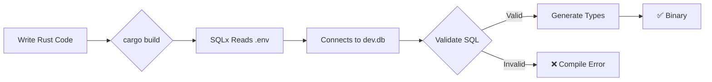
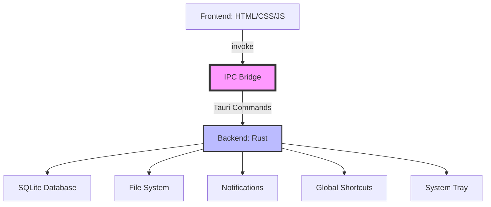
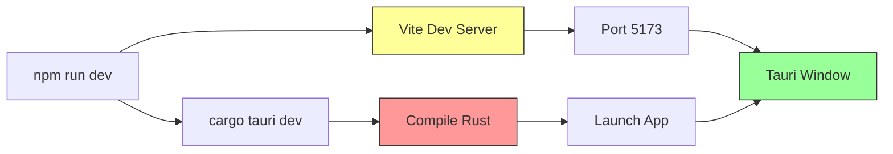
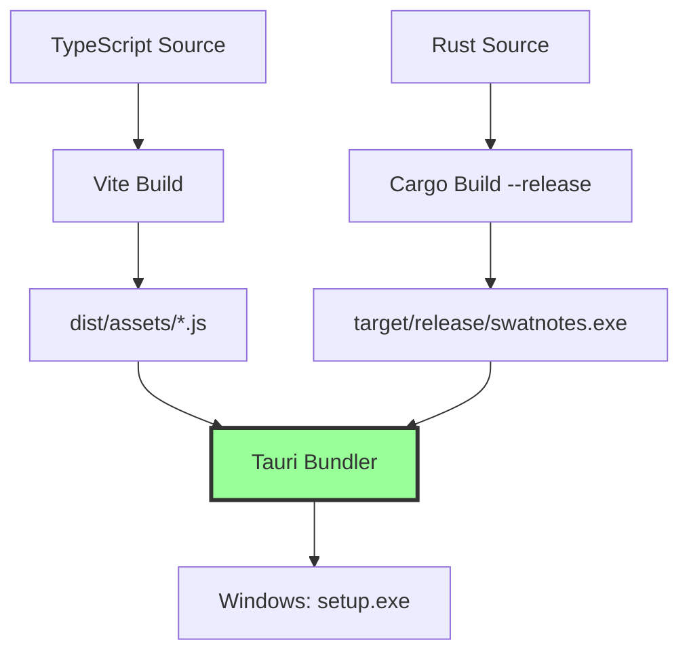
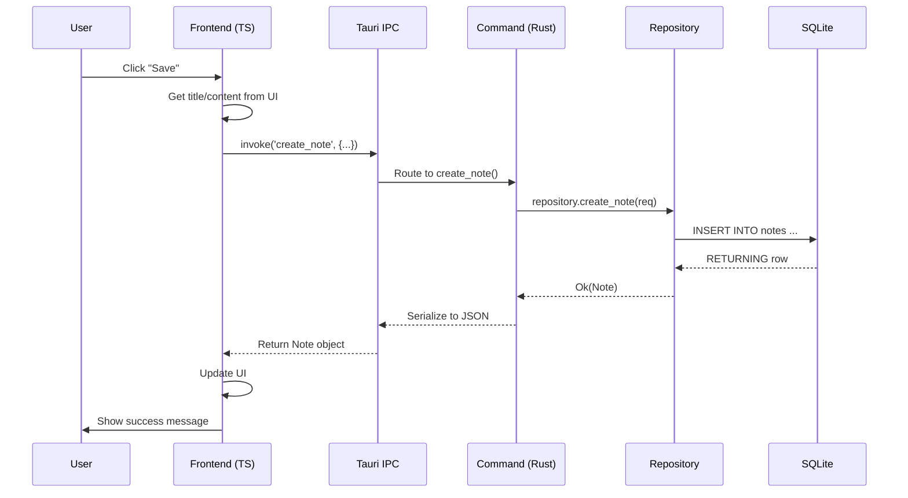

# Chapter 4: Understanding the Stack

> "The right tool makes the job effortless. The wrong tool makes it impossible."  
> *— Every carpenter ever*

In Chapter 3, you sent messages across the Tauri IPC bridge. But the bridge was empty—no real data, no persistence, no styling. Just a greeting.

In this chapter, we unpack **why SwatNotes chose each technology** and **how they work together** to create a production desktop app. You'll understand the mental model for each layer:

- **SQLite** - The embedded database (your app's filing cabinet)
- **SQLx** - Compile-time SQL safety (spell-check for database queries)
- **Tauri v2** - The desktop framework (the IPC bridge from Chapter 3, plus plugins)
- **DaisyUI** - The UI component library (pre-built LEGO bricks for interfaces)
- **Vite + Cargo** - The build coordinators (the construction foremen)

By the end, you'll see how **five technologies** become **one cohesive system**.

---

## 1. SQLite: The Embedded Database

### Mental Model: A Filing Cabinet Inside the App

**Traditional databases** (PostgreSQL, MySQL) are like **bank vaults**:
- Run as separate server processes
- Need network connections
- Require configuration, authentication, port management
- Great for multi-user systems

**SQLite** is like a **filing cabinet in your office**:
- Lives as a single file (`notes.db`)
- No server, no network, no authentication
- Read/write directly from your app
- Perfect for single-user desktop apps

```
Traditional DB:          SQLite:
┌─────────┐             ┌─────────────┐
│Your App │─network→│PostgreSQL│  │Your App │
└─────────┘             └─────────────┘  └──┬──────────┘
                                            │
Port 5432                               ├─ notes.db (file)
User: admin                             └─ (no server!)
Pass: ****
Config files...
```

### Why SwatNotes Uses SQLite

From [src-tauri/src/database/schema.rs](../src-tauri/src/database/schema.rs):

```rust
// Initialize database with performance pragmas
sqlx::query("PRAGMA journal_mode = WAL").execute(pool).await?;
sqlx::query("PRAGMA foreign_keys = ON").execute(pool).await?;
```

**Key features SwatNotes uses:**

1. **Zero Configuration**
   - No separate server to install
   - No ports to configure
   - Database file lives in user's AppData folder

2. **ACID Transactions**
   - **A**tomic: All-or-nothing writes (backup creation succeeds completely or rolls back)
   - **C**onsistent: Foreign keys enforced (can't delete note if reminders exist)
   - **I**solated: Concurrent reads don't block each other (WAL mode)
   - **D**urable: Data survives crashes (transactions are fsync'd)

3. **WAL Mode** (Write-Ahead Logging)
   ```
   Traditional:                WAL Mode:
   ┌───────┐                  ┌───────┐  ┌─────┐
   │ main  │                  │ main  │  │ WAL │
   │  DB   │←writes block     │  DB   │  │ log │
   └───────┘  reads           └───────┘  └─────┘
                                    ↑        ↓
   Slow!                      Readers    Writers
                              continue   append here
                              
   Fast concurrent access!
   ```

4. **Full-Text Search** (FTS5)
   From [001_initial_schema.sql](../src-tauri/src/database/migrations/001_initial_schema.sql):
   ```sql
   -- Notes table
   CREATE TABLE IF NOT EXISTS notes (
       id TEXT PRIMARY KEY,
       title TEXT NOT NULL,
       content_json TEXT NOT NULL,
       created_at TEXT NOT NULL DEFAULT (datetime('now')),
       updated_at TEXT NOT NULL DEFAULT (datetime('now')),
       deleted_at TEXT
   );
   
   CREATE INDEX IF NOT EXISTS idx_notes_updated_at ON notes(updated_at DESC);
   ```

   Migration 003 adds FTS:
   ```sql
   -- Full-text search virtual table
   CREATE VIRTUAL TABLE notes_fts USING fts5(
       title, content_text, content=notes, content_rowid=id
   );
   ```

**Real-life analogy:**  
A library card catalog (traditional DB) requires a librarian, opening hours, and a checkout process. SQLite is like keeping your personal book collection at home—instant access, no bureaucracy.

---

## 2. SQLx: Compile-Time SQL Safety

### Mental Model: Spell-Check for Database Queries

**Problem:** Traditional database libraries check SQL at **runtime**:

```rust
// Runtime checking (old way)
let result = conn.execute("SELCT * FROM notes"); // Typo!
// ❌ Crashes when app runs - users see error
```

**SQLx** checks SQL at **compile time**:

```rust
// Compile-time checking (SQLx)
let notes = sqlx::query_as::<_, Note>(
    "SELCT * FROM notes" // Typo!
).fetch_all(&pool).await?;
// ❌ Won't compile - you fix it before shipping
```

### How SQLx Works: The `DATABASE_URL` Contract

From [src-tauri/Cargo.toml](../src-tauri/Cargo.toml):

```toml
[dependencies]
sqlx = { version = "0.8", features = ["runtime-tokio", "sqlite", "chrono"] }
```

**The magic happens during compilation:**

1. **You set** `DATABASE_URL=sqlite:./dev.db` **in `.env`**
2. **SQLx connects** to your database **while compiling**
3. **It validates** every `query!()` and `query_as!()` macro
4. **It generates** Rust types matching your schema



### Real Example: Creating a Note

From [src-tauri/src/database/repository.rs](../src-tauri/src/database/repository.rs):

```rust
pub async fn create_note(&self, req: CreateNoteRequest) -> Result<Note> {
    let id = Uuid::new_v4().to_string();
    let now = Utc::now();

    // SQLx checks this SQL against dev.db schema at compile time!
    let note = sqlx::query_as::<_, Note>(
        "INSERT INTO notes (id, title, content_json, created_at, updated_at, deleted_at)
         VALUES (?, ?, ?, ?, ?, 0)
         RETURNING *"
    )
    .bind(&id)
    .bind(&req.title)
    .bind(&req.content_json)
    .bind(now)
    .bind(now)
    .fetch_one(&self.pool)
    .await?;

    Ok(note)
}
```

**What SQLx verifies:**
- ✅ Table `notes` exists
- ✅ Columns `id`, `title`, `content_json`, `created_at`, `updated_at`, `deleted_at` exist
- ✅ Types match: `id` is `TEXT`, `title` is `TEXT`, `created_at` is `TEXT` (ISO 8601)
- ✅ `RETURNING *` returns all columns in struct `Note`

**If you typo** `content_jason`:
```rust
.bind(&req.content_jason) // Typo
// ❌ error[E0609]: no field `content_jason` on type `CreateNoteRequest`
```

**If you typo** the SQL column:
```sql
INSERT INTO notes (id, title, content_jason, ...) -- Typo
-- ❌ error: no such column: content_jason
```

### Avoiding N+1 Queries with QueryBuilder

From [repository.rs](../src-tauri/src/database/repository.rs):

```rust
use sqlx::QueryBuilder;

pub async fn get_notes_by_ids(&self, ids: &[String]) -> Result<Vec<Note>> {
    if ids.is_empty() {
        return Ok(vec![]);
    }

    // Build dynamic IN clause to fetch all notes in one query
    let mut query_builder = QueryBuilder::new(
        "SELECT * FROM notes WHERE deleted_at IS NULL AND id IN ("
    );

    let mut separated = query_builder.separated(", ");
    for id in ids {
        separated.push_bind(id);
    }
    separated.push_unseparated(")");

    let notes = query_builder
        .build_query_as::<Note>()
        .fetch_all(&self.pool)
        .await?;

    Ok(notes)
}
```

**Why this matters:**
- **N+1 pattern** (slow): For 100 notes, make 101 database calls (1 to get IDs, 100 to get each note)
- **Batch pattern** (fast): 1 query with `WHERE id IN (id1, id2, ..., id100)`

**Real-life analogy:**  
Asking 100 students individually for their homework (N+1) vs. collecting all homework in one basket (batch query).

---

## 3. Tauri v2: The Desktop Framework

### Mental Model: The IPC Bridge + Superpowers

In Chapter 3, you learned Tauri is the **IPC bridge** between frontend (HTML/JS) and backend (Rust). Tauri v2 adds **plugins** for desktop features.



### Plugins SwatNotes Uses

From [src-tauri/Cargo.toml](../src-tauri/Cargo.toml):

```toml
[dependencies]
tauri = { version = "2.0", features = ["devtools", "tray-icon", "image-png"] }
tauri-plugin-shell = "2.0"          # Open files/URLs
tauri-plugin-dialog = "2.0"         # Native file pickers
tauri-plugin-fs = "2.0"             # Read/write files
tauri-plugin-notification = "2.0"   # Desktop notifications
tauri-plugin-global-shortcut = "2.0" # Keyboard shortcuts
tauri-plugin-process = "2.0"        # Restart app
tauri-plugin-updater = "2.0"        # Auto-updates
tauri-plugin-clipboard-manager = "2.0" # Copy/paste
```

**Examples in SwatNotes:**

1. **Global Shortcuts**
   - `Ctrl+Shift+N`: Create new sticky note from anywhere
   - `Ctrl+Shift+S`: Search all notes

2. **Notifications**
   - Reminder notifications at scheduled time
   - "Backup created successfully"

3. **Tray Icon**
   - Right-click system tray → "New Note", "Search", "Settings", "Quit"

4. **Dialog Plugin**
   - Native file picker for attachments
   - "Are you sure?" confirmation dialogs

### State Management

Tauri v2 uses **managed state** to share data across commands.

From [src-tauri/src/lib.rs](../src-tauri/src/lib.rs):

```rust
pub fn run() {
    tauri::Builder::default()
        .plugin(tauri_plugin_shell::init())
        .plugin(tauri_plugin_dialog::init())
        // ... more plugins ...
        .manage(AppState::new()) // ← Shared state
        .invoke_handler(tauri::generate_handler![
            commands::greet,
            commands::create_note,
            commands::get_note,
            // ... 40+ commands ...
        ])
        .run(tauri::generate_context!())
        .expect("error while running tauri application");
}
```

**Commands access state:**

```rust
#[tauri::command]
async fn create_note(
    title: String,
    content_json: String,
    state: tauri::State<'_, AppState>, // ← Injected by Tauri
) -> Result<Note, String> {
    state.repository
        .create_note(CreateNoteRequest { title, content_json })
        .await
        .map_err(|e| e.to_string())
}
```

**Mental model:**  
State is like a **shared toolbox**. Every worker (command) can access the same database connection pool, config, services—no need to rebuild tools for each task.

---

## 4. DaisyUI: Pre-Built UI Components

### Mental Model: LEGO Bricks for Interfaces

**Without DaisyUI:**

```html
<!-- Tailwind only - you build everything -->
<button class="px-4 py-2 bg-blue-500 text-white rounded hover:bg-blue-600 focus:outline-none focus:ring-2 focus:ring-blue-400">
  Save
</button>
```

**With DaisyUI:**

```html
<!-- DaisyUI - pre-built components -->
<button class="btn btn-primary">Save</button>
```

**Real examples from SwatNotes:**

From [src/utils/modal.ts](../src/utils/modal.ts):

```html
<button class="btn btn-ghost" id="${modalId}-cancel">Cancel</button>
<button class="btn btn-primary" id="${modalId}-confirm">Confirm</button>
```

From [src/main.ts](../src/main.ts):

```html
<div class="card bg-base-100 shadow-xl">
  <div class="card-body">
    <h2 class="card-title text-2xl">Getting Started</h2>
    <p>Create your first note...</p>
  </div>
</div>
```

### DaisyUI Class Naming

| Component | Class | Usage |
|-----------|-------|-------|
| Button | `btn` | Base button |
| Button Primary | `btn btn-primary` | Main action (blue) |
| Button Error | `btn btn-error` | Destructive action (red) |
| Button Ghost | `btn btn-ghost` | Subtle button |
| Button Size | `btn btn-xs`, `btn-sm`, `btn-lg` | Size variants |
| Card | `card` | Container with shadow |
| Card Body | `card-body` | Padding inside card |
| Card Title | `card-title` | Bold heading |

### Theming System

From [tailwind.config.js](../tailwind.config.js):

```javascript
module.exports = {
  plugins: [require('daisyui')],
  daisyui: {
    themes: [
      'light', 'dark', 'cupcake', 'bumblebee', 'emerald',
      'corporate', 'synthwave', 'retro', 'cyberpunk', 'valentine',
      'halloween', 'garden', 'forest', 'aqua', 'lofi',
      'pastel', 'fantasy', 'wireframe', 'black', 'luxury',
      'dracula', 'cmyk', 'autumn', 'business', 'acid',
      'lemonade', 'night', 'coffee', 'winter', 'dim',
      'nord', 'sunset'
    ],
    darkTheme: 'dark',
  },
}
```

**How users switch themes:**

1. Open **Settings** → **Appearance**
2. Select from 32 themes
3. JavaScript applies `data-theme` attribute:
   ```javascript
   document.documentElement.setAttribute('data-theme', 'cyberpunk');
   ```
4. All DaisyUI components update colors instantly

**Theme tokens:**

```css
/* DaisyUI uses CSS variables */
.btn-primary {
  background-color: hsl(var(--p)); /* Primary color */
  color: hsl(var(--pc));           /* Primary content */
}

/* Each theme defines different values */
[data-theme='light'] {
  --p: 259 94% 51%;   /* Purple */
}
[data-theme='dark'] {
  --p: 198 93% 60%;   /* Blue */
}
[data-theme='cyberpunk'] {
  --p: 340 100% 50%;  /* Pink */
}
```

**Real-life analogy:**  
DaisyUI is like buying furniture from IKEA (pre-designed, just assemble) vs. building furniture from lumber (Tailwind only).

---

## 5. Vite + Cargo: The Build Coordinators

### Mental Model: Two Foremen on a Construction Site

**SwatNotes has two codebases:**
- **Frontend:** TypeScript, HTML, CSS → compiled by **Vite**
- **Backend:** Rust → compiled by **Cargo**

**They need to coordinate:**



### Vite: Frontend Build Tool

From [vite.config.js](../vite.config.js):

```javascript
export default defineConfig({
  server: {
    port: 5173,
    strictPort: true,
  },
  build: {
    target: 'esnext',
    minify: 'esbuild',
    sourcemap: true,
    rollupOptions: {
      input: {
        main: resolve(__dirname, 'index.html'),
        'sticky-note': resolve(__dirname, 'sticky-note.html'),
        settings: resolve(__dirname, 'settings.html'),
        'update-required': resolve(__dirname, 'update-required.html'),
      },
    },
  },
});
```

**Key features:**

1. **Multi-Page Build**
   - SwatNotes has **4 HTML entry points**:
     - `index.html` - Main notes list
     - `sticky-note.html` - Floating sticky note window
     - `settings.html` - Settings panel
     - `update-required.html` - Update prompt
   
   - Each compiles to separate JS bundles (code splitting)

2. **Hot Module Replacement (HMR)**
   - Edit TypeScript → browser updates instantly
   - No manual refresh during development

3. **Tree Shaking**
   - Removes unused code from final bundle
   - If you import Quill.js but only use `insertText`, Vite strips out image/video modules

### Cargo: Rust Build Tool

From [src-tauri/Cargo.toml](../src-tauri/Cargo.toml):

```toml
[package]
name = "swatnotes"
version = "0.9.0"
edition = "2021"

[dependencies]
tauri = { version = "2.0", features = ["devtools", "tray-icon"] }
sqlx = { version = "0.8", features = ["runtime-tokio", "sqlite"] }
tokio = { version = "1", features = ["full"] }
# ... 20+ dependencies ...
```

**What Cargo does:**

1. **Dependency Resolution**
   - Downloads crates from crates.io
   - Resolves version conflicts
   - Caches downloads in `~/.cargo`

2. **Incremental Compilation**
   - Only recompiles changed modules
   - Uses `target/debug` for dev builds (fast, unoptimized)
   - Uses `target/release` for production (slow, optimized)

3. **Feature Flags**
   ```toml
   sqlx = { version = "0.8", features = ["runtime-tokio", "sqlite", "chrono"] }
   ```
   - `runtime-tokio`: Use tokio async runtime (not async-std)
   - `sqlite`: Enable SQLite driver (not Postgres/MySQL)
   - `chrono`: Add chrono type support for DateTime columns

### How They Work Together

**Development mode:**

```bash
npm run tauri dev
```

1. **Vite starts** dev server on `http://localhost:5173`
2. **Cargo compiles** Rust backend
3. **Tauri launches** desktop window pointing to `http://localhost:5173`
4. **HMR works:** Edit TypeScript → Vite hot-reloads → window updates

**Production build:**

```bash
npm run tauri build
```

1. **Vite builds** frontend to `dist/` folder:
   ```
   dist/
   ├── index.html
   ├── sticky-note.html
   ├── assets/
   │   ├── main-a1b2c3.js       (hashed for cache busting)
   │   ├── sticky-note-d4e5f6.js
   │   └── index-g7h8i9.css
   ```

2. **Cargo compiles** Rust with `--release` flag:
   - Optimizations: inlining, dead code elimination, LTO
   - Binary size: ~8MB (vs ~200MB for Electron apps)

3. **Tauri bundles** both:
   ```
   target/release/bundle/
   └── nsis/SwatNotes_0.9.0_x64-setup.exe  (Windows installer)
   ```

4. **Installer includes:**
   - Rust binary (`swatnotes.exe`)
   - Frontend assets (embedded in binary or separate folder)
   - Icons, metadata, uninstaller

**Data flow:**



---

## 6. How It All Connects: Full Stack Data Flow

Let's trace **creating a note** through every layer:

### Step 1: User Clicks "Save" Button

**Frontend:** [src/components/noteEditor.ts](../src/components/noteEditor.ts)

```html
<button class="btn btn-primary" id="save-note-btn">Save</button>
```

```typescript
document.getElementById('save-note-btn')?.addEventListener('click', async () => {
  const title = titleInput.value;
  const contentJson = JSON.stringify(quill.getContents());
  
  // Call Tauri command
  const note = await createNote(title, contentJson);
  console.log('Note created:', note);
});
```

### Step 2: TypeScript Invokes Tauri Command

**API Wrapper:** [src/utils/notesApi.ts](../src/utils/notesApi.ts)

```typescript
import { invoke } from '@tauri-apps/api/core';

export async function createNote(
  title: string,
  contentJson: string
): Promise<Note> {
  return await invoke('create_note', { title, contentJson });
}
```

### Step 3: Tauri Routes to Rust Command

**Command Handler:** [src-tauri/src/commands/notes.rs](../src-tauri/src/commands/notes.rs)

```rust
#[tauri::command]
pub async fn create_note(
    title: String,
    content_json: String,
    state: tauri::State<'_, AppState>,
) -> Result<Note, String> {
    let req = CreateNoteRequest {
        title,
        content_json,
    };
    
    state.repository
        .create_note(req)
        .await
        .map_err(|e| e.to_string())
}
```

### Step 4: Repository Inserts into SQLite

**Repository Layer:** [src-tauri/src/database/repository.rs](../src-tauri/src/database/repository.rs)

```rust
pub async fn create_note(&self, req: CreateNoteRequest) -> Result<Note> {
    let id = Uuid::new_v4().to_string();
    let now = Utc::now();

    // SQLx compile-time checked query
    let note = sqlx::query_as::<_, Note>(
        "INSERT INTO notes (id, title, content_json, created_at, updated_at, deleted_at)
         VALUES (?, ?, ?, ?, ?, 0)
         RETURNING *"
    )
    .bind(&id)
    .bind(&req.title)
    .bind(&req.content_json)
    .bind(now)
    .bind(now)
    .fetch_one(&self.pool)
    .await?;

    Ok(note)
}
```

### Step 5: Data Flows Back

```
SQLite → SQLx → Repository → Command → Tauri IPC → Frontend
                                                      ↓
                                              UI updates with new note
```

**Diagram:**



---

## 7. Key Takeaways

**SQLite:**
- Embedded database = single file, zero config
- ACID transactions for data safety
- WAL mode for concurrent reads
- FTS5 for full-text search

**SQLx:**
- Compile-time SQL checking (catch typos before shipping)
- Type-safe queries with `query_as!()`
- Async/await with tokio runtime
- QueryBuilder for dynamic queries

**Tauri v2:**
- IPC bridge + desktop plugins
- Smaller binaries than Electron (~8MB vs ~200MB)
- Native performance (Rust backend)
- Managed state for shared resources

**DaisyUI:**
- Pre-built components (`btn`, `card`, `modal`)
- 32 themes with CSS variables
- Built on Tailwind CSS
- Instant theme switching

**Vite + Cargo:**
- Vite: Frontend bundler with HMR, multi-page support
- Cargo: Rust compiler with incremental builds
- Coordinated builds for dev/production
- Produces Windows installer (setup.exe)

**The Stack in One Sentence:**  
SQLite stores data, SQLx makes queries safe, Rust commands process logic, Tauri bridges to TypeScript, DaisyUI styles components, and Vite+Cargo build it all.

---

## Practice Exercise

**Task:** Find where SwatNotes uses the **dialog plugin** to open a file picker for attachments.

**Hints:**
1. Search for `dialog` in [src/components/noteEditor.ts](../src/components/noteEditor.ts)
2. Look for `invoke('open_file_dialog', ...)` or similar
3. Trace the command in Rust backend

**Solution path:**
- Frontend: TypeScript calls Tauri command
- Backend: Command uses `tauri-plugin-dialog` to show native file picker
- Result: File path returned → uploaded as attachment

Try it yourself before checking the codebase!

---

**Next Chapter:** [Chapter 5: Project Architecture](./05-project-architecture.md)  
We'll dive deeper into **migrations, indexes, transactions, and the FTS5 full-text search** that powers SwatNotes' instant search.
