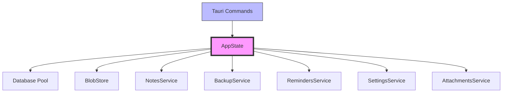
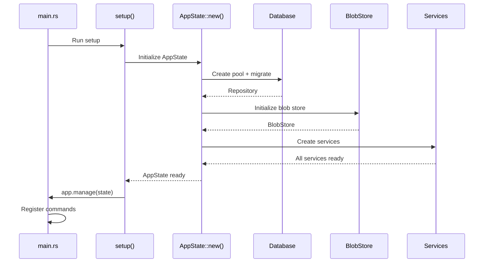
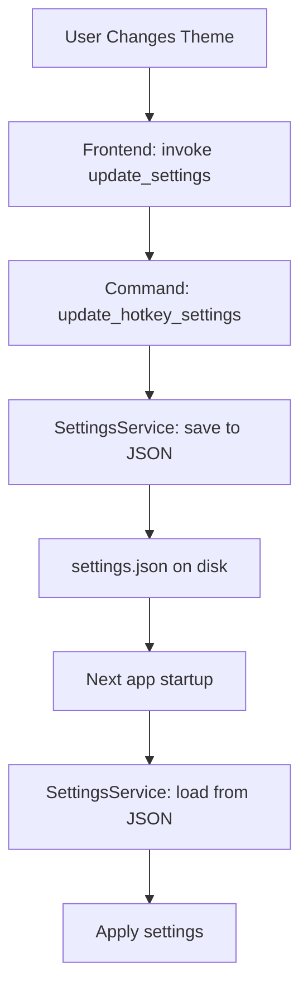
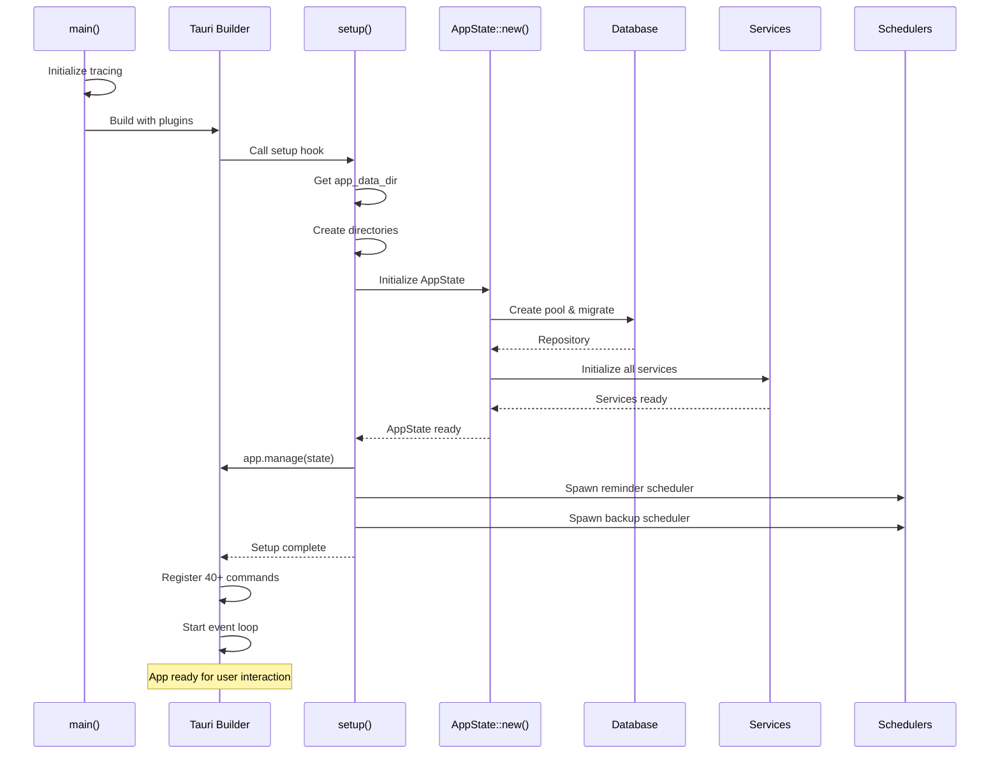

# Chapter 5: Project Architecture

> "A place for everything, and everything in its place."  
> *— Benjamin Franklin (and every good software architect)*

In Chapter 4, you learned about the stack: SQLite, SQLx, Tauri, DaisyUI, Vite, Cargo. But tools alone don't make an app—**organization** does.

A 100-line script can be one file. A production app with **50+ commands, 5 data models, 7 services, and thousands of lines of code** needs structure. Without it, you'll spend more time searching for code than writing it.

In this chapter, you'll learn SwatNotes' **organizational architecture**:

- **Module System** - How Rust files are organized and imported
- **AppState** - The central nervous system sharing resources
- **Service Layer** - Business logic between commands and database
- **Configuration** - Constants, settings, and environment management
- **Logging** - Observability with tracing

By the end, you'll understand **how 10+ Rust modules work together** as one cohesive system.

---

## 1. The Module System: Organizing Rust Code

### Mental Model: A Library with Sections

Think of your codebase as a **library**:
- **Books** = Rust files (`.rs`)
- **Sections** = Modules (`mod app;`, `mod database;`)
- **Catalog** = `lib.rs` or `main.rs` (the entry point that lists everything)

**Without modules:**
```rust
// One giant file - unmaintainable!
main.rs (5000 lines)
- fn create_note() { ... }
- fn delete_note() { ... }
- fn create_backup() { ... }
- fn encrypt_data() { ... }
// ... 40+ more functions
```

**With modules:**
```
src-tauri/src/
├── main.rs          (Entry point)
├── lib.rs           (Module catalog)
├── app.rs           (AppState, setup)
├── config.rs        (Constants)
├── error.rs         (Error types)
├── crypto.rs        (Encryption)
├── commands/        (Tauri commands)
│   ├── mod.rs
│   ├── notes.rs
│   ├── attachments.rs
│   └── ...
├── database/        (Data access)
│   ├── mod.rs
│   ├── repository.rs
│   └── ...
├── services/        (Business logic)
│   ├── mod.rs
│   ├── notes.rs
│   └── ...
└── storage/         (Blob storage)
    └── blob_store.rs
```

### How SwatNotes Organizes Modules

From [src-tauri/src/lib.rs](../src-tauri/src/lib.rs):

```rust
//! SwatNotes library
//!
//! This library exposes the core functionality of SwatNotes for testing
//! and potential future library use.

pub mod app;
pub mod commands;
pub mod config;
pub mod crypto;
pub mod database;
pub mod error;
pub mod services;
pub mod storage;
```

**What this means:**
- `pub mod app;` → Exposes `src/app.rs` as `swatnotes::app`
- `pub mod commands;` → Exposes `src/commands/mod.rs` as `swatnotes::commands`
- `pub mod database;` → Exposes `src/database/mod.rs` as `swatnotes::database`

### Module Hierarchy: Nested Modules

**Services module:** [src-tauri/src/services/mod.rs](../src-tauri/src/services/mod.rs)

```rust
//! Services module
//!
//! Business logic services that coordinate between commands and repository.

pub mod attachments;
pub mod backup;
pub mod credentials;
pub mod notes;
pub mod reminders;
pub mod scheduler;
pub mod settings;

// Re-export main types for convenience
pub use attachments::AttachmentsService;
pub use backup::BackupService;
pub use credentials::CredentialManager;
pub use notes::NotesService;
pub use reminders::RemindersService;
pub use scheduler::SchedulerService;
pub use settings::{AutoBackupSettings, HotkeySettings, ReminderSettings, SettingsService};
```

**Directory structure:**
```
services/
├── mod.rs           (Module declaration + re-exports)
├── notes.rs         (NotesService)
├── attachments.rs   (AttachmentsService)
├── backup.rs        (BackupService)
├── reminders.rs     (RemindersService)
├── scheduler.rs     (SchedulerService)
├── settings.rs      (SettingsService)
└── credentials.rs   (CredentialManager)
```

**Using the services:**

```rust
// In commands/notes.rs
use crate::services::NotesService; // Thanks to pub use in mod.rs

// Or without re-export:
use crate::services::notes::NotesService;
```

### Module Visibility: `pub` vs. Private

**Private by default:**

```rust
// In services/notes.rs
fn validate_title(title: &str) -> bool {
    !title.trim().is_empty()
}

// ❌ Can't use outside this file
// commands/notes.rs: validate_title(...) // Error!
```

**Public with `pub`:**

```rust
pub fn validate_title(title: &str) -> bool {
    !title.trim().is_empty()
}

// ✅ Accessible from other modules
```

**Real-life analogy:**  
Private functions are like **staff-only rooms** in a restaurant (kitchen, storage). Public functions are the **menu items** customers can order.

---

## 2. AppState: The Central Nervous System

### Mental Model: The Building's Electrical Panel

In a building, every room needs electricity, water, internet. Instead of each room having its own generator and water tank, they **share central infrastructure**.

**AppState is your app's central infrastructure:**



### AppState Definition

From [src-tauri/src/app.rs](../src-tauri/src/app.rs):

```rust
/// Central application state holding all services
#[derive(Clone)]
pub struct AppState {
    pub app_data_dir: PathBuf,
    /// Direct database access (use services instead when possible)
    #[allow(dead_code)]
    pub db: Repository,
    /// Direct blob store access (use services instead when possible)
    #[allow(dead_code)]
    pub blob_store: BlobStore,
    pub notes_service: NotesService,
    pub attachments_service: AttachmentsService,
    pub backup_service: BackupService,
    pub reminders_service: RemindersService,
    pub settings_service: SettingsService,
    pub scheduler_service: Option<Arc<SchedulerService>>,
    /// Last focused note window label for toggle hotkey
    pub last_focused_note_window: Arc<Mutex<Option<String>>>,
}
```

**Key design decisions:**

1. **`#[derive(Clone)]`** - Makes AppState cheap to clone
   - All services use `Arc` internally (shared pointers)
   - Cloning AppState just increments reference counts

2. **`Arc<Mutex<Option<String>>>`** - Thread-safe shared state
   - `Arc` = Atomic Reference Counter (shared ownership)
   - `Mutex` = Mutual exclusion (only one thread at a time)
   - `Option` = May or may not have a value

3. **Services instead of direct DB access** - Separation of concerns
   - Commands call services (`notes_service.create_note(...)`)
   - Services handle business logic (FTS updates, validation)
   - Repository handles raw SQL

### AppState Initialization

From [src-tauri/src/app.rs](../src-tauri/src/app.rs):

```rust
impl AppState {
    pub async fn new(app_data_dir: PathBuf) -> Result<Self> {
        // Initialize database
        let db_path = app_data_dir.join("db.sqlite");
        let pool = create_pool(&db_path).await?;
        let db = Repository::new(pool);

        // Rebuild FTS index to ensure all notes are properly indexed
        if let Err(e) = db.rebuild_fts_index().await {
            tracing::warn!("Failed to rebuild FTS index: {}", e);
            // Don't fail startup if FTS rebuild fails
        }

        // Initialize blob store
        let blob_store = BlobStore::new(app_data_dir.join("blobs"));
        blob_store.initialize().await?;

        // Initialize services
        let notes_service = NotesService::new(db.clone());
        let attachments_service = AttachmentsService::new(db.clone(), blob_store.clone());
        let backup_service =
            BackupService::new(db.clone(), blob_store.clone(), app_data_dir.clone());
        let reminders_service = RemindersService::new(db.clone());
        let settings_service = SettingsService::new(app_data_dir.clone());

        // Initialize scheduler service for automatic backups
        let scheduler_service = match SchedulerService::new(backup_service.clone()).await {
            Ok(scheduler) => {
                tracing::info!("Scheduler service initialized successfully");
                Some(Arc::new(scheduler))
            }
            Err(e) => {
                tracing::error!("Failed to initialize scheduler service: {}", e);
                None
            }
        };

        Ok(Self {
            app_data_dir,
            db,
            blob_store,
            notes_service,
            attachments_service,
            backup_service,
            reminders_service,
            settings_service,
            scheduler_service,
            last_focused_note_window: Arc::new(Mutex::new(None)),
        })
    }
}
```

**Startup sequence:**



### Using AppState in Commands

From [src-tauri/src/commands/notes.rs](../src-tauri/src/commands/notes.rs):

```rust
#[tauri::command]
pub async fn create_note(
    state: State<'_, AppState>,  // ← Injected by Tauri (always first)
    title: String,
    content_json: String,
) -> Result<Note> {
    state
        .notes_service
        .create_note(title, content_json)
        .await
}
```

**How Tauri injects state:**

1. **At startup:** `app.manage(state)` stores AppState globally
2. **At command invocation:** Tauri sees `tauri::State<'_, AppState>` parameter
3. **Tauri retrieves** the managed AppState and passes it to the function

**Mental model:**  
AppState is like a **valet service**. You don't carry your database connection everywhere—you just ask the valet (Tauri) to bring it when needed.

---

## 3. Service Layer: Business Logic

### Mental Model: Restaurant Roles

**Without service layer:**

```
Customer → Chef
  (User)  (Database)
```
Customer orders directly from the chef. Chef has to:
- Take orders
- Cook food
- Handle payments
- Clean tables

**With service layer:**

```
Customer → Waiter → Chef
  (User)  (Service) (Database)
```

Waiter handles:
- Taking orders
- Validating ("We're out of salmon")
- Coordinating (notify kitchen, update FTS, send notification)

Chef focuses on cooking (database operations).

### Real Example: NotesService

From [src-tauri/src/services/notes.rs](../src-tauri/src/services/notes.rs):

```rust
/// Service for managing notes
#[derive(Clone)]
pub struct NotesService {
    repo: Repository,
}

impl NotesService {
    pub fn new(repo: Repository) -> Self {
        Self { repo }
    }

    /// Create a new note
    pub async fn create_note(&self, title: String, content_json: String) -> Result<Note> {
        tracing::info!("Creating new note: {}", title);

        let req = CreateNoteRequest {
            title: title.clone(),
            content_json: content_json.clone(),
        };

        // 1. Create note in database
        let note = self.repo.create_note(req).await?;

        // 2. Sync to FTS index (service responsibility!)
        if let Err(e) = self
            .repo
            .insert_note_fts(&note.id, &title, &content_json)
            .await
        {
            tracing::warn!("Failed to insert note into FTS index: {}", e);
            // Don't fail the whole operation if FTS fails
        }

        tracing::info!("Note created successfully: {}", note.id);

        Ok(note)
    }
}
```

**Why use a service?**

1. **Coordinate multiple operations:**
   - Insert note into `notes` table
   - Insert into `notes_fts` table for search
   - Log the operation

2. **Handle errors gracefully:**
   - If FTS insert fails, warn but continue (search won't work for this note, but note is created)

3. **Keep commands thin:**
   ```rust
   // Command just delegates:
   #[tauri::command]
   pub async fn create_note(
       state: State<'_, AppState>,
       title: String,
       content_json: String,
   ) -> Result<Note> {
       state.notes_service
           .create_note(title, content_json)
           .await
   }
   ```

### Layer Responsibilities

| Layer | Responsibility | Example |
|-------|---------------|---------|
| **Command** | Parse inputs, call service, serialize output | `create_note(state, title, content_json)` |
| **Service** | Business logic, coordination, logging | Update FTS, send notifications, validate |
| **Repository** | Raw SQL, database queries | `INSERT INTO notes ...` |

**Data flow:**


---

## 4. Configuration: Constants and Settings

### Mental Model: The Restaurant's Recipe Book

**Hard-coded values scattered everywhere (bad):**

```rust
// In window.rs
let width = 350.0;

// In another file
let width = 350.0; // Hope they match!

// Months later, change one but forget the other
let width = 400.0; // ❌ Inconsistent!
```

**Centralized config (good):**

```rust
// config.rs
pub const STICKY_NOTE_DEFAULT_WIDTH: f64 = 350.0;

// Everywhere else:
use crate::config::STICKY_NOTE_DEFAULT_WIDTH;
let width = STICKY_NOTE_DEFAULT_WIDTH;
```

### SwatNotes Configuration

From [src-tauri/src/config.rs](../src-tauri/src/config.rs):

```rust
//! Application configuration constants
//!
//! Central location for all hard-coded values and configuration

/// Window dimensions for sticky notes
pub const STICKY_NOTE_DEFAULT_WIDTH: f64 = 350.0;
pub const STICKY_NOTE_DEFAULT_HEIGHT: f64 = 400.0;
pub const STICKY_NOTE_MIN_WIDTH: f64 = 250.0;
pub const STICKY_NOTE_MIN_HEIGHT: f64 = 300.0;
```

**Benefits:**

1. **Single source of truth** - Change once, applies everywhere
2. **Searchability** - `grep "STICKY_NOTE_DEFAULT_WIDTH"` finds all usages
3. **Documentation** - Constants have names explaining their purpose
4. **Type safety** - Compiler checks `f64` type

### Dynamic Settings vs. Static Config

**Static config** (`config.rs`):
- Compile-time constants
- Rarely change
- Examples: window sizes, cache limits, timeout durations

**Dynamic settings** (`SettingsService`):
- Runtime configuration
- User-changeable
- Persisted to `settings.json`
- Examples: theme, hotkeys, backup location

**Settings flow:**



---

## 5. Logging with Tracing

### Mental Model: A Ship's Captain's Log

**Without logging:**
- App crashes → "It broke, no idea why"
- Bug reports → "It's slow sometimes"
- Debugging → Add `println!()`, recompile, run, remove, repeat

**With logging:**
- Trace every operation: "2026-01-28 14:30:22 - Creating note: Shopping List"
- Levels: DEBUG, INFO, WARN, ERROR
- Filter by module: "Show me only database errors"

### Tracing Setup

From [src-tauri/src/main.rs](../src-tauri/src/main.rs):

```rust
use tracing_subscriber::{layer::SubscriberExt, util::SubscriberInitExt};

fn main() {
    // Initialize logging
    tracing_subscriber::registry()
        .with(
            tracing_subscriber::EnvFilter::try_from_default_env()
                .unwrap_or_else(|_| "swatnotes=debug,info".into()),
        )
        .with(tracing_subscriber::fmt::layer())
        .init();

    tracing::info!("Starting SwatNotes application");

    // ... rest of setup
}
```

**What this does:**

1. **`EnvFilter`** - Reads `RUST_LOG` environment variable
   - `RUST_LOG=debug` → Show all debug logs
   - `RUST_LOG=swatnotes=info` → Show only INFO+ from SwatNotes
   - Default: `"swatnotes=debug,info"`

2. **`fmt::layer()`** - Formats logs as text
   ```
   2026-01-28T14:30:22.123Z INFO swatnotes::app: Initializing application
   2026-01-28T14:30:22.456Z DEBUG swatnotes::database: Running migration 001
   ```

### Log Levels

| Level | Use Case | Example |
|-------|----------|---------|
| **ERROR** | Something failed | `tracing::error!("Failed to save note: {}", e)` |
| **WARN** | Unexpected but handled | `tracing::warn!("FTS update failed, continuing")` |
| **INFO** | Important milestones | `tracing::info!("Note created: {}", note.id)` |
| **DEBUG** | Detailed diagnostics | `tracing::debug!("Query took 12ms")` |
| **TRACE** | Very verbose | `tracing::trace!("Entering function foo")` |

### Real Examples from SwatNotes

**Service logs:**

```rust
// From services/notes.rs
pub async fn create_note(&self, title: String, content_json: String) -> Result<Note> {
    tracing::info!("Creating new note: {}", title);
    
    let note = self.repo.create_note(req).await?;
    
    if let Err(e) = self.repo.insert_note_fts(&note.id, &title, &content_json).await {
        tracing::warn!("Failed to insert note into FTS index: {}", e);
    }
    
    tracing::info!("Note created successfully: {}", note.id);
    Ok(note)
}
```

**Blob store logs:**

```rust
// From storage/blob_store.rs
pub async fn write(&self, data: &[u8]) -> Result<String> {
    let hash = calculate_hash(data);
    
    if self.exists(&hash).await {
        tracing::debug!("Blob already exists: {}", hash);
        return Ok(hash);
    }
    
    // ... write logic ...
    
    tracing::debug!("Wrote blob: {} ({} bytes)", hash, data.len());
    Ok(hash)
}
```

**Scheduler logs:**

```rust
// From services/scheduler.rs
pub async fn start(&self) -> Result<()> {
    tracing::info!("Backup scheduler started");
    
    if !settings.enabled {
        tracing::info!("Automatic backups disabled");
        return Ok(());
    }
    
    // ... schedule job ...
    
    tracing::info!("Scheduled automatic backup: {}", schedule);
    Ok(())
}
```

### Log Output in Development

```
2026-01-28T14:30:22.123Z  INFO swatnotes: Starting SwatNotes application
2026-01-28T14:30:22.234Z  INFO swatnotes::app: Initializing application
2026-01-28T14:30:22.345Z  INFO swatnotes::app: App data directory: "C:\\Users\\...\\swatnotes"
2026-01-28T14:30:22.456Z  INFO swatnotes::storage::blob_store: Blob store initialized at: "C:\\Users\\...\\blobs"
2026-01-28T14:30:22.567Z  INFO swatnotes::app: Spawning reminders scheduler task
2026-01-28T14:30:22.678Z  INFO swatnotes::services::scheduler: Backup scheduler started
2026-01-28T14:30:22.789Z  INFO swatnotes::services::notes: Creating new note: Shopping List
2026-01-28T14:30:22.890Z  INFO swatnotes::services::notes: Note created successfully: 3f2a8b4c-...
```

**Benefits:**

1. **Timestamp** - Know when things happened
2. **Module path** - `swatnotes::services::notes` → which code logged this
3. **Level** - INFO/WARN/ERROR at a glance
4. **Context** - "Creating new note: Shopping List" → know what was happening

---

## 6. Putting It All Together: Startup Flow

Let's trace **app startup** through all architectural layers:

### Startup Sequence

From [src-tauri/src/main.rs](../src-tauri/src/main.rs):

```rust
fn main() {
    // 1. Initialize logging
    tracing_subscriber::registry()
        .with(EnvFilter::try_from_default_env()
            .unwrap_or_else(|_| "swatnotes=debug,info".into()))
        .with(tracing_subscriber::fmt::layer())
        .init();

    tracing::info!("Starting SwatNotes application");

    // 2. Build Tauri app
    tauri::Builder::default()
        // 3. Register plugins
        .plugin(tauri_plugin_shell::init())
        .plugin(tauri_plugin_dialog::init())
        .plugin(tauri_plugin_fs::init())
        .plugin(tauri_plugin_notification::init())
        .plugin(tauri_plugin_global_shortcut::Builder::new().build())
        .plugin(tauri_plugin_process::init())
        .plugin(tauri_plugin_updater::Builder::new().build())
        .plugin(tauri_plugin_clipboard_manager::init())
        // 4. Run setup hook
        .setup(|app| {
            tracing::info!("Running app setup");
            app::setup(app)?;
            Ok(())
        })
        // 5. Register commands
        .invoke_handler(tauri::generate_handler![
            commands::greet,
            commands::create_note,
            commands::get_note,
            // ... 40+ more commands
        ])
        .run(tauri::generate_context!())
        .expect("error while running tauri application");
}
```

### Setup Function Deep Dive

From [src-tauri/src/app.rs](../src-tauri/src/app.rs):

```rust
pub fn setup(app: &mut App) -> Result<()> {
    tracing::info!("Initializing application");

    // 1. Get app data directory
    let app_data_dir = app.path().app_data_dir().map_err(|e| {
        crate::error::AppError::Generic(format!("Failed to get app data dir: {}", e))
    })?;

    tracing::info!("App data directory: {:?}", app_data_dir);

    // 2. Create necessary directories
    std::fs::create_dir_all(&app_data_dir)?;
    std::fs::create_dir_all(app_data_dir.join("blobs"))?;
    std::fs::create_dir_all(app_data_dir.join("backups"))?;
    std::fs::create_dir_all(app_data_dir.join("logs"))?;

    // 3. Initialize application state asynchronously
    let runtime = tokio::runtime::Runtime::new()?;
    let state = runtime.block_on(AppState::new(app_data_dir))?;

    // 4. Manage state early so it's available for other setup functions
    app.manage(state.clone());

    // 5. Start reminders scheduler
    tracing::info!("Spawning reminders scheduler task");
    let scheduler_service = state.reminders_service.clone();
    let app_handle = app.handle().clone();
    tauri::async_runtime::spawn(async move {
        tracing::info!("Reminders scheduler task started, setting app handle");
        scheduler_service.set_app_handle(app_handle).await;
        tracing::info!("Starting reminders scheduler");
        scheduler_service.start_scheduler();
        tracing::info!("Reminders scheduler started");
    });

    // 6. Start auto-backup scheduler
    if let Some(backup_scheduler) = state.scheduler_service.clone() {
        let settings_service = state.settings_service.clone();
        tauri::async_runtime::spawn(async move {
            if let Err(e) = backup_scheduler.start().await {
                tracing::error!("Failed to start backup scheduler: {}", e);
                return;
            }
            // ... load settings and schedule if enabled
        });
    }

    Ok(())
}
```

### Complete Startup Diagram



---

## 7. Architecture Patterns in SwatNotes

### Repository Pattern

```
Commands → Services → Repository → Database
```

**Benefit:** Swap databases (SQLite → Postgres) by only changing Repository layer.

### Dependency Injection

```rust
// Service gets repository injected:
pub struct NotesService {
    repo: Repository, // Injected in constructor
}

impl NotesService {
    pub fn new(repo: Repository) -> Self {
        Self { repo }
    }
}
```

**Benefit:** Easy to test with mock repository.

### Shared State with Arc

```rust
#[derive(Clone)]
pub struct NotesService {
    repo: Repository, // Repository is Arc<Pool> internally
}
```

**Benefit:** Cheap clones, shared connection pool.

### Error Propagation with `?`

```rust
pub async fn create_note(&self, title: String) -> Result<Note> {
    let note = self.repo.create_note(req).await?; // ← ? propagates errors
    Ok(note)
}
```

**Benefit:** Concise error handling, errors bubble up automatically.

---

## 8. Key Takeaways

**Module System:**
- Organize code into logical units (commands, services, database, storage)
- `lib.rs` or `main.rs` declares all modules
- `pub mod` makes modules accessible
- Nested modules with `mod.rs` for subdirectories

**AppState:**
- Central state holding all services and resources
- Initialized once at startup with `AppState::new()`
- Made available to commands with `app.manage(state)`
- Injected into commands with `tauri::State<'_, AppState>`

**Service Layer:**
- Business logic between commands and database
- Coordinates multiple operations (DB + FTS + logging)
- Handles errors gracefully (warn on FTS failure, don't crash)
- Keeps commands thin (just delegate to service)

**Configuration:**
- Static config in `config.rs` (compile-time constants)
- Dynamic settings in `SettingsService` (runtime, user-changeable)
- Centralized values prevent duplication and inconsistency

**Logging:**
- Tracing initialized at startup with `tracing_subscriber`
- Levels: ERROR, WARN, INFO, DEBUG, TRACE
- Filter with `RUST_LOG` environment variable
- Log important operations, errors, and milestones

**Startup Flow:**
1. Initialize tracing
2. Register Tauri plugins
3. Run setup (create dirs, init AppState, start schedulers)
4. Manage AppState globally
5. Register commands
6. Start event loop

**Architecture Patterns:**
- Repository pattern (data access abstraction)
- Dependency injection (services get dependencies in constructor)
- Shared state with Arc (cheap clones, shared resources)
- Error propagation with `?` (concise error handling)

---

## Practice Exercise

**Task:** Find where SwatNotes initializes the backup directory setting on startup.

**Hints:**
1. Start in [src-tauri/src/app.rs](../src-tauri/src/app.rs) at `AppState::new()`
2. Look for `settings_service.get_auto_backup()`
3. Trace how `backup_location` is applied to `backup_service`

**Questions to answer:**
- Which service holds the backup directory path?
- What happens if loading the setting fails?
- How is the backup directory set programmatically?

Try it yourself before checking the code!

---

**Next Chapter:** [Chapter 6: Database Foundations](./06-database-foundations.md)  
We'll dive deep into **SQLite schema design, migrations, indexes, transactions, and the Repository pattern** that powers SwatNotes' data layer.
