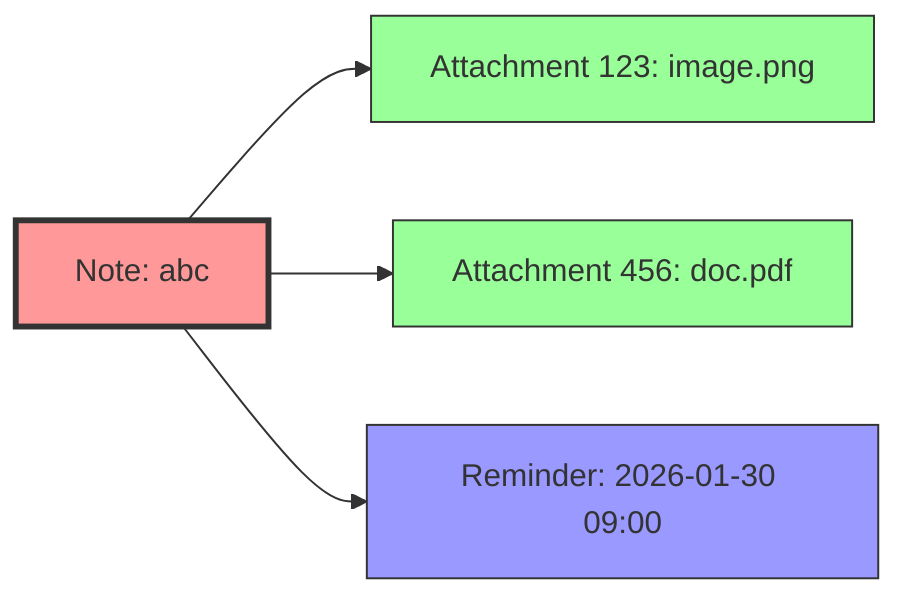
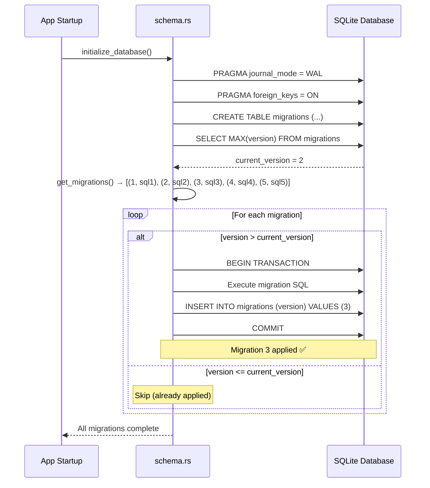
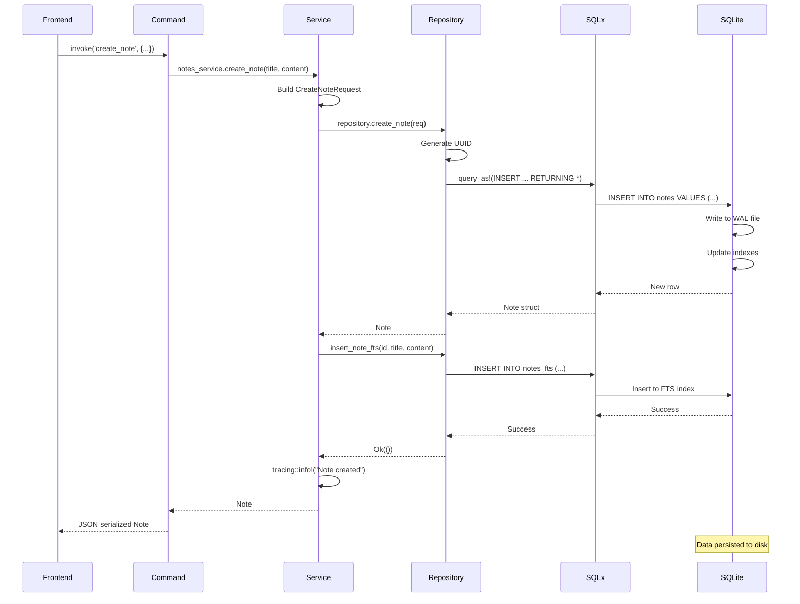

# Chapter 6: Database Foundations

> "Data outlives code. Design it well."  
> *— Every developer who maintained legacy systems*

In Chapter 5, you learned how SwatNotes organizes code with modules, services, and AppState. But code without data is just machinery with nothing to process.

The **database is the foundation**. It's where:
- Notes persist when the app closes
- Attachments are linked to notes
- Reminders are scheduled
- Collections organize your thoughts

A poorly designed database means:
- Slow queries (searching 10,000 notes takes 5 seconds)
- Data corruption (losing notes when the app crashes)
- Migration nightmares ("We can't add that feature without breaking existing data")

In this chapter, you'll learn SwatNotes' **database architecture**:

- **Schema Design** - Tables, columns, types, constraints
- **Migrations** - Evolving schema safely without losing data
- **Repository Pattern** - Clean abstraction hiding SQL details
- **Indexes** - Making queries fast
- **Transactions** - Ensuring data consistency

By the end, you'll understand **how SwatNotes stores and retrieves data reliably**.

---

## 1. Schema Design: Structuring Your Data

### Mental Model: A Filing Cabinet with Drawers

Think of your database as a **filing cabinet**:
- **Tables** = Drawers (Notes drawer, Attachments drawer, Reminders drawer)
- **Columns** = Fields on the forms (id, title, content, created_at)
- **Rows** = Individual documents (one note, one reminder)
- **Indexes** = Tabs for quick lookup ("Find all notes created in January")
- **Foreign Keys** = Cross-references ("This attachment belongs to Note #42")

**Without structure:**
```
notes/
├── note1.txt (Shopping list, created 2026-01-20, has 2 attachments... somewhere?)
├── note2.txt (Meeting notes, when was this created?)
└── ...chaos
```

**With database structure:**
```sql
notes table:
| id  | title         | content_json | created_at          | deleted_at |
|-----|---------------|--------------|---------------------|------------|
| abc | Shopping List | {...}        | 2026-01-20 14:30:00 | NULL       |
| def | Meeting Notes | {...}        | 2026-01-15 09:00:00 | NULL       |

attachments table:
| id  | note_id | blob_hash | filename  | size  |
|-----|---------|-----------|-----------|-------|
| 123 | abc     | a1b2c3... | image.png | 45128 |
| 456 | abc     | d4e5f6... | doc.pdf   | 98234 |
```

### SwatNotes Schema: 001_initial_schema.sql

From [src-tauri/src/database/migrations/001_initial_schema.sql](../src-tauri/src/database/migrations/001_initial_schema.sql):

```sql
-- Notes table
CREATE TABLE IF NOT EXISTS notes (
    id TEXT PRIMARY KEY,
    title TEXT NOT NULL,
    content_json TEXT NOT NULL,
    created_at TEXT NOT NULL DEFAULT (datetime('now')),
    updated_at TEXT NOT NULL DEFAULT (datetime('now')),
    deleted_at TEXT
);

CREATE INDEX IF NOT EXISTS idx_notes_created_at ON notes(created_at DESC);
CREATE INDEX IF NOT EXISTS idx_notes_updated_at ON notes(updated_at DESC);
CREATE INDEX IF NOT EXISTS idx_notes_deleted_at ON notes(deleted_at);

-- Attachments table
CREATE TABLE IF NOT EXISTS attachments (
    id TEXT PRIMARY KEY,
    note_id TEXT NOT NULL,
    blob_hash TEXT NOT NULL,
    filename TEXT NOT NULL,
    mime_type TEXT NOT NULL,
    size INTEGER NOT NULL,
    created_at TEXT NOT NULL DEFAULT (datetime('now')),
    FOREIGN KEY (note_id) REFERENCES notes(id) ON DELETE CASCADE
);

CREATE INDEX IF NOT EXISTS idx_attachments_note_id ON attachments(note_id);
CREATE INDEX IF NOT EXISTS idx_attachments_blob_hash ON attachments(blob_hash);

-- Reminders table
CREATE TABLE IF NOT EXISTS reminders (
    id TEXT PRIMARY KEY,
    note_id TEXT NOT NULL,
    trigger_time TEXT NOT NULL,
    triggered INTEGER NOT NULL DEFAULT 0,
    created_at TEXT NOT NULL DEFAULT (datetime('now')),
    FOREIGN KEY (note_id) REFERENCES notes(id) ON DELETE CASCADE
);

CREATE INDEX IF NOT EXISTS idx_reminders_note_id ON reminders(note_id);
CREATE INDEX IF NOT EXISTS idx_reminders_trigger_time ON reminders(trigger_time);
CREATE INDEX IF NOT EXISTS idx_reminders_triggered ON reminders(triggered);

-- Backups table
CREATE TABLE IF NOT EXISTS backups (
    id TEXT PRIMARY KEY,
    timestamp TEXT NOT NULL,
    path TEXT NOT NULL,
    size INTEGER NOT NULL,
    manifest_hash TEXT NOT NULL,
    created_at TEXT NOT NULL DEFAULT (datetime('now'))
);

CREATE INDEX IF NOT EXISTS idx_backups_timestamp ON backups(timestamp DESC);

-- Settings table
CREATE TABLE IF NOT EXISTS settings (
    key TEXT PRIMARY KEY,
    value TEXT NOT NULL
);
```

### Key Design Decisions

**1. UUIDs for Primary Keys**

```sql
id TEXT PRIMARY KEY
```

**Why TEXT instead of INTEGER?**
- UUIDs (like `"3f2a8b4c-9d1e-4f5a-b6c7-8d9e0f1a2b3c"`) are globally unique
- Can generate IDs in frontend/backend without coordination
- No auto-increment race conditions
- Easier to merge data from multiple sources

**Trade-off:**
- TEXT takes more space than INTEGER (36 bytes vs 8 bytes)
- Slower to index (but SQLite is fast enough for desktop apps)

**2. Soft Delete with deleted_at**

```sql
deleted_at TEXT
```

**Instead of:**
```sql
DELETE FROM notes WHERE id = ?; -- ❌ Gone forever
```

**SwatNotes uses:**
```sql
UPDATE notes SET deleted_at = datetime('now') WHERE id = ?; -- ✅ Recoverable
```

**Benefits:**
- Users can restore deleted notes ("Undo delete")
- Audit trail (when was this deleted?)
- Cascade deletes still work (foreign keys check deleted_at = NULL)

**3. Foreign Keys with CASCADE**

```sql
FOREIGN KEY (note_id) REFERENCES notes(id) ON DELETE CASCADE
```

**What this means:**
- Attachment **must** belong to a valid note
- If note is hard-deleted, attachments are automatically deleted too
- Prevents orphaned data (attachments with no parent note)

**Diagram:**



If `Note abc` is **hard-deleted** (bypassing soft delete):
- `Attachment 123` → deleted (CASCADE)
- `Attachment 456` → deleted (CASCADE)
- `Reminder` → deleted (CASCADE)

**4. Indexes for Fast Queries**

```sql
CREATE INDEX IF NOT EXISTS idx_notes_updated_at ON notes(updated_at DESC);
```

**Without index:**
```
SELECT * FROM notes ORDER BY updated_at DESC;
-- SQLite scans ALL rows, sorts in memory (slow for 10,000 notes)
```

**With index:**
```
-- SQLite uses idx_notes_updated_at, returns instantly
```

**Which columns to index?**
- Columns in `WHERE` clauses: `deleted_at`, `note_id`
- Columns in `ORDER BY`: `created_at DESC`, `updated_at DESC`
- Foreign keys: `note_id`, `collection_id`

**Real-life analogy:**  
A phone book is **indexed by last name**. Finding "Smith" is instant. Finding "all people born in 1985" requires reading every entry (no index on birth year).

---

## 2. Migrations: Evolving Schema Safely

### Mental Model: Remodeling a House While Living In It

**Problem:**
- v0.1: App launches with 3 tables (notes, attachments, reminders)
- v0.5: Need to add collections feature → add `collections` table + `collection_id` column to notes
- **Users have existing data!** Can't just delete database and start over.

**Solution: Migrations**

A migration is a **versioned, incremental change** to the database schema.

```
v0.1: 001_initial_schema.sql      (notes, attachments, reminders, backups, settings)
v0.5: 004_add_collections.sql      (+ collections table, + collection_id column)
```

### How SwatNotes Manages Migrations

From [src-tauri/src/database/schema.rs](../src-tauri/src/database/schema.rs):

```rust
async fn apply_migrations(pool: &SqlitePool, current_version: i32) -> Result<()> {
    let migrations = get_migrations();

    for (version, sql) in migrations {
        if version > current_version {
            tracing::info!("Applying migration version {}", version);

            // Execute migration in a transaction
            let mut tx = pool.begin().await?;

            // Run migration SQL
            for statement in sql.split(";").filter(|s| !s.trim().is_empty()) {
                sqlx::query(statement).execute(&mut *tx).await?;
            }

            // Record migration
            sqlx::query("INSERT INTO migrations (version) VALUES (?)")
                .bind(version)
                .execute(&mut *tx)
                .await?;

            tx.commit().await?;

            tracing::info!("Migration version {} applied successfully", version);
        }
    }

    Ok(())
}

fn get_migrations() -> Vec<(i32, &'static str)> {
    vec![
        (1, include_str!("migrations/001_initial_schema.sql")),
        (2, include_str!("migrations/002_add_title_modified.sql")),
        (3, include_str!("migrations/003_add_fts.sql")),
        (4, include_str!("migrations/004_add_collections.sql")),
        (5, include_str!("migrations/005_add_reminder_settings.sql")),
    ]
}
```

### Migration Flow



### Real Migration Examples

**Migration 002:** Add title_modified column

From [002_add_title_modified.sql](../src-tauri/src/database/migrations/002_add_title_modified.sql):

```sql
-- Add title_modified column to notes table
-- This tracks whether the title was manually set or auto-generated from content
ALTER TABLE notes ADD COLUMN title_modified INTEGER NOT NULL DEFAULT 0;
```

**Why this migration is safe:**
1. **ALTER TABLE** adds column without deleting existing data
2. **DEFAULT 0** ensures existing rows get a value
3. **NOT NULL** is okay because of DEFAULT
4. **Runs in transaction** → if it fails, rolls back

**Migration 003:** Add Full-Text Search

From [003_add_fts.sql](../src-tauri/src/database/migrations/003_add_fts.sql):

```sql
-- Create FTS5 virtual table for full-text search
CREATE VIRTUAL TABLE IF NOT EXISTS notes_fts USING fts5(
    note_id UNINDEXED,
    title,
    content_text,
    tokenize='porter unicode61'
);

-- Populate FTS table with existing notes
INSERT INTO notes_fts (note_id, title, content_text)
SELECT
    id,
    title,
    ''
FROM notes
WHERE deleted_at IS NULL;
```

**Key techniques:**
1. **Virtual table** (FTS5 is not a real table, it's an index)
2. **Populate from existing data** with `INSERT ... SELECT`
3. **Use empty string for content_text** (avoids JSON parsing issues during migration)
4. **Filter soft-deleted notes** with `WHERE deleted_at IS NULL`

**Migration 004:** Add Collections

From [004_add_collections.sql](../src-tauri/src/database/migrations/004_add_collections.sql):

```sql
-- Collections/Folders table for organizing notes
CREATE TABLE IF NOT EXISTS collections (
    id TEXT PRIMARY KEY,
    name TEXT NOT NULL,
    description TEXT,
    color TEXT NOT NULL DEFAULT '#6B7280',
    icon TEXT DEFAULT 'folder',
    sort_order INTEGER NOT NULL DEFAULT 0,
    created_at TEXT NOT NULL DEFAULT (datetime('now')),
    updated_at TEXT NOT NULL DEFAULT (datetime('now'))
);

-- Add collection_id to notes table
ALTER TABLE notes ADD COLUMN collection_id TEXT REFERENCES collections(id) ON DELETE SET NULL;

-- Index for faster lookups
CREATE INDEX IF NOT EXISTS idx_notes_collection_id ON notes(collection_id);
CREATE INDEX IF NOT EXISTS idx_collections_sort_order ON collections(sort_order);
```

**Foreign key with ON DELETE SET NULL:**
- If collection is deleted, `collection_id` becomes NULL (note becomes uncategorized)
- Alternative: `ON DELETE CASCADE` would delete the note too (too aggressive!)

### Migration Best Practices

**DO:**
- ✅ Use transactions (`BEGIN` ... `COMMIT`)
- ✅ Provide defaults for new `NOT NULL` columns
- ✅ Test migrations on a copy of production data
- ✅ Version migrations sequentially (001, 002, 003...)
- ✅ Never modify old migrations (create new ones instead)

**DON'T:**
- ❌ Delete columns directly (SQLite doesn't support `DROP COLUMN` before 3.35.0)
- ❌ Rename tables without aliasing (breaks existing queries)
- ❌ Change column types (create new column, copy data, delete old)
- ❌ Run migrations outside transactions (partial failures = corruption)

---

## 3. Repository Pattern: Clean Data Access

### Mental Model: A Librarian vs. Database Admin

**Without repository pattern:**

```rust
// In commands/notes.rs (MESSY)
#[tauri::command]
pub async fn create_note(title: String, content: String, pool: State<'_, SqlitePool>) -> Result<Note> {
    let id = Uuid::new_v4().to_string();
    let now = Utc::now();
    
    // Raw SQL in command handler ❌
    let note = sqlx::query_as::<_, Note>(
        "INSERT INTO notes (id, title, content_json, created_at, updated_at) VALUES (?, ?, ?, ?, ?) RETURNING *"
    )
    .bind(&id)
    .bind(&title)
    .bind(&content)
    .bind(now)
    .bind(now)
    .fetch_one(&*pool)
    .await?;
    
    // Also update FTS... ❌
    sqlx::query("INSERT INTO notes_fts (note_id, title, content_text) VALUES (?, ?, ?)")
        .bind(&id)
        .bind(&title)
        .bind("")
        .execute(&*pool)
        .await?;
    
    Ok(note)
}
```

**Problems:**
- SQL scattered across commands
- Duplication (every create_note does same thing)
- Hard to test (need real database)
- Business logic (FTS update) mixed with data access

**With repository pattern:**

```rust
// In database/repository.rs (CLEAN)
pub struct Repository {
    pool: SqlitePool,
}

impl Repository {
    pub async fn create_note(&self, req: CreateNoteRequest) -> Result<Note> {
        let id = Uuid::new_v4().to_string();
        let now = Utc::now();

        let note = sqlx::query_as::<_, Note>(
            "INSERT INTO notes (id, title, content_json, created_at, updated_at, title_modified)
             VALUES (?, ?, ?, ?, ?, 0)
             RETURNING *"
        )
        .bind(&id)
        .bind(&req.title)
        .bind(&req.content_json)
        .bind(now)
        .bind(now)
        .fetch_one(&self.pool)
        .await?;

        tracing::debug!("Created note: {}", id);
        Ok(note)
    }
}

// In commands/notes.rs (SIMPLE)
#[tauri::command]
pub async fn create_note(title: String, content_json: String, state: State<'_, AppState>) -> Result<Note> {
    state.notes_service.create_note(title, content_json).await
}
```

**Benefits:**
- **Single Responsibility** - Repository handles SQL, Service handles logic, Command handles IPC
- **Reusability** - Other code can call `repository.create_note()`
- **Testability** - Mock repository for unit tests
- **Maintainability** - Change SQL in one place

### Repository Structure

From [src-tauri/src/database/repository.rs](../src-tauri/src/database/repository.rs):

```rust
/// Repository for database operations
#[derive(Clone)]
pub struct Repository {
    pool: SqlitePool,
}

impl Repository {
    pub fn new(pool: SqlitePool) -> Self {
        Self { pool }
    }

    /// Create a new note
    pub async fn create_note(&self, req: CreateNoteRequest) -> Result<Note> {
        // ... (shown above)
    }

    /// Get a note by ID
    pub async fn get_note(&self, id: &str) -> Result<Note> {
        let note = sqlx::query_as::<_, Note>(
            "SELECT * FROM notes WHERE id = ? AND deleted_at IS NULL"
        )
        .bind(id)
        .fetch_optional(&self.pool)
        .await?
        .ok_or_else(|| AppError::NoteNotFound(id.to_string()))?;

        Ok(note)
    }

    /// List all notes (non-deleted)
    pub async fn list_notes(&self) -> Result<Vec<Note>> {
        let notes = sqlx::query_as::<_, Note>(
            "SELECT * FROM notes
             WHERE deleted_at IS NULL
             ORDER BY updated_at DESC"
        )
        .fetch_all(&self.pool)
        .await?;

        Ok(notes)
    }

    /// Update a note
    pub async fn update_note(&self, req: UpdateNoteRequest) -> Result<Note> {
        use sqlx::QueryBuilder;

        let now = Utc::now();

        // Use QueryBuilder for dynamic query construction
        let mut builder: QueryBuilder<sqlx::Sqlite> =
            QueryBuilder::new("UPDATE notes SET updated_at = ");
        builder.push_bind(now.to_rfc3339());

        if let Some(title) = &req.title {
            builder.push(", title = ");
            builder.push_bind(title.clone());
        }

        if let Some(content) = &req.content_json {
            builder.push(", content_json = ");
            builder.push_bind(content.clone());
        }

        if let Some(title_modified) = req.title_modified {
            builder.push(", title_modified = ");
            builder.push_bind(if title_modified { 1i32 } else { 0i32 });
        }

        builder.push(" WHERE id = ");
        builder.push_bind(req.id.clone());
        builder.push(" AND deleted_at IS NULL");

        // Execute update
        let rows_affected = builder.build().execute(&self.pool).await?.rows_affected();

        if rows_affected == 0 {
            return Err(AppError::NoteNotFound(req.id));
        }

        // Fetch updated note
        self.get_note(&req.id).await
    }

    /// Soft delete a note
    pub async fn delete_note(&self, id: &str) -> Result<()> {
        let now = Utc::now();

        let rows = sqlx::query(
            "UPDATE notes SET deleted_at = ? WHERE id = ? AND deleted_at IS NULL"
        )
        .bind(now)
        .bind(id)
        .execute(&self.pool)
        .await?
        .rows_affected();

        if rows == 0 {
            return Err(AppError::NoteNotFound(id.to_string()));
        }

        // Delete all reminders for this note
        sqlx::query("DELETE FROM reminders WHERE note_id = ?")
            .bind(id)
            .execute(&self.pool)
            .await?;

        tracing::debug!("Soft deleted note and removed reminders: {}", id);
        Ok(())
    }
}
```

### Request/Response DTOs

From [src-tauri/src/database/models.rs](../src-tauri/src/database/models.rs):

```rust
/// Create note request
#[derive(Debug, Deserialize)]
pub struct CreateNoteRequest {
    pub title: String,
    pub content_json: String,
}

/// Update note request
#[derive(Debug, Deserialize)]
pub struct UpdateNoteRequest {
    pub id: String,
    pub title: Option<String>,
    pub content_json: Option<String>,
    pub title_modified: Option<bool>,
}

/// A note with rich text content
#[derive(Debug, Clone, Serialize, Deserialize, FromRow)]
pub struct Note {
    pub id: String,
    pub title: String,
    pub content_json: String,
    pub created_at: DateTime<Utc>,
    pub updated_at: DateTime<Utc>,
    pub deleted_at: Option<DateTime<Utc>>,
    pub title_modified: bool,
    #[serde(default)]
    pub collection_id: Option<String>,
}
```

**Why separate Request types?**
- **Type safety** - Can't accidentally pass wrong fields
- **Validation** - Can add validation logic in Request constructors
- **Optionality** - `UpdateNoteRequest` uses `Option<String>` for partial updates
- **Decoupling** - Database model can evolve without breaking API

---

## 4. Indexes: Making Queries Fast

### Mental Model: Book Index vs. Reading Every Page

**Without index:**
```
Find all notes updated in January 2026
→ SQLite reads all 10,000 rows
→ Checks each updated_at value
→ Returns 247 matches
→ Takes 500ms
```

**With index:**
```
Find all notes updated in January 2026
→ SQLite uses idx_notes_updated_at (already sorted!)
→ Binary search for 2026-01-01 to 2026-01-31
→ Returns 247 matches
→ Takes 5ms (100x faster)
```

### Indexes in SwatNotes

**Notes indexes:**
```sql
CREATE INDEX IF NOT EXISTS idx_notes_created_at ON notes(created_at DESC);
CREATE INDEX IF NOT EXISTS idx_notes_updated_at ON notes(updated_at DESC);
CREATE INDEX IF NOT EXISTS idx_notes_deleted_at ON notes(deleted_at);
CREATE INDEX IF NOT EXISTS idx_notes_collection_id ON notes(collection_id);
```

**Why DESC for timestamps?**
- Most queries want recent notes first: `ORDER BY updated_at DESC`
- Index already in DESC order → SQLite doesn't need to sort

**Attachments indexes:**
```sql
CREATE INDEX IF NOT EXISTS idx_attachments_note_id ON attachments(note_id);
CREATE INDEX IF NOT EXISTS idx_attachments_blob_hash ON attachments(blob_hash);
```

**Use cases:**
- `note_id`: "Find all attachments for this note" (JOIN query)
- `blob_hash`: "Check if this file is already uploaded" (deduplication)

**Reminders indexes:**
```sql
CREATE INDEX IF NOT EXISTS idx_reminders_note_id ON reminders(note_id);
CREATE INDEX IF NOT EXISTS idx_reminders_trigger_time ON reminders(trigger_time);
CREATE INDEX IF NOT EXISTS idx_reminders_triggered ON reminders(triggered);
```

**Use cases:**
- `note_id`: "Find all reminders for this note"
- `trigger_time`: "Find reminders due in next 10 minutes"
- `triggered`: "Find untriggered reminders" (`WHERE triggered = 0`)

### Index Trade-offs

**Benefits:**
- ✅ Much faster queries (100x+ speedup)
- ✅ Essential for ORDER BY and JOIN performance
- ✅ SQLite automatically uses best index

**Costs:**
- ❌ Slightly slower writes (must update index + table)
- ❌ More disk space (~10% overhead)
- ❌ Too many indexes can confuse query planner

**When to index:**
- Columns in `WHERE` clauses
- Columns in `ORDER BY` clauses
- Foreign keys
- Frequently searched columns

**When NOT to index:**
- Columns rarely queried
- Very small tables (<100 rows)
- Columns with few unique values (e.g., boolean flags)

---

## 5. Transactions: Ensuring Data Consistency

### Mental Model: Bank Transfer

**Without transaction:**
```
1. Withdraw $100 from Account A
2. ❌ CRASH! (power outage)
3. Never deposited to Account B
4. $100 vanished into thin air
```

**With transaction:**
```
BEGIN TRANSACTION
1. Withdraw $100 from Account A
2. Deposit $100 to Account B
3. ❌ CRASH!
ROLLBACK (automatic) → Both accounts unchanged
```

Or if successful:
```
BEGIN TRANSACTION
1. Withdraw $100 from Account A
2. Deposit $100 to Account B
COMMIT → Both changes saved atomically
```

### Transactions in SwatNotes

**Migration transactions:**

From [schema.rs](../src-tauri/src/database/schema.rs):

```rust
// Execute migration in a transaction
let mut tx = pool.begin().await?;

// Run migration SQL
for statement in sql.split(";").filter(|s| !s.trim().is_empty()) {
    sqlx::query(statement).execute(&mut *tx).await?;
}

// Record migration
sqlx::query("INSERT INTO migrations (version) VALUES (?)")
    .bind(version)
    .execute(&mut *tx)
    .await?;

tx.commit().await?;
```

**Why this matters:**
- If migration SQL fails → ROLLBACK (database unchanged)
- If recording version fails → ROLLBACK (can retry migration)
- Only `COMMIT` if everything succeeds

**Batch delete transactions:**

From [repository.rs](../src-tauri/src/database/repository.rs):

```rust
/// Delete multiple backup records atomically in a single transaction
pub async fn delete_backups_batch(&self, ids: &[String]) -> Result<()> {
    use sqlx::QueryBuilder;

    if ids.is_empty() {
        return Ok(());
    }

    // Use a transaction for atomic deletion
    let mut tx = self.pool.begin().await?;

    let mut builder: QueryBuilder<sqlx::Sqlite> =
        QueryBuilder::new("DELETE FROM backups WHERE id IN (");

    let mut separated = builder.separated(", ");
    for id in ids {
        separated.push_bind(id.clone());
    }
    separated.push_unseparated(")");

    builder.build().execute(&mut *tx).await?;

    tx.commit().await?;

    tracing::debug!("Deleted {} backup records atomically", ids.len());
    Ok(())
}
```

**Why use a transaction here?**
- Deleting 10 backups should be all-or-nothing
- If 5 succeed and 5 fail → data inconsistency
- Transaction ensures atomic operation

### ACID Properties Review

Transactions provide **ACID guarantees**:

| Property | Meaning | Example in SwatNotes |
|----------|---------|---------------------|
| **Atomicity** | All-or-nothing | Delete note + delete reminders (both succeed or both fail) |
| **Consistency** | Database rules maintained | Foreign keys enforced, deleted_at can't be in the future |
| **Isolation** | Concurrent transactions don't interfere | Two users creating notes simultaneously → both succeed |
| **Durability** | Committed changes survive crashes | Note saved → survives power outage |

### Transaction Best Practices

**DO:**
- ✅ Use transactions for multi-step operations
- ✅ Keep transactions short (lock duration)
- ✅ Handle errors with rollback
- ✅ Use `?` operator to auto-rollback on error

**DON'T:**
- ❌ Hold transactions open while waiting for user input
- ❌ Nest transactions (SQLite doesn't support true nesting)
- ❌ Mix transaction and non-transaction writes

---

## 6. Putting It All Together: Complete Data Flow

Let's trace **creating a note** through all database layers:

### 1. Command receives request

```rust
// commands/notes.rs
#[tauri::command]
pub async fn create_note(
    title: String,
    content_json: String,
    state: tauri::State<'_, AppState>,
) -> Result<Note, String> {
    state.notes_service
        .create_note(title, content_json)
        .await
        .map_err(|e| e.to_string())
}
```

### 2. Service coordinates business logic

```rust
// services/notes.rs
pub async fn create_note(&self, title: String, content_json: String) -> Result<Note> {
    tracing::info!("Creating new note: {}", title);

    let req = CreateNoteRequest {
        title: title.clone(),
        content_json: content_json.clone(),
    };

    // 1. Create note in database
    let note = self.repo.create_note(req).await?;

    // 2. Sync to FTS index (service responsibility!)
    if let Err(e) = self.repo.insert_note_fts(&note.id, &title, &content_json).await {
        tracing::warn!("Failed to insert note into FTS index: {}", e);
        // Don't fail the whole operation if FTS fails
    }

    tracing::info!("Note created successfully: {}", note.id);
    Ok(note)
}
```

### 3. Repository executes SQL

```rust
// database/repository.rs
pub async fn create_note(&self, req: CreateNoteRequest) -> Result<Note> {
    let id = Uuid::new_v4().to_string();
    let now = Utc::now();

    let note = sqlx::query_as::<_, Note>(
        "INSERT INTO notes (id, title, content_json, created_at, updated_at, title_modified)
         VALUES (?, ?, ?, ?, ?, 0)
         RETURNING *"
    )
    .bind(&id)
    .bind(&req.title)
    .bind(&req.content_json)
    .bind(now)
    .bind(now)
    .fetch_one(&self.pool)
    .await?;

    tracing::debug!("Created note: {}", id);
    Ok(note)
}
```

### 4. SQLite persists data

```
1. Generate UUID: "3f2a8b4c-9d1e-4f5a-b6c7-8d9e0f1a2b3c"
2. Execute INSERT with bound parameters
3. Write to database file (WAL mode → wal file first)
4. Update indexes:
   - idx_notes_created_at
   - idx_notes_updated_at
   - idx_notes_deleted_at
5. Return new row as Note struct
```

### Complete Diagram



---

## 7. Key Takeaways

**Schema Design:**
- Use UUIDs for globally unique IDs
- Soft delete with `deleted_at` for recoverability
- Foreign keys with CASCADE for referential integrity
- Indexes on frequently queried columns
- Defaults for new NOT NULL columns

**Migrations:**
- Version migrations sequentially (001, 002, 003...)
- Always use transactions (BEGIN ... COMMIT)
- Never modify old migrations (create new ones)
- Test on copy of production data
- Provide defaults for backward compatibility

**Repository Pattern:**
- Abstracts SQL details from business logic
- Single place to change queries
- Type-safe with Request/Response DTOs
- Easy to test with mocking
- Keeps commands thin

**Indexes:**
- Make queries 100x+ faster
- Essential for ORDER BY and WHERE clauses
- Cost: slightly slower writes, more disk space
- SQLite automatically picks best index
- Don't over-index (diminishing returns)

**Transactions:**
- Ensure atomicity (all-or-nothing)
- Use for multi-step operations
- Automatic rollback on error with `?` operator
- Keep transactions short
- ACID guarantees with SQLite

**Data Flow:**
- Command → Service → Repository → SQLx → SQLite
- Each layer has clear responsibility
- Errors propagate up with `?`
- Logging at each layer for observability

---

## Practice Exercise

**Task:** Add a new feature: **note tags** (many-to-many relationship).

**Requirements:**
1. Create a `tags` table (id, name, color)
2. Create a `note_tags` junction table (note_id, tag_id)
3. Write a migration (006_add_tags.sql)
4. Add repository methods: `create_tag()`, `add_tag_to_note()`, `get_tags_for_note()`

**Hints:**
- Tags can be shared across notes (one tag → many notes)
- Notes can have multiple tags (one note → many tags)
- Use foreign keys with CASCADE on note_tags
- Index both note_id and tag_id in junction table

**Schema sketch:**
```sql
CREATE TABLE tags (
    id TEXT PRIMARY KEY,
    name TEXT NOT NULL UNIQUE,
    color TEXT NOT NULL DEFAULT '#6B7280'
);

CREATE TABLE note_tags (
    note_id TEXT NOT NULL,
    tag_id TEXT NOT NULL,
    PRIMARY KEY (note_id, tag_id),
    FOREIGN KEY (note_id) REFERENCES notes(id) ON DELETE CASCADE,
    FOREIGN KEY (tag_id) REFERENCES tags(id) ON DELETE CASCADE
);
```

Try implementing this yourself before checking if SwatNotes has a similar feature!

---

**Next Chapter:** [Chapter 7: Creating Notes](./07-creating-notes.md)  
We'll build the complete **create note feature** from frontend to backend: TypeScript API wrapper → Tauri command → Service → Repository → SQLite, with autosave, FTS indexing, and error handling.
