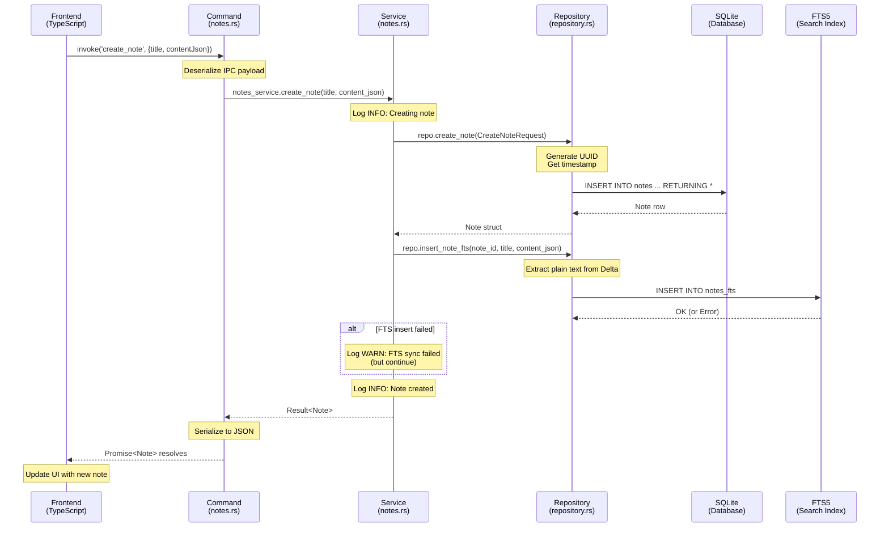

# Chapter 7: Creating Notes

In Chapter 6, we built the database foundation—tables, indexes, migrations, and the Repository pattern. Now we'll bring it to life by creating our first feature: **note creation**. This chapter traces a complete request from the frontend button click all the way through to SQLite, and back again.

Think of this chapter as **following a package through a shipping company**. When you drop a package at the counter (frontend), it gets a tracking number (UUID), travels through sorting facilities (command → service → repository), gets stored in a warehouse (SQLite), gets indexed for fast retrieval (FTS5), and you receive a confirmation receipt (Response). Every step has a specific responsibility, and the handoffs are explicit.

By the end of this chapter, you'll understand:
- How data flows through all four layers: Frontend → Command → Service → Repository
- Why we use Quill Delta format for rich text
- How FTS synchronization works (and what happens when it fails)
- The difference between thin command handlers and fat service layers
- How type safety bridges Rust and TypeScript

---

## 7.1 The Note Data Model

Before we create notes, we need to understand **what a note is** in both worlds: Rust and TypeScript.

### The Rust Model

In [src-tauri/src/database/models.rs](src-tauri/src/database/models.rs), we define the `Note` struct:

```rust
/// A note with rich text content
#[derive(Debug, Clone, Serialize, Deserialize, FromRow)]
pub struct Note {
    pub id: String,
    pub title: String,
    /// JSON-encoded Quill Delta format
    pub content_json: String,
    pub created_at: DateTime<Utc>,
    pub updated_at: DateTime<Utc>,
    pub deleted_at: Option<DateTime<Utc>>,
    /// Whether the title was manually modified (vs auto-generated from content)
    pub title_modified: bool,
    /// Optional collection/folder this note belongs to
    #[serde(default)]
    pub collection_id: Option<String>,
}
```

**Key decisions in this model:**

1. **`id: String` instead of `i32`**: We use UUIDs (Universally Unique Identifiers) as strings. Why? UUIDs can be generated on the client, server, or database without coordination. No need for auto-increment race conditions. The ID `"550e8400-e29b-41d4-a716-446655440000"` is globally unique.

2. **`content_json: String`**: Instead of plain text, we store rich text in **Quill Delta format**. More on this shortly.

3. **`deleted_at: Option<DateTime<Utc>>`**: Soft delete pattern. When `None`, the note is active. When `Some(timestamp)`, it's deleted but recoverable.

4. **`title_modified: bool`**: SwatNotes auto-generates titles from the first line of content. But if you manually change the title, we set `title_modified = true` so we don't overwrite your edits.

5. **Derives**: `Serialize` and `Deserialize` let serde convert between Rust and JSON. `FromRow` lets SQLx map database rows directly to this struct.

### The TypeScript Model

In [src/types.ts](src/types.ts), we mirror the Rust model:

```typescript
export interface Note {
  id: string;
  title: string;
  content_json: string; // Quill Delta JSON
  created_at: string;
  updated_at: string;
  deleted_at: string | null;
  title_modified: boolean;
  collection_id: string | null;
}
```

**Notice the differences:**
- **`DateTime<Utc>` becomes `string`**: When Rust serializes a `DateTime` to JSON, it becomes an ISO 8601 string like `"2024-01-15T10:30:00Z"`. TypeScript receives it as a string.
- **`Option<T>` becomes `T | null`**: Rust's `None` serializes to JSON `null`.

This **type alignment** is critical. If we add a field to the Rust struct but forget the TypeScript interface, we'll get runtime errors when the frontend tries to access it.

---

## 7.2 Understanding Quill Delta

SwatNotes uses **Quill** as the rich text editor. Quill doesn't store HTML—it uses a JSON format called **Delta**.

### What is a Delta?

A Delta is a **JSON array of operations** describing content and formatting. Each operation has an `insert` (the content) and optional `attributes` (the formatting).

Here's a simple example:

```json
{
  "ops": [
    { "insert": "Hello " },
    { "insert": "world", "attributes": { "bold": true } },
    { "insert": "\n" }
  ]
}
```

This represents: "Hello **world**" (with "world" in bold).

### Why Delta instead of HTML?

1. **Unambiguous**: HTML has 100 ways to make text bold (`<b>`, `<strong>`, `style="font-weight:bold"`). Delta has one way: `"attributes": { "bold": true }`.

2. **Operational Transform-friendly**: If we ever add collaborative editing, Delta operations can be merged mathematically. HTML strings cannot.

3. **Sanitization**: No risk of XSS attacks from malicious `<script>` tags. Delta is pure data.

4. **Searchable**: We extract plain text from Delta for full-text search. HTML would require a parser.

### Extracting Text from Delta

The Repository has a helper function in [src-tauri/src/database/repository.rs](src-tauri/src/database/repository.rs#L430-L454):

```rust
/// Extract plain text from Quill Delta JSON for indexing
fn extract_text_from_delta(delta_json: &str) -> String {
    match serde_json::from_str::<Value>(delta_json) {
        Ok(delta) => {
            if let Some(ops) = delta.get("ops").and_then(|v| v.as_array()) {
                ops.iter()
                    .filter_map(|op| op.get("insert")?.as_str())
                    .collect::<Vec<_>>()
                    .join("")
            } else {
                String::new()
            }
        }
        Err(_) => String::new(),
    }
}
```

**How it works:**
1. Parse the JSON string into a `serde_json::Value` (a flexible JSON type).
2. Navigate to `delta.ops` (an array).
3. For each operation, extract `op.insert` (skip if it's an image embed—we only want text).
4. Join all text fragments into a single string.

If the JSON is malformed, return an empty string instead of crashing. **Defensive programming**.

---

## 7.3 The Complete Data Flow

Let's trace a note creation request from start to finish. Imagine you click the "New Note" button in SwatNotes.

### Mental Model: The Assembly Line

Think of the request as a **product moving through a factory**:

1. **Frontend (Sales)**: Customer places an order: "Create a note titled 'Meeting Notes'."
2. **Command Layer (Order Processing)**: Receives the order, validates the format, passes it to manufacturing.
3. **Service Layer (Manufacturing)**: Generates a tracking number (UUID), coordinates with the warehouse (Repository) and logistics (FTS indexing), logs progress.
4. **Repository Layer (Warehouse)**: Stores the physical product (INSERT into SQLite).
5. **FTS Sync (Logistics)**: Indexes the product for fast retrieval later (FTS5).

Let's see the actual code for each step.

### Step 1: Frontend Calls the API

In [src/utils/notesApi.ts](src/utils/notesApi.ts#L10-L12), the TypeScript wrapper:

```typescript
export async function createNote(title: string, contentJson: string): Promise<Note> {
  return await invoke('create_note', { title, contentJson });
}
```

**What's happening:**
- `invoke()` is Tauri's IPC (Inter-Process Communication) function. It sends a message to the Rust backend.
- The first argument `'create_note'` is the **command name** (registered in Rust).
- The second argument `{ title, contentJson }` is the **payload** (serialized to JSON).
- The return type `Promise<Note>` is the **contract**—we expect a Note back (or an error).

This is like **calling a REST API**, except the "server" is a Rust process running on the same machine, and communication uses an optimized IPC channel instead of HTTP.

### Step 2: Command Layer Receives the Request

In [src-tauri/src/commands/notes.rs](src-tauri/src/commands/notes.rs#L8-L17), the Tauri command:

```rust
#[tauri::command]
pub async fn create_note(
    state: State<'_, AppState>,
    title: String,
    content_json: String,
) -> Result<Note> {
    state.notes_service.create_note(title, content_json).await
}
```

**Command layer responsibilities:**

1. **Deserialize the IPC payload**: Tauri automatically converts the JSON payload to Rust types (`String`).

2. **Inject dependencies**: The `state: State<'_, AppState>` parameter gives us access to `AppState` (which holds `notes_service`, `repo`, etc.). This is **dependency injection**—we don't create services inside the command, we receive them.

3. **Delegate to the service**: The command calls `notes_service.create_note()` and awaits the result.

4. **Serialize the response**: The `Result<Note>` return type is automatically converted to JSON and sent back to the frontend.

**Why is the command so thin?** Because business logic doesn't belong here. Commands are **adapters**—they translate between the IPC boundary (JSON strings) and the service layer (Rust types). If we put business logic here, we couldn't reuse it in a CLI tool, a REST API, or tests.

### Step 3: Service Layer Orchestrates the Operation

In [src-tauri/src/services/notes.rs](src-tauri/src/services/notes.rs#L32-L62), the service method:

```rust
pub async fn create_note(&self, title: String, content_json: String) -> Result<Note> {
    tracing::info!("Creating new note: {}", title);

    let req = CreateNoteRequest {
        title: title.clone(),
        content_json: content_json.clone(),
    };

    // Create note in database
    let note = self.repo.create_note(req).await?;

    // Sync to FTS index (non-critical - warn on failure but don't fail the operation)
    if let Err(e) = self.repo.insert_note_fts(&note.id, &title, &content_json).await {
        tracing::warn!("Failed to insert note into FTS index: {}", e);
    }

    tracing::info!("Note created successfully: {}", note.id);
    Ok(note)
}
```

**Service layer responsibilities:**

1. **Logging**: Log the operation at INFO level with context (`title`). This shows up in the console and log files.

2. **Build the request DTO**: Create a `CreateNoteRequest` struct. This keeps the API explicit (we could add validation here).

3. **Call the repository**: `self.repo.create_note(req).await?` does the database INSERT. The `?` operator propagates errors upward.

4. **Sync to FTS**: Call `insert_note_fts()` to index the note for search. **Key decision**: This is wrapped in `if let Err(e)` instead of `.await?`. Why? Because FTS is **non-critical**. If the FTS insert fails (corrupted index, disk full), we still want the note to be created. We log a warning and continue.

5. **Log success**: Record that the operation completed.

6. **Return the note**: The `Note` struct is returned to the command layer.

**Why is the service fat?** Because it **coordinates** multiple operations (database + FTS + logging). It contains the **business rules** (e.g., "FTS failures are non-fatal"). This logic can be unit tested without touching the frontend or database.

### Step 4: Repository Executes the SQL

In [src-tauri/src/database/repository.rs](src-tauri/src/database/repository.rs#L33-L51), the repository method:

```rust
pub async fn create_note(&self, req: CreateNoteRequest) -> Result<Note> {
    let id = Uuid::new_v4().to_string();
    let now = Utc::now();

    let note = sqlx::query_as::<_, Note>(
        r#"
        INSERT INTO notes (id, title, content_json, created_at, updated_at, title_modified)
        VALUES (?, ?, ?, ?, ?, 0)
        RETURNING *
        "#,
    )
    .bind(&id)
    .bind(&req.title)
    .bind(&req.content_json)
    .bind(now)
    .bind(now)
    .fetch_one(&self.pool)
    .await?;

    tracing::debug!("Created note: {}", id);
    Ok(note)
}
```

**Repository layer responsibilities:**

1. **Generate the UUID**: `Uuid::new_v4()` creates a random UUID. We convert it to a string for storage.

2. **Get the current timestamp**: `Utc::now()` gives us the current time in UTC.

3. **Execute the query**: `sqlx::query_as` runs the SQL and maps the result to a `Note` struct.
   - `INSERT INTO notes` adds the row.
   - `VALUES (?, ?, ?, ?, ?, 0)` uses **parameterized queries** (the `?` placeholders). SQLx binds the values safely, preventing SQL injection.
   - `RETURNING *` is a SQLite feature that returns the inserted row (so we get `created_at` and other computed fields).

4. **Bind parameters**: Each `.bind()` call fills in a `?` placeholder in order.

5. **Fetch one row**: `.fetch_one(&self.pool).await?` executes the query and expects exactly one row back. If the query fails (e.g., constraint violation), the `?` propagates the error.

6. **Log at DEBUG level**: Record the ID for troubleshooting.

7. **Return the note**: The complete `Note` struct is returned to the service.

**Why is this the only place we write SQL?** Because the Repository is the **boundary between our domain models and the database schema**. If we change the schema (e.g., rename `content_json` to `content`), we only edit this file. The service and command layers don't know SQL exists.

### Step 5: FTS Synchronization

Back in the service, after creating the note, we call [insert_note_fts](src-tauri/src/database/repository.rs#L456-L476):

```rust
pub async fn insert_note_fts(
    &self,
    note_id: &str,
    title: &str,
    content_json: &str,
) -> Result<()> {
    let content_text = Self::extract_text_from_delta(content_json);

    sqlx::query(
        r#"
        INSERT INTO notes_fts (note_id, title, content_text)
        VALUES (?, ?, ?)
        "#,
    )
    .bind(note_id)
    .bind(title)
    .bind(&content_text)
    .execute(&self.pool)
    .await?;

    tracing::debug!("Inserted note into FTS index: {}", note_id);
    Ok(())
}
```

**What happens here:**

1. **Extract plain text**: Call `extract_text_from_delta()` to convert the Quill Delta JSON to a plain string. For example, `{"ops":[{"insert":"Hello world\n"}]}` becomes `"Hello world\n"`.

2. **Insert into FTS table**: The `notes_fts` virtual table (FTS5) gets three columns: `note_id`, `title`, and `content_text`.

3. **Log at DEBUG level**: This is lower-priority logging (shown only if you run with `RUST_LOG=debug`).

**Why separate FTS sync from note creation?** Because they're **different concerns**:
- Creating the note is a **transaction** (must succeed or roll back).
- Syncing to FTS is **indexing** (improves search speed, but not critical to note existence).

If we put both in a single transaction, an FTS failure would rollback the note creation. We'd lose data. Instead, we gracefully degrade: the note exists, but searching might not find it until we rebuild the index.

---

## 7.4 Sequence Diagram

Here's the complete flow visualized:



**Key observations:**

- **Unidirectional flow**: Data flows left-to-right (frontend → backend) and returns right-to-left. No circular dependencies.
- **Error handling at boundaries**: The `?` operator in Rust bubbles errors up through Repository → Service → Command → Frontend (as a rejected Promise).
- **Graceful degradation**: FTS errors are caught and logged, but don't stop the operation.

---

## 7.5 The Clipboard Capture Feature

SwatNotes has a bonus feature: **Quick Capture from Clipboard**. You copy text anywhere, press a global shortcut, and SwatNotes creates a note with that text.

Let's see how it works.

### The Command

In [src-tauri/src/commands/notes.rs](src-tauri/src/commands/notes.rs#L91-L118), the `quick_capture_from_clipboard` command:

```rust
#[tauri::command]
pub async fn quick_capture_from_clipboard(
    app: AppHandle,
    state: State<'_, AppState>,
) -> Result<Note> {
    tracing::info!("Quick capture from clipboard triggered");

    // Read from clipboard (supports text and images)
    let text = match app.clipboard().read_text() {
        Ok(Some(text)) => text,
        Ok(None) => {
            return Err(AppError::Generic(
                "Clipboard is empty or contains non-text data".to_string(),
            ))
        }
        Err(e) => return Err(AppError::Generic(format!("Failed to read clipboard: {}", e))),
    };

    // (Code to convert plain text to Quill Delta omitted for brevity)

    // Create note with clipboard content
    state
        .notes_service
        .create_note(title.clone(), content_json)
        .await
}
```

**What's different from `create_note`?**

1. **AppHandle parameter**: The `app: AppHandle` parameter gives us access to Tauri's app instance, which includes the clipboard plugin.

2. **Clipboard API**: `app.clipboard().read_text()` reads text from the OS clipboard. This returns `Result<Option<String>>`:
   - `Ok(Some(text))` means we got text.
   - `Ok(None)` means the clipboard has an image, file, or is empty.
   - `Err(e)` means the OS denied clipboard access (permissions issue).

3. **Error handling**: We explicitly handle each case and return descriptive errors.

4. **Delta conversion**: The code (omitted here) converts plain text to Quill Delta format. For plain text, it's simple:

   ```rust
   let content_json = format!(r#"{{"ops":[{{"insert":"{}\n"}}]}}"#, text.replace('"', r#"\""#));
   ```

   This creates `{"ops":[{"insert":"clipboard text\n"}]}`.

5. **Same service call**: Once we have `title` and `content_json`, we call `notes_service.create_note()` just like the regular command. **Code reuse**.

### The Global Shortcut

In [src-tauri/src/app.rs](src-tauri/src/app.rs), during app initialization, we register a global shortcut:

```rust
app.global_shortcut()
    .on_shortcut("Ctrl+Alt+N", move |app, _event, _shortcut| {
        // Trigger the quick_capture_from_clipboard command
        let _ = app.emit("quick-capture", ());
    })
    .register();
```

**How it works:**

1. **Register the shortcut**: `on_shortcut("Ctrl+Alt+N", ...)` tells the OS to notify our app when the user presses Ctrl+Alt+N.
2. **Emit an event**: When triggered, we emit a Tauri event called `"quick-capture"`.
3. **Frontend listens**: The TypeScript code listens for this event and calls `invoke('quick_capture_from_clipboard')`.

This architecture keeps the command layer pure (no global state) while still supporting global hotkeys.

---

## 7.6 Error Handling: The `Result<T>` Pattern

Every Rust function in our backend returns `Result<T>` instead of `T`. Let's understand why.

### The Rust Way

In Rust, `Result<T, E>` is an enum:

```rust
enum Result<T, E> {
    Ok(T),    // Success: contains the value T
    Err(E),   // Failure: contains the error E
}
```

In SwatNotes, we use a type alias in [src-tauri/src/error.rs](src-tauri/src/error.rs):

```rust
pub type Result<T> = std::result::Result<T, AppError>;
```

So `Result<Note>` means "either a `Note` or an `AppError`".

### The `?` Operator

When you see `.await?` in our code, the `?` operator means:

1. If the result is `Ok(value)`, unwrap it and continue.
2. If the result is `Err(error)`, **immediately return** the error to the caller.

Example:

```rust
let note = self.repo.create_note(req).await?;
```

This is equivalent to:

```rust
let note = match self.repo.create_note(req).await {
    Ok(note) => note,
    Err(e) => return Err(e),
};
```

**Why this matters:** Errors **propagate automatically** through the layers. If the Repository hits a database constraint violation, the error bubbles up through Service → Command → Frontend without any manual `if err != nil` checks.

### Error Translation at the Boundary

When an error reaches the Tauri command layer, Tauri's `#[tauri::command]` macro automatically:

1. Serializes the error to JSON.
2. Sends it to the frontend as a rejected Promise.

On the frontend, in [src/utils/notesApi.ts](src/utils/notesApi.ts), we catch it:

```typescript
try {
  const note = await createNote("Meeting Notes", contentJson);
  console.log("Created note:", note);
} catch (error) {
  console.error("Failed to create note:", error);
  // Show error message to user
}
```

**Mental model:** Think of `Result<T>` as a **railway track** with two rails: the happy path (Ok) and the error path (Err). The `?` operator is a switch that **automatically diverts** onto the error track when things go wrong, without derailing the train.

---

## 7.7 Testing the Create Flow

Let's trace a manual test to see all the pieces together.

### Test Scenario

1. Open SwatNotes.
2. Click "New Note".
3. Type "Project Ideas" in the title.
4. Type "1. Build a notes app" in the editor.
5. Save the note.

### What Happens Behind the Scenes

**Frontend** (main.ts or noteEditor.ts):
```typescript
const title = "Project Ideas";
const delta = quill.getContents(); // Quill Delta object
const contentJson = JSON.stringify(delta);
const note = await createNote(title, contentJson);
console.log("Note created:", note.id);
```

**Command layer** (commands/notes.rs):
```rust
#[tauri::command]
pub async fn create_note(state: State<'_, AppState>, title: String, content_json: String) -> Result<Note> {
    state.notes_service.create_note(title, content_json).await
}
```

**Service layer** (services/notes.rs):
```rust
pub async fn create_note(&self, title: String, content_json: String) -> Result<Note> {
    tracing::info!("Creating new note: {}", title); // Log: "Creating new note: Project Ideas"
    let req = CreateNoteRequest { title, content_json };
    let note = self.repo.create_note(req).await?;
    // FTS sync...
    tracing::info!("Note created successfully: {}", note.id); // Log: "Note created successfully: 550e8400-..."
    Ok(note)
}
```

**Repository layer** (repository.rs):
```rust
pub async fn create_note(&self, req: CreateNoteRequest) -> Result<Note> {
    let id = Uuid::new_v4().to_string(); // e.g., "550e8400-e29b-41d4-a716-446655440000"
    let now = Utc::now(); // e.g., 2024-01-15T10:30:00Z
    let note = sqlx::query_as::<_, Note>(
        "INSERT INTO notes (id, title, content_json, created_at, updated_at, title_modified) VALUES (?, ?, ?, ?, ?, 0) RETURNING *",
    )
    .bind(&id)
    .bind("Project Ideas")
    .bind("{\"ops\":[{\"insert\":\"1. Build a notes app\\n\"}]}")
    .bind(now)
    .bind(now)
    .fetch_one(&self.pool)
    .await?;
    Ok(note)
}
```

**SQLite** executes:
```sql
INSERT INTO notes (id, title, content_json, created_at, updated_at, title_modified)
VALUES ('550e8400-e29b-41d4-a716-446655440000', 'Project Ideas', '{"ops":[{"insert":"1. Build a notes app\n"}]}', '2024-01-15 10:30:00+00:00', '2024-01-15 10:30:00+00:00', 0)
RETURNING *;
```

**FTS5** inserts:
```sql
INSERT INTO notes_fts (note_id, title, content_text)
VALUES ('550e8400-e29b-41d4-a716-446655440000', 'Project Ideas', '1. Build a notes app\n');
```

**Response returns to frontend:**
```json
{
  "id": "550e8400-e29b-41d4-a716-446655440000",
  "title": "Project Ideas",
  "content_json": "{\"ops\":[{\"insert\":\"1. Build a notes app\\n\"}]}",
  "created_at": "2024-01-15T10:30:00Z",
  "updated_at": "2024-01-15T10:30:00Z",
  "deleted_at": null,
  "title_modified": false,
  "collection_id": null
}
```

**Frontend updates the UI** with the new note ID, shows it in the list, and enables editing.

---

## 7.8 Why This Architecture?

You might wonder: "Why four layers? Why not just write SQL in the frontend?"

Here's the rationale:

### 1. Separation of Concerns

- **Frontend**: "Show a button. When clicked, create a note." No knowledge of SQL, UUIDs, or FTS.
- **Command**: "Translate IPC to Rust." No business logic.
- **Service**: "Create a note means: generate UUID, insert to DB, sync FTS, log." Reusable logic.
- **Repository**: "Execute SQL safely." No knowledge of FTS or logging.

Each layer has **one reason to change**.

### 2. Testability

We can unit test the service layer without touching the database (by mocking the repository). We can integration test the repository without touching the frontend.

### 3. Security

The frontend cannot execute arbitrary SQL. It calls **specific commands** with **validated inputs**. If a malicious script tries `invoke('delete_note', { id: '; DROP TABLE notes;--' })`, the parameterized query treats it as a literal ID string, not SQL.

### 4. Flexibility

If we add a REST API later (e.g., for syncing between devices), we reuse the service layer. The command layer is just an **adapter**.

---

## 7.9 Key Takeaways

**Data Models**:
- Rust and TypeScript models must stay in sync.
- Use UUIDs for client-generated IDs.
- Store rich text as Quill Delta (JSON) instead of HTML.

**Data Flow**:
- Frontend → Command (IPC boundary, deserialization).
- Command → Service (dependency injection, delegation).
- Service → Repository (business logic orchestration).
- Repository → SQLite (raw SQL execution).

**Error Handling**:
- Use `Result<T>` everywhere.
- The `?` operator propagates errors automatically.
- Graceful degradation for non-critical operations (FTS).

**FTS Synchronization**:
- Extract plain text from Delta for indexing.
- Sync to FTS after database insert (not in the same transaction).
- Log warnings on FTS failures instead of failing the operation.

**Global Shortcuts**:
- Register shortcuts with Tauri's global shortcut plugin.
- Emit events to trigger frontend actions.
- Reuse service methods for clipboard capture.

---

## Glossary Additions for Chapter 7

| Term | Definition |
|------|------------|
| **UUID (Universally Unique Identifier)** | A 128-bit identifier (e.g., `550e8400-e29b-41d4-a716-446655440000`) guaranteed to be unique without a central authority. SwatNotes uses UUIDs as note IDs. |
| **Quill Delta** | A JSON format representing rich text content as an array of insert operations with attributes (e.g., `{"ops":[{"insert":"Hello","attributes":{"bold":true}}]}`). Used by the Quill editor. |
| **Delta ops** | Individual operations in a Quill Delta, each with an `insert` (content) and optional `attributes` (formatting). |
| **IPC (Inter-Process Communication)** | Communication between processes, typically using message passing. Tauri uses IPC to send commands from the TypeScript frontend to the Rust backend. |
| **Tauri command** | A Rust function marked with `#[tauri::command]` that can be invoked from the frontend via `invoke()`. Commands are registered at app startup. |
| **invoke()** | Tauri's TypeScript function for calling Rust commands. Returns a Promise that resolves with the command result or rejects with an error. |
| **State injection** | Passing shared state (like `AppState`) to functions via parameters. Tauri provides `State<'_, AppState>` to commands automatically. |
| **DTO (Data Transfer Object)** | A simple struct used to transfer data between layers (e.g., `CreateNoteRequest`). DTOs have no business logic, just fields. |
| **Thin handler / Fat service** | A pattern where command handlers (thin) delegate to service methods (fat). Handlers adapt requests; services contain logic. |
| **Graceful degradation** | A system's ability to continue functioning when a non-critical component fails (e.g., note creation succeeds even if FTS sync fails). |
| **RETURNING clause** | A SQLite (and PostgreSQL) feature that returns the inserted/updated row in the same query (e.g., `INSERT ... RETURNING *`). Avoids a separate SELECT. |
| **Parameterized query** | A SQL query with placeholders (`?`) for values, filled in by binding. Prevents SQL injection by separating query structure from data. |
| **FTS synchronization** | Keeping the FTS5 index in sync with the main table by inserting/updating/deleting FTS rows whenever the main table changes. |
| **Error propagation** | Passing errors up the call stack without handling them. In Rust, the `?` operator propagates `Err` values automatically. |
| **Global shortcut** | A keyboard shortcut that works system-wide, even when the app is not focused. Registered with the OS via Tauri's global shortcut plugin. |
| **AppHandle** | Tauri's handle to the running app instance. Provides access to windows, clipboard, events, and other app-level APIs. |

---

**Next up:** In Chapter 8, we'll implement **reading and listing notes**—queries, pagination, and rendering notes in the UI. We'll learn about SQL `JOIN`s for fetching related data (like attachments) and avoid the N+1 query problem.
