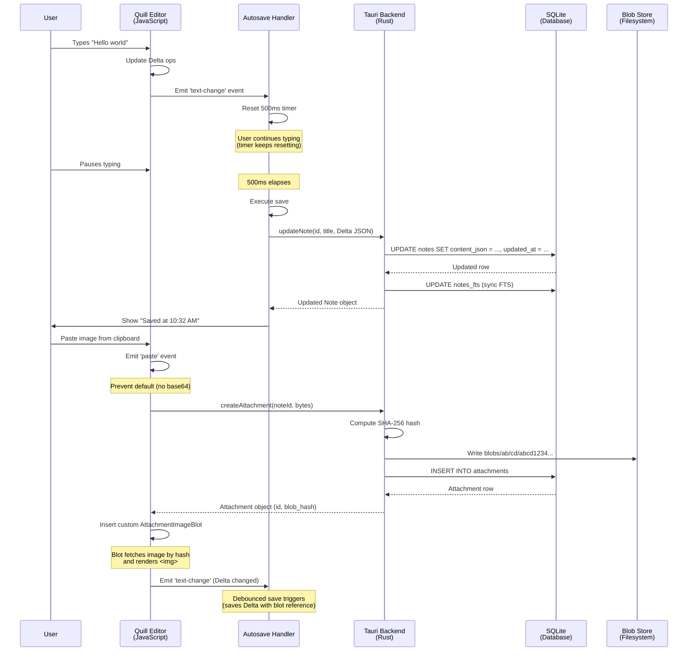

# Chapter 8: Rich Text Editing

In Chapter 7, we created notes with plain Delta JSON strings. But what makes SwatNotes powerful is **rich text editing**—bold, italic, lists, images, colors, and more. This chapter dives deep into **Quill.js**, the editor that powers SwatNotes, and how we integrate it with Tauri's backend.

Think of this chapter as **building a word processor inside a web browser**. We'll learn how Quill stores formatting, how we save changes without the user clicking "Save," how images are embedded without bloating the database, and how to prevent data loss during crashes.

By the end of this chapter, you'll understand:
- How Quill.js represents rich text as Delta operations
- Setting up the Quill editor with a custom toolbar
- Autosave with debouncing (saving efficiently without hammering the database)
- Automatic title generation from content
- Custom Quill "blots" for image and file attachments
- Clipboard paste handling for images
- Drag-and-drop file uploads
- The editor lifecycle (create, update, cleanup)

---

## 8.1 Why Quill.js?

When building a rich text editor, you have three main options:

1. **`<textarea>` with Markdown**: Users type `**bold**` and you render it. Simple, but not WYSIWYG (What You See Is What You Get). Users must learn Markdown syntax.

2. **`contenteditable` DIV**: Browser's native rich text editing. Powerful, but inconsistent across browsers. Handling paste from Word documents is a nightmare. The DOM becomes the source of truth, which is fragile.

3. **Dedicated Editor Library** (like Quill, ProseMirror, or TipTap): Controlled environment with a data model separate from the DOM. Quill stores content as Delta operations, renders to DOM, and provides a clean API.

**SwatNotes uses Quill** because:
- **WYSIWYG**: Users see formatting instantly.
- **Delta format**: Structured JSON, not HTML. Easy to search, sanitize, and version.
- **Modular**: We can add custom "blots" (Quill's term for content types) like our attachment chips.
- **Stable API**: Quill has been around since 2014, well-tested in production.

---

## 8.2 The Quill Delta Format (Deep Dive)

We touched on Delta in Chapter 7, but let's go deeper. Understanding Delta is crucial because **it's how we think about content**.

### Delta Structure

A Delta is a JSON object with an `ops` array (operations). Each operation has:
- **`insert`**: The content to insert (string for text, object for embeds like images).
- **`attributes`** (optional): Formatting applied to the inserted content.

Example:

```json
{
  "ops": [
    { "insert": "Hello " },
    { "insert": "world", "attributes": { "bold": true } },
    { "insert": "\n" }
  ]
}
```

This represents: "Hello **world**" (with "world" bolded).

### More Complex Example

```json
{
  "ops": [
    { "insert": "Shopping List", "attributes": { "header": 1 } },
    { "insert": "\n" },
    { "insert": "Milk" },
    { "insert": "\n", "attributes": { "list": "bullet" } },
    { "insert": "Eggs" },
    { "insert": "\n", "attributes": { "list": "bullet" } },
    { "insert": "Bread" },
    { "insert": "\n", "attributes": { "list": "bullet" } }
  ]
}
```

This represents:

```
# Shopping List
• Milk
• Eggs
• Bread
```

**Key insights:**

1. **Newlines are explicit**: The `\n` character is inserted as content. Formatting like `"list": "bullet"` applies to the *newline*, not the text before it. This is how Quill represents block-level formatting.

2. **Embeds use objects**: For images, you insert an object like `{ "image": "data:image/png;base64,..." }` instead of a string.

3. **No nesting**: Delta is flat. There's no `<ul><li>Milk</li></ul>` nesting. Each line is independent.

### The TypeScript Interface

In [src/types.ts](src/types.ts), SwatNotes defines:

```typescript
export interface QuillDelta {
  ops: Array<{
    insert: string | object;
    attributes?: Record<string, any>;
  }>;
}
```

This mirrors Quill's internal structure. When we call `quill.getContents()`, we get a Delta object. We serialize it to JSON with `JSON.stringify()` and store it in the database.

---

## 8.3 Setting Up the Quill Editor

Let's walk through creating a Quill instance in [src/components/noteEditor.ts](src/components/noteEditor.ts#L98-L129).

### The Setup Function

```typescript
function setupQuillEditor(element: HTMLElement, note: Note): Quill {
  const quill = new Quill(element, {
    theme: 'snow',
    placeholder: 'Start writing...',
    modules: {
      toolbar: [
        [{ 'header': [1, 2, 3, false] }],
        ['bold', 'italic', 'underline', 'strike'],
        [{ 'list': 'ordered'}, { 'list': 'bullet' }],
        [{ 'color': [] }, { 'background': [] }],
        ['link', 'blockquote', 'code-block'],
        ['clean']
      ]
    }
  });

  // Load initial content
  try {
    const content = JSON.parse(note.content_json);
    quill.setContents(content);
  } catch (e) {
    logger.error('Failed to parse note content', LOG_CONTEXT, e);
    quill.setText('');
  }

  return quill;
}
```

**What's happening:**

1. **Theme: 'snow'**: Quill's default theme with a toolbar. There's also 'bubble' (inline toolbar) and core (no toolbar).

2. **Placeholder**: Text shown when the editor is empty.

3. **Toolbar configuration**: An array of button groups. Each group is an array of format options:
   - `{ 'header': [1, 2, 3, false] }` - Dropdown for H1, H2, H3, or normal text.
   - `['bold', 'italic', 'underline', 'strike']` - Toggle buttons for inline formats.
   - `{ 'list': 'ordered' }` - Numbered list button.
   - `{ 'color': [] }` - Color picker (empty array means default color palette).
   - `'clean'` - Button to remove all formatting.

4. **Loading content**: We parse the `note.content_json` string (stored in SQLite) into a JavaScript object and pass it to `quill.setContents()`. This populates the editor.

5. **Error handling**: If the JSON is corrupted, we clear the editor instead of crashing.

### The DOM Structure

When we call `new Quill(element, ...)`, Quill transforms the `element` into this structure:

```html
<div id="note-editor">
  <div class="ql-toolbar"> <!-- Toolbar with buttons --> </div>
  <div class="ql-container">
    <div class="ql-editor" contenteditable="true">
      <!-- User's content renders here -->
    </div>
  </div>
</div>
```

The `ql-editor` div is where users type. Quill listens to DOM changes, updates its internal Delta model, and re-renders as needed.

---

## 8.4 Autosave: The Debounced Save Pattern

Imagine typing in a notes app where every keystroke triggers a database write. You'd hear your hard drive clicking like a jackhammer. **Debouncing** solves this: we wait until the user *stops typing* for 500ms, then save.

### Mental Model: The Lazy Chef

Think of autosave like a **lazy chef** in a kitchen:

- **Without debouncing**: Every time you say "add salt," the chef runs to the pantry, grabs salt, adds a pinch, and runs back. Exhausting.
- **With debouncing**: The chef waits. You say "add salt... add pepper... add garlic." The chef thinks, "Okay, they're still talking. I'll wait." After 500ms of silence, the chef gathers everything and does it in one trip. **Efficient**.

### The Autosave Code

In [src/components/noteEditor.ts](src/components/noteEditor.ts#L135-L213), the `setupAutosave` function:

```typescript
function setupAutosave(
  quill: Quill,
  titleInput: HTMLInputElement,
  autoTitleCheckbox: HTMLInputElement,
  saveStatus: HTMLElement,
  note: Note,
  titleState: TitleState,
  onSave?: (note: Note) => void
): { debouncedSave: () => Promise<void>; saveImmediately: () => Promise<void>; state: AutosaveState } {
  const state: AutosaveState = {
    saveTimeout: null,
    isSaving: false
  };

  const debouncedSave = async (): Promise<void> => {
    if (state.isSaving) return; // Don't trigger another save if already saving

    if (state.saveTimeout) clearTimeout(state.saveTimeout); // Cancel previous timer

    state.saveTimeout = setTimeout(async () => {
      // Don't save empty notes
      if (isNoteEmpty()) {
        logger.debug('Skipping save for empty note', LOG_CONTEXT);
        return;
      }

      try {
        state.isSaving = true;
        saveStatus.textContent = 'Saving...';
        saveStatus.classList.add('text-info');

        const title = titleInput.value.trim() || 'Untitled';
        const contentJson = JSON.stringify(quill.getContents());

        const updatedNote = await updateNote(
          note.id,
          title,
          contentJson,
          titleState.isManuallyModified
        );

        saveStatus.textContent = `Saved at ${formatDate(updatedNote.updated_at)}`;
        saveStatus.classList.remove('text-info');
        saveStatus.classList.add('text-success');

        // Notify that notes have changed
        await emit('notes-list-changed');

        if (onSave) {
          onSave(updatedNote);
        }
      } catch (error) {
        logger.error('Save error', LOG_CONTEXT, error);
        saveStatus.textContent = 'Save failed';
        saveStatus.classList.add('text-error');
      } finally {
        state.isSaving = false;
      }
    }, AUTOSAVE_DEBOUNCE_MS); // 500ms delay
  };

  // Listen for content changes
  quill.on('text-change', () => {
    updateAutoTitle();
    debouncedSave();
  });

  return { debouncedSave, saveImmediately, state };
}
```

**Key patterns:**

1. **`state.saveTimeout`**: Stores the timer ID. Each time `debouncedSave()` is called, we clear the previous timer with `clearTimeout()` and start a new one.

2. **500ms delay**: Defined as `AUTOSAVE_DEBOUNCE_MS` constant. If the user types within 500ms, the timer resets. Only when they pause for 500ms does the save execute.

3. **`state.isSaving` flag**: Prevents concurrent saves. If a save is in progress and the user types again, we don't start a second save—we queue it after the current one finishes.

4. **Empty note check**: Quill always has at least one character (the final newline). We check `quill.getText().trim().length === 0` to skip saving blank notes.

5. **Status UI**: The `saveStatus` element shows "Saving...", "Saved at 10:30 AM", or "Save failed". This gives users confidence their work is safe.

6. **Event emission**: After saving, we emit `'notes-list-changed'` event. Other parts of the UI (like the notes list sidebar) listen for this and refresh.

### Immediate Save

For certain actions (like losing focus on the title input), we want to save *immediately* without waiting:

```typescript
const saveImmediately = async (): Promise<void> => {
  if (state.saveTimeout) clearTimeout(state.saveTimeout);
  if (!state.isSaving && !isNoteEmpty()) {
    await debouncedSave();
  }
};

titleInput.addEventListener('blur', saveImmediately);
```

When the user clicks away from the title field, we cancel the debounce timer and save instantly.

---

## 8.5 Automatic Title Generation

SwatNotes has a clever feature: if you don't manually set a title, it auto-generates one from the first line of content.

### How It Works

In [src/components/noteEditor.ts](src/components/noteEditor.ts#L77-L91), the `generateTitleFromContent` function:

```typescript
function generateTitleFromContent(quill: Quill): string {
  const text = quill.getText().trim();
  if (!text) {
    return 'Untitled';
  }

  // Get first line or first 50 characters
  const firstLine = text.split('\n')[0];
  if (firstLine.length > 50) {
    return firstLine.substring(0, 50) + '...';
  }

  return firstLine || 'Untitled';
}
```

**Logic:**

1. Extract plain text from Quill with `quill.getText()` (strips all formatting).
2. Split by `\n` to get lines.
3. Take the first line.
4. If longer than 50 characters, truncate with `...`.
5. If empty, return "Untitled".

### The Auto-Title Checkbox

In the editor UI, there's a checkbox: **"Auto-generate title from content"**. When checked:

- Every time the user types, we regenerate the title.
- The title input is still editable, but if the user manually changes it to something different than the auto-generated title, we uncheck the box and set `title_modified = true` in the database.

**Why?** Imagine you create a note: "Buy groceries at Whole Foods." The auto-title is "Buy groceries at Whole Foods." Later, you edit it to: "Buy groceries at Whole Foods and pick up dry cleaning." The auto-title updates. But if you manually change the title to "Shopping List," we respect that and stop auto-generating.

Code for manual modification detection in [noteEditor.ts](src/components/noteEditor.ts#L228-L240):

```typescript
titleInput.addEventListener('input', () => {
  // If user types in title field, mark as manually modified
  if (!titleState.isManuallyModified) {
    // Only mark as modified if the value differs from auto-generated
    const autoTitle = generateTitleFromContent(quill);
    if (titleInput.value.trim() !== autoTitle) {
      titleState.isManuallyModified = true;
      autoTitleCheckbox.checked = false;
    }
  }
  debouncedSave();
});
```

**The `title_modified` field** (stored in the `notes` table) tracks this state across app restarts.

---

## 8.6 Custom Quill Blots for Attachments

Quill supports embeds (images, videos, etc.), but by default, it stores images as **data URLs** (base64-encoded strings). For a 5MB image, that's 7MB of base64 in the Delta JSON. **Unacceptable**.

Instead, SwatNotes uses **custom blots** that store **references** to attachments (by blob hash), and load the image dynamically.

### What is a Blot?

In Quill's architecture, a **blot** is a content type. Built-in blots include:
- `TextBlot` - Plain text
- `BoldBlot` - Bold formatting
- `ImageBlot` - Inline images
- `BlockEmbed` - Block-level embeds (like our attachment chips)

We define two custom blots in [src/utils/quillAttachmentBlots.ts](src/utils/quillAttachmentBlots.ts):

1. **`AttachmentImageBlot`** - For image attachments (renders as ``).
2. **`AttachmentFileBlot`** - For non-image files (renders as a clickable chip).

### AttachmentImageBlot

In [quillAttachmentBlots.ts](src/utils/quillAttachmentBlots.ts#L25-L112), the image blot:

```typescript
export class AttachmentImageBlot extends BlockEmbed {
  static blotName = 'attachment-image';
  static tagName = 'div';
  static className = 'ql-attachment-image';

  static create(value: AttachmentImageValue): HTMLElement {
    const node = super.create() as HTMLElement;
    node.setAttribute('data-attachment-id', value.attachmentId || '');
    node.setAttribute('data-blob-hash', value.blobHash);
    node.setAttribute('data-mime-type', value.mimeType);
    node.setAttribute('data-filename', value.filename || '');
    node.setAttribute('contenteditable', 'false');

    // Create loading placeholder
    const placeholder = document.createElement('div');
    placeholder.innerHTML = `
      <span class="loading loading-spinner loading-sm"></span>
      <span class="text-xs">Loading image...</span>
    `;
    node.appendChild(placeholder);

    // Load the image asynchronously
    AttachmentImageBlot.loadImage(node, img, value.blobHash, value.mimeType, placeholder);

    return node;
  }

  static async loadImage(
    node: HTMLElement,
    img: HTMLImageElement,
    blobHash: string,
    mimeType: string,
    placeholder: HTMLElement
  ): Promise<void> {
    try {
      const data = await getAttachmentData(blobHash); // Fetch from backend
      const url = createDataUrl(data, mimeType); // Create data URL
      img.src = url;

      img.onload = () => {
        placeholder.remove();
        node.appendChild(img);
      };
    } catch (error) {
      logger.error('Failed to load attachment image', LOG_CONTEXT, error);
      placeholder.innerHTML = `<span class="text-error text-xs">Failed to load image</span>`;
    }
  }

  static value(node: HTMLElement): AttachmentImageValue {
    return {
      attachmentId: node.getAttribute('data-attachment-id') || '',
      blobHash: node.getAttribute('data-blob-hash') || '',
      mimeType: node.getAttribute('data-mime-type') || '',
      filename: node.getAttribute('data-filename') || '',
    };
  }
}
```

**How it works:**

1. **`create()` method**: Called when Quill needs to render this blot. We create a `<div>` with `data-*` attributes storing the attachment metadata (blob hash, MIME type, filename).

2. **Loading state**: Initially, we show a spinner with "Loading image..." because fetching the image from the backend is async.

3. **`loadImage()` method**: Calls `getAttachmentData(blobHash)` (a Tauri command) to fetch the image bytes, converts them to a data URL, and sets `img.src`.

4. **`value()` method**: Called when Quill serializes the blot back to Delta. We extract the `data-*` attributes and return an object like:

   ```json
   {
     "insert": {
       "attachment-image": {
         "attachmentId": "abc123",
         "blobHash": "def456",
         "mimeType": "image/png",
         "filename": "screenshot.png"
       }
     }
   }
   ```

This object is what gets saved in the Delta JSON. **No base64 bloat**—just a 64-character hash reference.

### AttachmentFileBlot

For non-image files (PDFs, Word docs, etc.), we render a **file chip** in [quillAttachmentBlots.ts](src/utils/quillAttachmentBlots.ts#L131-L260):

```typescript
export class AttachmentFileBlot extends BlockEmbed {
  static blotName = 'attachment-file';
  static tagName = 'div';
  static className = 'ql-attachment-file';

  static create(value: AttachmentFileValue): HTMLElement {
    const node = super.create() as HTMLElement;
    node.setAttribute('data-blob-hash', value.blobHash);
    node.setAttribute('data-filename', value.filename);
    node.setAttribute('data-size', String(value.size || 0));

    // Create file chip UI
    node.innerHTML = `
      <div class="attachment-file-chip">
        <span>${getFileIconSvg(value.mimeType)}</span>
        <div>
          <div>${value.filename}</div>
          <div>${formatFileSize(value.size)}</div>
        </div>
        <span>📥</span>
      </div>
    `;

    // Click to download
    node.addEventListener('click', async () => {
      await AttachmentFileBlot.downloadFile(value.blobHash, value.mimeType, value.filename);
    });

    return node;
  }

  static async downloadFile(blobHash: string, mimeType: string, filename: string): Promise<void> {
    const data = await getAttachmentData(blobHash);
    const filePath = await save({ defaultPath: filename }); // Tauri file dialog
    if (filePath) {
      await writeFile(filePath, data);
      logger.info(`Downloaded attachment to ${filePath}`, LOG_CONTEXT);
    }
  }
}
```

**Key features:**

1. **Chip UI**: Shows file icon (based on MIME type), filename, and file size.
2. **Click to download**: When clicked, opens a save dialog and writes the file to disk.
3. **No preview**: We don't try to render PDFs inline—just provide a download button.

### Registering Blots

Before Quill can use our custom blots, we register them in [quillAttachmentBlots.ts](src/utils/quillAttachmentBlots.ts#L280-L284):

```typescript
export function registerAttachmentBlots(): void {
  Quill.register('formats/attachment-image', AttachmentImageBlot);
  Quill.register('formats/attachment-file', AttachmentFileBlot);
  logger.debug('Registered attachment blots', LOG_CONTEXT);
}
```

This is called once at module load in [noteEditor.ts](src/components/noteEditor.ts#L33):

```typescript
// Register custom blots once at module load
registerAttachmentBlots();
```

---

## 8.7 Handling Clipboard Paste for Images

One of SwatNotes' best UX features: **paste an image from the clipboard, and it appears inline**. No "upload" button required.

### The Paste Event Handler

In [noteEditor.ts](src/components/noteEditor.ts#L367-L385), we listen for `paste` events:

```typescript
const pasteHandler = async (e: ClipboardEvent) => {
  const clipboardData = e.clipboardData || (window as any).clipboardData;
  const items = clipboardData.items;

  for (let i = 0; i < items.length; i++) {
    if (items[i].type.indexOf('image') !== -1) {
      e.preventDefault(); // Don't let Quill handle it (would insert base64)
      const blob = items[i].getAsFile();
      if (blob) {
        await handleImagePaste(blob);
      }
      break;
    }
  }
};

editorElement.addEventListener('paste', pasteHandler);
```

**How it works:**

1. **Check clipboard items**: `clipboardData.items` is an array of clipboard data. Each item has a `type` (MIME type).

2. **Look for images**: If any item's type contains `"image"`, we handle it.

3. **Prevent default**: `e.preventDefault()` stops Quill from inserting the image as a base64 data URL.

4. **Get the Blob**: `items[i].getAsFile()` gives us a JavaScript `Blob` object (the raw image bytes).

5. **Upload to backend**: Call `handleImagePaste(blob)`, which:
   - Converts the Blob to a byte array.
   - Calls `createAttachment(noteId, filename, mimeType, data)` (a Tauri command).
   - Backend stores the image in content-addressed storage (by SHA-256 hash).
   - Backend returns an `Attachment` object with `id` and `blob_hash`.
   - Frontend inserts the attachment into Quill using `insertInlineAttachment()`.

### The Upload Flow

In [noteEditor.ts](src/components/noteEditor.ts#L320-L358):

```typescript
async function handleImagePaste(blob: Blob): Promise<void> {
  await handleFileUpload(blob, `pasted-image-${Date.now()}.png`);
}

async function handleFileUpload(file: Blob | File, defaultFilename?: string): Promise<void> {
  const actualFilename = file instanceof File ? file.name : (defaultFilename || 'file');
  const mimeType = file.type || 'application/octet-stream';

  try {
    saveStatus.textContent = `Uploading ${actualFilename}...`;
    saveStatus.classList.add('text-info');

    const bytes = await readFileAsBytes(file);
    const attachment = await createAttachment(note.id, actualFilename, mimeType, bytes);

    // Insert into editor at cursor position
    insertInlineAttachment(quill, attachment);

    // Refresh attachments list
    await loadAttachments();

    saveStatus.textContent = `Uploaded ${actualFilename}`;
    saveStatus.classList.add('text-success');
  } catch (error) {
    logger.error('Failed to upload file', LOG_CONTEXT, error);
    saveStatus.textContent = `Failed to upload ${actualFilename}`;
    saveStatus.classList.add('text-error');
  }
}
```

**The flow:**

1. **Convert to bytes**: `readFileAsBytes(file)` uses the FileReader API to get a `Uint8Array`.
2. **Call backend**: `createAttachment()` invokes the Rust command.
3. **Insert into Quill**: `insertInlineAttachment(quill, attachment)` embeds the custom blot at the cursor position.
4. **Refresh sidebar**: The attachments list in the sidebar updates to show the new file.

---

## 8.8 Drag-and-Drop File Uploads

SwatNotes also supports **dragging files into the editor**. Same flow as paste, different trigger.

### The Drag Event Handlers

In [noteEditor.ts](src/components/noteEditor.ts#L387-L423):

```typescript
const dragOverHandler = (e: DragEvent) => {
  e.preventDefault();
  editorElement.classList.add('drag-over'); // Visual feedback
};

const dragLeaveHandler = (e: DragEvent) => {
  e.preventDefault();
  editorElement.classList.remove('drag-over');
};

const dropHandler = async (e: DragEvent) => {
  e.preventDefault();
  editorElement.classList.remove('drag-over');

  const files = e.dataTransfer?.files;
  if (!files || files.length === 0) return;

  for (const file of Array.from(files)) {
    await handleFileUpload(file);
  }
};

editorElement.addEventListener('dragover', dragOverHandler);
editorElement.addEventListener('dragleave', dragLeaveHandler);
editorElement.addEventListener('drop', dropHandler);
```

**Key points:**

1. **`dragover` event**: Fired continuously while dragging over the element. We call `e.preventDefault()` to allow dropping (browsers block drops by default).

2. **Visual feedback**: Add a `drag-over` class to highlight the drop zone (e.g., add a blue border via CSS).

3. **`drop` event**: Fired when the user releases the mouse. We get the files from `e.dataTransfer.files`.

4. **Multiple files**: We loop through all dropped files and upload each one.

5. **Same upload function**: `handleFileUpload(file)` is reused from paste handling. **DRY (Don't Repeat Yourself)**.

---

## 8.9 The Complete Editor Lifecycle

Let's zoom out and see the **big picture**: creating an editor, using it, and cleaning up.

### Creating the Editor

In [main.ts](src/main.ts#L175-L190), when a note is opened:

```typescript
async function openNoteInEditor(note: Note): Promise<void> {
  const container = document.getElementById('editor-container');
  container.innerHTML = '<div class="max-w-4xl mx-auto" id="note-editor-wrapper"></div>';

  const editor = createNoteEditor(
    'note-editor-wrapper',
    note,
    (updatedNote) => {
      appState.updateCurrentNote(updatedNote);
      refreshNotesList();
    },
    () => {
      deleteCurrentNote();
    }
  );

  appState.setCurrentEditor(editor);
}
```

**The `createNoteEditor` function** (exported from `noteEditor.ts`) does all the heavy lifting:

1. **Render HTML template**: Insert the editor UI (title input, Quill container, toolbar, tabs for attachments/reminders/collections).

2. **Initialize Quill**: Call `setupQuillEditor()` to create the Quill instance.

3. **Setup autosave**: Call `setupAutosave()` to attach debounced save logic.

4. **Setup attachments**: Call `setupAttachments()` to handle paste/drag-and-drop.

5. **Setup reminders**: Add UI for scheduling reminders.

6. **Setup collections**: Dropdown for assigning the note to a collection.

7. **Return a cleanup function**: So the caller can destroy the editor later.

### Using the Editor

Once created, the editor is **reactive**:

- **User types** → `text-change` event → `debouncedSave()` → waits 500ms → saves to backend.
- **User pastes image** → `paste` event → uploads to backend → inserts custom blot.
- **User changes title** → `input` event → checks if manually modified → debounced save.

All of this happens **without explicit "Save" buttons**. The UI always shows the latest save status ("Saved at 10:32 AM").

### Cleaning Up the Editor

When switching to a different note, we must **clean up** the old editor to prevent memory leaks.

In [noteEditor.ts](src/components/noteEditor.ts#L850-L870), the `destroy()` method:

```typescript
export interface NoteEditorInstance {
  quill: Quill;
  destroy: () => void;
}

function createNoteEditor(...): NoteEditorInstance {
  // ... setup code ...

  const cleanupFunctions: Array<() => void> = [];

  // Collect cleanup functions from each module
  cleanupFunctions.push(attachmentsCleanup);
  // ... other cleanups ...

  return {
    quill,
    destroy: () => {
      cleanupFunctions.forEach(fn => fn());
      logger.debug('Editor destroyed', LOG_CONTEXT);
    }
  };
}
```

**Why cleanup matters:**

1. **Event listeners**: Without cleanup, event listeners (paste, dragover, etc.) remain attached to the DOM. Opening 100 notes creates 100 listeners on the same element. **Memory leak**.

2. **Timers**: If we don't clear `state.saveTimeout`, the timer continues firing even after the editor is destroyed. **Unexpected saves**.

3. **Quill instance**: Quill holds references to DOM nodes. We need to clear those references for garbage collection.

The `destroy()` method removes all event listeners, clears timers, and nullifies references.

---

## 8.10 Editor Sequence Diagram

Here's the complete flow when a user edits a note:



**Key observations:**

- **Debouncing prevents spam**: The timer resets on every keystroke. Only when the user pauses does the save execute.
- **Attachments bypass Delta bloat**: Images are stored in the blob store, not in the Delta JSON. The Delta only stores a hash reference.
- **FTS sync is automatic**: Every content save triggers an FTS index update.

---

## 8.11 Common Mistakes and Fixes

### Mistake 1: Storing Images as Base64 in Delta

**Problem**: Using Quill's default `ImageBlot` stores images like this:

```json
{
  "ops": [
    { "insert": { "image": "data:image/png;base64,iVBORw0KGgoAAAANSUhEUgAA..." } }
  ]
}
```

A 1MB image becomes 1.3MB of base64. A note with 10 images is 13MB of JSON. **Database bloat**.

**Fix**: Use custom blots that store blob hashes, like SwatNotes does.

### Mistake 2: No Debouncing (Saving on Every Keystroke)

**Problem**: Calling `updateNote()` on every `text-change` event hammers the database.

**Fix**: Debounce with a 500ms delay. Only save after the user stops typing.

### Mistake 3: Not Cleaning Up Event Listeners

**Problem**: Creating 100 editors without cleanup leaves 100 paste handlers attached to the same DOM node.

**Fix**: Return a `destroy()` function that removes all listeners and clears timers.

### Mistake 4: Quill Delta Becoming Corrupt

**Problem**: If the `content_json` in the database is invalid JSON, `JSON.parse()` throws an error and the note won't load.

**Fix**: Wrap in try-catch:

```typescript
try {
  const content = JSON.parse(note.content_json);
  quill.setContents(content);
} catch (e) {
  logger.error('Corrupt Delta, clearing editor', LOG_CONTEXT, e);
  quill.setText('');
}
```

Never crash the app over bad data—**graceful degradation**.

---

## 8.12 Key Takeaways

**Quill.js Fundamentals**:
- Quill uses Delta format (JSON with ops array) instead of HTML.
- Delta is flat, unambiguous, and searchable.
- Quill provides a clean API: `getContents()`, `setContents()`, `on('text-change')`.

**Editor Setup**:
- Configure toolbar modules for formatting options.
- Load initial content by parsing `content_json` from the database.
- Handle corrupt data gracefully with try-catch.

**Autosave Pattern**:
- Debounce saves with a 500ms delay to avoid database spam.
- Use a state flag (`isSaving`) to prevent concurrent saves.
- Show save status to the user ("Saving...", "Saved at...", "Save failed").

**Automatic Title Generation**:
- Extract first line of plain text from Quill.
- Truncate to 50 characters if needed.
- Respect manual edits with `title_modified` flag.

**Custom Blots for Attachments**:
- Store blob hash references instead of base64 data.
- Load images asynchronously with loading states.
- Render file chips for non-image attachments.
- Click to download files to disk.

**Clipboard and Drag-and-Drop**:
- Listen for `paste` events to detect image pastes.
- Prevent default to avoid base64 insertion.
- Listen for `dragover`, `dragleave`, `drop` for file uploads.
- Reuse the same upload flow for both paste and drop.

**Editor Lifecycle**:
- Create editor with setup functions for autosave, attachments, reminders.
- Use editor reactively (events trigger saves).
- Clean up with `destroy()` method to prevent memory leaks.

---

**Next up:** In Chapter 9, we'll implement **listing and searching notes**—queries with filters, FTS5 search, ranking by relevance, and building a responsive notes list UI.
