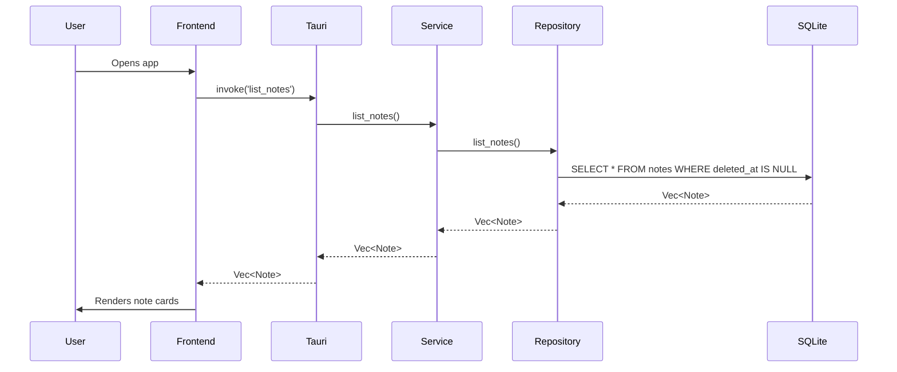
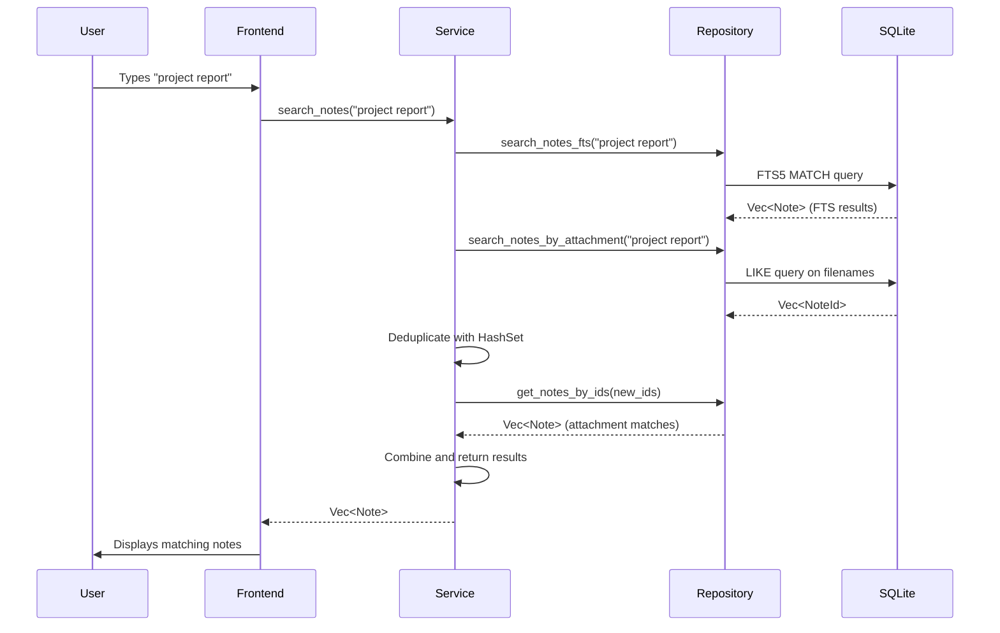

# Chapter 9: Listing and Searching Notes

This chapter explores how SwatNotes retrieves and searches notes using SQL queries and full-text search. We'll examine the complete data flow from frontend to backend and back.

## Overview

SwatNotes provides two core query operations:
1. **Listing notes** - fetches all non-deleted notes sorted by update time
2. **Searching notes** - performs full-text search across titles, content, and attachment filenames

## Mental Model: The Library Catalog System

Think of listing and searching like a library catalog system:
- **Listing notes** is like browsing the "Recently Updated" shelf - all books are organized by when they were last modified
- **FTS5 search** is like the library's index card system - every important word is indexed and can be quickly found
- **BM25 ranking** is like the librarian who knows which books are most relevant to your query

## Listing Notes

### The Complete Flow



### Backend Implementation

#### Repository Layer - SQL Query

```rust
// src-tauri/src/database/repository.rs
pub async fn list_notes(&self) -> Result<Vec<Note>> {
    let notes = sqlx::query_as::<_, Note>(
        r#"
        SELECT * FROM notes
        WHERE deleted_at IS NULL
        ORDER BY updated_at DESC
        "#,
    )
    .fetch_all(&self.pool)
    .await?;
    Ok(notes)
}
```

**Key observations:**
- `WHERE deleted_at IS NULL` - Implements soft delete filtering
- `ORDER BY updated_at DESC` - Most recently updated notes appear first
- `query_as!` - Type-safe query execution with automatic struct mapping
- No pagination - loads all notes (acceptable for desktop app)

#### Service Layer - Simple Delegation

```rust
// src-tauri/src/services/notes.rs
pub async fn list_notes(&self) -> Result<Vec<Note>> {
    self.repo.list_notes().await
}
```

The service layer simply delegates to the repository. No additional business logic is needed for basic listing.

#### Command Layer - Tauri IPC

```rust
// src-tauri/src/commands/notes.rs
#[tauri::command]
pub async fn list_notes(state: State<'_, AppState>) -> Result<Vec<Note>> {
    state.notes_service.list_notes().await
}
```

**Pattern**: Thin command handlers that delegate to services. This keeps IPC boundaries clean and testable.

### Frontend Implementation

#### TypeScript API Wrapper

```typescript
// src/utils/notesApi.ts
export async function listNotes(): Promise<Note[]> {
  return await invoke('list_notes');
}
```

#### Main App Refresh Logic

```typescript
// src/main.ts (simplified)
async function refreshNotesList() {
  const filter = appState.currentFilter;
  let notes: Note[];

  if (filter === 'all') {
    notes = await listNotes();
  } else if (filter === 'uncategorized') {
    notes = await getUncategorizedNotes();
  } else {
    // Collection-specific filter
    notes = await getNotesByCollection(filter);
  }

  renderNotesList('notes-list-container', (note) => {
    selectNote(note.id);
  }, undefined, notes);
}
```

**Filter Support:**
- `'all'` - Shows all notes
- `'uncategorized'` - Notes without collection assignment
- Collection ID - Notes belonging to specific collection

#### Rendering Note Cards

```typescript
// src/components/notesList.ts (simplified)
export function renderNotesList(
  containerId: string,
  onNoteClick: (note: Note) => void,
  onNotesChange?: () => void,
  providedNotes?: Note[]
) {
  const container = document.getElementById(containerId);
  if (!container) return;

  const notes = providedNotes || await listNotes();

  if (notes.length === 0) {
    container.innerHTML = '<p class="empty-state">No notes yet</p>';
    return;
  }

  container.innerHTML = '';
  for (const note of notes) {
    const card = createNoteCard(note);
    card.addEventListener('click', () => onNoteClick(note));
    container.appendChild(card);
  }
}

function createNoteCard(note: Note): HTMLElement {
  const card = document.createElement('div');
  card.className = 'note-card';
  
  // Highlight selected note
  if (note.id === appState.currentNoteId) {
    card.classList.add('ring-2', 'ring-primary', 'bg-primary/10');
  }

  card.innerHTML = `
    <div class="note-title">${truncate(note.title, 50)}</div>
    <div class="note-preview">${extractTextPreview(note.content, 100)}</div>
    <div class="note-date">${formatRelativeDate(note.updated_at)}</div>
    <button class="popout-button">Open in Window</button>
  `;
  
  return card;
}
```

**UX Patterns:**
- Empty state handling with friendly message
- Selection highlighting using Tailwind classes
- Title truncation to prevent overflow
- Content preview (2 lines max)
- Relative dates (e.g., "2 hours ago")
- Popout button for floating windows

---

## Searching Notes

### Two-Phase Search Strategy

SwatNotes uses a sophisticated two-phase search:
1. **Phase 1**: FTS5 full-text search on title and content
2. **Phase 2**: LIKE pattern matching on attachment filenames
3. **Deduplication**: Combine results without duplicates



### FTS5 Full-Text Search

#### What is FTS5?

FTS5 is SQLite's full-text search extension. It builds an inverted index (like a book's index) that maps words to their locations in documents.

**Mental Model**: Imagine a reference book's index:
```
project ..... pages 14, 27, 58
report ...... pages 14, 103
quarterly ... pages 27, 103
```

FTS5 does this for every word in your notes, allowing instant lookups.

#### Repository Implementation

```rust
// src-tauri/src/database/repository.rs
pub async fn search_notes_fts(&self, query: &str) -> Result<Vec<Note>> {
    // Escape double quotes and add prefix wildcard
    let search_query = format!("{}*", query.replace('"', "\"\""));
    
    let notes = sqlx::query_as::<_, Note>(
        r#"
        SELECT n.* FROM notes n
        INNER JOIN notes_fts fts ON n.id = fts.note_id
        WHERE notes_fts MATCH ?
        AND n.deleted_at IS NULL
        ORDER BY bm25(notes_fts)
        "#,
    )
    .bind(&search_query)
    .fetch_all(&self.pool)
    .await?;
    Ok(notes)
}
```

**Key Components:**

1. **Query Escaping**: `query.replace('"', "\"\"")` 
   - FTS5 uses double quotes for exact phrases
   - We escape user input to prevent syntax errors

2. **Prefix Wildcard**: `format!("{}*", query)`
   - Matches "proj" → "project", "projects", "projection"
   - Enables autocomplete-style search

3. **INNER JOIN**: Links main table to FTS virtual table
   - `notes_fts` is a virtual table managed by FTS5
   - Contains tokenized and indexed content

4. **MATCH Operator**: FTS5-specific query syntax
   - Much faster than LIKE for text search
   - Supports boolean operators (AND, OR, NOT)

5. **BM25 Ranking**: `ORDER BY bm25(notes_fts)`
   - **B**est **M**atching algorithm (version 25)
   - Ranks results by relevance
   - Considers term frequency and document length
   - Lower scores = more relevant (counterintuitive!)

#### BM25 Algorithm Explained

BM25 calculates relevance using:
- **Term Frequency (TF)**: How often the search term appears in this note
- **Inverse Document Frequency (IDF)**: How rare the term is across all notes
- **Document Length**: Normalizes scores for long vs short notes

**Example**:
- Query: "budget"
- Note A: "budget" appears 10 times in 100 words → High TF
- Note B: "budget" appears 1 time in 1000 words → Low TF, penalized for length
- Result: Note A ranks higher

### Attachment Filename Search

FTS5 indexes `title` and `content`, but **not** attachment filenames (they're in a separate table). We need a second query:

```rust
// src-tauri/src/database/repository.rs
pub async fn search_notes_by_attachment(&self, query: &str) -> Result<Vec<String>> {
    let pattern = format!("%{}%", query.to_lowercase());
    
    let note_ids: Vec<String> = sqlx::query_scalar(
        r#"
        SELECT DISTINCT note_id FROM attachments
        WHERE LOWER(filename) LIKE ?
        "#,
    )
    .bind(&pattern)
    .fetch_all(&self.pool)
    .await?;
    Ok(note_ids)
}
```

**Why LIKE instead of FTS5?**
- Attachment table isn't FTS-indexed (simpler schema)
- Filename searches are less common
- LIKE is fast enough for this use case

**Pattern breakdown:**
- `%` = SQL wildcard (matches any characters)
- `LOWER()` = Case-insensitive matching
- `DISTINCT` = Prevents duplicate note IDs

### Service Layer - Orchestration

```rust
// src-tauri/src/services/notes.rs
pub async fn search_notes(&self, query: &str) -> Result<Vec<Note>> {
    // Empty query = return all notes
    if query.trim().is_empty() {
        return self.list_notes().await;
    }
    
    // Phase 1: FTS search
    let mut results = self.repo.search_notes_fts(query).await?;
    
    // Track which notes we already have
    let seen_ids: HashSet<String> = results.iter()
        .map(|n| n.id.clone())
        .collect();
    
    // Phase 2: Attachment search
    match self.repo.search_notes_by_attachment(query).await {
        Ok(attachment_note_ids) => {
            // Filter to only new note IDs
            let new_ids: Vec<String> = attachment_note_ids
                .into_iter()
                .filter(|id| !seen_ids.contains(id))
                .collect();
            
            if !new_ids.is_empty() {
                // Batch fetch all new notes in a single query
                match self.repo.get_notes_by_ids(&new_ids).await {
                    Ok(attachment_notes) => {
                        results.extend(attachment_notes);
                    }
                    Err(e) => {
                        tracing::warn!("Failed to fetch attachment notes: {}", e);
                    }
                }
            }
        }
        Err(e) => {
            // Don't fail the entire search if attachments fail
            tracing::warn!("Failed to search attachments: {}", e);
        }
    }
    
    Ok(results)
}
```

**Orchestration Pattern:**

1. **Empty Query Optimization**: Skips FTS overhead for empty strings
2. **HashSet Deduplication**: O(1) lookups to check for duplicates
3. **Batch Fetching**: Avoids N+1 queries by fetching all new notes at once
4. **Graceful Degradation**: Attachment search failure doesn't break FTS results

**Why not JOIN?**
- FTS and attachments are in different tables
- Batch fetching is more efficient than multiple JOINs
- Simpler error handling (can fail independently)

### Frontend Search UI

```html
<!-- index.html (simplified) -->
<form class="subnav-search" onsubmit="handleSearchSubmit(event)">
  <input 
    type="text" 
    id="search-input"
    placeholder="Search notes..."
    value=""
  />
</form>
```

```typescript
function handleSearchSubmit(event: Event) {
  event.preventDefault();
  const form = event.target as HTMLFormElement;
  const formData = new FormData(form);
  const query = formData.get('q') as string;
  
  // Update URL with search query
  const url = new URL(window.location.href);
  const params = new URLSearchParams({q: query});
  url.hash = '?' + params.toString();
  
  // Navigate to new URL (triggers re-render)
  window.history.pushState({}, '', url);
  window.dispatchEvent(new PopStateEvent('popstate'));
}
```

**UX Flow:**
1. User types search query
2. Form submission updates URL hash
3. `popstate` event triggers re-render
4. App reads `?q=` from URL and calls `searchNotes()`
5. Results render in same component as list

---

## Performance Optimizations

### 1. Empty Query Check

```rust
if query.trim().is_empty() {
    return self.list_notes().await;
}
```

**Why?** FTS5 doesn't accept empty queries. This provides a fast path for "show all" behavior.

### 2. Prefix Wildcard Search

```rust
let search_query = format!("{}*", query);
```

**Trade-off:**
- ✅ Enables autocomplete-style search ("proj" finds "project")
- ❌ Can't use wildcards at the start (no `*roject`)
- ✅ Maintains good performance (indexed prefix scans)

### 3. Batch Fetching

```rust
// BAD: N+1 queries
for id in new_ids {
    let note = self.repo.get_note_by_id(&id).await?;
    results.push(note);
}

// GOOD: Single batch query
let notes = self.repo.get_notes_by_ids(&new_ids).await?;
results.extend(notes);
```

**Impact**: 10 attachment matches = 10 queries vs 1 query

### 4. Deduplication with HashSet

```rust
let seen_ids: HashSet<String> = results.iter()
    .map(|n| n.id.clone())
    .collect();

let new_ids: Vec<String> = attachment_note_ids
    .into_iter()
    .filter(|id| !seen_ids.contains(id))
    .collect();
```

**Complexity:**
- Building HashSet: O(n)
- Filtering: O(m) with O(1) lookups
- Total: O(n + m) instead of O(n * m)

---

## Real-World Example

Let's trace a search for "budget report":

### Step 1: User Input
```
Query: "budget report"
```

### Step 2: FTS5 Search

```sql
SELECT n.* FROM notes n
INNER JOIN notes_fts fts ON n.id = fts.note_id
WHERE notes_fts MATCH 'budget report*'
AND n.deleted_at IS NULL
ORDER BY bm25(notes_fts)
```

**Results:**
- Note A: "Q4 Budget Report" (title match)
- Note B: "The annual budget looks good..." (content match)

### Step 3: Attachment Search

```sql
SELECT DISTINCT note_id FROM attachments
WHERE LOWER(filename) LIKE '%budget report%'
```

**Results:**
- Note C: has attachment "2023_budget_report.pdf"
- Note A: also has attachment "budget_report_final.xlsx" (duplicate!)

### Step 4: Deduplication

```rust
seen_ids = {Note A, Note B}
attachment_note_ids = {Note C, Note A}
new_ids = {Note C}  // Note A filtered out
```

### Step 5: Batch Fetch

```sql
SELECT * FROM notes
WHERE id IN ('note_c_id')
AND deleted_at IS NULL
```

**Results:**
- Note C: "Meeting Notes" with budget_report.pdf attachment

### Step 6: Final Results

```
1. Note A (title match, BM25 ranked highest)
2. Note B (content match)
3. Note C (attachment match)
```

---

## Testing Strategy

### Unit Tests

```rust
#[cfg(test)]
mod tests {
    use super::*;

    #[tokio::test]
    async fn test_list_notes_excludes_deleted() {
        let repo = setup_test_repo().await;
        
        // Create active and deleted notes
        repo.create_note(/* ... */).await.unwrap();
        let deleted = repo.create_note(/* ... */).await.unwrap();
        repo.delete_note(&deleted.id).await.unwrap();
        
        let notes = repo.list_notes().await.unwrap();
        assert_eq!(notes.len(), 1);
    }

    #[tokio::test]
    async fn test_search_fts_prefix_wildcard() {
        let repo = setup_test_repo().await;
        repo.create_note_with_title("Project Alpha").await.unwrap();
        
        let results = repo.search_notes_fts("proj").await.unwrap();
        assert_eq!(results.len(), 1);
    }

    #[tokio::test]
    async fn test_search_deduplicates_results() {
        let service = setup_test_service().await;
        let note = service.create_note(/* ... */).await.unwrap();
        service.add_attachment(&note.id, "report.pdf", /* ... */).await.unwrap();
        
        // This note should appear in both FTS and attachment results
        let results = service.search_notes("report").await.unwrap();
        
        // Should only appear once
        let count = results.iter().filter(|n| n.id == note.id).count();
        assert_eq!(count, 1);
    }
}
```

### E2E Tests

```typescript
// e2e/notes.spec.ts
test('search finds notes by title', async ({page}) => {
  await createNote({title: 'Budget Report', content: ''});
  await createNote({title: 'Meeting Notes', content: ''});
  
  await page.fill('#search-input', 'budget');
  await page.press('#search-input', 'Enter');
  
  await expect(page.locator('.note-card')).toHaveCount(1);
  await expect(page.locator('.note-title')).toContainText('Budget Report');
});

test('search finds notes by attachment filename', async ({page}) => {
  const note = await createNote({title: 'Notes'});
  await addAttachment(note.id, 'budget_report.pdf', new Blob());
  
  await page.fill('#search-input', 'budget');
  await page.press('#search-input', 'Enter');
  
  await expect(page.locator('.note-card')).toHaveCount(1);
});

test('empty search shows all notes', async ({page}) => {
  await createNote({title: 'Note 1'});
  await createNote({title: 'Note 2'});
  
  await page.fill('#search-input', '');
  await page.press('#search-input', 'Enter');
  
  await expect(page.locator('.note-card')).toHaveCount(2);
});
```

---

## Troubleshooting

### Issue: FTS5 Syntax Errors

**Problem**: User search breaks with `fts5: syntax error near "project"`

**Cause**: User input contains FTS5 special characters (quotes, parentheses, etc.)

**Solution**: Always escape double quotes:
```rust
let search_query = format!("{}*", query.replace('"', "\"\""));
```

### Issue: Search Results Missing

**Problem**: Note exists but doesn't appear in search

**Debugging checklist:**
1. Check if note is soft-deleted (`deleted_at IS NOT NULL`)
2. Verify FTS index is in sync (check `notes_fts` table)
3. Test with exact title match
4. Check attachment table separately

**FTS Sync**: See Chapter 7 for how FTS triggers keep the index updated.

### Issue: Slow Search Performance

**Problem**: Search takes >1 second with 10,000 notes

**Causes:**
- Missing indexes on `notes_fts`
- N+1 queries for attachments
- Large result sets without pagination

**Solutions:**
```sql
-- Verify FTS index exists
SELECT * FROM sqlite_master WHERE type='table' AND name='notes_fts';

-- Check query plan
EXPLAIN QUERY PLAN
SELECT n.* FROM notes n
INNER JOIN notes_fts fts ON n.id = fts.note_id
WHERE notes_fts MATCH 'budget*';
```

---

## Key Takeaways

1. **Soft Delete Filtering**: Always include `WHERE deleted_at IS NULL` in queries

2. **FTS5 Benefits**:
   - Fast full-text search (even with 100,000+ notes)
   - BM25 relevance ranking
   - Prefix matching for autocomplete

3. **Two-Phase Search**: Combines FTS (title/content) with LIKE (attachments)

4. **Deduplication**: HashSet prevents notes from appearing twice

5. **Batch Queries**: Avoid N+1 problem by fetching all attachment notes in one query

6. **Graceful Degradation**: Attachment search failure doesn't break FTS results

7. **Empty Query Optimization**: Skip FTS for "show all" behavior

---

## What's Next?

In **Chapter 10: Updating and Deleting Notes**, we'll explore:
- Soft delete implementation
- Update triggers for `updated_at`
- Conflict resolution for concurrent edits
- FTS index updates on note changes

We'll also examine how the frontend handles optimistic updates and error recovery.