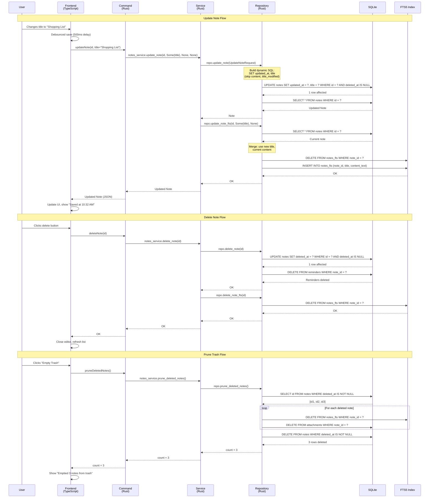

# Chapter 10: Updating and Deleting Notes

In Chapters 7 and 8, we learned to create and edit notes. But what happens when you want to change a note's title without touching its content? Or delete a note, then change your mind and want it back? This chapter explores **partial updates**, **soft delete**, and **trash management**—the patterns that make SwatNotes feel safe and forgiving.

Think of this chapter as learning **the undo button** for life. When you delete a file on your computer, it goes to the Recycle Bin, not straight to oblivion. SwatNotes works the same way: deletes are reversible, updates are precise, and errors are recoverable.

By the end of this chapter, you'll understand:
- Partial updates with optional parameters (update title without touching content)
- Dynamic SQL construction with SQLx QueryBuilder
- Soft delete pattern (marking deleted instead of removing)
- Hard delete (permanent removal with trash pruning)
- FTS synchronization for updates and deletes
- Optimistic UI updates (show changes immediately, sync later)
- Delete confirmation flows and error handling
- Cleaning up associated data (reminders, attachments)

---

## 10.1 The Problem with Naive Updates

Imagine a naive update function:

```typescript
// BAD: Requires all fields every time
async function updateNote(id: string, title: string, content: string): Promise<Note> {
  return await invoke('update_note', { id, title, content });
}
```

**Problem**: If you only want to change the title, you must pass the entire content. If the content is 10MB of Delta JSON, you're sending 10MB over IPC just to change 5 characters.

**Solution**: **Partial updates** with optional parameters.

---

## 10.2 Partial Updates with Optional Parameters

SwatNotes uses a pattern where **every update field is optional**. You only send what changed.

### The TypeScript API

In [src/utils/notesApi.ts](src/utils/notesApi.ts#L44-L52), the `updateNote` function:

```typescript
export async function updateNote(
  id: string,
  title: string | null = null,
  contentJson: string | null = null,
  titleModified: boolean | null = null
): Promise<Note> {
  return await invoke('update_note', { id, title, contentJson, titleModified });
}
```

**Usage examples:**

```typescript
// Update only title
await updateNote(noteId, 'New Title');

// Update only content
await updateNote(noteId, null, newContentJson);

// Update both
await updateNote(noteId, 'New Title', newContentJson);

// Update title_modified flag only
await updateNote(noteId, null, null, true);
```

**Mental model**: Think of this like **filling out a form** where you only need to fill in the fields you want to change. Leave the rest blank, and the database keeps the original values.

### The Rust Command

In [src-tauri/src/commands/notes.rs](src-tauri/src/commands/notes.rs#L33-L44), the command handler:

```rust
#[tauri::command]
pub async fn update_note(
    state: State<'_, AppState>,
    id: String,
    title: Option<String>,
    content_json: Option<String>,
    title_modified: Option<bool>,
) -> Result<Note> {
    state
        .notes_service
        .update_note(id, title, content_json, title_modified)
        .await
}
```

**Key insight**: Rust's `Option<String>` becomes JavaScript's `string | null`. When you pass `null` from TypeScript, Tauri deserializes it as `None` in Rust. When you pass a string, it becomes `Some(string)`.

This **type alignment** ensures partial updates work seamlessly across the IPC boundary.

### The Service Layer

In [src-tauri/src/services/notes.rs](src-tauri/src/services/notes.rs#L59-L89), the service method:

```rust
pub async fn update_note(
    &self,
    id: String,
    title: Option<String>,
    content_json: Option<String>,
    title_modified: Option<bool>,
) -> Result<Note> {
    tracing::debug!("Updating note: {}", id);

    let req = UpdateNoteRequest {
        id: id.clone(),
        title: title.clone(),
        content_json: content_json.clone(),
        title_modified,
    };

    let note = self.repo.update_note(req).await?;

    // Sync to FTS index if title or content changed
    if title.is_some() || content_json.is_some() {
        if let Err(e) = self
            .repo
            .update_note_fts(&id, title.as_deref(), content_json.as_deref())
            .await
        {
            tracing::warn!("Failed to update note in FTS index: {}", e);
            // Don't fail the whole operation if FTS fails
        }
    }

    tracing::debug!("Note updated successfully: {}", note.id);

    Ok(note)
}
```

**Service responsibilities:**

1. **Build the DTO**: Create an `UpdateNoteRequest` with the optional fields.

2. **Call the repository**: Delegate to `repo.update_note()`.

3. **Conditional FTS sync**: Only update the FTS index if `title` or `content_json` changed. Why? Because if you're only updating `title_modified`, there's no text to re-index.

4. **Graceful FTS failure**: If FTS update fails, log a warning but return success. The note data is safe in the main table; FTS is a secondary index.

### The Repository Layer (Dynamic SQL)

Here's where it gets interesting. In [src-tauri/src/database/repository.rs](src-tauri/src/database/repository.rs#L111-L149), the `update_note` method uses **SQLx QueryBuilder** for dynamic SQL:

```rust
pub async fn update_note(&self, req: UpdateNoteRequest) -> Result<Note> {
    use sqlx::QueryBuilder;

    let now = Utc::now();

    // Use QueryBuilder for type-safe dynamic query construction
    let mut builder: QueryBuilder<sqlx::Sqlite> =
        QueryBuilder::new("UPDATE notes SET updated_at = ");
    builder.push_bind(now.to_rfc3339());

    if let Some(title) = &req.title {
        builder.push(", title = ");
        builder.push_bind(title.clone());
    }

    if let Some(content) = &req.content_json {
        builder.push(", content_json = ");
        builder.push_bind(content.clone());
    }

    if let Some(title_modified) = req.title_modified {
        builder.push(", title_modified = ");
        builder.push_bind(if title_modified { 1i32 } else { 0i32 });
    }

    builder.push(" WHERE id = ");
    builder.push_bind(req.id.clone());
    builder.push(" AND deleted_at IS NULL");

    // Execute update
    let rows_affected = builder.build().execute(&self.pool).await?.rows_affected();

    if rows_affected == 0 {
        return Err(AppError::NoteNotFound(req.id));
    }

    // Fetch updated note
    self.get_note(&req.id).await
}
```

**How QueryBuilder works:**

1. **Start with base query**: `"UPDATE notes SET updated_at = "` plus the timestamp. Every update sets `updated_at`—this is guaranteed.

2. **Conditionally add fields**: `if let Some(title) = &req.title` checks if title is `Some`. If yes, append `", title = "` and bind the value. If `None`, skip it.

3. **Build WHERE clause**: Always filter by `id` and `deleted_at IS NULL` (don't update deleted notes).

4. **Execute and check rows**: If `rows_affected == 0`, the note doesn't exist (or is deleted). Return `NoteNotFound` error.

5. **Fetch and return**: Use `self.get_note(&req.id)` to fetch the updated note with all fields (including computed `updated_at`).

**Generated SQL examples:**

If you update only title:
```sql
UPDATE notes SET updated_at = '2024-01-28T10:30:00Z', title = 'New Title' WHERE id = '...' AND deleted_at IS NULL
```

If you update title and content:
```sql
UPDATE notes SET updated_at = '2024-01-28T10:30:00Z', title = 'New Title', content_json = '...' WHERE id = '...' AND deleted_at IS NULL
```

**Why QueryBuilder instead of string concatenation?**

```rust
// BAD: SQL injection risk
let sql = format!("UPDATE notes SET title = '{}'", title);

// GOOD: QueryBuilder uses parameterized queries
builder.push_bind(title);
```

QueryBuilder calls `push_bind()`, which uses placeholders (`?`) and parameter binding. **No SQL injection**, even if `title` contains `'; DROP TABLE notes;--`.

---

## 10.3 The Soft Delete Pattern

When you delete a note in SwatNotes, it doesn't disappear instantly. It's **soft deleted**: marked as deleted but still in the database.

### Why Soft Delete?

**Advantages:**

1. **Undo**: Users can restore accidentally deleted notes.
2. **Audit trail**: You can see *when* a note was deleted.
3. **Data recovery**: If the app crashes during delete, the note is still recoverable.
4. **Foreign keys**: Attachments and reminders linked to the note remain queryable (for debugging).

**Disadvantages:**

1. **Storage**: Deleted notes take up disk space.
2. **Queries**: Must filter `WHERE deleted_at IS NULL` in every query.
3. **Cleanup**: Need a "empty trash" function to permanently delete old notes.

SwatNotes chooses soft delete because **users value undo more than a few KB of disk space**.

### The Database Schema

Recall from Chapter 6, the `notes` table has:

```sql
CREATE TABLE notes (
    id TEXT PRIMARY KEY,
    title TEXT NOT NULL,
    content_json TEXT NOT NULL,
    created_at TEXT NOT NULL,
    updated_at TEXT NOT NULL,
    deleted_at TEXT,  -- NULL = active, timestamp = deleted
    title_modified INTEGER NOT NULL DEFAULT 0,
    collection_id TEXT REFERENCES collections(id) ON DELETE SET NULL
)
```

The `deleted_at` column is `NULL` for active notes. When deleted, we set it to the current timestamp.

### The Delete Command

In [src-tauri/src/commands/notes.rs](src-tauri/src/commands/notes.rs#L47-L50), the command:

```rust
#[tauri::command]
pub async fn delete_note(state: State<'_, AppState>, id: String) -> Result<()> {
    state.notes_service.delete_note(&id).await
}
```

Simple delegation. The service handles the logic.

### The Delete Service

In [src-tauri/src/services/notes.rs](src-tauri/src/services/notes.rs#L92-L106), the service method:

```rust
pub async fn delete_note(&self, id: &str) -> Result<()> {
    tracing::info!("Deleting note: {}", id);

    self.repo.delete_note(id).await?;

    // Remove from FTS index
    if let Err(e) = self.repo.delete_note_fts(id).await {
        tracing::warn!("Failed to delete note from FTS index: {}", e);
        // Don't fail the whole operation if FTS fails
    }

    tracing::info!("Note deleted successfully: {}", id);

    Ok(())
}
```

**Service responsibilities:**

1. **Call repository**: Mark the note as deleted in the database.
2. **Remove from FTS**: Call `delete_note_fts()` to remove the note from the search index. If this fails, log a warning but don't fail the delete (the note is already marked deleted).

### The Delete Repository Method

In [src-tauri/src/database/repository.rs](src-tauri/src/database/repository.rs#L151-L174), the repository:

```rust
pub async fn delete_note(&self, id: &str) -> Result<()> {
    let now = Utc::now();

    let rows = sqlx::query(
        r#"
        UPDATE notes SET deleted_at = ? WHERE id = ? AND deleted_at IS NULL
        "#,
    )
    .bind(now)
    .bind(id)
    .execute(&self.pool)
    .await?
    .rows_affected();

    if rows == 0 {
        return Err(AppError::NoteNotFound(id.to_string()));
    }

    // Delete all reminders for this note (soft-deleted notes shouldn't have active reminders)
    sqlx::query("DELETE FROM reminders WHERE note_id = ?")
        .bind(id)
        .execute(&self.pool)
        .await?;

    tracing::debug!("Soft deleted note and removed reminders: {}", id);
    Ok(())
}
```

**Key steps:**

1. **Set `deleted_at`**: Execute `UPDATE notes SET deleted_at = ? WHERE id = ? AND deleted_at IS NULL`. The `deleted_at IS NULL` check prevents double-deleting.

2. **Check rows affected**: If 0 rows updated, the note doesn't exist (or is already deleted). Return `NoteNotFound`.

3. **Delete reminders**: A soft-deleted note shouldn't trigger notifications. We **hard delete** reminders with `DELETE FROM reminders WHERE note_id = ?`. Why hard delete? Because reminders are not user-facing data—they're internal scheduler state.

4. **Log at DEBUG level**: Soft deletes are routine, not errors. DEBUG level is appropriate.

**Why `deleted_at IS NULL` in the WHERE clause?**

Without it:
```sql
UPDATE notes SET deleted_at = '2024-01-28T10:30:00Z' WHERE id = 'abc123'
```

If you delete the same note twice, both deletes succeed (idempotent). But the second delete overwrites the original `deleted_at` timestamp. **You lose the information of when it was first deleted**.

With `deleted_at IS NULL`:
```sql
UPDATE notes SET deleted_at = '2024-01-28T10:30:00Z' WHERE id = 'abc123' AND deleted_at IS NULL
```

The second delete affects 0 rows, and we return `NoteNotFound`. **Explicit failure** is better than silent data corruption.

---

## 10.4 The Frontend Delete Flow

Let's trace what happens when a user clicks the delete button in SwatNotes.

### The Delete Function

In [src/main.ts](src/main.ts#L201-L231), the `deleteCurrentNote` function:

```typescript
async function deleteCurrentNote(): Promise<void> {
  const currentNote = appState.currentNote;

  if (!currentNote) {
    logger.debug('No note selected to delete', LOG_CONTEXT);
    return;
  }

  try {
    const noteId = currentNote.id;

    // Close the note (cleans up editor)
    appState.closeNote();

    await deleteNote(noteId);

    // Close floating window if open
    try {
      await invoke('delete_note_and_close_window', { id: noteId });
    } catch (e) {
      // Window might not be open, ignore
    }

    // Show welcome screen
    showWelcomeScreen();

    // Refresh notes list
    await refreshNotesList();
  } catch (error) {
    logger.error('Failed to delete note', LOG_CONTEXT, error);
  }
}
```

**The delete flow:**

1. **Check if note is open**: If no note is selected, return early.

2. **Close the editor**: Call `appState.closeNote()`, which triggers the editor's `destroy()` method (removes event listeners, clears timers).

3. **Delete from backend**: Call `deleteNote(noteId)`, which invokes the Rust command.

4. **Close floating window**: If the note has a floating sticky note window open, close it. This call might fail (window not open), so we wrap in try-catch and ignore errors.

5. **Update UI**: Show the welcome screen (empty state) and refresh the notes list sidebar.

6. **Error handling**: If delete fails, log the error. No user-facing alert—deletes are expected to succeed.

**Optimistic UI vs. Pessimistic UI:**

- **Pessimistic** (what SwatNotes does): Close editor, delete from backend, then update UI. If delete fails, the editor is already closed. **Slightly awkward UX** if delete fails (note disappears from editor but is still in the list).

- **Optimistic** (alternative): Remove note from UI immediately, delete in background. If delete fails, restore the note to the UI. **Better UX** but more complex (need rollback logic).

SwatNotes chooses pessimistic because delete failures are rare (would require database corruption or file permission issues).

---

## 10.5 Trash Management: Counting and Pruning

Soft-deleted notes accumulate over time. SwatNotes provides two commands to manage the "trash":

1. **`count_deleted_notes`**: How many notes are in the trash?
2. **`prune_deleted_notes`**: Permanently delete all trash notes (empty the trash).

### Counting Deleted Notes

In [src-tauri/src/database/repository.rs](src-tauri/src/database/repository.rs#L610-L620), the `count_deleted_notes` method:

```rust
pub async fn count_deleted_notes(&self) -> Result<i64> {
    let count: (i64,) = sqlx::query_as(
        r#"
        SELECT COUNT(*) FROM notes WHERE deleted_at IS NOT NULL
        "#,
    )
    .fetch_one(&self.pool)
    .await?;

    Ok(count.0)
}
```

**How it works:**

1. **Query**: `SELECT COUNT(*) FROM notes WHERE deleted_at IS NOT NULL` counts rows with a non-null `deleted_at`.

2. **`sqlx::query_as`**: Maps the result to a Rust tuple `(i64,)`. SQLite's `COUNT(*)` returns a single integer.

3. **Return `count.0`**: Extract the first (and only) element of the tuple.

**Usage**: Show a badge in the UI: "Trash (5)" if there are 5 deleted notes.

### Pruning Deleted Notes (Hard Delete)

In [src-tauri/src/database/repository.rs](src-tauri/src/database/repository.rs#L624-L665), the `prune_deleted_notes` method:

```rust
pub async fn prune_deleted_notes(&self) -> Result<i64> {
    // Get list of soft-deleted note IDs
    let deleted_note_ids: Vec<(String,)> = sqlx::query_as(
        r#"
        SELECT id FROM notes WHERE deleted_at IS NOT NULL
        "#,
    )
    .fetch_all(&self.pool)
    .await?;

    let count = deleted_note_ids.len() as i64;

    if count == 0 {
        tracing::debug!("No deleted notes to prune");
        return Ok(0);
    }

    tracing::info!("Pruning {} soft-deleted notes", count);

    for (note_id,) in &deleted_note_ids {
        // Delete FTS entries
        sqlx::query("DELETE FROM notes_fts WHERE note_id = ?")
            .bind(note_id)
            .execute(&self.pool)
            .await?;

        // Delete attachments metadata (blobs are handled separately)
        sqlx::query("DELETE FROM attachments WHERE note_id = ?")
            .bind(note_id)
            .execute(&self.pool)
            .await?;

        // Reminders were already deleted during soft delete
    }

    // Finally, delete the notes themselves
    sqlx::query("DELETE FROM notes WHERE deleted_at IS NOT NULL")
        .execute(&self.pool)
        .await?;

    tracing::info!("Pruned {} notes", count);
    Ok(count)
}
```

**The prune process:**

1. **Fetch deleted note IDs**: Query all notes with `deleted_at IS NOT NULL`.

2. **Early return**: If count is 0, return immediately (no work to do).

3. **Delete associated data**: For each note:
   - Delete from `notes_fts` (FTS index).
   - Delete from `attachments` (metadata; the actual blob files are reference-counted and cleaned separately).
   - Reminders were already hard-deleted during soft delete (see [delete_note](#103-the-soft-delete-pattern)), so we skip them.

4. **Delete notes**: Execute `DELETE FROM notes WHERE deleted_at IS NOT NULL` to permanently remove all soft-deleted notes.

5. **Return count**: Tell the caller how many notes were pruned.

**Why delete associated data first?**

If we deleted notes first, foreign keys would prevent deletion (because attachments reference `notes.id`). By deleting children first (FTS, attachments) and parents last (notes), we avoid constraint violations.

**What about blob files?**

Blob files (images, PDFs) are stored in the filesystem, not the database. They're reference-counted: if multiple notes reference the same blob (via `blob_hash`), we only delete the blob file when the last reference is removed.

The blob cleanup logic is in a separate garbage collection process (covered in Chapter 13). `prune_deleted_notes` only cleans database rows.

---

## 10.6 Hard Delete vs. Soft Delete

SwatNotes has both, but uses them differently:

| Operation | When Used | Reversible? | Data Loss? |
|-----------|-----------|-------------|------------|
| **Soft Delete** | User clicks "Delete" | Yes (until pruned) | No |
| **Hard Delete** | User clicks "Empty Trash" or testing | No | Yes |

### Hard Delete (For Testing)

In [src-tauri/src/database/repository.rs](src-tauri/src/database/repository.rs#L183-L191), the `hard_delete_note` method:

```rust
#[allow(dead_code)]
pub async fn hard_delete_note(&self, id: &str) -> Result<()> {
    sqlx::query("DELETE FROM notes WHERE id = ?")
        .bind(id)
        .execute(&self.pool)
        .await?;

    tracing::debug!("Hard deleted note: {}", id);
    Ok(())
}
```

**Usage**: Only in tests. For example, cleaning up test data after a test runs. **Never called from user-facing commands**.

**Why `#[allow(dead_code)]`?** This function isn't used in production code, only in tests. Without the attribute, the Rust compiler would warn about unused code.

---

## 10.7 FTS Synchronization on Update/Delete

Every time a note is updated or deleted, the FTS index must be updated to match.

### Update FTS

In [src-tauri/src/database/repository.rs](src-tauri/src/database/repository.rs#L478-L520), the `update_note_fts` method:

```rust
pub async fn update_note_fts(
    &self,
    note_id: &str,
    title: Option<&str>,
    content_json: Option<&str>,
) -> Result<()> {
    // FTS5 doesn't support partial updates, so we need to delete and re-insert
    // First, get the current values if not provided
    let current = self.get_note(note_id).await?;

    let final_title = title.unwrap_or(&current.title);
    let final_content = content_json.unwrap_or(&current.content_json);
    let content_text = Self::extract_text_from_delta(final_content);

    // Delete existing entry
    sqlx::query("DELETE FROM notes_fts WHERE note_id = ?")
        .bind(note_id)
        .execute(&self.pool)
        .await?;

    // Insert updated entry
    sqlx::query(
        r#"
        INSERT INTO notes_fts (note_id, title, content_text)
        VALUES (?, ?, ?)
        "#,
    )
    .bind(note_id)
    .bind(final_title)
    .bind(&content_text)
    .execute(&self.pool)
    .await?;

    tracing::debug!("Updated note in FTS index: {}", note_id);
    Ok(())
}
```

**Why delete-then-insert instead of UPDATE?**

FTS5 virtual tables **don't support UPDATE**. From the SQLite docs:

> FTS5 does not support the UPDATE statement. To update a row, you must DELETE the old row and INSERT the new row.

So we:
1. Fetch the current note (to get fields we're not updating).
2. Merge: Use provided `title`/`content_json` if given, else use current values.
3. Delete the FTS row.
4. Insert the updated FTS row.

**What if the note doesn't exist?** `self.get_note(note_id)` returns `Err(NoteNotFound)`, which propagates up. The FTS update fails, but the caller (service layer) catches this and logs a warning. The note update still succeeds.

### Delete FTS

In [src-tauri/src/database/repository.rs](src-tauri/src/database/repository.rs#L523-L532), the `delete_note_fts` method:

```rust
pub async fn delete_note_fts(&self, note_id: &str) -> Result<()> {
    sqlx::query("DELETE FROM notes_fts WHERE note_id = ?")
        .bind(note_id)
        .execute(&self.pool)
        .await?;

    tracing::debug!("Deleted note from FTS index: {}", note_id);
    Ok(())
}
```

Simple: delete the FTS row matching the note ID.

---

## 10.8 Update/Delete Sequence Diagram

Here's the complete flow for updating and deleting notes:



**Key observations:**

- **Partial updates**: Only modified fields are sent and updated in SQL.
- **FTS synchronization**: Every update/delete triggers FTS changes, with graceful failure handling.
- **Soft delete first**: Notes are marked deleted, not removed immediately.
- **Prune is batched**: We delete FTS and attachments for all notes, then delete notes in one query.

---

## 10.9 Error Handling: NoteNotFound

What happens when you try to update or delete a note that doesn't exist?

### The Error Type

In [src-tauri/src/error.rs](src-tauri/src/error.rs), SwatNotes defines:

```rust
#[derive(Debug, thiserror::Error)]
pub enum AppError {
    #[error("Note not found: {0}")]
    NoteNotFound(String),

    #[error("Database error: {0}")]
    Database(#[from] sqlx::Error),

    // ... other error types
}
```

`NoteNotFound` is a **custom error variant** with the note ID embedded in the message.

### Returning NoteNotFound

In the repository, when `rows_affected == 0`:

```rust
if rows_affected == 0 {
    return Err(AppError::NoteNotFound(req.id));
}
```

This error propagates through:
1. Repository → Service (via `?` operator)
2. Service → Command (via `?` operator)
3. Command → Frontend (Tauri serializes to JSON)

### Frontend Handling

On the frontend, the rejected Promise is caught:

```typescript
try {
  await updateNote(noteId, 'New Title');
} catch (error) {
  console.error('Update failed:', error);
  // Show error toast to user
}
```

Tauri serializes Rust errors to JSON like:

```json
{
  "message": "Note not found: abc123"
}
```

The frontend can parse this and show a user-friendly message: "Note not found. It may have been deleted."

---

## 10.10 Optimistic UI Updates (Future Enhancement)

SwatNotes currently uses **pessimistic updates**: wait for the backend to confirm success before updating the UI.

**Optimistic updates** (an alternative pattern):

1. **Update UI immediately**: Remove note from list, show "Deleted" toast.
2. **Send delete to backend**: Background request.
3. **On success**: Do nothing (UI already updated).
4. **On failure**: Rollback—restore note to UI, show error toast.

**Advantages:**

- **Feels instant**: No waiting for network/database.
- **Better UX**: Users can continue working without pauses.

**Disadvantages:**

- **Complexity**: Need rollback logic for every operation.
- **Consistency**: UI and backend can be out of sync during network delays.
- **Conflicts**: If two clients update the same note, optimistic updates can show stale data.

**When to use optimistic updates:**

- **Networked apps** (like Google Docs): Where backend latency is significant (100ms+).
- **High-frequency operations** (like drawing apps): Where waiting for confirmation would feel sluggish.

**When to use pessimistic updates:**

- **Local-first apps** (like SwatNotes): Where backend is instant (<10ms).
- **Destructive operations** (like delete): Where you want confirmation before showing success.

SwatNotes uses pessimistic updates because the SQLite backend is on the same machine—updates complete in milliseconds. Adding optimistic updates would increase complexity for negligible UX improvement.

---

## 10.11 Common Mistakes and Fixes

### Mistake 1: Updating Without `deleted_at IS NULL` Check

**Problem:**

```rust
sqlx::query("UPDATE notes SET title = ? WHERE id = ?")
    .bind(title)
    .bind(id)
    .execute(&self.pool)
    .await?;
```

This updates deleted notes. If a note is soft-deleted, this query "resurrects" it by changing its title while keeping `deleted_at` set.

**Fix:** Always add `AND deleted_at IS NULL`:

```rust
sqlx::query("UPDATE notes SET title = ? WHERE id = ? AND deleted_at IS NULL")
```

### Mistake 2: FTS Update Fails and Breaks the Whole Operation

**Problem:**

```rust
self.repo.update_note(req).await?;
self.repo.update_note_fts(...).await?; // If this fails, entire update fails
```

If FTS is corrupted, note updates would fail. Users can't edit notes.

**Fix:** Wrap FTS update in error handling:

```rust
if let Err(e) = self.repo.update_note_fts(...).await {
    tracing::warn!("FTS update failed: {}", e);
}
```

### Mistake 3: Not Deleting Associated Data During Prune

**Problem:** Pruning only deletes notes, leaving orphaned attachments and FTS rows.

**Fix:** Delete children before parents (see [prune_deleted_notes](#105-trash-management-counting-and-pruning)).

### Mistake 4: Sending All Fields on Every Update

**Problem:**

```typescript
// Sends 10MB of content just to change title
await updateNote(noteId, 'New Title', currentContent);
```

**Fix:** Use partial updates (send only changed fields):

```typescript
await updateNote(noteId, 'New Title'); // content remains unchanged
```

---

## 10.12 Key Takeaways

**Partial Updates:**
- Use `Option<T>` in Rust for optional fields.
- SQLx QueryBuilder constructs dynamic SQL safely.
- Only update fields that changed (reduces IPC payload and SQL complexity).

**Soft Delete:**
- Mark deleted with `deleted_at` timestamp instead of removing.
- Always filter `WHERE deleted_at IS NULL` in queries.
- Check `rows_affected` to detect already-deleted notes.
- Delete associated data (reminders) during soft delete to prevent orphaned state.

**Hard Delete (Pruning):**
- Permanently remove soft-deleted notes with `prune_deleted_notes`.
- Delete children (FTS, attachments) before parents (notes) to avoid constraint violations.
- Return count to inform the user how many notes were removed.

**FTS Synchronization:**
- Update FTS on note updates (delete-then-insert pattern).
- Delete FTS on note deletes.
- Wrap FTS operations in error handling (non-critical, log warnings).

**Error Handling:**
- Return `NoteNotFound` when `rows_affected == 0`.
- Propagate errors with `?` operator through layers.
- Frontend catches errors and shows user-friendly messages.

**Optimistic vs. Pessimistic UI:**
- Pessimistic: Wait for backend confirmation (SwatNotes' choice).
- Optimistic: Update UI first, rollback on error (better for networked apps).

---

**Next up:** In Chapter 11, we'll dive deep into **State Management**—how `AppState` holds services, how frontend state (like `appState.currentNote`) is synchronized with the backend, and patterns for mutation and reactivity.

## Glossary Additions for Chapter 10

| Term | Definition |
|------|------------|
| **Partial update** | Updating only specific fields of a record, leaving others unchanged; uses optional parameters |
| **Optional parameter** | Function parameter that can be omitted; in Rust `Option<T>`, in TypeScript `T \| null` or `T \| undefined` |
| **Dynamic SQL** | SQL queries constructed at runtime based on input parameters; requires careful escaping to prevent injection |
| **SQLx QueryBuilder** | Type-safe SQL query builder preventing injection by using parameterized queries with `.push_bind()` |
| **Soft delete** | Marking records as deleted (with `deleted_at` timestamp) without removing from database; enables undo |
| **Hard delete** | Permanently removing records from database; irreversible data loss |
| **Trash** | Collection of soft-deleted items; can be emptied (pruned) to free disk space |
| **Prune** | Permanently delete soft-deleted records; typically called "Empty Trash" in UI |
| **Idempotent operation** | Operation that produces same result whether called once or multiple times |
| **rows_affected** | SQL execution result indicating how many rows were changed by UPDATE/DELETE query |
| **Orphaned data** | Child records whose parent was deleted, leaving dangling foreign keys |
| **Reference counting** | Tracking how many references exist to a resource; delete resource when count reaches zero |
| **Optimistic UI** | Updating UI immediately and sending backend request asynchronously; rollback on error |
| **Pessimistic UI** | Waiting for backend confirmation before updating UI; slower but safer |
| **Rollback** | Reversing changes when an operation fails; in optimistic UI, restoring previous state |
| **Graceful failure** | Handling errors without crashing; log warnings and continue with degraded functionality |
