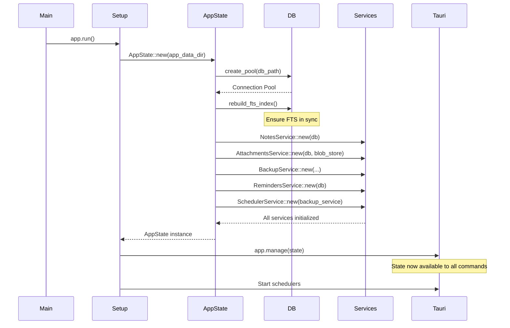
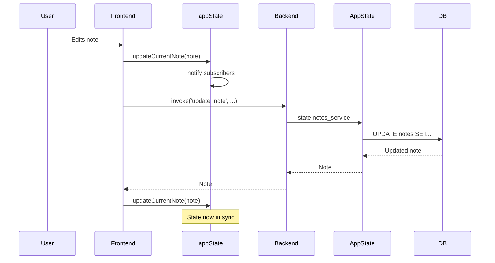

# Chapter 11: State Management

This chapter explores how SwatNotes manages state across both the Rust backend and TypeScript frontend. We'll examine two complementary state systems: **AppState** (Rust) for backend services and **appState** (TypeScript) for frontend UI synchronization.

## Overview

State management is the hardest problem in application development. In desktop apps, you have two independent state domains that must stay synchronized:

1. **Backend State (Rust)**: Database connections, services, schedulers
2. **Frontend State (TypeScript)**: Current note, editor instance, search query

SwatNotes uses different patterns for each domain, optimized for their specific needs.

## Mental Model: The Hotel Management System

Think of state management like a hotel:

**Backend (AppState)**: The hotel's back office
- **Concierge (Services)**: Specialized staff for different tasks
- **File Cabinet (Repository)**: Permanent record storage
- **Manager's Office (AppState struct)**: Central access point to all resources
- **Shared Resources (Arc)**: Equipment multiple staff can use simultaneously
- **Protected Records (Mutex)**: Only one person can modify at a time

**Frontend (appState)**: The guest-facing lobby
- **Guest Board (UI State)**: What guests currently see
- **Bulletin Board (Pub-Sub)**: Notifications when things change
- **Atomicity (Compound Operations)**: Checking in/out is all-or-nothing

---

## Part 1: Backend State Management

### The AppState Pattern

```rust
// src-tauri/src/app.rs

/// Central application state holding all services
#[derive(Clone)]
pub struct AppState {
    pub app_data_dir: PathBuf,
    
    /// Direct database access (use services instead when possible)
    #[allow(dead_code)]
    pub db: Repository,
    
    /// Direct blob store access (use services instead when possible)
    #[allow(dead_code)]
    pub blob_store: BlobStore,
    
    pub notes_service: NotesService,
    pub attachments_service: AttachmentsService,
    pub backup_service: BackupService,
    pub reminders_service: RemindersService,
    pub settings_service: SettingsService,
    pub scheduler_service: Option<Arc<SchedulerService>>,
    
    /// Last focused note window label for toggle hotkey
    pub last_focused_note_window: Arc<Mutex<Option<String>>>,
}
```

**Key Observations:**

1. **#[derive(Clone)]**: AppState is cheaply cloneable (all fields are Arc/cheap to clone)
2. **#[allow(dead_code)]**: Direct DB access exists but services are preferred
3. **Service Composition**: All business logic encapsulated in services
4. **Arc<Mutex<T>>**: Thread-safe shared mutable state for window tracking

### AppState Initialization



```rust
// src-tauri/src/app.rs (continued)

impl AppState {
    pub async fn new(app_data_dir: PathBuf) -> Result<Self> {
        // Initialize database
        let db_path = app_data_dir.join("db.sqlite");
        let pool = create_pool(&db_path).await?;
        let db = Repository::new(pool);

        // Rebuild FTS index to ensure all notes are properly indexed
        if let Err(e) = db.rebuild_fts_index().await {
            tracing::warn!("Failed to rebuild FTS index: {}", e);
            // Don't fail startup if FTS rebuild fails
        }

        // Initialize blob store
        let blob_store = BlobStore::new(app_data_dir.join("blobs"));
        blob_store.initialize().await?;

        // Initialize services
        let notes_service = NotesService::new(db.clone());
        let attachments_service = AttachmentsService::new(db.clone(), blob_store.clone());
        let backup_service =
            BackupService::new(db.clone(), blob_store.clone(), app_data_dir.clone());
        let reminders_service = RemindersService::new(db.clone());
        let settings_service = SettingsService::new(app_data_dir.clone());

        // Initialize scheduler service for automatic backups
        let scheduler_service = match SchedulerService::new(backup_service.clone()).await {
            Ok(scheduler) => Some(Arc::new(scheduler)),
            Err(e) => {
                tracing::error!("Failed to initialize scheduler service: {}", e);
                None
            }
        };

        Ok(Self {
            app_data_dir,
            db,
            blob_store,
            notes_service,
            attachments_service,
            backup_service,
            reminders_service,
            settings_service,
            scheduler_service,
            last_focused_note_window: Arc::new(Mutex::new(None)),
        })
    }
}
```

**Initialization Pattern:**

1. **Sequential Setup**: Database → BlobStore → Services
2. **Graceful Degradation**: FTS rebuild failure doesn't crash startup
3. **Service Dependencies**: Services depend on Repository, not each other
4. **Arc Wrapping**: scheduler_service wrapped in Arc for shared ownership

### Accessing AppState in Commands

Commands receive AppState via Tauri's dependency injection:

```rust
// src-tauri/src/commands/notes.rs

#[tauri::command]
pub async fn create_note(
    state: State<'_, AppState>,
    title: String,
    content_json: String,
) -> Result<Note> {
    state.notes_service.create_note(title, content_json).await
}

#[tauri::command]
pub async fn list_notes(state: State<'_, AppState>) -> Result<Vec<Note>> {
    state.notes_service.list_notes().await
}

#[tauri::command]
pub async fn delete_note(state: State<'_, AppState>, id: String) -> Result<()> {
    state.notes_service.delete_note(&id).await
}
```

**State<'_, AppState> Explained:**

- `State<'_, T>` is Tauri's wrapper for managed state
- `'_` is a lifetime placeholder (inferred by compiler)
- Automatically injected by Tauri when command is called
- Acts like `&AppState` but with special Tauri management
- Multiple commands can access state concurrently

**Mental Model**: State<'_, AppState> is like the hotel manager's phone directory. Every command gets a copy of the directory, so they can all call different departments simultaneously.

### Why Services Instead of Direct DB Access?

```rust
// ❌ BAD: Command talks directly to database
#[tauri::command]
pub async fn create_note(state: State<'_, AppState>, title: String, content: String) -> Result<Note> {
    let note = state.db.create_note(CreateNoteRequest { title, content }).await?;
    
    // Oops! Forgot to update FTS index
    // No logging
    // No validation
    
    Ok(note)
}

// ✅ GOOD: Command delegates to service
#[tauri::command]
pub async fn create_note(state: State<'_, AppState>, title: String, content: String) -> Result<Note> {
    state.notes_service.create_note(title, content).await
}
```

Services provide:
- **FTS Synchronization**: Automatic index updates
- **Logging**: Structured tracing statements
- **Validation**: Business rule enforcement
- **Graceful Degradation**: Non-critical failures don't break operations
- **Testability**: Mock services instead of mocking entire DB

**NotesService Example:**

```rust
// src-tauri/src/services/notes.rs

#[derive(Clone)]
pub struct NotesService {
    repo: Repository,
}

impl NotesService {
    pub fn new(repo: Repository) -> Self {
        Self { repo }
    }

    pub async fn create_note(&self, title: String, content_json: String) -> Result<Note> {
        tracing::info!("Creating new note: {}", title);

        let req = CreateNoteRequest {
            title: title.clone(),
            content_json: content_json.clone(),
        };

        let note = self.repo.create_note(req).await?;

        // Sync to FTS index
        if let Err(e) = self
            .repo
            .insert_note_fts(&note.id, &title, &content_json)
            .await
        {
            tracing::warn!("Failed to insert note into FTS index: {}", e);
            // Don't fail the whole operation if FTS fails
        }

        tracing::info!("Note created successfully: {}", note.id);
        Ok(note)
    }
}
```

**Service Layer Responsibilities:**
- Orchestrate multi-step operations
- Coordinate between repository and other services
- Handle non-critical failures gracefully
- Provide structured logging
- Encapsulate business logic

---

## Understanding Arc and Mutex

SwatNotes uses Arc and Mutex for thread-safe shared state. Let's understand these primitives.

### Arc: Shared Ownership

**Arc** = **A**tomic **R**eference **C**ounter

```rust
// Without Arc - won't compile!
let service = NotesService::new(repo);

thread::spawn(move || {
    service.create_note(...); // ❌ service moved here
});

service.list_notes(); // ❌ service was moved, can't use it here!


// With Arc - works!
let service = Arc::new(NotesService::new(repo));

let service_clone = service.clone(); // Cheap clone, just increments counter
thread::spawn(move || {
    service_clone.create_note(...); // ✅ Uses clone
});

service.list_notes(); // ✅ Original still valid!
```

**Mental Model**: Arc is like a library book checkout card:
- Original book stays in library
- Multiple people can "check out" a reference
- Book only removed when last person returns their card
- Reference counting = number of cards out

**In SwatNotes:**

```rust
pub scheduler_service: Option<Arc<SchedulerService>>,
pub last_focused_note_window: Arc<Mutex<Option<String>>>,
```

These fields are Arc-wrapped because:
1. Multiple commands need concurrent access
2. Background tasks hold references
3. Cheap to clone (just increments atomic counter)

### Mutex: Exclusive Access

**Mutex** = **Mut**ual **Ex**clusion lock

```rust
// last_focused_note_window tracks which sticky note was last focused
pub last_focused_note_window: Arc<Mutex<Option<String>>>,

// Reading
{
    let window_label = state.last_focused_note_window.lock().unwrap();
    if let Some(label) = window_label.as_ref() {
        println!("Last focused: {}", label);
    }
} // Lock automatically released here!

// Writing
{
    let mut window_label = state.last_focused_note_window.lock().unwrap();
    *window_label = Some("sticky-note-123".to_string());
} // Lock released
```

**Lock Mechanics:**

1. **`.lock()`**: Blocks until mutex is available
2. **`.unwrap()`**: Panics if lock is poisoned (previous holder panicked)
3. **Automatic unlock**: Lock released when guard goes out of scope
4. **Blocking**: Other threads wait until lock is released

**Mental Model**: Mutex is like a single bathroom key:
- Only one person can hold the key at a time
- Others wait in line
- You must return the key when done
- If someone loses the key (panics), the bathroom is "poisoned"

**Why Arc<Mutex<T>>?**

```rust
Arc<Mutex<Option<String>>>
│   │     └─ The data
│   └─ Exclusive access guard
└─ Shared ownership wrapper
```

- **Arc**: Multiple threads can have reference to the Mutex
- **Mutex**: Only one thread can modify the data at a time
- **Option<String>**: The actual state (can be Some or None)

### Real-World Example: Window Tracking

```rust
// src-tauri/src/commands/windows.rs

#[tauri::command]
pub async fn set_last_focused_note_window(
    state: State<'_, AppState>,
    window: Window,
) -> Result<()> {
    let label = window.label().to_string();
    
    // Lock mutex, update value, automatically unlock
    let mut last_focused = state.last_focused_note_window.lock().unwrap();
    *last_focused = Some(label);
    
    Ok(())
} // Mutex unlocked here

#[tauri::command]
pub async fn toggle_last_focused_note_window(
    state: State<'_, AppState>,
    app: AppHandle,
) -> Result<()> {
    // Read last focused window
    let window_label = {
        let last_focused = state.last_focused_note_window.lock().unwrap();
        last_focused.clone() // Clone String, not Mutex!
    }; // Unlock immediately after reading
    
    if let Some(label) = window_label {
        if let Some(window) = app.get_webview_window(&label) {
            if window.is_visible()? {
                window.hide()?;
            } else {
                window.show()?;
                window.set_focus()?;
            }
        }
    }
    
    Ok(())
}
```

**Best Practices:**

1. **Minimize lock scope**: Release lock as soon as possible
2. **Clone data out**: Don't hold lock while doing expensive work
3. **Avoid nested locks**: Can cause deadlocks
4. **Use blocks**: `{ let guard = mutex.lock(); ... }` ensures unlock

---

## Part 2: Frontend State Management

### The appState Singleton

```typescript
// src/state/appState.ts

export interface AppStateData {
  /** Currently selected note in the main editor */
  currentNote: Note | null;
  
  /** Currently selected note ID (for sidebar highlighting) */
  selectedNoteId: string | null;
  
  /** Active editor instance */
  currentEditor: NoteEditorInstance | null;
  
  /** Current search query */
  searchQuery: string;
  
  /** Whether a search is currently active */
  isSearching: boolean;
}

class AppState {
  private state: AppStateData = {
    currentNote: null,
    selectedNoteId: null,
    currentEditor: null,
    searchQuery: '',
    isSearching: false,
  };

  private subscribers: Map<StateChangeEvent, Set<StateSubscriber<any> | GlobalSubscriber>> = new Map();
  
  // ...methods
}

// Singleton export
export const appState = new AppState();
```

**Why Singleton?**

- Global access across all frontend files
- Single source of truth
- No prop drilling through component tree
- Easier to debug (one state object to inspect)

**Why Not React/Vue/etc.?**

SwatNotes is a vanilla TypeScript app:
- No framework overhead
- Direct DOM manipulation for performance
- Simpler for small to medium apps
- Custom state solution tailored to needs

### Getters and Setters

```typescript
// Read-only getters
get currentNote(): Note | null {
  return this.state.currentNote;
}

get selectedNoteId(): string | null {
  return this.state.selectedNoteId;
}

// Setters with notifications
setCurrentNote(note: Note | null): void {
  const oldValue = this.state.currentNote;
  this.state.currentNote = note;

  // Also update selectedNoteId to keep in sync
  const oldSelectedId = this.state.selectedNoteId;
  this.state.selectedNoteId = note?.id ?? null;

  this.notify('currentNote', note, oldValue);
  if (oldSelectedId !== this.state.selectedNoteId) {
    this.notify('selectedNoteId', this.state.selectedNoteId, oldSelectedId);
  }
}
```

**Setter Pattern:**

1. Store old value for comparison
2. Update internal state
3. Update related state (keep in sync)
4. Notify subscribers of all changes

**Why Getters?**

- Encapsulation: State can't be modified directly
- Future-proofing: Can add validation or computation later
- TypeScript autocomplete and type safety

### Pub-Sub Pattern: Reactive Updates

```typescript
/**
 * Subscribe to state changes
 * @param event - The state key to watch, or '*' for all changes
 * @param callback - Function called when state changes
 * @returns Unsubscribe function
 */
subscribe<K extends keyof AppStateData>(
  event: K | '*',
  callback: K extends '*' ? GlobalSubscriber : StateSubscriber<K>
): () => void {
  if (!this.subscribers.has(event)) {
    this.subscribers.set(event, new Set());
  }
  this.subscribers.get(event)!.add(callback);

  // Return unsubscribe function
  return () => {
    this.subscribers.get(event)?.delete(callback);
  };
}

/**
 * Notify subscribers of state changes
 */
private notify<K extends keyof AppStateData>(
  key: K,
  newValue: AppStateData[K],
  oldValue: AppStateData[K]
): void {
  // Skip if value hasn't changed
  if (newValue === oldValue) return;

  // Notify specific subscribers
  this.subscribers.get(key)?.forEach((callback) => {
    (callback as StateSubscriber<K>)(newValue, oldValue);
  });

  // Notify wildcard subscribers
  this.subscribers.get('*')?.forEach((callback) => {
    (callback as GlobalSubscriber)(key, newValue, oldValue);
  });
}
```

**Usage Example:**

```typescript
// Subscribe to note changes
const unsubscribe = appState.subscribe('currentNote', (newNote, oldNote) => {
  console.log('Note changed:', oldNote?.title, '->', newNote?.title);
  updateUI(newNote);
});

// Later: cleanup
unsubscribe();
```

**Pub-Sub Benefits:**

- **Decoupling**: UI components don't know about each other
- **Reactivity**: Changes automatically propagate
- **Cleanup**: Unsubscribe function prevents memory leaks
- **Debugging**: Easy to log all state changes

**Mental Model**: Pub-sub is like a newsletter:
- **Subscribe**: Sign up for notifications
- **Notify**: Send emails to all subscribers
- **Unsubscribe**: Stop receiving emails
- **Wildcard**: Subscribe to all topics

### Atomic Compound Operations

Sometimes multiple state changes must happen together:

```typescript
/**
 * Open a note in the editor - updates both note and editor state atomically
 */
openNote(note: Note, editor: NoteEditorInstance): void {
  // Clean up old editor first
  if (this.state.currentEditor) {
    this.state.currentEditor.destroy();
  }

  const oldNote = this.state.currentNote;
  const oldSelectedId = this.state.selectedNoteId;
  const oldEditor = this.state.currentEditor;

  // Update all state atomically
  this.state.currentNote = note;
  this.state.selectedNoteId = note.id;
  this.state.currentEditor = editor;

  // Notify all changes
  this.notify('currentNote', note, oldNote);
  this.notify('selectedNoteId', note.id, oldSelectedId);
  this.notify('currentEditor', editor, oldEditor);
}

/**
 * Close the current note - clears note and editor state atomically
 */
closeNote(): void {
  // Clean up editor
  if (this.state.currentEditor) {
    this.state.currentEditor.destroy();
  }

  const oldNote = this.state.currentNote;
  const oldSelectedId = this.state.selectedNoteId;
  const oldEditor = this.state.currentEditor;

  // Clear all state atomically
  this.state.currentNote = null;
  this.state.selectedNoteId = null;
  this.state.currentEditor = null;

  // Notify all changes
  this.notify('currentNote', null, oldNote);
  this.notify('selectedNoteId', null, oldSelectedId);
  this.notify('currentEditor', null, oldEditor);
}
```

**Why Atomic Operations?**

```typescript
// ❌ BAD: Non-atomic
appState.setCurrentNote(note);
// What if code throws here?
appState.setCurrentEditor(editor);
// State is inconsistent!

// ✅ GOOD: Atomic
appState.openNote(note, editor);
// All-or-nothing guarantee
```

**Atomicity Benefits:**

1. **Consistency**: State never in half-updated state
2. **Cleanup**: Resources properly released
3. **Fewer Notifications**: One "open" event instead of three separate changes
4. **Easier Reasoning**: Single operation, single mental model

---

## State Synchronization: Backend ↔ Frontend

### The Update Cycle



**Key Insight**: Frontend state updates **optimistically** (before backend confirms), but backend response is **source of truth**.

### Optimistic vs Pessimistic Updates

**Pessimistic (SwatNotes approach):**

```typescript
async function deleteNote(id: string) {
  // Wait for backend confirmation
  await invoke('delete_note', {id});
  
  // Only update UI after success
  if (appState.currentNote?.id === id) {
    appState.closeNote();
  }
  refreshNotesList();
}
```

**Optimistic (alternative):**

```typescript
async function deleteNote(id: string) {
  // Update UI immediately
  if (appState.currentNote?.id === id) {
    appState.closeNote();
  }
  refreshNotesList();
  
  try {
    await invoke('delete_note', {id});
  } catch (error) {
    // Rollback on failure
    const note = await invoke('get_note', {id});
    appState.setCurrentNote(note);
    refreshNotesList();
  }
}
```

**Trade-offs:**

| Approach | Pros | Cons |
|----------|------|------|
| **Pessimistic** | Always accurate, no rollback logic | Slower perceived performance |
| **Optimistic** | Instant feedback, feels faster | Complex rollback, can show wrong data |

SwatNotes uses **pessimistic** because:
- Desktop app (not web, no network latency)
- Rust backend is fast (<10ms for most operations)
- Data accuracy more important than perceived speed
- Simpler code (no rollback complexity)

---

## State Management Patterns in Practice

### Pattern 1: Editor Lifecycle

```typescript
// src/main.ts

async function selectNote(noteId: string) {
  // Load note from backend
  const note = await invoke('get_note', {id: noteId});
  
  // Create new editor instance
  const editor = createNoteEditor('editor-container', note);
  
  // Atomically update state
  appState.openNote(note, editor);
  
  // Subscribe to editor changes
  editor.on('text-change', async () => {
    await debouncedSave();
  });
}

async function closeCurrentNote() {
  const noteId = appState.currentNote?.id;
  if (!noteId) return;
  
  // Cleanup happens automatically in appState.closeNote()
  appState.closeNote();
}
```

**Pattern**: State manages editor lifecycle, not the other way around.

### Pattern 2: Search State

```typescript
// src/main.ts

async function handleSearch(query: string) {
  appState.setSearchQuery(query);
  
  if (query.trim() === '') {
    appState.clearSearch();
    const notes = await invoke('list_notes');
    renderNotesList(notes);
  } else {
    appState.setIsSearching(true);
    const notes = await invoke('search_notes', {query});
    renderNotesList(notes);
  }
}

// Subscribe to search state changes
appState.subscribe('isSearching', (isSearching) => {
  const searchIcon = document.getElementById('search-icon');
  if (isSearching) {
    searchIcon.classList.add('spinning');
  } else {
    searchIcon.classList.remove('spinning');
  }
});
```

**Pattern**: State drives UI, UI doesn't directly manipulate DOM.

### Pattern 3: Service Coordination

```rust
// src-tauri/src/app.rs

// Start reminders scheduler
let scheduler_service = state.reminders_service.clone();
let app_handle = app.handle().clone();
tauri::async_runtime::spawn(async move {
    scheduler_service.set_app_handle(app_handle).await;
    scheduler_service.start_scheduler();
});

// Start auto-backup scheduler
if let Some(backup_scheduler) = state.scheduler_service.clone() {
    let settings_service = state.settings_service.clone();
    tauri::async_runtime::spawn(async move {
        backup_scheduler.start().await.ok();
        
        // Load settings and schedule backups
        if let Ok(settings) = settings_service.get_auto_backup().await {
            if settings.enabled {
                backup_scheduler.schedule_backup(
                    settings.frequency.parse().unwrap_or_default(),
                    true
                ).await.ok();
            }
        }
    });
}
```

**Pattern**: AppState initialization spawns background tasks that hold service references (via Arc).

---

## Common Pitfalls and Solutions

### Pitfall 1: Holding Mutex Locks Too Long

```rust
// ❌ BAD
let mut window_label = state.last_focused_note_window.lock().unwrap();
expensive_operation(); // Lock held during slow operation!
*window_label = Some(new_label);

// ✅ GOOD
expensive_operation(); // Do work without lock
{
    let mut window_label = state.last_focused_note_window.lock().unwrap();
    *window_label = Some(new_label);
} // Lock released immediately
```

### Pitfall 2: Forgetting to Unsubscribe

```typescript
// ❌ BAD
function setupEditor() {
  appState.subscribe('currentNote', (note) => {
    updateEditor(note);
  });
  // Memory leak! Subscription never removed
}

// ✅ GOOD
function setupEditor() {
  const unsubscribe = appState.subscribe('currentNote', (note) => {
    updateEditor(note);
  });
  
  return () => {
    unsubscribe(); // Cleanup function
  };
}
```

### Pitfall 3: Stale State in Closures

```typescript
// ❌ BAD
function startAutosave() {
  setInterval(() => {
    const note = appState.currentNote; // Captures old reference!
    saveNote(note);
  }, 5000);
}

// ✅ GOOD
function startAutosave() {
  setInterval(() => {
    const note = appState.currentNote; // Fresh read each time
    if (note) {
      saveNote(note);
    }
  }, 5000);
}
```

### Pitfall 4: Race Conditions in Updates

```typescript
// ❌ BAD: Race condition
async function updateTitle(newTitle: string) {
  const note = appState.currentNote;
  if (!note) return;
  
  note.title = newTitle; // Mutates cached object!
  await invoke('update_note', {id: note.id, title: newTitle});
}

// ✅ GOOD: Backend is source of truth
async function updateTitle(newTitle: string) {
  const note = appState.currentNote;
  if (!note) return;
  
  const updatedNote = await invoke('update_note', {
    id: note.id,
    title: newTitle
  });
  
  appState.updateCurrentNote(updatedNote); // Update with fresh data
}
```

---

## Debugging State Issues

### Backend State Debugging

**Logging:**

```rust
tracing::info!("AppState initialized with {} services", 5);
tracing::debug!("Last focused window: {:?}", 
    state.last_focused_note_window.lock().unwrap());
```

**Rust Analyzer:**

- Hover over `State<'_, AppState>` to see lifetime annotations
- `#[derive(Clone)]` shows what makes AppState cloneable
- Jump to definition to see service implementations

### Frontend State Debugging

**Global State Inspection:**

```typescript
// In browser console
window.appState = appState; // Expose for debugging

// Inspect current state
appState.currentNote
appState.selectedNoteId

// Subscribe to all changes
appState.subscribe('*', (key, newValue, oldValue) => {
  console.log(`State changed: ${key}`, oldValue, '->', newValue);
});
```

**State Snapshots:**

```typescript
function captureStateSnapshot() {
  return {
    currentNote: appState.currentNote?.id,
    selectedNoteId: appState.selectedNoteId,
    searchQuery: appState.searchQuery,
    isSearching: appState.isSearching,
    timestamp: Date.now(),
  };
}

// Log state at key points
const before = captureStateSnapshot();
await performOperation();
const after = captureStateSnapshot();
console.log('State change:', before, '->', after);
```

---

## Key Takeaways

1. **AppState (Rust)**: Central hub for all services and resources
   - Use `State<'_, AppState>` in commands
   - Services encapsulate business logic
   - Arc enables shared ownership
   - Mutex protects mutable state

2. **appState (TypeScript)**: Singleton for frontend UI state
   - Getters for read access
   - Setters with automatic notifications
   - Pub-sub for reactive updates
   - Atomic compound operations

3. **Arc<Mutex<T>>**: Thread-safe shared mutable state
   - Arc = shared ownership
   - Mutex = exclusive access
   - Always minimize lock scope
   - Clone data out of critical sections

4. **State Synchronization**:
   - Frontend state is **cache** of backend state
   - Backend is **source of truth**
   - Pessimistic updates for accuracy
   - Optimistic possible for better UX

5. **Best Practices**:
   - Use services instead of direct DB access
   - Unsubscribe to prevent memory leaks
   - Keep state updates atomic
   - Backend responses refresh frontend state

---

## What's Next?

In **Chapter 12: Frontend Architecture**, we'll explore:
- TypeScript type system and type safety
- Component organization patterns
- Event handling and DOM manipulation
- Module system and code organization
- Build process and bundling with Vite

We'll see how the frontend complements the backend architecture we've built.
