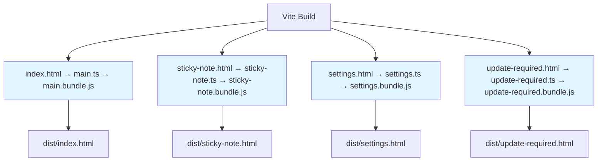
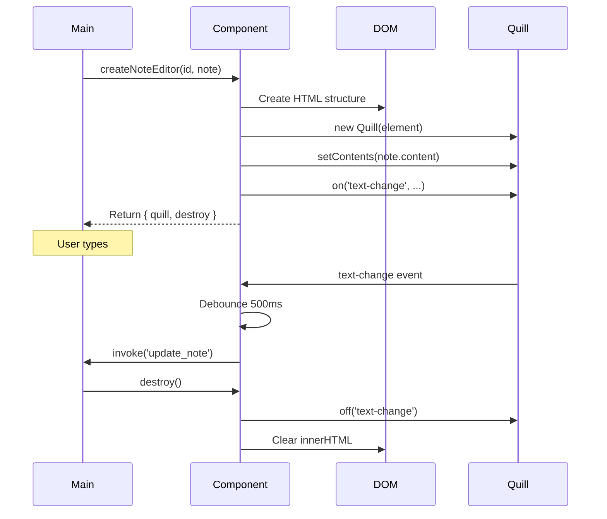
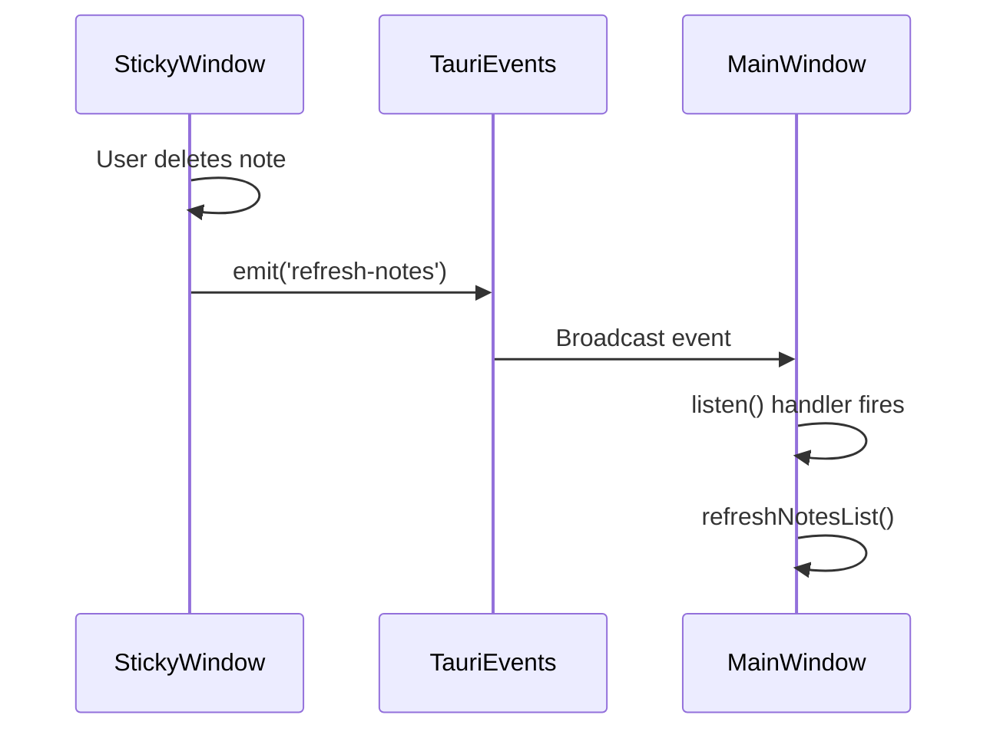
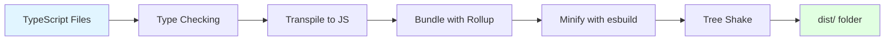

# Chapter 12: Frontend Architecture

In previous chapters, we've explored the Rust backend—state management, database operations, and command handlers. Now we turn to the other side of Tauri: the **TypeScript frontend**.

Unlike React, Vue, or Angular apps, SwatNotes uses **vanilla TypeScript** with direct DOM manipulation. This chapter explains why, how the frontend is organized, and the patterns that keep the codebase maintainable despite having no framework.

---

## Why Vanilla TypeScript?

**Mental Model**: Think of frameworks like scaffolding for building a skyscraper. For a small building (like SwatNotes), scaffolding adds unnecessary complexity and weight. You can build faster and lighter by working directly with the foundation.

### The Trade-off

| Aspect | With Framework (React/Vue) | Vanilla TypeScript (SwatNotes) |
|--------|---------------------------|-------------------------------|
| **Bundle Size** | 40-200 KB (framework) | ~10 KB (no framework) |
| **Startup Time** | 100-300ms | <50ms (instant) |
| **Learning Curve** | Framework concepts + APIs | JavaScript fundamentals only |
| **Boilerplate** | Components, hooks, state | More manual DOM manipulation |
| **Updates** | Framework upgrade cycles | No framework to upgrade |
| **DevTools** | Excellent React/Vue tools | Browser DevTools |

**SwatNotes Choice**: Vanilla TypeScript because:
1. **Small app**: <20 UI screens, no complex routing
2. **Desktop app**: Performance matters more than web frameworks
3. **Direct control**: No virtual DOM overhead
4. **Simplicity**: Easier to reason about (no magic)
5. **Bundle size**: App launches instantly

**When to use a framework**: Multi-page SPAs, complex state interactions, large teams needing structure.

---

## Project Structure

```
src/
├── main.ts                  # Main window entry point
├── sticky-note.ts           # Floating sticky note entry
├── settings.ts              # Settings window entry
├── update-required.ts       # Update prompt entry
├── config.ts                # Frontend constants
├── types.ts                 # TypeScript type definitions
│
├── components/              # Reusable UI components
│   ├── noteEditor.ts        # Quill editor wrapper
│   └── notesList.ts         # Notes list renderer
│
├── state/                   # Global state management
│   └── appState.ts          # Singleton state (covered in Ch 11)
│
├── events/                  # Event handling logic
│   └── handlers.ts          # Centralized event handlers
│
├── ui/                      # UI-specific utilities
│   ├── theme.ts             # DaisyUI theme management
│   └── backup.ts            # Backup UI flows
│
├── utils/                   # API wrappers and helpers
│   ├── notesApi.ts          # Notes backend calls
│   ├── attachmentsApi.ts    # Attachments backend calls
│   ├── formatters.ts        # String formatting
│   ├── logger.ts            # Frontend logging
│   └── modal.ts             # Custom modal dialogs
│
└── styles/
    └── main.css             # Tailwind + custom styles
```

**Pattern**: Organize by **purpose**, not by file type:
- `components/` = Reusable UI building blocks
- `utils/` = API wrappers (thin layer over `invoke()`)
- `events/` = Event handling logic
- `state/` = Global application state

---

## TypeScript Configuration

```jsonc
// tsconfig.json

{
  "compilerOptions": {
    "target": "ES2020",              // Modern JavaScript features
    "module": "ESNext",              // ES modules (import/export)
    "lib": ["ES2020", "DOM"],        // Browser APIs available
    
    /* Bundler mode */
    "moduleResolution": "bundler",   // Vite handles imports
    "allowImportingTsExtensions": true,  // Import .ts files directly
    "isolatedModules": true,         // Each file is a separate module
    "noEmit": true,                  // Vite handles compilation
    
    /* Linting */
    "strict": false,                 // Relaxed for prototyping
    "forceConsistentCasingInFileNames": true,
    
    /* Path mapping */
    "baseUrl": ".",
    "paths": {
      "@/*": ["./src/*"]             // @ alias for src/
    }
  }
}
```

**Key Settings:**

- **`target: ES2020`**: Use modern JavaScript (async/await, optional chaining `?.`, nullish coalescing `??`)
- **`module: ESNext`**: Native ES modules (`import`/`export`)
- **`moduleResolution: bundler`**: Let Vite resolve imports
- **`noEmit: true`**: TypeScript only checks types, Vite compiles to JS
- **`strict: false`**: Relaxed type checking (SwatNotes prioritizes rapid development)

**Path Mapping** (unused in SwatNotes but common):
```typescript
import { Note } from '@/types';  // Instead of '../../../types'
```

---

## Module System: ES Modules

SwatNotes uses **ES Modules** (the modern JavaScript module system).

### Import Syntax

```typescript
// src/main.ts

// Named imports
import { invoke } from '@tauri-apps/api/core';
import { listen, emit } from '@tauri-apps/api/event';

// Default imports
import Quill from 'quill';

// Type-only imports
import type { Note, Collection } from './types';

// Import with alias
import { appState as state } from './state/appState';

// Import everything as namespace
import * as formatters from './utils/formatters';
```

**Type-only imports**: `import type { ... }` doesn't generate runtime code (types are erased after compilation).

### Export Syntax

```typescript
// src/utils/formatters.ts

// Named exports
export function escapeHtml(text: string): string { ... }
export function formatDate(dateString: string): string { ... }

// Export types
export interface FormatterOptions { ... }

// Re-export from another module
export { someFunction } from './helpers';

// Default export (avoid in SwatNotes for consistency)
export default function mainFormatter() { ... }
```

**SwatNotes Convention**: Use **named exports** only (no default exports). Makes refactoring easier (you can grep for function names).

### Circular Imports (Common Pitfall)

```typescript
// ❌ BAD: Circular dependency
// fileA.ts
import { funcB } from './fileB';
export function funcA() { return funcB(); }

// fileB.ts
import { funcA } from './fileA';  // Circular!
export function funcB() { return funcA(); }
```

**Solution**: Extract shared code to a third file:

```typescript
// ✅ GOOD: Break circular dependency
// shared.ts
export function sharedLogic() { ... }

// fileA.ts
import { sharedLogic } from './shared';
export function funcA() { return sharedLogic(); }

// fileB.ts
import { sharedLogic } from './shared';
export function funcB() { return sharedLogic(); }
```

**SwatNotes Avoids Circulars** by:
1. **Unidirectional imports**: Utils never import from components, components never import from main.ts
2. **State as singleton**: `appState` is imported everywhere (doesn't import anything except types)
3. **Event emitter pattern**: Use Tauri events instead of direct function calls

---

## Entry Points: Multi-Page Application

SwatNotes has **4 HTML pages**, each with its own TypeScript entry point:

```javascript
// vite.config.js

export default defineConfig({
  build: {
    rollupOptions: {
      input: {
        main: resolve(__dirname, 'index.html'),
        'sticky-note': resolve(__dirname, 'sticky-note.html'),
        settings: resolve(__dirname, 'settings.html'),
        'update-required': resolve(__dirname, 'update-required.html'),
      },
    },
  },
});
```

**How it works**:



**Each entry point**:
1. Imports only what it needs (tree-shaking removes unused code)
2. Has its own bundle (no shared bundle bloat)
3. Can share utility modules (Vite deduplicates common code)

**Example - Sticky Note Entry**:

```typescript
// src/sticky-note.ts

import { invoke } from '@tauri-apps/api/core';
import { listen } from '@tauri-apps/api/event';
import { createNoteEditor } from './components/noteEditor';
import { appState } from './state/appState';
import type { Note } from './types';

// Get note ID from URL query parameter
const urlParams = new URLSearchParams(window.location.search);
const noteId = urlParams.get('id');

if (!noteId) {
  document.body.innerHTML = '<p class="p-4">Error: No note ID provided</p>';
} else {
  loadNote(noteId);
}

async function loadNote(id: string): Promise<void> {
  const note = await invoke<Note>('get_note', { id });
  createNoteEditor('note-editor-container', note);
}
```

**Why multi-page?**
- Each window has different UI (main dashboard vs floating sticky note vs settings)
- Smaller bundles (settings.js doesn't include Quill editor code)
- Simpler than client-side routing

---

## Component Pattern: Functions Returning State

SwatNotes doesn't use classes or component frameworks. Instead, components are **functions** that:
1. Accept configuration
2. Manipulate the DOM
3. Return cleanup/state

### Example: Note Editor Component

```typescript
// src/components/noteEditor.ts

export interface NoteEditorInstance {
  quill: Quill;
  destroy: () => void;
}

export function createNoteEditor(
  containerId: string,
  note: Note,
  onUpdate?: (note: Note) => void,
  onDelete?: () => void
): NoteEditorInstance {
  const container = document.getElementById(containerId);
  if (!container) {
    throw new Error(`Container #${containerId} not found`);
  }

  // 1. Create DOM structure
  container.innerHTML = `
    <div class="note-editor">
      <input id="note-title-${note.id}" class="input input-bordered w-full mb-2" 
             value="${escapeHtml(note.title)}" placeholder="Note title">
      <div id="quill-editor-${note.id}" class="prose"></div>
      <div id="editor-status" class="text-sm text-base-content/50 mt-2"></div>
    </div>
  `;

  // 2. Initialize Quill editor
  const editorElement = document.getElementById(`quill-editor-${note.id}`);
  const quill = new Quill(editorElement!, {
    theme: 'snow',
    modules: { toolbar: [...] },
  });
  quill.setContents(JSON.parse(note.content_json));

  // 3. Setup event handlers
  let saveTimeout: ReturnType<typeof setTimeout> | null = null;

  quill.on('text-change', () => {
    if (saveTimeout) clearTimeout(saveTimeout);
    
    saveTimeout = setTimeout(async () => {
      const contentJson = JSON.stringify(quill.getContents());
      const updatedNote = await invoke<Note>('update_note', {
        id: note.id,
        contentJson,
      });
      onUpdate?.(updatedNote);
    }, 500);
  });

  // 4. Return instance with cleanup
  return {
    quill,
    destroy: () => {
      if (saveTimeout) clearTimeout(saveTimeout);
      quill.off('text-change');  // Remove listener
      container.innerHTML = '';  // Clear DOM
    }
  };
}
```

**Component Lifecycle:**



**Key Pattern**: Component returns **cleanup function** to prevent memory leaks.

### Usage

```typescript
// src/main.ts

let currentEditor: NoteEditorInstance | null = null;

async function openNote(note: Note): Promise<void> {
  // Cleanup old editor
  if (currentEditor) {
    currentEditor.destroy();
  }

  // Create new editor
  currentEditor = createNoteEditor(
    'editor-container',
    note,
    (updatedNote) => {
      appState.updateCurrentNote(updatedNote);
      refreshNotesList();
    },
    () => {
      deleteCurrentNote();
    }
  );
}
```

---

## Event Handling Patterns

SwatNotes uses **three types of event handling**:

### 1. DOM Events (Standard Browser Events)

```typescript
// src/events/handlers.ts

export function setupEventHandlers(): void {
  const newNoteBtn = document.getElementById('new-note-btn');
  newNoteBtn?.addEventListener('click', async () => {
    await handleCreateNote();
  });

  const searchInput = document.getElementById('search-input') as HTMLInputElement;
  searchInput?.addEventListener('input', (e) => {
    const query = (e.target as HTMLInputElement).value;
    handleSearch(query);
  });
}
```

**Pattern**: Centralize event handler registration in `events/handlers.ts`.

### 2. Tauri Events (Cross-Window Communication)

```typescript
// src/main.ts

import { listen, emit } from '@tauri-apps/api/event';

// Listen for events
listen('refresh-notes', async () => {
  await refreshNotesList();
});

// Emit events
async function requestNotesListRefresh(): Promise<void> {
  await emit('refresh-notes');
}
```

**Use Case**: When one window needs to notify another (e.g., sticky note deleted → refresh main window list).

**Event Flow:**



### 3. State Change Events (Reactive Updates)

```typescript
// src/state/appState.ts (from Chapter 11)

appState.subscribe('currentNote', (newNote, oldNote) => {
  console.log('Note changed:', oldNote?.title, '->', newNote?.title);
  updateUI(newNote);
});

// Trigger notification
appState.setCurrentNote(note);
```

**Use Case**: React to state changes without tight coupling.

---

## DOM Manipulation: Direct vs Template Strings

SwatNotes uses **template strings** for HTML generation:

```typescript
// src/components/notesList.ts

function createNoteCard(note: Note): string {
  const preview = extractTextPreview(note.content_json);
  const date = formatRelativeDate(note.updated_at);

  return `
    <div id="note-${note.id}" class="note-card card bg-base-100 hover:bg-base-200 cursor-pointer p-4 mb-2">
      <div class="flex justify-between items-start">
        <div class="flex-1 min-w-0">
          <h3 class="font-bold text-lg truncate">${escapeHtml(note.title)}</h3>
          <p class="text-sm text-base-content/70 line-clamp-2 mt-1">${escapeHtml(preview)}</p>
          <p class="text-xs text-base-content/50 mt-2">${date}</p>
        </div>
        <button id="delete-${note.id}" class="btn btn-ghost btn-sm btn-circle">
          <!-- SVG icon -->
        </button>
      </div>
    </div>
  `;
}

export async function renderNotesList(containerId: string, onNoteClick: (note: Note) => void): Promise<void> {
  const container = document.getElementById(containerId);
  const notes = await listNotes();

  // Render all cards
  container!.innerHTML = notes.map(note => createNoteCard(note)).join('');

  // Attach event listeners
  notes.forEach(note => {
    const card = document.getElementById(`note-${note.id}`);
    card?.addEventListener('click', () => onNoteClick(note));

    const deleteBtn = document.getElementById(`delete-${note.id}`);
    deleteBtn?.addEventListener('click', async (e) => {
      e.stopPropagation();  // Don't trigger card click
      await deleteNote(note.id);
    });
  });
}
```

**Pattern Breakdown:**

1. **`createNoteCard()`**: Pure function returning HTML string
2. **`renderNotesList()`**: Main function that:
   - Fetches data
   - Renders HTML (`innerHTML`)
   - Attaches event listeners

**Why Template Strings?**

| Approach | Pros | Cons |
|----------|------|------|
| **Template strings** | Simple, readable, fast | No reactivity, XSS risk if not escaped |
| **document.createElement()** | Type-safe, no XSS risk | Verbose, harder to read |
| **Framework (React)** | Reactive, component tree | Bundle size, learning curve |

**SwatNotes uses template strings** because:
- Simplicity (HTML looks like HTML)
- Performance (single `innerHTML` faster than many `.appendChild()`)
- XSS protection via `escapeHtml()` utility

### XSS Prevention

```typescript
// src/utils/formatters.ts

export function escapeHtml(text: string): string {
  const div = document.createElement('div');
  div.textContent = text;  // Browser automatically escapes
  return div.innerHTML;
}

// Usage
const title = '<script>alert("XSS")</script>';
container.innerHTML = `<h1>${escapeHtml(title)}</h1>`;
// Result: <h1>&lt;script&gt;alert("XSS")&lt;/script&gt;</h1>
```

**Mental Model**: `escapeHtml()` is like putting quotes around a SQL query parameter. It neutralizes special characters.

---

## Utility Modules: API Wrappers

```typescript
// src/utils/notesApi.ts

import { invoke } from '@tauri-apps/api/core';
import type { Note } from '../types';

export async function createNote(title: string, contentJson: string): Promise<Note> {
  return await invoke<Note>('create_note', { title, contentJson });
}

export async function listNotes(): Promise<Note[]> {
  return await invoke<Note[]>('list_notes');
}

export async function updateNote(
  id: string,
  title?: string,
  contentJson?: string,
  titleModified?: boolean
): Promise<Note> {
  return await invoke<Note>('update_note', {
    id,
    title: title ?? null,
    contentJson: contentJson ?? null,
    titleModified: titleModified ?? null,
  });
}
```

**Pattern**: One wrapper function per Tauri command.

**Benefits:**

1. **Type safety**: Return type is `Promise<Note>`, not `Promise<unknown>`
2. **Single source of truth**: All `invoke()` calls in one place
3. **Easy mocking**: For testing, mock `notesApi` module instead of `invoke()`
4. **Documentation**: Function signatures document expected parameters

**Mental Model**: API wrappers are like a menu at a restaurant. Instead of speaking directly to the kitchen (Rust backend), you order from the menu (wrapper functions).

---

## Centralized Logging

```typescript
// src/utils/logger.ts

export enum LogLevel {
  DEBUG = 0,
  INFO = 1,
  WARN = 2,
  ERROR = 3,
}

class Logger {
  private level: LogLevel;

  constructor() {
    this.level = import.meta.env.DEV ? LogLevel.DEBUG : LogLevel.WARN;
  }

  debug(message: string, context: string, data?: any): void {
    if (this.level <= LogLevel.DEBUG) {
      console.log(`[DEBUG] [${context}] ${message}`, data || '');
    }
  }

  info(message: string, context: string, data?: any): void {
    if (this.level <= LogLevel.INFO) {
      console.info(`[INFO] [${context}] ${message}`, data || '');
    }
  }

  error(message: string, context: string, error?: any): void {
    if (this.level <= LogLevel.ERROR) {
      console.error(`[ERROR] [${context}] ${message}`, error || '');
    }
  }
}

export const logger = new Logger();
```

**Usage:**

```typescript
// src/main.ts

import { logger } from './utils/logger';

const LOG_CONTEXT = 'Main';

async function loadNotes(): Promise<void> {
  logger.debug('Loading notes...', LOG_CONTEXT);
  
  try {
    const notes = await listNotes();
    logger.info(`Loaded ${notes.length} notes`, LOG_CONTEXT);
  } catch (error) {
    logger.error('Failed to load notes', LOG_CONTEXT, error);
  }
}
```

**Pattern**: Log with **context** (which module/function) for easier debugging.

**Development vs Production:**

- **Development** (`import.meta.env.DEV === true`): DEBUG level, all logs visible
- **Production** (`import.meta.env.DEV === false`): WARN level, only warnings and errors

---

## Custom Modal System

SwatNotes replaces browser `alert()`, `confirm()`, `prompt()` with DaisyUI modals:

```typescript
// src/utils/modal.ts

export function showAlert(message: string, options: Partial<ModalOptions> = {}): Promise<void> {
  return new Promise((resolve) => {
    const modal = createModal({
      title: options.title || 'Alert',
      message,
      type: options.type || 'info',
      confirmText: 'OK',
      onConfirm: () => {
        closeModal(modal);
        resolve();
      }
    });
    document.body.appendChild(modal);
    showModal(modal);
  });
}

export function showConfirm(message: string, options: Partial<ModalOptions> = {}): Promise<boolean> {
  return new Promise((resolve) => {
    const modal = createModal({
      title: options.title || 'Confirm',
      message,
      confirmText: options.confirmText || 'Yes',
      cancelText: options.cancelText || 'No',
      onConfirm: () => {
        closeModal(modal);
        resolve(true);
      },
      onCancel: () => {
        closeModal(modal);
        resolve(false);
      }
    });
    document.body.appendChild(modal);
    showModal(modal);
  });
}
```

**Usage:**

```typescript
// Before (browser native)
alert('Note deleted');
if (confirm('Delete this note?')) {
  deleteNote(id);
}

// After (DaisyUI modal)
await showAlert('Note deleted', { type: 'success' });
if (await showConfirm('Delete this note?')) {
  await deleteNote(id);
}
```

**Benefits:**

- Consistent styling with DaisyUI theme
- Non-blocking (async/await instead of blocking dialog)
- Customizable (icons, colors, buttons)
- No browser UI differences

---

## Debouncing: Preventing Excessive Function Calls

```typescript
// src/events/handlers.ts

let searchTimeout: ReturnType<typeof setTimeout> | null = null;

searchInput?.addEventListener('input', (e) => {
  const query = (e.target as HTMLInputElement).value;

  // Clear previous timeout
  if (searchTimeout) {
    clearTimeout(searchTimeout);
  }

  // Schedule new search after 300ms of inactivity
  searchTimeout = setTimeout(async () => {
    await handleSearch(query);
  }, 300);
});
```

**How Debouncing Works:**

```
User types:        h    e    l    l    o
Timeout starts:    T1   T2   T3   T4   T5
Timeout cleared:   ×    ×    ×    ×    (300ms later)
Function called:                       ✓ handleSearch("hello")
```

**Mental Model**: Debouncing is like waiting for someone to finish talking before you respond. If they keep talking, you keep waiting.

**When to use:**
- Search input (wait for user to stop typing)
- Window resize events
- Autosave (wait for user to stop editing)

**Debounce vs Throttle:**

| Pattern | Behavior | Use Case |
|---------|----------|----------|
| **Debounce** | Call after quiet period | Search, autosave |
| **Throttle** | Call at most once per interval | Scroll events, mouse move |

---

## Build Process with Vite

### Development Mode

```bash
npm run dev
```

**What happens:**

1. **Vite starts dev server** on port 5173
2. **Hot Module Replacement (HMR)**: Save a file → browser updates instantly
3. **Source maps**: Browser shows TypeScript line numbers (not compiled JS)
4. **Type checking**: TypeScript compiler runs in watch mode

**HMR Example:**

```typescript
// Change logger.ts
export const LOG_PREFIX = 'SwatNotes'; // Add this line

// Save file
// Browser console immediately shows:
// [vite] hot updated: /src/utils/logger.ts
// No full page reload!
```

### Production Build

```bash
npm run build
```

**Build Steps:**



**Output:**

```
dist/
├── index.html
├── sticky-note.html
├── settings.html
├── update-required.html
├── assets/
│   ├── main-abc123.js      # Main bundle (hashed)
│   ├── sticky-note-def456.js
│   ├── settings-ghi789.js
│   └── main-xyz999.css     # Tailwind CSS
```

**Optimizations:**

1. **Tree shaking**: Remove unused code
   ```typescript
   // formatters.ts exports 20 functions
   import { escapeHtml } from './utils/formatters';
   // Only escapeHtml() code is bundled, other 19 functions removed
   ```

2. **Minification**: Remove whitespace, shorten variable names
   ```typescript
   // Before
   function calculateTotal(items) {
     return items.reduce((sum, item) => sum + item.price, 0);
   }

   // After minification
   function c(i){return i.reduce((s,t)=>s+t.price,0)}
   ```

3. **Code splitting**: Each entry point gets its own bundle (sticky-note.js doesn't include main.ts code)

4. **Content hashing**: `main-abc123.js` (hash changes when file changes, enabling cache busting)

---

## Common Patterns

### 1. Loading States

```typescript
async function loadNotes(): Promise<void> {
  const container = document.getElementById('notes-list');
  
  // Show loading spinner
  container!.innerHTML = '<div class="loading loading-spinner"></div>';
  
  try {
    const notes = await listNotes();
    renderNotesList('notes-list', handleNoteClick, null, notes);
  } catch (error) {
    container!.innerHTML = '<div class="text-error">Failed to load notes</div>';
  }
}
```

### 2. Event Delegation (for Dynamic Elements)

```typescript
// Instead of attaching listeners to every card (expensive):
notes.forEach(note => {
  const card = document.getElementById(`note-${note.id}`);
  card?.addEventListener('click', () => handleClick(note));
});

// Use event delegation (one listener on parent):
document.getElementById('notes-list')?.addEventListener('click', (e) => {
  const target = e.target as HTMLElement;
  const card = target.closest('.note-card');
  if (card) {
    const noteId = card.id.replace('note-', '');
    handleClick(noteId);
  }
});
```

### 3. Conditional Rendering

```typescript
function renderToolbar(hasNote: boolean): void {
  const toolbar = document.getElementById('toolbar');
  
  if (!hasNote) {
    toolbar!.innerHTML = '';
    return;
  }
  
  toolbar!.innerHTML = `
    <button id="save-btn" class="btn btn-primary">Save</button>
    <button id="delete-btn" class="btn btn-error">Delete</button>
  `;
  
  // Attach handlers
  document.getElementById('save-btn')?.addEventListener('click', handleSave);
  document.getElementById('delete-btn')?.addEventListener('click', handleDelete);
}
```

---

## Testing Frontend Code

SwatNotes uses **Vitest** for unit tests:

```typescript
// src/utils/formatters.test.ts

import { describe, it, expect } from 'vitest';
import { escapeHtml, formatFileSize, extractTextPreview } from './formatters';

describe('escapeHtml', () => {
  it('should escape HTML special characters', () => {
    expect(escapeHtml('<script>alert("XSS")</script>'))
      .toBe('&lt;script&gt;alert("XSS")&lt;/script&gt;');
  });

  it('should handle quotes', () => {
    expect(escapeHtml('"quotes"')).toBe('&quot;quotes&quot;');
  });
});

describe('formatFileSize', () => {
  it('should format bytes correctly', () => {
    expect(formatFileSize(0)).toBe('0 B');
    expect(formatFileSize(1024)).toBe('1 KB');
    expect(formatFileSize(1536)).toBe('1.5 KB');
    expect(formatFileSize(1048576)).toBe('1 MB');
  });
});
```

**Run tests:**

```bash
npm run test          # Run all tests
npm run test:ui       # Visual test interface
npm run test:coverage # Generate coverage report
```

**E2E Tests** (covered in Chapter 22):
- Use WebdriverIO to test full user flows
- Open app → create note → save → search → verify

---

## Performance Considerations

### 1. Minimize Reflows

```typescript
// ❌ BAD: Causes 3 reflows
container.innerHTML = '<h1>Title</h1>';
container.innerHTML += '<p>Paragraph</p>';
container.innerHTML += '<button>Click</button>';

// ✅ GOOD: Single reflow
container.innerHTML = `
  <h1>Title</h1>
  <p>Paragraph</p>
  <button>Click</button>
`;
```

### 2. Debounce Expensive Operations

```typescript
// ❌ BAD: Search on every keystroke
searchInput.addEventListener('input', async (e) => {
  await searchNotes(e.target.value);  // Expensive backend call!
});

// ✅ GOOD: Debounce 300ms
let timeout: ReturnType<typeof setTimeout> | null = null;
searchInput.addEventListener('input', (e) => {
  if (timeout) clearTimeout(timeout);
  timeout = setTimeout(() => searchNotes(e.target.value), 300);
});
```

### 3. Use Document Fragments for Bulk DOM Insertion

```typescript
// ❌ BAD: Multiple DOM insertions
notes.forEach(note => {
  container.appendChild(createNoteElement(note));  // Reflow each time!
});

// ✅ GOOD: Single insertion with innerHTML
container.innerHTML = notes.map(note => createNoteCard(note)).join('');
```

---

## Common Mistakes

### Mistake 1: Forgetting to Remove Event Listeners

```typescript
// ❌ BAD: Memory leak
function openEditor(note: Note): void {
  const editor = createNoteEditor('container', note);
  // Never call editor.destroy() → event listeners remain
}

// ✅ GOOD: Cleanup
let currentEditor: NoteEditorInstance | null = null;

function openEditor(note: Note): void {
  if (currentEditor) {
    currentEditor.destroy();  // Remove old listeners
  }
  currentEditor = createNoteEditor('container', note);
}
```

### Mistake 2: Not Escaping User Input

```typescript
// ❌ BAD: XSS vulnerability
const title = note.title;
container.innerHTML = `<h1>${title}</h1>`;
// If title = '<script>alert("XSS")</script>', script executes!

// ✅ GOOD: Escape
container.innerHTML = `<h1>${escapeHtml(title)}</h1>`;
```

### Mistake 3: Blocking the UI Thread

```typescript
// ❌ BAD: Freezes UI
const notes = [];
for (let i = 0; i < 10000; i++) {
  notes.push(generateNote());  // CPU-intensive, blocks rendering
}
renderNotes(notes);

// ✅ GOOD: Chunk work with setTimeout
async function generateNotesChunked(): Promise<Note[]> {
  const notes: Note[] = [];
  for (let i = 0; i < 10000; i++) {
    notes.push(generateNote());
    if (i % 100 === 0) {
      await new Promise(resolve => setTimeout(resolve, 0));  // Yield to browser
    }
  }
  return notes;
}
```

---

## Key Takeaways

1. **Vanilla TypeScript**: No framework overhead, full control, smaller bundles
   - Trade-off: More manual DOM manipulation vs React's declarative UI

2. **ES Modules**: Modern import/export syntax
   - Avoid circular dependencies with unidirectional imports

3. **Multi-page app**: Each HTML page has its own entry point
   - Smaller bundles per window, no shared routing complexity

4. **Component pattern**: Functions returning cleanup handlers
   - Prevents memory leaks, encapsulates lifecycle

5. **Event handling**: DOM events, Tauri events, state subscriptions
   - Use the right tool for each communication pattern

6. **Template strings**: Simple HTML generation with XSS protection
   - Always use `escapeHtml()` for user content

7. **API wrappers**: Centralized `invoke()` calls with types
   - Single source of truth, easy to mock for testing

8. **Debouncing**: Prevent excessive function calls
   - Critical for search, autosave, resize events

9. **Vite build**: HMR in dev, optimized bundles in production
   - Tree shaking, minification, code splitting automatic

10. **Testing**: Vitest for unit tests, WebdriverIO for E2E
    - Test utilities, not components (easier to test pure functions)

---

## What's Next?

In **Chapter 13: File Attachments**, we'll explore:
- Content-addressed storage with SHA-256 hashing
- Blob store architecture (hash sharding for performance)
- Uploading files from frontend → backend
- Custom Quill blots for attachment rendering
- Drag-and-drop and clipboard paste handling

We'll see how frontend and backend coordinate to handle files efficiently without bloating the database.
