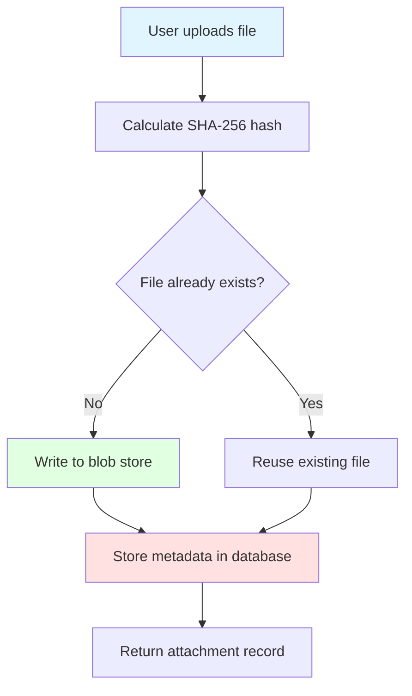
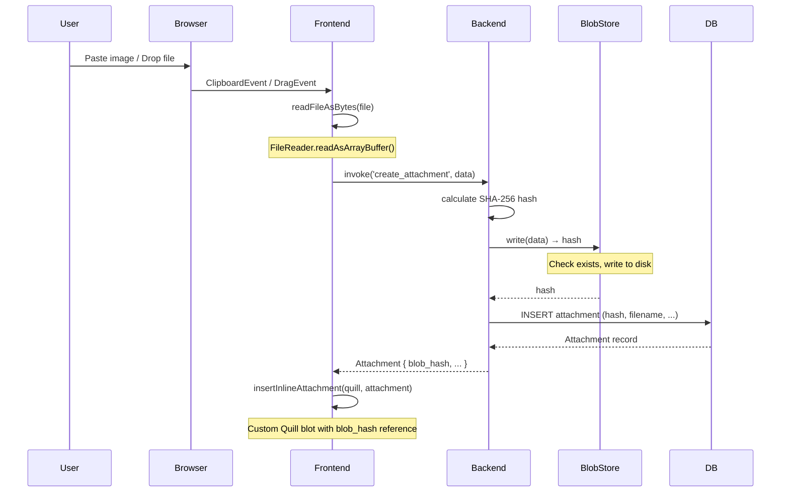

# Chapter 13: File Attachments

Notes without images are like books without illustrations—functional, but missing something. SwatNotes handles file attachments differently than most applications. Instead of storing files in the database as BLOBs, it uses **content-addressed storage** with SHA-256 hashing. This chapter explains why, how it works, and the complete file upload journey from browser to disk.

---

## The Problem with Database BLOBs

**Naive Approach**: Store files directly in SQLite as BLOB columns.

```sql
CREATE TABLE attachments (
  id TEXT PRIMARY KEY,
  note_id TEXT,
  filename TEXT,
  data BLOB  -- ❌ Entire file stored here
);
```

**Problems:**

1. **Database bloat**: 10 MB image = 10 MB added to database file
2. **Backup slowness**: Every backup copies ALL file data, even unchanged files
3. **Performance**: Large BLOBs slow down queries (even unrelated ones)
4. **Deduplication impossible**: Same image attached twice = stored twice

**Mental Model**: Storing files in the database is like keeping groceries in your wallet. It works, but wallets aren't designed for bananas.

---

## Content-Addressed Storage

SwatNotes uses **content-addressed storage**:
- Files are stored by their **SHA-256 hash** (not filename)
- Identical files have identical hashes (automatic deduplication)
- Database stores metadata only (hash, filename, size)

### Architecture



**Data Flow:**

1. **Frontend** → Reads file as bytes (`FileReader` API)
2. **Backend** → Calculates SHA-256 hash
3. **Blob Store** → Writes file to `blobs/ab/cd/abcd1234...` (if not exists)
4. **Database** → Stores metadata row (id, note_id, blob_hash, filename, size)
5. **Frontend** → Receives attachment record with `blob_hash`

---

## Blob Store Implementation

### Directory Structure

```
app_data/
└── blobs/
    ├── ab/
    │   ├── cd/
    │   │   └── abcd1234ef5678901234567890abcdef... (64-char hash)
    │   └── ef/
    │       └── abef9876543210abcdef...
    ├── 12/
    │   └── 34/
    │       └── 123456789abcdef...
    └── ff/
        └── ee/
            └── ffee...
```

**Two-Level Sharding**: First 2 characters → Second 2 characters → Full hash

**Why shard?**
- Many filesystems slow down with >10,000 files in one directory
- Two levels = 256 × 256 = 65,536 directories max
- Each directory holds fewer files (faster lookups)

**Example**: Hash `abcd1234ef...` → stored at `blobs/ab/cd/abcd1234ef...`

### Rust Implementation

```rust
// src-tauri/src/storage/blob_store.rs

use sha2::{Digest, Sha256};
use std::path::PathBuf;
use tokio::fs;

#[derive(Clone)]
pub struct BlobStore {
    root: PathBuf,
}

impl BlobStore {
    pub fn new(root: PathBuf) -> Self {
        Self { root }
    }

    /// Write data to blob store, returns SHA-256 hash
    pub async fn write(&self, data: &[u8]) -> Result<String> {
        // Calculate hash
        let hash = self.calculate_hash(data);

        // Check if already exists (deduplication)
        if self.exists(&hash).await? {
            tracing::debug!("Blob already exists: {}", hash);
            return Ok(hash);
        }

        // Get path for this hash
        let path = self.get_path(&hash);

        // Create parent directories
        if let Some(parent) = path.parent() {
            fs::create_dir_all(parent).await?;
        }

        // Write to temp file first (atomic write)
        let temp_path = path.with_extension("tmp");
        let mut file = fs::File::create(&temp_path).await?;
        file.write_all(data).await?;
        file.sync_all().await?;

        // Rename to final location (atomic on most filesystems)
        fs::rename(temp_path, &path).await?;

        tracing::debug!("Wrote blob: {} ({} bytes)", hash, data.len());
        Ok(hash)
    }

    /// Read data from blob store
    pub async fn read(&self, hash: &str) -> Result<Vec<u8>> {
        let path = self.get_path(hash);

        if !path.exists() {
            return Err(AppError::BlobStore(format!("Blob not found: {}", hash)));
        }

        let mut file = fs::File::open(&path).await?;
        let mut data = Vec::new();
        file.read_to_end(&mut data).await?;

        Ok(data)
    }

    /// Get file path for a hash
    fn get_path(&self, hash: &str) -> PathBuf {
        // Two-level directory structure: blobs/ab/cd/abcd1234...
        let prefix1 = &hash[0..2];
        let prefix2 = &hash[2..4];
        self.root.join(prefix1).join(prefix2).join(hash)
    }

    /// Calculate SHA-256 hash of data
    fn calculate_hash(&self, data: &[u8]) -> String {
        let mut hasher = Sha256::new();
        hasher.update(data);
        format!("{:x}", hasher.finalize())
    }

    /// Check if a blob exists
    pub async fn exists(&self, hash: &str) -> Result<bool> {
        let path = self.get_path(hash);
        Ok(path.exists())
    }
}
```

**Key Patterns:**

1. **Deduplication**: Check `exists()` before writing
2. **Atomic writes**: Write to `.tmp` file, then rename (prevents corruption if process crashes)
3. **Hash-based addressing**: Same content = same hash = same file

### Atomic Write Pattern

```
Write flow:
1. Create blobs/ab/cd/abcd1234.tmp  (temporary file)
2. Write all data
3. Sync to disk (fsync)
4. Rename to blobs/ab/cd/abcd1234   (atomic operation)
```

**Why atomic?**
- If power fails during step 2, only `.tmp` file is corrupted (not the real file)
- Rename is atomic on most filesystems (either fully succeeds or fully fails)
- No partial/corrupted files in blob store

**Mental Model**: Atomic writes are like writing a letter in private, then dropping it in the mailbox all at once. No one sees a half-written letter.

---

## Database Schema

```sql
CREATE TABLE attachments (
    id TEXT PRIMARY KEY,
    note_id TEXT NOT NULL,
    blob_hash TEXT NOT NULL,     -- SHA-256 hash (64 hex chars)
    filename TEXT NOT NULL,       -- Original filename
    mime_type TEXT NOT NULL,      -- e.g., image/png, application/pdf
    size INTEGER NOT NULL,        -- Bytes
    created_at TEXT NOT NULL,
    FOREIGN KEY (note_id) REFERENCES notes(id) ON DELETE CASCADE
);
```

**Attachment Model (Rust):**

```rust
// src-tauri/src/database/models.rs

#[derive(Debug, Clone, Serialize, Deserialize, FromRow)]
pub struct Attachment {
    pub id: String,             // UUID
    pub note_id: String,         // Foreign key
    pub blob_hash: String,       // SHA-256 hash (links to file)
    pub filename: String,        // User-visible name
    pub mime_type: String,       // Content type
    pub size: i64,               // File size in bytes
    pub created_at: DateTime<Utc>,
}
```

**Key Insight**: The `blob_hash` is the **link** between database metadata and filesystem blob.

---

## Upload Flow: Frontend to Backend

### Complete Sequence



### Step 1: Reading File (Frontend)

```typescript
// src/utils/attachmentsApi.ts

export async function readFileAsBytes(file: File | Blob): Promise<Uint8Array> {
  return new Promise((resolve, reject) => {
    const reader = new FileReader();
    reader.onload = () => {
      resolve(new Uint8Array(reader.result as ArrayBuffer));
    };
    reader.onerror = reject;
    reader.readAsArrayBuffer(file);
  });
}
```

**FileReader API**:
- Asynchronous file reading in browser
- `readAsArrayBuffer()` returns binary data
- Wrap in Promise for async/await

### Step 2: Invoke Backend Command

```typescript
// src/utils/attachmentsApi.ts

export async function createAttachment(
  noteId: string,
  filename: string,
  mimeType: string,
  data: Uint8Array
): Promise<Attachment> {
  return await invoke('create_attachment', {
    noteId,
    filename,
    mimeType,
    data: Array.from(data), // Convert to array for JSON serialization
  });
}
```

**Why `Array.from(data)`?**
- Tauri serializes parameters to JSON
- Uint8Array isn't valid JSON (it's a typed array)
- `Array.from()` converts to plain array `[1, 2, 3, ...]`
- Backend receives `Vec<u8>` (automatically deserialized)

### Step 3: Backend Command

```rust
// src-tauri/src/commands/attachments.rs

#[tauri::command]
pub async fn create_attachment(
    state: State<'_, AppState>,
    note_id: String,
    filename: String,
    mime_type: String,
    data: Vec<u8>,
) -> Result<Attachment> {
    state
        .attachments_service
        .create_attachment(&note_id, &filename, &mime_type, &data)
        .await
}
```

**Thin handler**: Just delegates to service layer.

### Step 4: Service Layer (Business Logic)

```rust
// src-tauri/src/services/attachments.rs

const MAX_ATTACHMENT_SIZE: usize = 100 * 1024 * 1024; // 100 MB

impl AttachmentsService {
    pub async fn create_attachment(
        &self,
        note_id: &str,
        filename: &str,
        mime_type: &str,
        data: &[u8],
    ) -> Result<Attachment> {
        // 1. Validate file size
        if data.len() > MAX_ATTACHMENT_SIZE {
            return Err(AppError::Generic(format!(
                "File size ({} bytes) exceeds maximum allowed size (100 MB)",
                data.len()
            )));
        }

        // 2. Sanitize filename (prevent path traversal)
        let safe_filename = sanitize_filename(filename);

        // 3. Write to blob store (returns hash)
        let hash = self.blob_store.write(data).await?;

        // 4. Create attachment record in database
        let attachment = self
            .repo
            .create_attachment(note_id, &hash, &safe_filename, mime_type, data.len() as i64)
            .await?;

        tracing::info!("Attachment created: {}", attachment.id);
        Ok(attachment)
    }
}

/// Sanitize filename to prevent path traversal attacks
fn sanitize_filename(filename: &str) -> String {
    // Remove path separators and null bytes
    filename
        .chars()
        .filter(|c| *c != '/' && *c != '\\' && *c != '\0')
        .collect::<String>()
        .chars()
        .take(255) // Limit length
        .collect()
}
```

**Security: Path Traversal Prevention**

```rust
// ❌ DANGEROUS: Unsanitized filename
filename = "../../etc/passwd";
// Could be written outside blob store!

// ✅ SAFE: Sanitized
sanitize_filename("../../etc/passwd") → "..etcpasswd"
```

**Service Responsibilities:**

1. Validation (file size, filename safety)
2. Orchestration (blob store write → database insert)
3. Logging
4. Error handling

### Step 5: Repository (Database)

```rust
// src-tauri/src/database/repository.rs

pub async fn create_attachment(
    &self,
    note_id: &str,
    blob_hash: &str,
    filename: &str,
    mime_type: &str,
    size: i64,
) -> Result<Attachment> {
    let id = Uuid::new_v4().to_string();
    let now = Utc::now();

    let attachment = sqlx::query_as::<_, Attachment>(
        r#"
        INSERT INTO attachments (id, note_id, blob_hash, filename, mime_type, size, created_at)
        VALUES (?, ?, ?, ?, ?, ?, ?)
        RETURNING *
        "#,
    )
    .bind(&id)
    .bind(note_id)
    .bind(blob_hash)
    .bind(filename)
    .bind(mime_type)
    .bind(size)
    .bind(now)
    .fetch_one(&self.pool)
    .await?;

    Ok(attachment)
}
```

**RETURNING clause**: Get inserted row back in single query (no separate SELECT needed).

---

## Displaying Attachments: Custom Quill Blots

After uploading, we need to **display** attachments in the editor. Quill uses **blots** (custom content types).

### The Problem

```typescript
// ❌ BAD: Store base64 data URL in Delta
quill.insertEmbed(index, 'image', 'data:image/png;base64,iVBORw0KGgoAAAANS...');
// Bloats Delta JSON to megabytes!
// Doesn't persist after reload (data URL is gone)

// ✅ GOOD: Store blob hash reference
quill.insertEmbed(index, 'attachment-image', {
  blobHash: 'abcd1234...',
  filename: 'screenshot.png',
  mimeType: 'image/png'
});
// Lightweight Delta
// Loads image from blob store on page load
```

### Custom Blot: AttachmentImageBlot

```typescript
// src/utils/quillAttachmentBlots.ts

import Quill from 'quill';
import { getAttachmentData, createDataUrl } from './attachmentsApi';

const BlockEmbed = Quill.import('blots/block/embed') as any;

export class AttachmentImageBlot extends BlockEmbed {
  static blotName = 'attachment-image';
  static tagName = 'div';
  static className = 'ql-attachment-image';

  static create(value: AttachmentImageValue): HTMLElement {
    const node = super.create() as HTMLElement;
    
    // Store metadata in data attributes
    node.setAttribute('data-blob-hash', value.blobHash);
    node.setAttribute('data-mime-type', value.mimeType);
    node.setAttribute('data-filename', value.filename || '');
    node.setAttribute('contenteditable', 'false');

    // Create image element
    const img = document.createElement('img');
    img.alt = value.filename || 'Attached image';
    img.className = 'attachment-image';
    img.style.maxWidth = '100%';

    // Create loading placeholder
    const placeholder = document.createElement('div');
    placeholder.className = 'attachment-image-loading';
    placeholder.innerHTML = `
      <span class="loading loading-spinner loading-sm"></span>
      <span class="text-xs">Loading image...</span>
    `;
    node.appendChild(placeholder);

    // Load the image asynchronously
    AttachmentImageBlot.loadImage(node, img, value.blobHash, value.mimeType, placeholder);

    return node;
  }

  static async loadImage(
    node: HTMLElement,
    img: HTMLImageElement,
    blobHash: string,
    mimeType: string,
    placeholder: HTMLElement
  ): Promise<void> {
    try {
      // Fetch image data from backend
      const data = await getAttachmentData(blobHash);
      
      // Create object URL (blob URL)
      const url = createDataUrl(data, mimeType);
      img.src = url;

      img.onload = () => {
        placeholder.remove();
        node.appendChild(img);
      };

      img.onerror = () => {
        placeholder.innerHTML = '<span class="text-error">Failed to load image</span>';
      };
    } catch (error) {
      placeholder.innerHTML = '<span class="text-error">Failed to load image</span>';
    }
  }

  static value(node: HTMLElement): AttachmentImageValue {
    return {
      blobHash: node.getAttribute('data-blob-hash') || '',
      mimeType: node.getAttribute('data-mime-type') || '',
      filename: node.getAttribute('data-filename') || '',
    };
  }
}

export interface AttachmentImageValue {
  attachmentId: string;
  blobHash: string;
  mimeType: string;
  filename: string;
}

// Register blot with Quill
export function registerAttachmentBlots(): void {
  Quill.register('formats/attachment-image', AttachmentImageBlot);
  Quill.register('formats/attachment-file', AttachmentFileBlot);
}
```

**Blot Lifecycle:**

1. **`create(value)`**: Called when blot is inserted into Delta
   - Builds DOM structure
   - Stores metadata in `data-*` attributes
   - Starts async image load

2. **`loadImage()`**: Async function fetching image from backend
   - Shows loading spinner while fetching
   - Replaces placeholder with `` when loaded

3. **`value(node)`**: Extracts blot value from DOM (for saving back to Delta)
   - Reads `data-*` attributes
   - Returns object with blob hash (not image data!)

**Delta Storage:**

```json
{
  "ops": [
    { "insert": "Here's a screenshot:\n" },
    {
      "insert": {
        "attachment-image": {
          "blobHash": "abcd1234ef5678901234567890abcdef...",
          "mimeType": "image/png",
          "filename": "screenshot.png"
        }
      }
    },
    { "insert": "\n" }
  ]
}
```

**Size**: ~200 bytes (vs. megabytes for base64 data URL)

### Object URLs vs Data URLs

| Type | Format | Size | Lifetime |
|------|--------|------|----------|
| **Data URL** | `data:image/png;base64,iVBORw0...` | Megabytes | Permanent |
| **Object URL** | `blob:http://localhost/uuid` | ~50 bytes | Until revoked or page unload |

```typescript
// Create object URL from Uint8Array
export function createDataUrl(data: Uint8Array, mimeType: string): string {
  const blob = new Blob([data], { type: mimeType });
  return URL.createObjectURL(blob);  // Returns blob:http://... URL
}
```

**Object URLs** are temporary pointers to browser memory. They don't embed data in HTML (lightweight).

**When to revoke**: When blot is destroyed (cleanup):

```typescript
// Cleanup when removing image from editor
URL.revokeObjectURL(imageElement.src);
```

---

## Drag-and-Drop File Upload

### Frontend Event Handlers

```typescript
// src/components/noteEditor.ts

function setupAttachments(quill: Quill, note: Note): void {
  const editorElement = document.getElementById('note-editor');

  const dragOverHandler = (e: DragEvent) => {
    e.preventDefault();
    e.stopPropagation();
    editorElement?.classList.add('drag-over'); // Visual feedback
  };

  const dragLeaveHandler = (e: DragEvent) => {
    e.preventDefault();
    e.stopPropagation();
    editorElement?.classList.remove('drag-over');
  };

  const dropHandler = async (e: DragEvent) => {
    e.preventDefault();
    e.stopPropagation();
    editorElement?.classList.remove('drag-over');

    const files = e.dataTransfer?.files;
    if (!files || files.length === 0) return;

    for (const file of Array.from(files)) {
      await handleFileUpload(file);
    }
  };

  async function handleFileUpload(file: File): Promise<void> {
    const data = await readFileAsBytes(file);
    const attachment = await createAttachment(note.id, file.name, file.type, data);
    
    // Insert into editor
    insertInlineAttachment(quill, attachment);
  }

  // Attach event listeners
  editorElement?.addEventListener('dragover', dragOverHandler);
  editorElement?.addEventListener('dragleave', dragLeaveHandler);
  editorElement?.addEventListener('drop', dropHandler);
}
```

**Drag-and-Drop Flow:**

```
User drags file → dragover (add visual feedback)
User releases → drop (read file, upload, insert blot)
User moves away → dragleave (remove visual feedback)
```

**CSS for Visual Feedback:**

```css
.note-editor.drag-over {
  outline: 2px dashed oklch(var(--p));
  outline-offset: -2px;
  background-color: oklch(var(--p) / 0.05);
}
```

---

## Clipboard Paste: Images

```typescript
// src/components/noteEditor.ts

const pasteHandler = async (e: ClipboardEvent) => {
  const clipboardData = e.clipboardData || (window as any).clipboardData;
  const items = clipboardData.items;

  for (let i = 0; i < items.length; i++) {
    if (items[i].type.indexOf('image') !== -1) {
      e.preventDefault(); // Prevent default paste (would insert base64)
      
      const blob = items[i].getAsFile();
      if (blob) {
        const filename = `pasted-image-${Date.now()}.png`;
        const data = await readFileAsBytes(blob);
        const attachment = await createAttachment(note.id, filename, blob.type, data);
        
        insertInlineAttachment(quill, attachment);
      }
      break;
    }
  }
};

editorElement.addEventListener('paste', pasteHandler);
```

**Clipboard API:**

- `ClipboardEvent.clipboardData.items`: Array of clipboard items
- `items[i].type`: MIME type (`image/png`, `text/plain`, etc.)
- `items[i].getAsFile()`: Returns `File` object for binary data

**Why `e.preventDefault()`?**

Without it, Quill's default paste handler would insert the image as a base64 data URL:

```json
// ❌ Default Quill behavior
{
  "insert": {
    "image": "data:image/png;base64,iVBORw0KGgoAAAANSUhEUgAA..."
  }
}
```

With `preventDefault()`, we handle the paste manually and insert our custom blot.

---

## Inserting Attachments into Editor

```typescript
// src/utils/quillAttachmentBlots.ts

export function insertInlineAttachment(
  quill: Quill,
  attachment: {
    id: string;
    blob_hash: string;
    mime_type: string;
    filename: string;
    size: number;
  }
): void {
  const cursorPosition = quill.getSelection()?.index || quill.getLength();

  // Determine blot type based on MIME type
  if (attachment.mime_type.startsWith('image/')) {
    // Insert image blot
    quill.insertEmbed(cursorPosition, 'attachment-image', {
      attachmentId: attachment.id,
      blobHash: attachment.blob_hash,
      mimeType: attachment.mime_type,
      filename: attachment.filename,
    });
  } else {
    // Insert file chip blot (for PDFs, documents, etc.)
    quill.insertEmbed(cursorPosition, 'attachment-file', {
      attachmentId: attachment.id,
      blobHash: attachment.blob_hash,
      mimeType: attachment.mime_type,
      filename: attachment.filename,
      size: attachment.size,
    });
  }

  // Move cursor after inserted blot
  quill.setSelection(cursorPosition + 1);
}
```

**Image vs File Chips:**

- **Images** (`image/*`): Rendered as `` tags
- **Other files** (`application/pdf`, `text/plain`, etc.): Rendered as clickable chips

**File Chip Example:**

```html
<div class="attachment-file-chip">
  <svg><!-- File icon --></svg>
  <div>
    <p>report.pdf</p>
    <p class="text-xs">2.3 MB</p>
  </div>
  <button>Download</button>
</div>
```

---

## Deduplication in Action

**Scenario**: User uploads the same screenshot twice.

```typescript
// First upload
const attachment1 = await createAttachment(noteId, 'screenshot.png', 'image/png', data);
// Backend calculates hash: abcd1234...
// Writes to blobs/ab/cd/abcd1234...

// Second upload (same file)
const attachment2 = await createAttachment(noteId, 'screenshot.png', 'image/png', data);
// Backend calculates hash: abcd1234... (same!)
// blob_store.write() sees file already exists → returns hash immediately
// Creates new attachment record, but reuses existing blob
```

**Result:**

| Attachment ID | blob_hash | filename | Disk File |
|---------------|-----------|----------|-----------|
| uuid-1 | abcd1234... | screenshot.png | blobs/ab/cd/abcd1234... |
| uuid-2 | abcd1234... | screenshot.png | blobs/ab/cd/abcd1234... (same) |

**Disk Space**: 1× file size (not 2×)

---

## Reading Attachments

### Backend Command

```rust
// src-tauri/src/commands/attachments.rs

#[tauri::command]
pub async fn get_attachment_data(
    state: State<'_, AppState>,
    blob_hash: String,
) -> Result<Vec<u8>> {
    state
        .attachments_service
        .get_attachment_by_hash(&blob_hash)
        .await
}
```

### Service

```rust
// src-tauri/src/services/attachments.rs

pub async fn get_attachment_by_hash(&self, hash: &str) -> Result<Vec<u8>> {
    self.blob_store.read(hash).await
}
```

### Blob Store

```rust
// src-tauri/src/storage/blob_store.rs

pub async fn read(&self, hash: &str) -> Result<Vec<u8>> {
    let path = self.get_path(hash);

    if !path.exists() {
        return Err(AppError::BlobStore(format!("Blob not found: {}", hash)));
    }

    let mut file = fs::File::open(&path).await?;
    let mut data = Vec::new();
    file.read_to_end(&mut data).await?;

    Ok(data)
}
```

**Simple read**: Hash → path → read file → return bytes.

---

## Deleting Attachments

### Frontend

```typescript
await deleteAttachment(attachmentId);
await loadAttachments(); // Refresh list
```

### Backend

```rust
// src-tauri/src/services/attachments.rs

pub async fn delete_attachment(&self, attachment_id: &str) -> Result<()> {
    tracing::info!("Deleting attachment: {}", attachment_id);

    // Get blob hash before deleting
    let _blob_hash = self.repo.delete_attachment(attachment_id).await?;

    // Note: We don't delete the blob file (for simplicity)
    // Garbage collection is future work
    // (Need to check if blob is still referenced by other attachments)

    Ok(())
}
```

### Repository

```rust
// src-tauri/src/database/repository.rs

pub async fn delete_attachment(&self, id: &str) -> Result<String> {
    // Get blob hash before deleting
    let blob_hash: String =
        sqlx::query_scalar("SELECT blob_hash FROM attachments WHERE id = ?")
            .bind(id)
            .fetch_optional(&self.pool)
            .await?
            .ok_or_else(|| AppError::Generic("Attachment not found".to_string()))?;

    // Delete attachment record
    sqlx::query("DELETE FROM attachments WHERE id = ?")
        .bind(id)
        .execute(&self.pool)
        .await?;

    Ok(blob_hash)
}
```

**Garbage Collection** (not implemented):

To properly delete blobs, we'd need to:
1. Check if `blob_hash` is referenced by any other attachments
2. If not, delete the file from blob store
3. This requires a reference counting system

**Current Approach**: Keep blobs even if unreferenced (disk space trade-off for simplicity).

---

## Testing Attachment Upload

### Manual Test

1. **Open SwatNotes**
2. **Create a new note**
3. **Drag an image into the editor**
4. **Verify:**
   - Loading spinner appears
   - Image loads and displays
   - File appears in blob store (`app_data/blobs/...`)
   - Attachment metadata in database:
     ```sql
     SELECT * FROM attachments WHERE note_id = '...';
     ```

5. **Paste image from clipboard** (screenshot)
6. **Verify:** Same as drag-and-drop

7. **Close and reopen note**
8. **Verify:** Images still load (from blob store via blob_hash)

### E2E Test (WebdriverIO)

```typescript
// e2e/attachments.spec.ts

describe('Attachments', () => {
  it('should upload image via drag-and-drop', async () => {
    // Create note
    await createTestNote('Attachment Test');

    // Drag file into editor
    const filePath = path.join(__dirname, 'fixtures', 'test-image.png');
    const editor = await $('#note-editor');
    
    // Simulate drag-and-drop
    await browser.execute((el, file) => {
      const dataTransfer = new DataTransfer();
      const blob = new Blob([file], { type: 'image/png' });
      dataTransfer.items.add(new File([blob], 'test-image.png'));
      
      const dropEvent = new DragEvent('drop', {
        dataTransfer,
        bubbles: true,
      });
      el.dispatchEvent(dropEvent);
    }, editor, fs.readFileSync(filePath));

    // Wait for image to appear
    await browser.waitUntil(async () => {
      const img = await $('img.attachment-image');
      return await img.isDisplayed();
    });

    // Verify image loaded
    const img = await $('img.attachment-image');
    expect(await img.getAttribute('src')).toContain('blob:');
  });
});
```

---

## Common Mistakes

### Mistake 1: Storing Base64 in Delta

```typescript
// ❌ BAD: Base64 data URL
const base64 = await fileToBase64(file);
quill.insertEmbed(index, 'image', base64);
// Delta JSON becomes megabytes!
// Doesn't persist (data URL lost on reload)

// ✅ GOOD: Blob hash reference
const attachment = await createAttachment(...);
insertInlineAttachment(quill, attachment);
// Delta stays small
// Persists via blob store
```

### Mistake 2: Not Preventing Default Paste

```typescript
// ❌ BAD: Missing preventDefault
document.addEventListener('paste', (e) => {
  const blob = e.clipboardData.items[0].getAsFile();
  uploadFile(blob);
  // Default paste still happens → base64 inserted!
});

// ✅ GOOD: Prevent default
document.addEventListener('paste', (e) => {
  if (hasImage(e)) {
    e.preventDefault(); // Stop default paste
    const blob = e.clipboardData.items[0].getAsFile();
    uploadFile(blob);
  }
});
```

### Mistake 3: Not Sanitizing Filenames

```rust
// ❌ BAD: Unsanitized filename
let path = format!("{}/{}", blob_dir, filename);
// filename = "../../etc/passwd" → path traversal!

// ✅ GOOD: Sanitized
fn sanitize_filename(name: &str) -> String {
    name.chars()
        .filter(|c| !matches!(c, '/' | '\\' | '\0' | ':'))
        .collect()
}
```

### Mistake 4: Forgetting to Revoke Object URLs

```typescript
// ❌ BAD: Memory leak
const url = URL.createObjectURL(blob);
img.src = url;
// URL never revoked → blob stays in memory

// ✅ GOOD: Revoke when done
const url = URL.createObjectURL(blob);
img.src = url;

// Later, when removing image:
URL.revokeObjectURL(url);
```

---

## Performance Considerations

### 1. Lazy Loading Images

```typescript
// Don't load all images immediately when opening note
// Load as they become visible in viewport

const observer = new IntersectionObserver((entries) => {
  entries.forEach(entry => {
    if (entry.isIntersecting) {
      const img = entry.target as HTMLImageElement;
      loadImage(img); // Fetch from backend
      observer.unobserve(img);
    }
  });
});

document.querySelectorAll('img.attachment-image').forEach(img => {
  observer.observe(img);
});
```

### 2. Parallel Uploads

```typescript
// ❌ BAD: Sequential uploads
for (const file of files) {
  await uploadFile(file); // Wait for each
}

// ✅ GOOD: Parallel uploads
await Promise.all(files.map(file => uploadFile(file)));
```

### 3. Chunked Uploads (for large files)

```typescript
// For files >10 MB, upload in chunks
async function uploadLargeFile(file: File): Promise<void> {
  const CHUNK_SIZE = 5 * 1024 * 1024; // 5 MB chunks
  const chunks = Math.ceil(file.size / CHUNK_SIZE);

  for (let i = 0; i < chunks; i++) {
    const start = i * CHUNK_SIZE;
    const end = Math.min(start + CHUNK_SIZE, file.size);
    const chunk = file.slice(start, end);
    
    await invoke('upload_chunk', {
      uploadId: file.name,
      chunkIndex: i,
      totalChunks: chunks,
      data: await readFileAsBytes(chunk),
    });
  }
}
```

(Not implemented in SwatNotes, but useful for very large files)

---

## Security Considerations

### 1. File Size Limits

```rust
// src-tauri/src/services/attachments.rs

const MAX_ATTACHMENT_SIZE: usize = 100 * 1024 * 1024; // 100 MB

if data.len() > MAX_ATTACHMENT_SIZE {
    return Err(AppError::Generic("File too large".to_string()));
}
```

**Why limit?**
- Prevent disk exhaustion
- Prevent DoS attacks (upload 1 GB files repeatedly)
- Keep app responsive (large uploads freeze UI)

### 2. MIME Type Validation

```rust
// Validate MIME type matches file content
use infer; // crate for detecting MIME from magic bytes

let detected_mime = infer::get(data)
    .map(|t| t.mime_type())
    .unwrap_or("application/octet-stream");

if detected_mime != claimed_mime_type {
    tracing::warn!("MIME mismatch: claimed {}, detected {}", claimed_mime_type, detected_mime);
    // Optionally reject or use detected type
}
```

**Why validate?**
- User uploads `malware.exe` renamed to `photo.jpg`
- Claimed MIME: `image/jpeg`, actual: `application/x-executable`
- Validation prevents displaying as image

### 3. Path Traversal Prevention

```rust
fn sanitize_filename(name: &str) -> String {
    name.chars()
        .filter(|c| !matches!(c, '/' | '\\' | '\0' | ':' | '<' | '>' | '|' | '*' | '?'))
        .take(255) // Max filename length
        .collect()
}
```

**Attack**: Upload filename `../../.ssh/authorized_keys`

**Result without sanitization**: File written to `~/.ssh/authorized_keys` (SSH compromise!)

**Result with sanitization**: Filename becomes `sshauthorized_keys` (harmless)

---

## Key Takeaways

1. **Content-addressed storage**: Files stored by SHA-256 hash, not filename
   - Automatic deduplication (same content = same hash)
   - Database stores metadata only

2. **Two-level directory sharding**: `blobs/ab/cd/abcd1234...`
   - Prevents filesystem slowdown with many files
   - 65,536 possible directories

3. **Atomic writes**: Write to `.tmp`, then rename
   - Prevents corruption if process crashes
   - Either fully succeeds or fully fails

4. **Custom Quill blots**: Store blob hash, not image data
   - Lightweight Delta JSON (<1 KB vs. MB)
   - Images load async from blob store

5. **Object URLs vs Data URLs**: Use object URLs for temp image display
   - `blob:http://...` (50 bytes) vs. `data:image/png;base64,...` (MB)
   - Revoke when done to free memory

6. **Drag-and-drop**: Handle `dragover`, `dragleave`, `drop` events
   - Provide visual feedback
   - Prevent default to avoid base64 insertion

7. **Clipboard paste**: Intercept paste events for images
   - `e.preventDefault()` to stop default behavior
   - Upload as attachment, insert custom blot

8. **Security**: Sanitize filenames, validate file size, check MIME types
   - Prevent path traversal attacks
   - Prevent disk exhaustion
   - Detect file type mismatches

9. **Deduplication**: Same file uploaded twice = stored once
   - Blob store checks existence before writing
   - Multiple attachment records can reference same blob

10. **Garbage collection**: Not implemented (future work)
    - Blobs remain even if no attachments reference them
    - Would require reference counting system

---

## What's Next?

In **Chapter 14: Encryption Fundamentals**, we'll explore:
- AES-256-GCM encryption for backup files
- Argon2id key derivation from passwords
- Nonce generation and IV management
- Encrypt/decrypt flow for protecting user data
- Key storage in Windows Credential Manager

We'll see how SwatNotes protects sensitive data at rest with industry-standard cryptography.
