# Chapter 14: Encryption Fundamentals

Notes are personal. Backups leave your computer. Without encryption, anyone with access to your backup file can read everything. SwatNotes uses **AES-256-GCM** encryption with **Argon2id** key derivation to protect backup files. This chapter explains how modern encryption works, why these specific algorithms were chosen, and the complete encrypt/decrypt journey.

---

## The Threat Model

**Scenario**: You create a backup and store it on:
- USB drive (could be lost or stolen)
- Cloud storage (Dropbox, Google Drive, OneDrive)
- Network share (accessible to other users)

**Without encryption:**
- Anyone with the file can read your notes
- Database is SQLite (plain text, easily opened)
- Attachments are unencrypted blobs

**With encryption:**
- File is unreadable without password
- Backup is just random-looking bytes
- Only someone with the correct password can decrypt

**Mental Model**: Encryption is like putting your backup in a safe. The file exists, but it's useless without the combination.

---

## Encryption Overview

SwatNotes uses **authenticated encryption** with two layers:

1. **Key Derivation**: Password → 256-bit encryption key (using Argon2id)
2. **Encryption**: Plaintext → Ciphertext (using AES-256-GCM)


**Complete Flow:**

```
User's password: "backup_password_2026"
        ↓
Argon2id (password + random salt) → 256-bit key
        ↓
AES-256-GCM (plaintext + key + random nonce) → ciphertext
        ↓
Store: {salt, nonce, ciphertext}
```

---

## AES-256-GCM: Authenticated Encryption

### What is AES?

**AES** (Advanced Encryption Standard) is a **symmetric cipher**:
- Same key encrypts and decrypts
- Block cipher: processes data in 128-bit (16-byte) blocks
- **256** refers to key size: 256 bits = 32 bytes

### What is GCM?

**GCM** (Galois/Counter Mode) is an **authenticated encryption mode**:
- **Encryption**: Converts plaintext to ciphertext
- **Authentication**: Generates authentication tag (proves data wasn't tampered)
- **Counter mode**: Turns block cipher into stream cipher (can encrypt any length)

### Why GCM?

```rust
// ❌ Without authentication (CBC mode)
// Attacker can flip bits in ciphertext
// Decryption succeeds but produces garbage
// App might process corrupted data

// ✅ With authentication (GCM mode)
// Attacker flips bits in ciphertext
// Decryption FAILS (authentication tag doesn't match)
// App never sees corrupted data
```

**GCM provides:**
1. **Confidentiality**: Can't read plaintext without key
2. **Integrity**: Can't modify ciphertext without detection
3. **Authenticity**: Proves ciphertext was created by someone with the key

**Mental Model**: GCM is like a tamper-evident seal on medication. If someone opens or modifies it, you know immediately.

### Nonce (Number Used Once)

```rust
// Generate random 96-bit (12-byte) nonce
let mut nonce_bytes = vec![0u8; 12];
OsRng.fill_bytes(&mut nonce_bytes);
```

**Why nonces?**
- Encrypting same plaintext with same key produces **different ciphertext** each time
- Prevents pattern analysis (attacker can't tell if two backups are identical)
- CRITICAL: Never reuse nonce with same key (breaks security completely)

**Example:**

| Encryption | Plaintext | Key | Nonce | Ciphertext |
|------------|-----------|-----|-------|------------|
| 1st | "Hello" | key123 | nonce_A | `3f8a9b2c...` |
| 2nd | "Hello" | key123 | nonce_B | `7d4e1f5a...` (different!) |

---

## Argon2id: Password-Based Key Derivation

### The Problem with Direct Password Use

```rust
// ❌ BAD: Use password directly as encryption key
let key = password.as_bytes(); // "password" = 8 bytes
// AES-256 needs 32 bytes!
// Also: weak password = weak key
// Also: same password = same key (no salt)

// ✅ GOOD: Derive key from password
let key = argon2_hash(password, salt); // Always 32 bytes
```

### What is Argon2?

**Argon2id** is a **password hashing function** (PHF):
- Winner of Password Hashing Competition (2015)
- Designed to be **slow** and **memory-hard**
- Prevents brute-force attacks and GPU cracking

**Three variants:**
- **Argon2d**: Faster, but vulnerable to side-channel attacks
- **Argon2i**: Resistant to side-channel, but slower
- **Argon2id**: Hybrid (best of both) ← SwatNotes uses this

### How Argon2id Works

```rust
fn derive_key(password: &str, salt: &[u8]) -> Vec<u8> {
    let argon2 = Argon2::default();
    
    // Hash password with salt
    let password_hash = argon2.hash_password(password.as_bytes(), &salt_string)?;
    
    // Extract first 32 bytes for AES-256
    let key_bytes = password_hash.hash.as_bytes();
    key_bytes[..32].to_vec()
}
```

**Parameters** (defaults in SwatNotes):
- **Time cost**: Number of iterations (more = slower = more secure)
- **Memory cost**: KB of RAM required (more = harder to parallelize on GPUs)
- **Parallelism**: Number of threads

**Why slow is good:**

| Attack Type | Iterations | Time per Password |
|-------------|----------|-------------------|
| Attacker (brute force) | 1 million | 1,000,000 × 100ms = 27 hours |
| Legitimate user | 1 attempt | 1 × 100ms = instant |

**Mental Model**: Argon2id is like a time-lock safe. It takes 100ms to open even with the correct combination. A thief trying 1 million combinations takes forever.

### Salt: Preventing Rainbow Tables

```rust
// Generate random 128-bit salt
let mut salt = vec![0u8; 16];
OsRng.fill_bytes(&mut salt);
```

**Without salt:**
```
password "backup123" → hash abc123 (always)
Attacker precomputes hashes for common passwords (rainbow table)
Looks up "abc123" → finds "backup123"
```

**With salt:**
```
password "backup123" + salt_A → hash xyz789
password "backup123" + salt_B → hash mno456
Different salts = different hashes
Rainbow tables are useless (attacker must brute-force for each unique salt)
```

**Important**: Salt is **not secret**. It's stored alongside ciphertext. Its purpose is uniqueness, not secrecy.

---

## Encryption Implementation

### Rust Code (Backend)

```rust
// src-tauri/src/crypto.rs

use aes_gcm::{
    aead::{Aead, KeyInit, OsRng},
    Aes256Gcm, Nonce,
};
use argon2::{Argon2, PasswordHasher};
use rand::RngCore;

const NONCE_SIZE: usize = 12; // 96 bits
const SALT_SIZE: usize = 16; // 128 bits

/// Container for encrypted data
#[derive(Debug, Serialize, Deserialize)]
pub struct EncryptedData {
    pub salt: Vec<u8>,        // Random salt for key derivation
    pub nonce: Vec<u8>,       // Random nonce for GCM
    pub ciphertext: Vec<u8>,  // Encrypted data + auth tag
}

/// Encrypt data with AES-256-GCM
pub fn encrypt(plaintext: &[u8], password: &str) -> Result<EncryptedData> {
    // 1. Generate random salt
    let mut salt = vec![0u8; SALT_SIZE];
    OsRng.fill_bytes(&mut salt);

    // 2. Derive 256-bit key from password
    let key = derive_key(password, &salt)?;

    // 3. Generate random nonce
    let mut nonce_bytes = vec![0u8; NONCE_SIZE];
    OsRng.fill_bytes(&mut nonce_bytes);
    let nonce = Nonce::from_slice(&nonce_bytes);

    // 4. Create cipher instance
    let cipher = Aes256Gcm::new_from_slice(&key)
        .map_err(|e| AppError::Generic(format!("Cipher init failed: {}", e)))?;

    // 5. Encrypt (produces ciphertext + authentication tag)
    let ciphertext = cipher
        .encrypt(nonce, plaintext)
        .map_err(|e| AppError::Generic(format!("Encryption failed: {}", e)))?;

    Ok(EncryptedData {
        salt,
        nonce: nonce_bytes,
        ciphertext,
    })
}

/// Decrypt data with AES-256-GCM
pub fn decrypt(encrypted: &EncryptedData, password: &str) -> Result<Vec<u8>> {
    // 1. Derive key from password + stored salt
    let key = derive_key(password, &encrypted.salt)?;

    // 2. Reconstruct nonce
    let nonce = Nonce::from_slice(&encrypted.nonce);

    // 3. Create cipher instance
    let cipher = Aes256Gcm::new_from_slice(&key)
        .map_err(|e| AppError::Generic(format!("Cipher init failed: {}", e)))?;

    // 4. Decrypt and verify authentication tag
    let plaintext = cipher
        .decrypt(nonce, encrypted.ciphertext.as_ref())
        .map_err(|e| AppError::Generic(format!("Decryption failed: {}", e)))?;
    // Note: If auth tag doesn't match, this returns Err

    Ok(plaintext)
}

/// Derive 256-bit key from password using Argon2id
fn derive_key(password: &str, salt: &[u8]) -> Result<Vec<u8>> {
    let argon2 = Argon2::default();

    // Convert salt to required format
    let salt_string = SaltString::encode_b64(salt)
        .map_err(|e| AppError::Generic(format!("Salt encoding failed: {}", e)))?;

    // Hash password with salt
    let password_hash = argon2
        .hash_password(password.as_bytes(), &salt_string)
        .map_err(|e| AppError::Generic(format!("Key derivation failed: {}", e)))?;

    // Extract hash bytes
    let hash = password_hash
        .hash
        .ok_or_else(|| AppError::Generic("No hash generated".to_string()))?;

    let key_bytes = hash.as_bytes();
    if key_bytes.len() < 32 {
        return Err(AppError::Generic("Derived key too short".to_string()));
    }

    // Return first 32 bytes (256 bits) for AES-256
    Ok(key_bytes[..32].to_vec())
}
```

**Key Steps:**

1. **Generate random salt** (128 bits)
2. **Derive key** from password + salt using Argon2id → 256-bit key
3. **Generate random nonce** (96 bits)
4. **Encrypt** plaintext with AES-256-GCM → ciphertext + auth tag
5. **Return** `{salt, nonce, ciphertext}` (all needed for decryption)

---

## Backup Encryption Flow

### Creating Encrypted Backup

```mermaid
sequenceDiagram
    participant User
    participant Frontend
    participant BackupService
    participant Crypto
    participant Disk
    
    User->>Frontend: Click "Create Backup", enter password
    Frontend->>BackupService: create_backup(password)
    BackupService->>BackupService: Build ZIP (db.sqlite + blobs)
    Note over BackupService: ZIP file in memory
    BackupService->>Crypto: encrypt(zip_data, password)
    Crypto->>Crypto: Generate random salt (128-bit)
    Crypto->>Crypto: derive_key(password, salt) → key
    Crypto->>Crypto: Generate random nonce (96-bit)
    Crypto->>Crypto: AES-256-GCM encrypt
    Crypto-->>BackupService: {salt, nonce, ciphertext}
    BackupService->>BackupService: Serialize to JSON
    BackupService->>Disk: Write backup_20260128.enc
    BackupService->>BackupService: Record metadata in DB
    BackupService-->>Frontend: Backup path
    Frontend-->>User: "Backup created successfully"
```



### Backend Code

```rust
// src-tauri/src/services/backup.rs

pub async fn create_backup(&self, password: &str) -> Result<PathBuf> {
    tracing::info!("Creating encrypted backup");

    // 1. Build ZIP file with database + blobs
    let zip_data = self.create_zip_archive().await?;

    // 2. Encrypt the ZIP data
    let encrypted = crypto::encrypt(&zip_data, password)?;

    // 3. Serialize encrypted data to JSON
    let encrypted_json = serde_json::to_vec(&encrypted)?;

    // 4. Write to backup file
    let backup_path = self.get_backup_path()?;
    fs::write(&backup_path, &encrypted_json).await?;

    // 5. Record in database
    self.repo.record_backup(&backup_path, size, &manifest_hash).await?;

    Ok(backup_path)
}
```

**File Structure:**

```json
{
  "salt": [123, 45, 67, 89, ...], // 16 bytes
  "nonce": [234, 56, 78, 90, ...], // 12 bytes
  "ciphertext": [111, 222, 333, ...] // Encrypted ZIP + 16-byte auth tag
}
```

**File Extension**: `.enc` (indicates encrypted file)

---

## Decryption Flow

### Restoring from Encrypted Backup


### Backend Code

```rust
// src-tauri/src/services/backup.rs

pub async fn restore_backup(&self, backup_path: &Path, password: &str) -> Result<()> {
    tracing::info!("Restoring from backup: {:?}", backup_path);

    // 1. Read encrypted backup file
    let encrypted_data = fs::read(backup_path).await?;

    // 2. Deserialize JSON to EncryptedData
    let encrypted: crypto::EncryptedData = serde_json::from_slice(&encrypted_data)
        .map_err(|e| AppError::Restore(format!("Invalid backup format: {}", e)))?;

    // 3. Decrypt (will fail if wrong password or tampered)
    let zip_data = crypto::decrypt(&encrypted, password)?;

    // 4. Extract ZIP to temp directory
    let temp_dir = self.extract_zip_to_temp(&zip_data).await?;

    // 5. Verify checksums from manifest
    self.verify_backup_integrity(&temp_dir).await?;

    // 6. Atomic swap (close DB, replace files, reopen DB)
    self.perform_atomic_restore(&temp_dir).await?;

    Ok(())
}
```

---

## Security Properties

### 1. Authenticated Encryption

```rust
// Scenario: Attacker modifies ciphertext
let mut encrypted = crypto::encrypt(b"Secret data", "password")?;
encrypted.ciphertext[0] ^= 0xFF; // Flip bits

// Decryption FAILS (authentication tag doesn't match)
let result = crypto::decrypt(&encrypted, "password");
assert!(result.is_err()); // ✅ Tampering detected
```

**Without authentication:**
- Attacker modifies ciphertext
- Decryption produces garbage
- App might crash or process corrupted data

**With GCM authentication:**
- Attacker modifies ciphertext
- Decryption fails immediately
- App never sees corrupted data

### 2. Password Strength Doesn't Weaken Key

```rust
// Weak password
let encrypted = crypto::encrypt(data, "123")?;
// Still uses 256-bit key derived with Argon2id
// Attacker must brute-force password (slow due to Argon2id)

// Strong password
let encrypted = crypto::encrypt(data, "xK9$mP2@qL7#nB4")?;
// Also 256-bit key, but much harder to brute-force
```

**Key insight**: Argon2id always produces 256-bit key, but weak passwords are easier to guess.

### 3. Salt Prevents Precomputation

```rust
// Two users, same password
let enc1 = crypto::encrypt(data, "password123")?; // salt_A
let enc2 = crypto::encrypt(data, "password123")?; // salt_B

assert_ne!(enc1.salt, enc2.salt); // Different salts
assert_ne!(enc1.ciphertext, enc2.ciphertext); // Different ciphertexts
```

**Without salt:**
- Attacker precomputes hashes for common passwords
- Rainbow table: "password123" → key_XYZ
- Instant crack

**With salt:**
- Each backup has unique salt
- Attacker must brute-force each backup individually
- Rainbow tables are useless

### 4. Nonce Prevents Pattern Analysis

```rust
// Encrypt same data twice
let enc1 = crypto::encrypt(b"Same plaintext", "password")?;
let enc2 = crypto::encrypt(b"Same plaintext", "password")?;

assert_ne!(enc1.nonce, enc2.nonce); // Different nonces
assert_ne!(enc1.ciphertext, enc2.ciphertext); // Different ciphertexts
```

**Why this matters:**
- Attacker can't tell if two backups contain identical data
- Prevents frequency analysis (counting how often data appears)

---

## Frontend Integration

### TypeScript API Wrapper

```typescript
// src/utils/backupApi.ts

/**
 * Create encrypted backup
 * @param password - Password to encrypt the backup
 * @returns Promise resolving to backup file path
 */
export async function createBackup(password: string): Promise<string> {
  return await invoke('create_backup', { password });
}

/**
 * Restore from encrypted backup
 * @param backupPath - Path to the backup file
 * @param password - Password to decrypt the backup
 */
export async function restoreBackup(
  backupPath: string,
  password: string
): Promise<void> {
  return await invoke('restore_backup', { backupPath, password });
}
```

### UI Flow

```typescript
// Create backup
const password = await promptForPassword("Enter backup password:");
if (!password) return;

try {
  const backupPath = await createBackup(password);
  showSuccess(`Backup created: ${backupPath}`);
} catch (error) {
  showError(`Backup failed: ${error}`);
}
```

**Password Input Best Practices:**
- Use `<input type="password">` (hides characters)
- Confirm password on creation: "Enter password" → "Confirm password"
- Show password strength indicator (weak/medium/strong)
- Don't enforce complex requirements (passphrase is better than "P@ssw0rd!")

---

## Common Mistakes

### Mistake 1: Using Password Directly as Key

```rust
// ❌ BAD: Password as encryption key
let key = password.as_bytes();
let cipher = Aes256Gcm::new_from_slice(key)?; // FAILS if password != 32 bytes
// Also: weak password = weak key
// Also: no salt = rainbow table vulnerable

// ✅ GOOD: Derive key with Argon2id
let key = derive_key(password, &salt)?; // Always 32 bytes
```

### Mistake 2: Reusing Nonce

```rust
// ❌ BAD: Hardcoded nonce
let nonce = Nonce::from_slice(b"always_same!");
cipher.encrypt(nonce, plaintext)?; // Security BROKEN
// Same nonce + same key = attacker can XOR ciphertexts to get plaintext XOR

// ✅ GOOD: Random nonce each time
let mut nonce_bytes = vec![0u8; 12];
OsRng.fill_bytes(&mut nonce_bytes);
```

### Mistake 3: Not Verifying Authentication Tag

```rust
// ❌ BAD: Use CBC mode (no authentication)
// Attacker modifies ciphertext → decrypts to garbage → app crashes

// ✅ GOOD: Use GCM mode (authenticated)
cipher.decrypt(nonce, ciphertext)?; // Fails if tampered
```

### Mistake 4: Storing Password in Code

```rust
// ❌ BAD: Hardcoded password
const BACKUP_PASSWORD: &str = "super_secret_123";
encrypt(data, BACKUP_PASSWORD)?; // Security BROKEN
// Password is in source code → anyone can read backups

// ✅ GOOD: User-provided password
let password = prompt_user_for_password()?;
encrypt(data, &password)?;
```

### Mistake 5: Using ECB Mode

```rust
// ❌ BAD: ECB mode (Electronic Codebook)
// Same plaintext block → same ciphertext block
// Creates visible patterns (ECB penguin meme)

// ✅ GOOD: GCM mode (counter-based)
// Encrypts each block with different counter value
```

---

## Testing Encryption

### Unit Tests

```rust
// src-tauri/src/crypto.rs (tests module)

#[test]
fn test_encrypt_decrypt() {
    let plaintext = b"Hello, World!";
    let password = "test_password";

    let encrypted = encrypt(plaintext, password).unwrap();
    let decrypted = decrypt(&encrypted, password).unwrap();

    assert_eq!(plaintext, decrypted.as_slice());
}

#[test]
fn test_wrong_password() {
    let plaintext = b"Secret";
    let encrypted = encrypt(plaintext, "correct").unwrap();

    let result = decrypt(&encrypted, "wrong");
    assert!(result.is_err()); // Should fail
}

#[test]
fn test_different_salts() {
    let password = "password";
    let plaintext = b"Data";

    let enc1 = encrypt(plaintext, password).unwrap();
    let enc2 = encrypt(plaintext, password).unwrap();

    // Different salts = different ciphertexts
    assert_ne!(enc1.salt, enc2.salt);
    assert_ne!(enc1.ciphertext, enc2.ciphertext);

    // Both decrypt correctly
    assert_eq!(decrypt(&enc1, password).unwrap(), plaintext);
    assert_eq!(decrypt(&enc2, password).unwrap(), plaintext);
}

#[test]
fn test_corrupted_ciphertext() {
    let encrypted = encrypt(b"Data", "password").unwrap();

    // Corrupt ciphertext
    let mut corrupted = encrypted.clone();
    corrupted.ciphertext[0] ^= 0xFF;

    // Decryption should fail (auth tag mismatch)
    assert!(decrypt(&corrupted, "password").is_err());
}

#[test]
fn test_corrupted_nonce() {
    let encrypted = encrypt(b"Data", "password").unwrap();

    // Corrupt nonce
    let mut corrupted = encrypted.clone();
    corrupted.nonce[0] ^= 0xFF;

    // Decryption should fail
    assert!(decrypt(&corrupted, "password").is_err());
}

#[test]
fn test_large_data() {
    // Test with 10MB
    let plaintext = vec![0x42u8; 10 * 1024 * 1024];
    let password = "large_data";

    let encrypted = encrypt(&plaintext, password).unwrap();
    let decrypted = decrypt(&encrypted, password).unwrap();

    assert_eq!(plaintext, decrypted);
}

#[test]
fn test_unicode_password() {
    let plaintext = b"Data";
    let password = "пароль密码🔐"; // Russian, Chinese, emoji

    let encrypted = encrypt(plaintext, password).unwrap();
    let decrypted = decrypt(&encrypted, password).unwrap();

    assert_eq!(plaintext.as_slice(), decrypted.as_slice());
}
```

### Manual Testing

1. **Create backup** with password "test123"
2. **Open backup file** in text editor → should see random bytes
3. **Try to open as ZIP** → should fail (it's encrypted)
4. **Restore with wrong password** → should show error
5. **Restore with correct password** → should succeed
6. **Verify data** → notes and attachments intact

---

## Performance Considerations

### 1. Argon2id is Slow (By Design)

```rust
// Deriving key takes ~100ms
let start = Instant::now();
let key = derive_key("password", &salt)?;
println!("Key derivation: {:?}", start.elapsed()); // ~100ms
```

**Why acceptable:**
- Only done once per backup/restore
- 100ms is imperceptible to users
- Prevents brute-force attacks (attacker must also wait 100ms per guess)

### 2. Encryption is Fast

```rust
// Encrypting 100MB backup takes ~500ms
let start = Instant::now();
let encrypted = encrypt(&zip_data, password)?;
println!("Encryption: {:?}", start.elapsed()); // ~500ms for 100MB
```

**AES-256-GCM performance:**
- ~200 MB/s on typical CPU (with hardware acceleration)
- Most time spent on Argon2id (key derivation), not AES

### 3. Memory Usage

```rust
// Entire ZIP file loaded into memory
let zip_data = create_zip_archive()?; // Could be 100MB+

// Then encrypted
let encrypted = crypto::encrypt(&zip_data, password)?;
```

**Trade-off:**
- **In-memory**: Simple code, all-or-nothing encryption
- **Streaming**: More complex, but handles arbitrary file sizes

**Current approach**: In-memory (fine for typical backup sizes <500MB)

---

## Why These Algorithms?

### AES-256-GCM

**Alternatives:**
- **AES-128-GCM**: 128-bit key (less secure, but faster)
- **ChaCha20-Poly1305**: Alternative cipher (better for non-AES hardware)
- **AES-CBC + HMAC**: Separate encryption + authentication (more complex, more room for mistakes)

**Why AES-256-GCM:**
- ✅ **Industry standard** (NIST approved, FIPS 140-2 compliant)
- ✅ **Hardware acceleration** (AES-NI instructions on modern CPUs)
- ✅ **Authenticated encryption** (single operation, hard to misuse)
- ✅ **256-bit security** (future-proof against quantum computers)

### Argon2id

**Alternatives:**
- **PBKDF2**: Older standard (fast, vulnerable to GPU attacks)
- **bcrypt**: Password hashing (not designed for key derivation)
- **scrypt**: Memory-hard (but Argon2id is newer and better)

**Why Argon2id:**
- ✅ **Winner of Password Hashing Competition** (2015)
- ✅ **Memory-hard** (expensive on GPUs and ASICs)
- ✅ **Configurable** (time cost, memory cost, parallelism)
- ✅ **Hybrid mode** (id = best of Argon2i and Argon2d)

---

## Security Best Practices

### 1. Strong Passwords

**Bad:**
- "password"
- "123456"
- "backup"

**Good:**
- "correct horse battery staple" (passphrase)
- "xK9$mP2@qL7#nB4" (random characters)
- "MyDog'sName_2026!" (memorable but complex)

**Mental Model**: Password entropy matters more than complexity. "correcthorsebatterystaple" (4 random words) is stronger than "P@ssw0rd!" (complex but short).

### 2. Never Log Passwords

```rust
// ❌ BAD
tracing::info!("Creating backup with password: {}", password);

// ✅ GOOD
tracing::info!("Creating backup");
```

### 3. Clear Password from Memory

```rust
// Rust: String is automatically cleared on drop
let password = get_password_from_user()?;
encrypt(data, &password)?;
drop(password); // Explicitly drop to clear memory
```

### 4. Verify Backup Integrity

```rust
// After creating backup, verify it can be decrypted
let encrypted_data = fs::read(&backup_path)?;
let encrypted: EncryptedData = serde_json::from_slice(&encrypted_data)?;
let decrypted = crypto::decrypt(&encrypted, password)?;
// If this fails, backup is corrupted
```

### 5. Use OS Entropy for Random Numbers

```rust
// ❌ BAD: Predictable random numbers
let mut rng = rand::thread_rng();
rng.fill_bytes(&mut salt); // Might be predictable

// ✅ GOOD: Cryptographically secure random
use aes_gcm::aead::OsRng;
OsRng.fill_bytes(&mut salt); // Uses OS entropy (/dev/urandom, CryptGenRandom, etc.)
```

---

## Threat Scenarios

### Scenario 1: Backup Stored on Cloud

**Attack**: Cloud provider reads backup file

**Defense**: File is encrypted; cloud provider sees random bytes. Without password, file is unreadable.

### Scenario 2: Stolen USB Drive

**Attack**: Thief steals USB drive with backups

**Defense**: Each backup requires password. Thief must brute-force password (Argon2id makes this extremely slow).

### Scenario 3: Malicious User Modifies Backup

**Attack**: Attacker changes ciphertext to inject malicious data

**Defense**: GCM authentication tag detects tampering. Decryption fails, app never processes corrupted data.

### Scenario 4: Weak Password

**Attack**: User chooses password "123"

**Defense**: Argon2id makes brute-forcing slow (~100ms per guess). Still vulnerable to dictionary attacks, but no worse than user's choice.

**Mitigation**: Show password strength indicator, encourage passphrases.

### Scenario 5: Password Reuse

**Attack**: User uses same password for multiple services; one is breached

**Defense**: Password leak elsewhere doesn't directly compromise backups. Attacker still needs backup file AND password.

---

## Key Takeaways

1. **AES-256-GCM**: Authenticated encryption providing confidentiality, integrity, and authenticity
   - 256-bit key, 96-bit nonce, authentication tag
   - Single operation (harder to misuse than separate encryption + MAC)

2. **Argon2id**: Password-based key derivation function
   - Converts weak passwords into strong 256-bit keys
   - Memory-hard and slow (prevents brute-force attacks)
   - Always produces 32-byte key regardless of password length

3. **Salt**: Random 128-bit value preventing rainbow table attacks
   - Stored with ciphertext (not secret)
   - Different salt = different key for same password

4. **Nonce**: Random 96-bit value ensuring ciphertext uniqueness
   - Must NEVER be reused with same key
   - Different nonce = different ciphertext for same plaintext

5. **Authentication tag**: Cryptographic checksum proving data integrity
   - GCM generates 16-byte tag during encryption
   - Decryption fails if ciphertext or nonce is modified
   - Prevents tampering attacks

6. **EncryptedData struct**: Container holding all decryption inputs
   - `{salt, nonce, ciphertext}`
   - Serialized to JSON and stored as `.enc` file

7. **Security properties**: Authenticated encryption prevents common attacks
   - Confidentiality: Can't read without password
   - Integrity: Can't modify without detection
   - Authenticity: Proves creator had the key

8. **Performance**: Key derivation is slow (by design), encryption is fast
   - Argon2id: ~100ms (prevents brute-force)
   - AES-256-GCM: ~200 MB/s (with hardware acceleration)

9. **Random number generation**: Use `OsRng` for cryptographic randomness
   - Never hardcode salts or nonces
   - OS provides entropy from hardware sources

10. **Testing**: Verify encryption, wrong password, tampering detection
    - Unit tests for all scenarios
    - Manual testing with real backups

---

## What's Next?

In **Chapter 15: Backup System**, we'll explore:
- Building ZIP archives with manifest and checksums
- Backup retention policies (automatic cleanup)
- Atomic restore operations (all-or-nothing)
- Verification flow: checksums, manifest validation
- Backup scheduling and automatic backups

We'll see how encryption integrates into the complete backup workflow, from creating consistent snapshots to safely restoring data.
