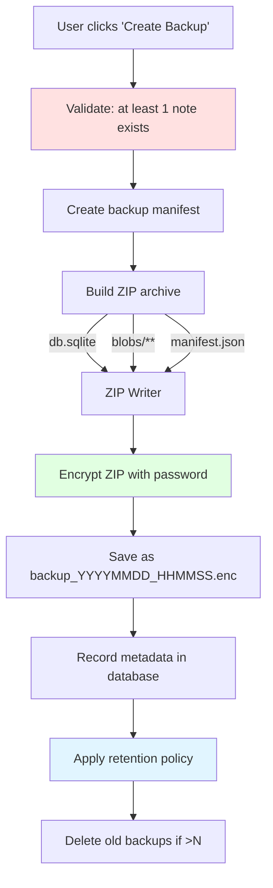
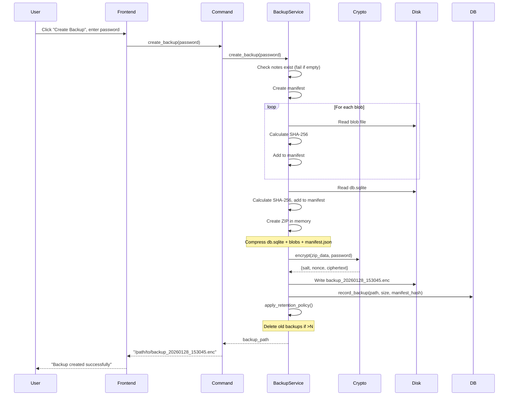
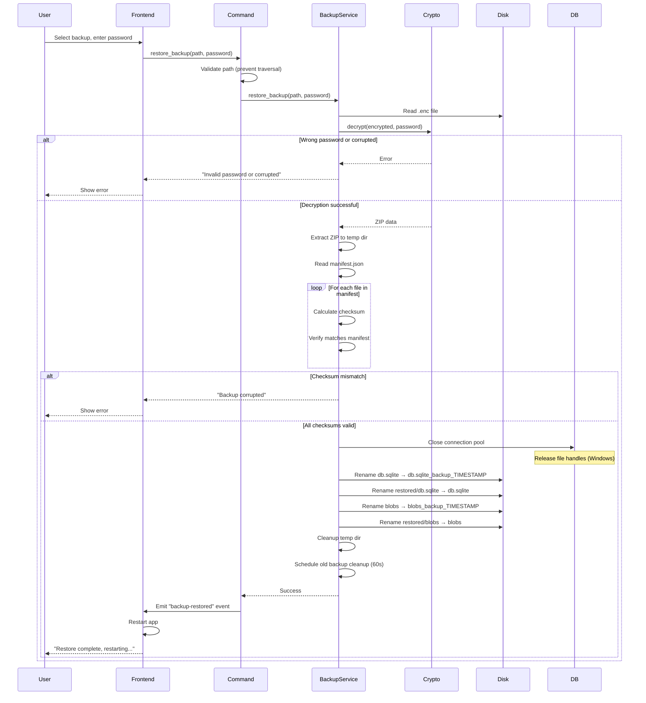

# Chapter 15: Backup System

Data without backups is data waiting to be lost. SwatNotes creates **consistent snapshots** of the entire application state—database, attachments, and metadata—packaged as encrypted ZIP archives. This chapter explains the complete backup workflow: manifest generation, ZIP creation, integrity verification, retention policies, and atomic restore operations.

---

## Why Backups Matter

**Scenarios where backups save you:**

1. **Hard drive failure**: Computer dies, all local data lost
2. **Accidental deletion**: Deleted important notes, want them back
3. **Corruption**: Database corrupted (power outage, disk error)
4. **Migration**: Moving to new computer, want to transfer all data
5. **Rollback**: Made bulk changes, want to undo everything
6. **Ransomware**: Files encrypted by malware, restore from clean backup

**Mental Model**: Backups are like taking a photograph of your entire workspace. If anything goes wrong, you can restore that exact moment.

---

## Backup Architecture

### High-Level Flow



**Components:**

1. **Manifest**: JSON file listing all files with checksums
2. **ZIP archive**: Container for database + blobs + manifest
3. **Encryption**: AES-256-GCM encrypted ZIP (see Chapter 14)
4. **Metadata**: Database record (path, size, timestamp, manifest hash)
5. **Retention**: Automatic cleanup of old backups

---

## Backup Manifest

### Purpose

The manifest is a **bill of materials** for the backup:
- Lists every file included
- Provides SHA-256 checksum for each file
- Records SwatNotes version and timestamp
- Enables integrity verification during restore

**Mental Model**: The manifest is like a packing list for a shipment. You can verify every item arrived intact by checking against the list.

### Manifest Structure

```json
{
  "version": "1.0.6",
  "timestamp": "2026-01-28T15:30:45.123Z",
  "files": [
    {
      "path": "db.sqlite",
      "size": 8192000,
      "checksum": "e3b0c44298fc1c149afbf4c8996fb92427ae41e4649b934ca495991b7852b855"
    },
    {
      "path": "blobs/ab/cd/abcd1234ef567890...",
      "size": 204800,
      "checksum": "5d41402abc4b2a76b9719d911017c592"
    },
    {
      "path": "blobs/12/34/1234567890abcdef...",
      "size": 1048576,
      "checksum": "098f6bcd4621d373cade4e832627b4f6"
    }
  ]
}
```

**Fields:**

- **version**: SwatNotes version that created backup (for compatibility checks)
- **timestamp**: ISO 8601 UTC timestamp
- **files**: Array of file entries
  - **path**: Relative path within ZIP (e.g., `db.sqlite`, `blobs/ab/cd/...`)
  - **size**: File size in bytes
  - **checksum**: SHA-256 hash (hex string)

### Rust Implementation

```rust
// src-tauri/src/services/backup.rs

#[derive(Debug, Serialize, Deserialize)]
pub struct BackupManifest {
    pub version: String,
    pub timestamp: String,
    pub files: Vec<FileEntry>,
}

#[derive(Debug, Serialize, Deserialize)]
pub struct FileEntry {
    pub path: String,
    pub size: u64,
    pub checksum: String, // SHA-256 hex string
}
```

---

## Creating a Backup

### Complete Flow



### Backend Implementation

```rust
// src-tauri/src/services/backup.rs

pub async fn create_backup(&self, password: &str) -> Result<PathBuf> {
    tracing::info!("Creating encrypted backup");

    // 1. Validate: must have at least one note
    let notes = self.repo.list_notes().await?;
    if notes.is_empty() {
        return Err(AppError::Backup(
            "Cannot create backup: No notes found".to_string(),
        ));
    }

    // 2. Get backup directory
    let backups_dir = self.get_backup_dir()?;
    fs::create_dir_all(&backups_dir).await?;

    // 3. Generate filename with timestamp
    let timestamp = Utc::now().format("%Y%m%d_%H%M%S").to_string();
    let backup_filename = format!("backup_{}.enc", timestamp);
    let backup_path = backups_dir.join(&backup_filename);

    // 4. Build manifest
    let mut manifest = BackupManifest {
        version: env!("CARGO_PKG_VERSION").to_string(),
        timestamp: Utc::now().to_rfc3339(),
        files: Vec::new(),
    };

    // 5. Create ZIP archive in memory
    let temp_zip_path = backups_dir.join(format!("{}.zip.tmp", timestamp));
    let temp_file = std::fs::File::create(&temp_zip_path)?;
    let mut zip = ZipWriter::new(temp_file);
    let options = FileOptions::default()
        .compression_method(zip::CompressionMethod::Deflated);

    // 6. Add database to ZIP
    let db_path = self.app_data_dir.join("db.sqlite");
    if db_path.exists() {
        let db_data = fs::read(&db_path).await?;
        let db_checksum = calculate_checksum(&db_data);

        zip.start_file("db.sqlite", options)?;
        std::io::Write::write_all(&mut zip, &db_data)?;

        manifest.files.push(FileEntry {
            path: "db.sqlite".to_string(),
            size: db_data.len() as u64,
            checksum: db_checksum,
        });
    }

    // 7. Add all blobs to ZIP
    let blob_hashes = self.blob_store.list_all().await?;
    for hash in &blob_hashes {
        let blob_data = self.blob_store.read(hash).await?;
        let blob_checksum = calculate_checksum(&blob_data);

        // Preserve directory structure: blobs/ab/cd/abcd123...
        let blob_rel_path = format!(
            "blobs/{}/{}/{}",
            &hash[0..2],
            &hash[2..4],
            hash
        );

        zip.start_file(&blob_rel_path, options)?;
        std::io::Write::write_all(&mut zip, &blob_data)?;

        manifest.files.push(FileEntry {
            path: blob_rel_path,
            size: blob_data.len() as u64,
            checksum: blob_checksum,
        });
    }

    tracing::debug!("Added {} blobs to backup", blob_hashes.len());

    // 8. Add manifest to ZIP
    let manifest_json = serde_json::to_string_pretty(&manifest)?;
    let manifest_checksum = calculate_checksum(manifest_json.as_bytes());

    zip.start_file("manifest.json", options)?;
    std::io::Write::write_all(&mut zip, manifest_json.as_bytes())?;

    // 9. Finalize ZIP
    zip.finish()?;

    // 10. Read ZIP file
    let zip_data = fs::read(&temp_zip_path).await?;

    // 11. Encrypt ZIP
    let encrypted = crypto::encrypt(&zip_data, password)?;
    let encrypted_json = serde_json::to_vec(&encrypted)?;

    // 12. Write encrypted backup
    fs::write(&backup_path, &encrypted_json).await?;

    // 13. Clean up temp file
    fs::remove_file(&temp_zip_path).await?;

    // 14. Record in database
    let metadata = fs::metadata(&backup_path).await?;
    let size = metadata.len() as i64;

    self.repo
        .record_backup(
            backup_path.to_string_lossy().as_ref(),
            size,
            &manifest_checksum,
        )
        .await?;

    tracing::info!("Backup created: {:?} ({} bytes)", backup_path, size);

    // 15. Apply retention policy
    self.apply_retention_policy().await?;

    Ok(backup_path)
}
```

**Key Steps:**

1. **Validate**: Prevent empty backups (no notes = nothing to restore)
2. **Manifest**: Build file list with checksums before compression
3. **ZIP**: Package database + blobs + manifest with Deflate compression
4. **Encrypt**: AES-256-GCM with user password (Chapter 14)
5. **Record**: Save metadata in database for listing
6. **Retention**: Auto-delete old backups

---

## Checksum Calculation

### SHA-256 for Integrity

```rust
// src-tauri/src/services/backup.rs

use sha2::{Digest, Sha256};

fn calculate_checksum(data: &[u8]) -> String {
    let mut hasher = Sha256::new();
    hasher.update(data);
    format!("{:x}", hasher.finalize()) // Hex string
}
```

**Why SHA-256?**
- **Collision resistance**: Astronomically unlikely two files have same hash
- **Integrity verification**: Single bit change = completely different hash
- **Standard**: Same algorithm used for content-addressed blob storage

**Example:**

```rust
let data1 = b"Hello, World!";
let hash1 = calculate_checksum(data1);
// hash1 = "dffd6021bb2bd5b0af676290809ec3a53191dd81c7f70a4b28688a362182986f"

let data2 = b"Hello, World?"; // Changed ! to ?
let hash2 = calculate_checksum(data2);
// hash2 = "c0535e4be2b79ffd93291305436bf889314e4a3faec05ecffcbb7df31ad9e51a"
// Completely different!
```

---

## Retention Policy

### Automatic Cleanup

**Problem**: Backups accumulate forever, consuming disk space.

**Solution**: Keep only the last **N** backups (default: 10).

### Implementation

```rust
// src-tauri/src/services/backup.rs

const DEFAULT_RETENTION_COUNT: usize = 10;

async fn apply_retention_policy(&self) -> Result<()> {
    let retention_count = self.get_retention_count().await?;

    let backups = self.repo.list_backups().await?;

    // If we have fewer backups than retention limit, keep all
    if backups.len() <= retention_count {
        return Ok(());
    }

    // Sort by timestamp (newest first)
    let mut sorted_backups = backups;
    sorted_backups.sort_by(|a, b| b.timestamp.cmp(&a.timestamp));

    // Identify backups to delete (everything after index N)
    let backups_to_delete: Vec<_> = sorted_backups
        .iter()
        .skip(retention_count)
        .collect();

    if backups_to_delete.is_empty() {
        return Ok(());
    }

    tracing::info!(
        "Applying retention policy: deleting {} old backups",
        backups_to_delete.len()
    );

    // Delete database records atomically (in transaction)
    let ids_to_delete: Vec<String> = backups_to_delete
        .iter()
        .map(|b| b.id.clone())
        .collect();

    self.repo.delete_backups_batch(&ids_to_delete).await?;

    // Delete physical files (non-atomic, but records are gone)
    for backup in backups_to_delete {
        if let Err(e) = fs::remove_file(&backup.path).await {
            tracing::warn!(
                "Failed to delete backup file {} (orphaned): {}",
                backup.path,
                e
            );
            // Continue with other deletions
        }
    }

    Ok(())
}

async fn get_retention_count(&self) -> Result<usize> {
    match self.repo.get_setting("backup_retention_count").await? {
        Some(value) => value.parse().unwrap_or(DEFAULT_RETENTION_COUNT),
        None => Ok(DEFAULT_RETENTION_COUNT),
    }
}
```

**Flow:**

```
1. List all backups
2. Sort by timestamp (newest first)
3. Keep first N, delete rest
4. Delete DB records atomically (transaction)
5. Delete physical files (best effort)
```

**Why delete DB records first?**
- Database deletion is atomic (transaction)
- If file deletion fails, orphaned files can be cleaned up later
- Ensures UI doesn't show deleted backups

### Batch Deletion

```rust
// src-tauri/src/database/repository.rs

pub async fn delete_backups_batch(&self, ids: &[String]) -> Result<()> {
    use sqlx::QueryBuilder;

    if ids.is_empty() {
        return Ok(());
    }

    // Use transaction for atomic deletion
    let mut tx = self.pool.begin().await?;

    let mut builder: QueryBuilder<sqlx::Sqlite> =
        QueryBuilder::new("DELETE FROM backups WHERE id IN (");

    let mut separated = builder.separated(", ");
    for id in ids {
        separated.push_bind(id.clone());
    }
    separated.push_unseparated(")");

    builder.build().execute(&mut *tx).await?;
    tx.commit().await?;

    tracing::debug!("Deleted {} backup records atomically", ids.len());
    Ok(())
}
```

**Atomic deletion**: All records deleted in single transaction (all-or-nothing).

---

## Orphaned Record Cleanup

### The Problem

```
Scenario:
1. Backup created: DB record + file
2. User manually deletes file from disk
3. DB record remains (points to non-existent file)
4. UI shows backup, but restore fails
```

### Solution: Auto-Cleanup

```rust
// src-tauri/src/services/backup.rs

async fn cleanup_orphaned_records(&self) -> Result<()> {
    let backups = self.repo.list_backups().await?;

    // Find records where file doesn't exist
    let orphaned_ids: Vec<String> = backups
        .iter()
        .filter(|backup| {
            let path = Path::new(&backup.path);
            !path.exists()
        })
        .map(|backup| {
            tracing::info!(
                "Found orphaned backup record: {} (file not found: {})",
                backup.id,
                backup.path
            );
            backup.id.clone()
        })
        .collect();

    // Delete all orphaned records atomically
    if !orphaned_ids.is_empty() {
        tracing::info!("Cleaning up {} orphaned records", orphaned_ids.len());
        self.repo.delete_backups_batch(&orphaned_ids).await?;
    }

    Ok(())
}

pub async fn list_backups(&self) -> Result<Vec<Backup>> {
    // Clean up orphaned records first
    self.cleanup_orphaned_records().await?;

    // Then list remaining backups
    self.repo.list_backups().await
}
```

**When called:** Every time `list_backups()` is invoked (automatically cleans before listing).

---

## Restoring from Backup

### Restore Flow



### Atomic Restore

**Challenge**: Replace database and blobs without leaving system in inconsistent state.

**Solution**: Rename operations (atomic on most filesystems).

```rust
// src-tauri/src/services/backup.rs

pub async fn restore_backup(&self, backup_path: &Path, password: &str) -> Result<()> {
    tracing::info!("Restoring from backup: {:?}", backup_path);

    // 1. Decrypt backup
    let encrypted_data = fs::read(backup_path).await?;
    let encrypted: crypto::EncryptedData = serde_json::from_slice(&encrypted_data)
        .map_err(|e| AppError::Restore(format!("Invalid backup format: {}", e)))?;

    let zip_data = crypto::decrypt(&encrypted, password)?;

    // 2. Extract to temp directory
    let backups_dir = self.get_backup_dir()?;
    let temp_restore_dir = backups_dir.join(format!(
        "restore_temp_{}",
        Utc::now().timestamp()
    ));
    fs::create_dir_all(&temp_restore_dir).await?;

    let cursor = std::io::Cursor::new(zip_data);
    let mut archive = zip::ZipArchive::new(cursor)?;

    // 3. Read manifest
    let manifest = {
        let mut manifest_file = archive.by_name("manifest.json")?;
        let mut manifest_data = String::new();
        std::io::Read::read_to_string(&mut manifest_file, &mut manifest_data)?;
        serde_json::from_str::<BackupManifest>(&manifest_data)?
    };

    tracing::info!(
        "Backup version: {}, timestamp: {}, files: {}",
        manifest.version,
        manifest.timestamp,
        manifest.files.len()
    );

    // 4. Verify checksums and extract files
    for file_entry in &manifest.files {
        if file_entry.path == "manifest.json" {
            continue; // Skip manifest itself
        }

        // Read file contents
        let contents = {
            let mut file = archive.by_name(&file_entry.path)?;
            let mut contents = Vec::new();
            std::io::Read::read_to_end(&mut file, &mut contents)?;
            contents
        };

        // Verify checksum
        let actual_checksum = calculate_checksum(&contents);
        if actual_checksum != file_entry.checksum {
            // Cleanup and fail
            let _ = fs::remove_dir_all(&temp_restore_dir).await;
            return Err(AppError::Restore(format!(
                "Checksum mismatch for {}: expected {}, got {}",
                file_entry.path, file_entry.checksum, actual_checksum
            )));
        }

        // Write to temp directory
        let temp_file_path = temp_restore_dir.join(&file_entry.path);
        if let Some(parent) = temp_file_path.parent() {
            fs::create_dir_all(parent).await?;
        }
        fs::write(&temp_file_path, &contents).await?;

        tracing::debug!("Verified and extracted: {}", file_entry.path);
    }

    tracing::info!("All files verified successfully, performing atomic swap...");

    // 5. Close database connection pool (release file handles)
    tracing::info!("Closing database connection pool...");
    self.repo.close().await;

    // Small delay for Windows to release handles
    tokio::time::sleep(tokio::time::Duration::from_millis(100)).await;

    // 6. Atomic swap
    let backup_suffix = format!("_backup_{}", Utc::now().timestamp());

    // Swap database
    let db_path = self.app_data_dir.join("db.sqlite");
    let db_backup_path = self.app_data_dir.join(format!(
        "db.sqlite{}",
        backup_suffix
    ));
    let restored_db_path = temp_restore_dir.join("db.sqlite");

    if db_path.exists() {
        fs::rename(&db_path, &db_backup_path).await?;
    }

    if restored_db_path.exists() {
        fs::rename(&restored_db_path, &db_path).await?;
        tracing::info!("Database restored");
    }

    // Swap blobs directory
    let blobs_dir = self.app_data_dir.join("blobs");
    let blobs_backup_dir = self.app_data_dir.join(format!(
        "blobs{}",
        backup_suffix
    ));
    let restored_blobs_dir = temp_restore_dir.join("blobs");

    if blobs_dir.exists() {
        fs::rename(&blobs_dir, &blobs_backup_dir).await?;
    }

    if restored_blobs_dir.exists() {
        fs::rename(&restored_blobs_dir, &blobs_dir).await?;
        tracing::info!("Blobs directory restored");
    } else {
        // Create empty blobs directory if none in backup
        fs::create_dir_all(&blobs_dir).await?;
    }

    // 7. Cleanup temp directory
    let _ = fs::remove_dir_all(&temp_restore_dir).await;

    // 8. Schedule cleanup of old backup data (after 60 seconds)
    tokio::spawn(async move {
        tokio::time::sleep(tokio::time::Duration::from_secs(60)).await;
        let _ = fs::remove_file(&db_backup_path).await;
        let _ = fs::remove_dir_all(&blobs_backup_dir).await;
    });

    tracing::info!("Restore completed successfully");

    Ok(())
}
```

**Atomic Swap Pattern:**

```
Before:
  db.sqlite (active)
  blobs/ (active)

During restore:
  db.sqlite → db.sqlite_backup_12345
  restored/db.sqlite → db.sqlite
  blobs/ → blobs_backup_12345
  restored/blobs/ → blobs/

After:
  db.sqlite (restored)
  blobs/ (restored)
  db.sqlite_backup_12345 (old, deleted after 60s)
  blobs_backup_12345 (old, deleted after 60s)
```

**Why atomic?**
- Rename is atomic on most filesystems (POSIX, NTFS)
- Either fully succeeds or fully fails
- No intermediate state with partial data

**Why keep old files for 60 seconds?**
- Safety net if restore was mistake
- User can manually recover if needed
- Automatic cleanup prevents disk bloat

---

## Path Traversal Prevention

### Security Vulnerability

```
Attack: User provides backup_path = "../../../../etc/passwd"
Result without validation: Tries to restore system file!
```

### Defense

```rust
// src-tauri/src/commands/backup.rs

pub async fn restore_backup(
    state: State<'_, AppState>,
    backup_path: String,
    password: String,
) -> Result<()> {
    let path = Path::new(&backup_path);

    // Get allowed backup directory
    let backup_dir = state.backup_service.get_backup_directory()?;

    // Canonicalize paths (resolves .., symlinks, etc.)
    let canonical_backup_dir = backup_dir.canonicalize()
        .map_err(|e| AppError::Backup(format!(
            "Failed to resolve backup directory: {}", e
        )))?;

    let canonical_path = path.canonicalize()
        .map_err(|e| AppError::Backup(format!(
            "Invalid backup path: {}", e
        )))?;

    // Verify path is within backup directory
    if !canonical_path.starts_with(&canonical_backup_dir) {
        tracing::warn!(
            "Path traversal attempt blocked: {} is outside {}",
            backup_path,
            backup_dir.display()
        );
        return Err(AppError::Backup(
            "Invalid backup path: must be within backups directory".to_string(),
        ));
    }

    // Path is safe, proceed with restore
    state.backup_service
        .restore_backup(&canonical_path, &password)
        .await
}
```

**Defense layers:**

1. **Canonicalize paths**: Resolve `..`, `.`, symlinks to absolute paths
2. **Check prefix**: Ensure canonical path starts with backup directory
3. **Log attempts**: Warn on suspicious paths

---

## Frontend UI

### Create Backup

```typescript
// src/ui/backup.ts

export async function handleBackupNow() {
  const statusEl = document.getElementById('backup-status');
  const btnEl = document.getElementById('backup-now-btn');
  const passwordInput = document.getElementById('backup-password');

  try {
    // Validate password
    const password = passwordInput?.value?.trim();
    if (!password) {
      statusEl.textContent = 'Please enter a backup password';
      statusEl.className = 'text-sm text-error';
      return;
    }

    if (password.length < MIN_PASSWORD_LENGTH) {
      statusEl.textContent = `Password must be at least ${MIN_PASSWORD_LENGTH} characters`;
      statusEl.className = 'text-sm text-error';
      return;
    }

    btnEl.disabled = true;
    statusEl.textContent = 'Creating encrypted backup...';
    statusEl.className = 'text-sm text-info';

    const backupPath = await createBackup(password);

    statusEl.textContent = `Backup created successfully!`;
    statusEl.className = 'text-sm text-success';

    // Clear password field
    if (passwordInput) {
      passwordInput.value = '';
    }

    // Refresh backups list
    await loadBackupsList();

    setTimeout(() => {
      statusEl.textContent = '';
    }, 3000);
  } catch (error) {
    logger.error('Backup failed', LOG_CONTEXT, error);
    statusEl.textContent = 'Backup failed: ' + error;
    statusEl.className = 'text-sm text-error';
  } finally {
    btnEl.disabled = false;
  }
}
```

### List Backups

```typescript
// src/ui/backup.ts

export async function loadBackupsList() {
  const listEl = document.getElementById('backups-list');
  if (!listEl) return;

  try {
    const backups = await listBackups();

    if (backups.length === 0) {
      listEl.innerHTML = '<p class="text-sm text-base-content/50">No backups yet.</p>';
      return;
    }

    // Sort by timestamp (newest first)
    backups.sort((a, b) => new Date(b.timestamp) - new Date(a.timestamp));

    listEl.innerHTML = backups
      .slice(0, BACKUP_LIST_LIMIT) // Show last 10
      .map((backup, index) => `
        <div class="flex justify-between items-center p-2 bg-base-200 rounded mb-2">
          <div>
            <p class="text-sm font-medium">${formatDate(backup.timestamp)}</p>
            <p class="text-xs text-base-content/50">${formatFileSize(backup.size)}</p>
          </div>
          <div class="flex gap-2">
            <button class="btn btn-primary btn-xs restore-btn" data-backup-index="${index}">
              Restore
            </button>
            <button class="btn btn-error btn-xs delete-btn" data-backup-index="${index}">
              Delete
            </button>
          </div>
        </div>
      `)
      .join('');

    // Attach event listeners
    const recentBackups = backups.slice(0, BACKUP_LIST_LIMIT);
    document.querySelectorAll('.restore-btn').forEach((btn, index) => {
      btn.addEventListener('click', () => {
        const backup = recentBackups[index];
        handleRestoreBackup(backup.path, backup.timestamp);
      });
    });

    document.querySelectorAll('.delete-btn').forEach((btn, index) => {
      btn.addEventListener('click', () => {
        const backup = recentBackups[index];
        handleDeleteBackup(backup.id, backup.path, backup.timestamp);
      });
    });
  } catch (error) {
    logger.error('Failed to load backups', LOG_CONTEXT, error);
    listEl.innerHTML = '<p class="text-sm text-error">Failed to load backups</p>';
  }
}
```

### Restore Backup

```typescript
// src/ui/backup.ts

async function handleRestoreBackup(backupPath: string, backupTimestamp: string) {
  const confirmed = await showAlert(
    `Restore backup from ${formatDate(backupTimestamp)}?\n\n` +
    `This will replace all current data. The app will restart after restore.`,
    'warning'
  );

  if (!confirmed) return;

  const password = await showPrompt('Enter backup password:', 'password');
  if (!password) return;

  try {
    await restoreBackup(backupPath, password);

    // Restore succeeded, app will restart
    await showAlert(
      'Backup restored successfully! The app will now restart.',
      'success'
    );

    // Restart app
    await relaunch();
  } catch (error) {
    logger.error('Restore failed', LOG_CONTEXT, error);
    await showAlert(
      `Restore failed: ${error}\n\nPlease check your password and try again.`,
      'error'
    );
  }
}
```

**Restore flow:**

1. Confirm with user (destructive operation)
2. Prompt for password
3. Call `restore_backup()` backend command
4. On success, restart app (database was replaced)
5. On error, show message

---

## Testing

### Unit Tests

```rust
// src-tauri/src/services/backup.rs (tests module)

#[tokio::test]
async fn test_create_backup() {
    let (service, _temp) = create_test_service().await;

    let password = "test_password_123";

    // Create test note
    service.repo.create_note(CreateNoteRequest {
        title: "Test Note".to_string(),
        content_json: "{}".to_string(),
    }).await.unwrap();

    // Create backup
    let backup_path = service.create_backup(password).await.unwrap();

    // Verify file exists
    assert!(backup_path.exists());

    // Verify can decrypt
    let encrypted_data = fs::read(&backup_path).await.unwrap();
    let encrypted: crypto::EncryptedData = serde_json::from_slice(&encrypted_data).unwrap();
    let zip_data = crypto::decrypt(&encrypted, password).unwrap();

    assert!(!zip_data.is_empty());
}

#[tokio::test]
async fn test_retention_policy() {
    let (service, _temp) = create_test_service().await;

    let password = "test_password";

    // Create test note
    service.repo.create_note(CreateNoteRequest {
        title: "Test".to_string(),
        content_json: "{}".to_string(),
    }).await.unwrap();

    // Set retention to 3
    service.repo.set_setting("backup_retention_count", "3").await.unwrap();

    // Create 5 backups
    for _ in 0..5 {
        service.create_backup(password).await.unwrap();
        tokio::time::sleep(Duration::from_millis(100)).await;
    }

    // List backups
    let backups = service.list_backups().await.unwrap();

    // Should have only 3 (retention deleted 2 oldest)
    assert_eq!(backups.len(), 3);

    // All 3 should have existing files
    for backup in backups {
        assert!(Path::new(&backup.path).exists());
    }
}

#[tokio::test]
async fn test_restore_wrong_password() {
    let (service, _temp) = create_test_service().await;

    let password = "correct_password";

    // Create backup
    let backup_path = service.create_backup(password).await.unwrap();

    // Try to restore with wrong password
    let result = service.restore_backup(&backup_path, "wrong_password").await;

    assert!(result.is_err());
    assert!(result.unwrap_err().to_string().contains("Decryption failed"));
}

#[tokio::test]
async fn test_restore_corrupted_backup() {
    let (service, _temp) = create_test_service().await;

    let password = "test_password";

    // Create backup
    let backup_path = service.create_backup(password).await.unwrap();

    // Corrupt the backup file
    let mut corrupted_data = fs::read(&backup_path).await.unwrap();
    corrupted_data[50] ^= 0xFF; // Flip bits
    fs::write(&backup_path, &corrupted_data).await.unwrap();

    // Try to restore corrupted backup
    let result = service.restore_backup(&backup_path, password).await;

    assert!(result.is_err());
}

#[tokio::test]
async fn test_backup_without_notes_fails() {
    let (service, _temp) = create_test_service().await;

    let password = "test_password";

    // Try to create backup without any notes
    let result = service.create_backup(password).await;

    assert!(result.is_err());
    assert!(result.unwrap_err().to_string().contains("No notes found"));
}
```

---

## Common Mistakes

### Mistake 1: Not Validating Empty Backups

```rust
// ❌ BAD: Allow backup with no data
pub async fn create_backup(&self, password: &str) -> Result<PathBuf> {
    // No validation → creates empty ZIP
    self.build_zip_archive().await?;
    // ...
}

// ✅ GOOD: Validate notes exist
pub async fn create_backup(&self, password: &str) -> Result<PathBuf> {
    let notes = self.repo.list_notes().await?;
    if notes.is_empty() {
        return Err(AppError::Backup("No notes found".to_string()));
    }
    // ...
}
```

### Mistake 2: Not Verifying Checksums on Restore

```rust
// ❌ BAD: Extract files without verification
for file_entry in &manifest.files {
    let contents = read_file_from_zip(&file_entry.path)?;
    write_file(&temp_path, &contents)?;
    // No checksum verification!
}

// ✅ GOOD: Verify each file
for file_entry in &manifest.files {
    let contents = read_file_from_zip(&file_entry.path)?;
    let actual_checksum = calculate_checksum(&contents);
    if actual_checksum != file_entry.checksum {
        return Err(AppError::Restore("Checksum mismatch".to_string()));
    }
    write_file(&temp_path, &contents)?;
}
```

### Mistake 3: Forgetting to Close Database Before Restore

```rust
// ❌ BAD: Try to rename database while open
fs::rename(&db_path, &db_backup_path).await?;
// FAILS on Windows: file is locked by SQLite

// ✅ GOOD: Close connection pool first
self.repo.close().await; // Release all connections
tokio::time::sleep(Duration::from_millis(100)).await; // Wait for handles
fs::rename(&db_path, &db_backup_path).await?; // Now succeeds
```

### Mistake 4: Not Handling Path Traversal

```rust
// ❌ BAD: Trust user input
pub async fn restore_backup(backup_path: String, password: String) -> Result<()> {
    // backup_path could be "../../../../etc/passwd"
    let path = Path::new(&backup_path);
    self.restore(path, &password).await?;
}

// ✅ GOOD: Validate path is within backup directory
let canonical_path = path.canonicalize()?;
if !canonical_path.starts_with(&canonical_backup_dir) {
    return Err(AppError::Backup("Invalid path".to_string()));
}
```

### Mistake 5: Forgetting Retention Policy

```rust
// ❌ BAD: Backups accumulate forever
pub async fn create_backup(&self, password: &str) -> Result<PathBuf> {
    // ... create backup ...
    Ok(backup_path) // No cleanup
}

// ✅ GOOD: Apply retention after each backup
pub async fn create_backup(&self, password: &str) -> Result<PathBuf> {
    // ... create backup ...
    self.apply_retention_policy().await?; // Auto-delete old backups
    Ok(backup_path)
}
```

---

## Key Takeaways

1. **Manifest-based backups**: JSON file lists all files with SHA-256 checksums
   - Enables integrity verification during restore
   - Records SwatNotes version for compatibility checks

2. **ZIP compression**: Package database + blobs + manifest into single archive
   - Deflate compression reduces file size
   - Preserves directory structure for blobs

3. **Encryption**: ZIP encrypted with AES-256-GCM (Chapter 14)
   - Password-based encryption with Argon2id key derivation
   - File extension: `.enc`

4. **Checksum verification**: Every file verified on restore
   - SHA-256 calculated and compared to manifest
   - Restore fails if any checksum mismatches

5. **Atomic restore**: Rename operations replace files atomically
   - Old files renamed to `_backup_TIMESTAMP`
   - Restored files renamed to active locations
   - Old backups deleted after 60 seconds

6. **Retention policy**: Automatically delete old backups
   - Keep only last N backups (default: 10)
   - Configurable via settings
   - Applied after each backup creation

7. **Orphaned record cleanup**: Automatically remove records without files
   - Prevents UI showing non-existent backups
   - Runs on every `list_backups()` call

8. **Path traversal prevention**: Validate backup paths
   - Canonicalize paths to resolve `..` and symlinks
   - Ensure path is within backup directory

9. **Database connection handling**: Close pool before restore
   - Required on Windows (file locking)
   - Small delay ensures handles released

10. **Empty backup prevention**: Require at least one note
    - Prevents useless backups
    - Clear error message to user

---

## What's Next?

In **Chapter 16: Reminders and Scheduling**, we'll explore:
- Cron-based reminder scheduling with tokio-cron-scheduler
- Notification system using Tauri plugin
- Timezone handling and UTC storage
- Recurring vs one-time reminders
- Background task management

We'll see how SwatNotes schedules tasks reliably and notifies users at the right time.
