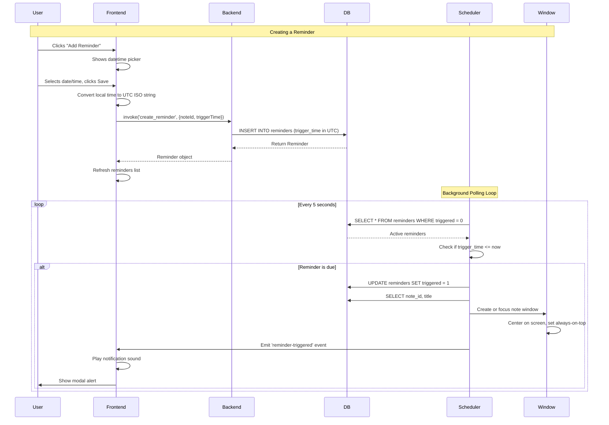

# Chapter 16: Reminders and Scheduling

**What You'll Learn**: How SwatNotes schedules future events with time-based reminders, background polling loops, and visual window notifications without relying on intrusive system popups.

---

## Why Reminders Matter

You're working on a project note and realize you need to review it tomorrow before a meeting. Without a reminder system, you'd need to:

1. Remember to open the app tomorrow
2. Remember which note to check
3. Remember the exact time

That's three things to remember just to remember one thing.

A reminder system automates this: tell the app once, and it handles the rest. The challenge is doing this reliably:

- **Time accuracy**: Triggering within seconds of the scheduled time (not minutes)
- **Persistence**: Reminders survive app restarts
- **Background execution**: Checking for reminders without blocking the UI
- **Graceful notifications**: Showing the note window, not intrusive popups

**Mental Model**: Think of reminders like alarm clocks. You set a time, go about your day, and the clock rings when the time arrives. The reminder service is your alarm clock that watches the time and "rings" (shows the note window) when it's time.

---

## Reminder Data Model

Every reminder is a simple record linking a note to a future time:

```rust
// src-tauri/src/database/models.rs
#[derive(Debug, Clone, Serialize, Deserialize, FromRow)]
pub struct Reminder {
    pub id: String,              // UUID
    pub note_id: String,         // Which note to show
    pub trigger_time: DateTime<Utc>,  // When to trigger
    pub triggered: bool,         // Has it fired already?
    pub created_at: DateTime<Utc>,
    // Per-reminder notification settings (optional - falls back to defaults)
    pub sound_enabled: Option<bool>,
    pub sound_type: Option<String>,
    pub shake_enabled: Option<bool>,
    pub glow_enabled: Option<bool>,
}
```

**Key Fields**:

- `trigger_time`: **Always UTC**. Storing timestamps in UTC avoids timezone headaches (daylight saving, traveling across zones). The frontend converts to local time for display.
- `triggered`: Boolean flag. Once a reminder fires, we mark `triggered = true` so it doesn't fire repeatedly.
- `sound_enabled`, `shake_enabled`, `glow_enabled`: **Optional per-reminder settings**. When `None`, the system uses default values (all enabled). When set, these override defaults for this specific reminder.
- `sound_type`: Optional custom sound (`whoosh`, `chime`, `bell`, `gentle`, `alert`).

**Database Schema**:

```sql
CREATE TABLE reminders (
    id TEXT PRIMARY KEY,
    note_id TEXT NOT NULL,
    trigger_time TEXT NOT NULL,  -- ISO 8601 UTC timestamp
    triggered INTEGER NOT NULL DEFAULT 0,
    created_at TEXT NOT NULL,
    -- Per-reminder notification settings (NULL = use defaults)
    sound_enabled INTEGER,       -- 1 = on, 0 = off, NULL = default
    sound_type TEXT,             -- 'whoosh', 'chime', etc.
    shake_enabled INTEGER,
    glow_enabled INTEGER,
    FOREIGN KEY (note_id) REFERENCES notes(id) ON DELETE CASCADE
);
```

**ON DELETE CASCADE**: When a note is deleted, all its reminders are automatically deleted. No orphaned reminders.

**Why Optional Settings?**: Most users want consistent notification behavior. Per-reminder settings are for power users who want a quiet reminder for a low-priority task or a loud one for something critical.

---

## Per-Reminder Notification Settings UI

When creating a reminder, users can optionally customize notification behavior:

```html
<!-- sticky-note.html - Per-reminder settings -->
<div class="collapse collapse-arrow bg-base-200 mb-3">
  <input type="checkbox" id="reminder-settings-toggle" />
  <div class="collapse-title text-sm font-medium py-2">
    Notification Settings (optional)
  </div>
  <div class="collapse-content">
    <div class="form-control">
      <label class="label cursor-pointer justify-start gap-3 py-1">
        <input type="checkbox" id="reminder-sound-enabled" 
               class="checkbox checkbox-sm checkbox-primary" checked>
        <span class="label-text text-sm">Play sound</span>
      </label>
    </div>
    <div class="form-control ml-7 mb-2">
      <select id="reminder-sound-type" class="select select-bordered select-sm w-full">
        <option value="whoosh">Whoosh (default)</option>
        <option value="chime">Chime</option>
        <option value="bell">Bell</option>
        <option value="gentle">Gentle</option>
        <option value="alert">Alert</option>
      </select>
    </div>
    <div class="form-control">
      <label class="label cursor-pointer justify-start gap-3 py-1">
        <input type="checkbox" id="reminder-shake-enabled" 
               class="checkbox checkbox-sm checkbox-primary" checked>
        <span class="label-text text-sm">Swoosh animation</span>
      </label>
    </div>
    <div class="form-control">
      <label class="label cursor-pointer justify-start gap-3 py-1">
        <input type="checkbox" id="reminder-glow-enabled" 
               class="checkbox checkbox-sm checkbox-primary" checked>
        <span class="label-text text-sm">Glow effect</span>
      </label>
    </div>
    <p class="text-xs text-base-content/50 mt-2">
      Leave checked to use defaults, or customize for this reminder.
    </p>
  </div>
</div>
```

**Design Pattern**: The settings panel is collapsed by default using DaisyUI's collapse component. Most users won't need it, but it's there for those who do. Checkboxes default to checked, so creating a reminder without expanding the panel uses standard settings.

---

## The Polling Loop Strategy

How does the app know when to trigger a reminder? It can't sleep until the exact time (what if that's days away?). Instead, SwatNotes uses a **polling loop**:

```rust
// src-tauri/src/services/reminders.rs
pub fn start_scheduler(self) {
    tokio::spawn(async move {
        // Check every 5 seconds
        let mut interval = tokio::time::interval(
            tokio::time::Duration::from_secs(5)
        );

        loop {
            interval.tick().await;  // Wait for next tick
            
            if let Err(e) = self.check_and_trigger_reminders().await {
                tracing::error!("Reminder check failed: {}", e);
                // Continue loop even on error
            }
        }
    });
}
```

**Why 5 seconds?**

- **Accurate enough**: Reminders trigger within 5 seconds of scheduled time
- **Low overhead**: Checking active reminders is a fast query
- **Battery friendly**: Not polling every millisecond

**Mental Model**: Like a security guard making rounds every 5 seconds, checking if any alarms have gone off.

**Trade-off**: We could poll every second for 1-second accuracy, but the overhead isn't worth it for note reminders. If you need millisecond precision (like a timer app), you'd use a different strategy.

---

## Checking for Due Reminders

Every 5 seconds, the service queries for reminders that are due:

```rust
async fn check_and_trigger_reminders(&self) -> Result<()> {
    // Get all active (non-triggered) reminders
    let reminders = self.list_active_reminders().await?;
    let now = Utc::now();

    for reminder in reminders {
        // Has the trigger time passed?
        if reminder.trigger_time <= now {
            tracing::info!("Triggering reminder {} for note {}", 
                reminder.id, reminder.note_id);

            // 1. Mark as triggered (prevent re-firing)
            self.repo.mark_reminder_triggered(&reminder.id).await?;

            // 2. Send notification
            self.send_notification(&reminder).await;
        }
    }

    Ok(())
}
```

**The Flow**:

1. **Query active reminders**: `WHERE triggered = 0 ORDER BY trigger_time ASC`
2. **Compare times**: `if trigger_time <= now` (using UTC)
3. **Mark as triggered**: Update database to prevent duplicate notifications
4. **Send notification**: Open/focus the note window

**Important**: We mark as triggered **before** sending the notification. If the notification fails (window creation error), the reminder won't fire again. This is intentional—better to skip a notification than spam the user.

---

## The Notification Strategy

When a reminder triggers, SwatNotes **doesn't use system notifications**. Instead, it opens or focuses the note window with visual emphasis:

```rust
async fn send_notification(&self, reminder: &Reminder) {
    let app_handle = self.app_handle.lock().await;
    let handle = match app_handle.as_ref() {
        Some(h) => h.clone(),
        None => {
            tracing::error!("App handle not set");
            return;
        }
    };
    drop(app_handle);  // Release lock immediately

    // Get note title
    let note = match self.repo.get_note(&reminder.note_id).await {
        Ok(note) => note,
        Err(e) => {
            tracing::error!("Failed to get note: {}", e);
            return;
        }
    };

    // Open or focus window (async task)
    let window_label = format!("note-{}", reminder.note_id);
    tauri::async_runtime::spawn(async move {
        // Window management logic...
    });
}
```

**Why not system notifications?**

- **Context**: Users want to **see the note**, not just a text notification
- **Action**: Opening the note window is more useful than clicking a notification
- **Cross-platform**: Window management is more reliable than OS-specific notification APIs

**Window Behavior**:

1. **Existing window**: Unminimize, show, center on screen, set always-on-top
2. **New window**: Create sticky note window, center on screen, don't steal focus
3. **Visual feedback**: Window appears above other apps (always-on-top), plays notification sound
4. **Event emission**: Send `reminder-triggered` event to frontend for additional UI effects

---

## Window Management Details

Creating or focusing windows is more complex than it seems:

```rust
// Check if window exists
if let Some(window) = handle.get_webview_window(&window_label) {
    // Window exists - show it
    let _ = window.unminimize();
    let _ = window.show();
    
    // Center on screen
    if let Ok(Some(monitor)) = window.current_monitor() {
        let monitor_size = monitor.size();
        let monitor_position = monitor.position();
        
        if let Ok(window_size) = window.outer_size() {
            let x = monitor_position.x 
                + ((monitor_size.width as i32 - window_size.width as i32) / 2);
            let y = monitor_position.y 
                + ((monitor_size.height as i32 - window_size.height as i32) / 2);
            
            window.set_position(tauri::Position::Physical(
                tauri::PhysicalPosition::new(x, y)
            ))?;
        }
    }
    
    // Set always on top (without stealing focus)
    window.set_always_on_top(true)?;
    
    // Wait for window to be visible, then emit event
    tokio::time::sleep(tokio::time::Duration::from_millis(200)).await;
    handle.emit("reminder-triggered", reminder_event)?;
} else {
    // Window doesn't exist - create it
    WebviewWindowBuilder::new(
        &handle,
        &window_label,
        WebviewUrl::App("sticky-note.html".into())
    )
    .title(&note_title)
    .inner_size(400.0, 500.0)
    .always_on_top(true)
    .visible(false)  // Will be shown by frontend after loading
    .focused(false)  // Don't steal focus when created
    .build()?;
}
```

**Key Decisions**:

- **Centering**: Calculate position based on monitor size (not hardcoded coordinates)
- **Always-on-top**: Window stays above other apps, but doesn't steal keyboard focus
- **Delayed event**: Wait 200ms after showing window to ensure it's visible before emitting event
- **Separate creation**: New windows start invisible and unfocused to prevent jarring focus theft

**Mental Model**: Think of the window as a gentle tap on the shoulder, not a loud alarm. It appears in your field of vision without interrupting your current task.

---

## Database Operations

The repository handles all reminder CRUD operations:

### Creating a Reminder

```rust
pub async fn create_reminder(
    &self,
    note_id: &str,
    trigger_time: DateTime<Utc>,
    sound_enabled: Option<bool>,
    sound_type: Option<String>,
    shake_enabled: Option<bool>,
    glow_enabled: Option<bool>,
) -> Result<Reminder> {
    let id = Uuid::new_v4().to_string();
    let now = Utc::now();

    let reminder = sqlx::query_as::<_, Reminder>(
        r#"
        INSERT INTO reminders (id, note_id, trigger_time, triggered, created_at, 
                               sound_enabled, sound_type, shake_enabled, glow_enabled)
        VALUES (?, ?, ?, 0, ?, ?, ?, ?, ?)
        RETURNING *
        "#,
    )
    .bind(&id)
    .bind(note_id)
    .bind(trigger_time)
    .bind(now)
    .bind(sound_enabled)
    .bind(&sound_type)
    .bind(shake_enabled)
    .bind(glow_enabled)
    .fetch_one(&self.pool)
    .await?;

    tracing::debug!("Created reminder: {} for note: {}", id, note_id);
    Ok(reminder)
}
```

**Parameters**:

- `trigger_time` is `DateTime<Utc>`. The frontend converts local time to UTC before calling this command.
- `sound_enabled`, `sound_type`, `shake_enabled`, `glow_enabled` are optional overrides for per-reminder notification settings. When `None`, the reminder uses the global defaults.

### Listing Active Reminders

```rust
pub async fn list_active_reminders(&self) -> Result<Vec<Reminder>> {
    let reminders = sqlx::query_as::<_, Reminder>(
        r#"
        SELECT * FROM reminders WHERE triggered = 0 ORDER BY trigger_time ASC
        "#,
    )
    .fetch_all(&self.pool)
    .await?;

    Ok(reminders)
}
```

**Query**: `WHERE triggered = 0` filters out past reminders. `ORDER BY trigger_time ASC` returns earliest reminders first.

**Performance**: This query is fast even with thousands of reminders (indexed `triggered` column, small result set).

### Marking as Triggered

```rust
pub async fn mark_reminder_triggered(&self, id: &str) -> Result<()> {
    sqlx::query("UPDATE reminders SET triggered = 1 WHERE id = ?")
        .bind(id)
        .execute(&self.pool)
        .await?;

    tracing::debug!("Marked reminder as triggered: {}", id);
    Ok(())
}
```

**Idempotent**: Can be called multiple times safely (already triggered reminders stay triggered).

---

## Frontend Integration

The frontend creates and displays reminders through the note editor:

### Creating a Reminder

```typescript
// src/components/noteEditor.ts
saveReminderBtn?.addEventListener('click', async () => {
  const datetimeValue = reminderDatetime?.value;
  if (!datetimeValue) {
    showAlert('Please select a date and time', { 
      title: 'Invalid Input', 
      type: 'warning' 
    });
    return;
  }

  try {
    const triggerDate = new Date(datetimeValue);
    await createReminder(note.id, triggerDate);
    reminderForm?.classList.add('hidden');
    await loadReminders();
  } catch (error) {
    logger.error('Failed to create reminder', LOG_CONTEXT, error);
    showAlert('Failed to create reminder: ' + error, { 
      title: 'Error', 
      type: 'error' 
    });
  }
});
```

**User Flow**:

1. User clicks "Add Reminder" button
2. Datetime picker appears (HTML5 `<input type="datetime-local">`)
3. User selects date and time
4. Click "Save" triggers `createReminder(note.id, triggerDate)`
5. Reminder list refreshes to show new reminder

**Timezone Conversion**:

```typescript
// src/utils/remindersApi.ts
export async function createReminder(
  noteId: string,
  triggerTime: Date,
  settings?: ReminderCreateSettings
): Promise<Reminder> {
  // Convert local Date to ISO 8601 UTC string
  const triggerTimeStr = triggerTime.toISOString();
  return await invoke('create_reminder', {
    noteId,
    triggerTime: triggerTimeStr,
    soundEnabled: settings?.sound_enabled ?? null,
    soundType: settings?.sound_type ?? null,
    shakeEnabled: settings?.shake_enabled ?? null,
    glowEnabled: settings?.glow_enabled ?? null,
  });
}
```

**How it works**: JavaScript `Date.toISOString()` always returns UTC format (`2026-01-28T15:30:00.000Z`). The backend parses this as UTC with `DateTime::parse_from_rfc3339()`. The optional `settings` parameter allows per-reminder notification customization—when omitted or `null`, the global defaults apply.

### Displaying Reminders

```typescript
async function loadReminders(): Promise<void> {
  const remindersList = document.getElementById('reminders-list');
  if (!remindersList) return;

  try {
    const allReminders = await listActiveReminders();
    const noteReminders = allReminders.filter(
      r => r.note_id === note.id
    );

    if (noteReminders.length === 0) {
      remindersList.innerHTML = 
        '<p class="text-base-content/50 text-sm">No active reminders.</p>';
      return;
    }

    remindersList.innerHTML = noteReminders.map(reminder => `
      <div class="flex items-center justify-between p-3 bg-base-200 rounded-lg">
        <div class="flex items-center gap-3">
          <svg><!-- Bell icon --></svg>
          <div>
            <p class="font-medium">${formatReminderDate(reminder.trigger_time)}</p>
            <p class="text-xs text-base-content/50">
              Reminder will notify you at this time
            </p>
          </div>
        </div>
        <button class="btn btn-ghost btn-sm btn-circle delete-reminder" 
                data-id="${reminder.id}">
          <svg><!-- X icon --></svg>
        </button>
      </div>
    `).join('');

    // Attach delete handlers
    remindersList.querySelectorAll('.delete-reminder').forEach(btn => {
      btn.addEventListener('click', async () => {
        const id = btn.getAttribute('data-id');
        await deleteReminder(id!);
        await loadReminders();
      });
    });
  } catch (error) {
    logger.error('Failed to load reminders', LOG_CONTEXT, error);
    remindersList.innerHTML = 
      '<p class="text-error text-sm">Failed to load reminders</p>';
  }
}
```

**Pattern**: Fetch all active reminders, filter by current note ID, render list with delete buttons.

**Date Formatting**:

```typescript
function formatReminderDate(dateString: string): string {
  const date = new Date(dateString);
  return date.toLocaleString(undefined, {
    year: 'numeric',
    month: 'short',
    day: 'numeric',
    hour: '2-digit',
    minute: '2-digit',
  });
  // Example: "Jan 28, 2026, 3:30 PM"
}
```

**Automatic conversion**: `new Date(utcString)` parses UTC and displays in user's local timezone.

---

## Listening for Triggered Reminders

The frontend listens for the `reminder-triggered` event:

```typescript
// src/events/handlers.ts
interface ReminderTriggeredPayload {
  note_id: string;
  note_title: string;
}

export async function setupReminderListener(): Promise<void> {
  await listen<ReminderTriggeredPayload>('reminder-triggered', (event) => {
    const { note_id, note_title } = event.payload;
    logger.info(`Reminder triggered for note: ${note_title}`, LOG_CONTEXT);

    // Play notification sound
    playNotificationSound();

    // Show in-app alert
    showAlert(`Reminder: ${note_title}`, { 
      title: 'Reminder', 
      type: 'info' 
    });
  });
}
```

**Multi-layered notification**:

1. **Window appears**: The note window opens or focuses (backend)
2. **Sound plays**: Audible alert (`playNotificationSound()`)
3. **In-app alert**: DaisyUI modal appears (visual confirmation)

**Why all three?**

- **Window**: Shows the actual note content (primary action)
- **Sound**: Alerts user even if window is behind other apps
- **Modal**: Confirms reminder fired (can be dismissed)

This redundancy ensures users don't miss reminders.

---

## Service Initialization and Lifecycle

The reminder service starts when the app launches:

```rust
// src-tauri/src/app.rs
pub fn setup(app: &mut App) -> Result<()> {
    // ... database and services initialization ...

    let state = AppState::new(app_data_dir).await?;
    app.manage(state.clone());

    // Start reminders scheduler
    let scheduler_service = state.reminders_service.clone();
    let app_handle = app.handle().clone();
    tauri::async_runtime::spawn(async move {
        scheduler_service.set_app_handle(app_handle).await;
        scheduler_service.start_scheduler();
    });

    Ok(())
}
```

**Initialization Steps**:

1. **Create service**: `RemindersService::new(repo)`
2. **Set app handle**: Needed for window creation and events
3. **Start scheduler**: Spawn background polling loop

**AppHandle Injection**:

```rust
// src-tauri/src/services/reminders.rs
pub struct RemindersService {
    repo: Repository,
    app_handle: Arc<Mutex<Option<AppHandle>>>,
}

pub async fn set_app_handle(&self, handle: AppHandle) {
    let mut app = self.app_handle.lock().await;
    *app = Some(handle);
}
```

**Why delayed?** The `AppHandle` isn't available until after `app.manage()` is called. We inject it in a separate step.

**Thread Safety**: `Arc<Mutex<Option<AppHandle>>>` allows the background polling loop to access the handle from a different thread.

---

## Automatic Backup Scheduling (Bonus)

SwatNotes also uses scheduling for **automatic backups** with `tokio-cron-scheduler`:

```rust
// src-tauri/src/services/scheduler.rs
use tokio_cron_scheduler::{Job, JobScheduler};

pub struct SchedulerService {
    scheduler: Arc<RwLock<JobScheduler>>,
    backup_service: Arc<BackupService>,
    current_job_id: Arc<RwLock<Option<Uuid>>>,
}

pub async fn schedule_backup(
    &self, 
    frequency: BackupFrequency, 
    enabled: bool
) -> Result<()> {
    // Cancel existing job
    self.cancel_backup().await?;

    if !enabled {
        return Ok(());
    }

    let cron_expr = frequency.to_cron();  // e.g., "0 0 2 * * *" (daily at 2 AM)
    let backup_service = Arc::clone(&self.backup_service);

    // Create cron job
    let job = Job::new_async(cron_expr, move |_uuid, _l| {
        let backup_service = Arc::clone(&backup_service);
        Box::pin(async move {
            // Retrieve password from credential manager
            let password = CredentialManager::get_auto_backup_password()?;
            
            // Create backup
            match backup_service.create_backup(&password).await {
                Ok(path) => {
                    tracing::info!("Automatic backup created: {:?}", path);
                    send_notification("Backup Complete", 
                        "Automatic backup created successfully")?;
                }
                Err(e) => {
                    tracing::error!("Automatic backup failed: {}", e);
                    send_notification("Backup Failed", &format!("{}", e))?;
                }
            }
        })
    })?;

    let job_id = job.guid();
    
    // Add to scheduler
    self.scheduler.write().await.add(job).await?;
    self.current_job_id.write().await = Some(job_id);

    tracing::info!("Automatic backup scheduled: {:?}", frequency);
    Ok(())
}
```

**Cron Expressions**:

- Daily: `"0 0 2 * * *"` (2 AM every day)
- Every 6 hours: `"0 0 */6 * * *"`
- Weekly: `"0 0 2 */7 * *"` (every 7 days at 2 AM)

**Why Cron vs Polling?**

- **Reminders**: Unknown trigger times, need to check frequently → **polling**
- **Backups**: Fixed schedule (daily/weekly) → **cron** (more efficient)

---

## Complete Data Flow Diagram

Here's the end-to-end flow for reminders:



---

## Testing Reminders

### Unit Tests

Test reminder creation and triggering:

```rust
#[tokio::test]
async fn test_create_reminder() {
    let (service, repo, _temp) = create_test_service().await;

    let note = repo.create_note(CreateNoteRequest {
        title: "Test Note".to_string(),
        content_json: "{}".to_string(),
    }).await.unwrap();

    let trigger_time = Utc::now() + Duration::hours(1);
    let reminder = service.create_reminder(&note.id, trigger_time)
        .await.unwrap();

    assert_eq!(reminder.note_id, note.id);
    assert_eq!(reminder.triggered, false);
}

#[tokio::test]
async fn test_check_and_trigger_past_reminders() {
    let (service, repo, _temp) = create_test_service().await;

    let note = repo.create_note(CreateNoteRequest {
        title: "Test Note".to_string(),
        content_json: "{}".to_string(),
    }).await.unwrap();

    // Create reminder in the past
    let trigger_time = Utc::now() - Duration::minutes(5);
    let _reminder = service.create_reminder(&note.id, trigger_time)
        .await.unwrap();

    // Check and trigger
    service.check_and_trigger_reminders().await.unwrap();

    // Verify it was marked as triggered
    let reminders = service.list_active_reminders().await.unwrap();
    assert_eq!(reminders.len(), 0);  // Should be empty now
}
```

**Pattern**: Create reminder in past, call `check_and_trigger_reminders()`, verify it's marked triggered.

### Manual Testing

1. **Create future reminder**: Set reminder for 10 seconds from now
2. **Wait and observe**: Window should appear within 5 seconds of trigger time
3. **Check database**: `SELECT * FROM reminders WHERE id = '<id>'` → `triggered = 1`
4. **Test window behavior**: Minimize window, verify it unminimizes when triggered
5. **Test app restart**: Create reminder, restart app, verify it still triggers

---

## Common Mistakes and Fixes

### Mistake 1: Forgetting Timezone Conversion

**Problem**: Storing local time instead of UTC.

```typescript
// ❌ WRONG: Stores local time
const triggerTime = new Date('2026-01-28 15:30');  // Ambiguous!
await createReminder(note.id, triggerTime);
```

**Fix**: Always use UTC.

```typescript
// ✅ CORRECT: ISO string is always UTC
const triggerTime = new Date('2026-01-28T15:30:00Z');
await createReminder(note.id, triggerTime);
```

**Why**: UTC is unambiguous. Local times have daylight saving transitions (some times don't exist or occur twice).

### Mistake 2: Not Marking as Triggered

**Problem**: Forgetting to update `triggered = 1` causes duplicate notifications.

```rust
// ❌ WRONG: Sends notification without marking
async fn check_and_trigger_reminders(&self) -> Result<()> {
    let reminders = self.list_active_reminders().await?;
    for reminder in reminders {
        if reminder.trigger_time <= Utc::now() {
            self.send_notification(&reminder).await;  // Will trigger again!
        }
    }
    Ok(())
}
```

**Fix**: Always mark first.

```rust
// ✅ CORRECT: Mark before notification
if reminder.trigger_time <= Utc::now() {
    self.repo.mark_reminder_triggered(&reminder.id).await?;
    self.send_notification(&reminder).await;
}
```

### Mistake 3: Blocking the Polling Loop

**Problem**: Performing slow operations in the loop blocks all reminders.

```rust
// ❌ WRONG: Synchronous window creation blocks loop
for reminder in reminders {
    if reminder.trigger_time <= now {
        self.repo.mark_reminder_triggered(&reminder.id).await?;
        self.create_window_sync(&reminder)?;  // Blocks for seconds!
    }
}
```

**Fix**: Spawn async tasks for slow operations.

```rust
// ✅ CORRECT: Spawn async task
for reminder in reminders {
    if reminder.trigger_time <= now {
        self.repo.mark_reminder_triggered(&reminder.id).await?;
        
        let reminder_clone = reminder.clone();
        let service = self.clone();
        tokio::spawn(async move {
            service.send_notification(&reminder_clone).await;
        });
    }
}
```

**Why**: The loop must complete quickly to check other reminders. Window creation can take 200-500ms.

### Mistake 4: Not Handling Deleted Notes

**Problem**: Reminder triggers for deleted note, crashes trying to fetch it.

**Fix**: Use `ON DELETE CASCADE` in schema (already done). Deleting a note automatically deletes its reminders.

**Alternative**: Check if note exists before sending notification.

```rust
let note = match self.repo.get_note(&reminder.note_id).await {
    Ok(note) => note,
    Err(_) => {
        tracing::warn!("Note {} not found, skipping reminder", reminder.note_id);
        return;
    }
};
```

### Mistake 5: Forgetting to Start Scheduler

**Problem**: Service created but scheduler never started.

```rust
// ❌ WRONG: Service exists but does nothing
let reminders_service = RemindersService::new(repo);
app.manage(reminders_service);
// Reminders will never trigger!
```

**Fix**: Call `start_scheduler()` in setup.

```rust
// ✅ CORRECT: Explicitly start scheduler
let reminders_service = RemindersService::new(repo);
app.manage(reminders_service.clone());
reminders_service.start_scheduler();
```

---

## Performance Considerations

### Query Performance

**Active reminders query**:

```sql
SELECT * FROM reminders WHERE triggered = 0 ORDER BY trigger_time ASC
```

**Index**: Create index on `triggered` column.

```sql
CREATE INDEX idx_reminders_triggered ON reminders(triggered);
```

**With 10,000 reminders**:
- Without index: 50-100ms (full table scan)
- With index: <1ms (index scan)

**Why it matters**: This query runs every 5 seconds. Slow queries waste battery and CPU.

### Memory Usage

Each reminder is ~150 bytes (UUID + timestamps + foreign key). 10,000 reminders = ~1.5 MB in database.

**Optimization**: Archive old triggered reminders.

```rust
pub async fn archive_old_reminders(&self) -> Result<()> {
    // Delete reminders triggered more than 30 days ago
    let cutoff = Utc::now() - Duration::days(30);
    
    sqlx::query(
        "DELETE FROM reminders WHERE triggered = 1 AND trigger_time < ?"
    )
    .bind(cutoff)
    .execute(&self.pool)
    .await?;
    
    Ok(())
}
```

**When to run**: Weekly cleanup (cron job or startup check).

### Polling Interval Trade-offs

| Interval | Accuracy | CPU Usage | Battery Impact |
|----------|----------|-----------|----------------|
| 1 second | ±1s | High | High |
| 5 seconds | ±5s | Low | Low |
| 60 seconds | ±60s | Very low | Very low |

**SwatNotes uses 5 seconds** as a balance between accuracy and efficiency.

**For different use cases**:
- Timer apps (stopwatch): 100ms or less
- Calendar reminders: 5-10 seconds
- Daily digest emails: 5-10 minutes

---

## Key Takeaways

1. **Polling vs Cron**: Use polling for variable times (reminders), cron for fixed schedules (daily backups)
2. **UTC everywhere**: Store and compare times in UTC, convert to local only for display
3. **Mark before notify**: Update `triggered` flag before sending notification to prevent duplicates
4. **Async notifications**: Spawn tasks for slow operations (window creation) to avoid blocking the loop
5. **Graceful failures**: Handle missing notes, failed window creation without crashing the loop
6. **Index your queries**: `triggered` column index makes active reminder queries instant
7. **Visual notifications**: Opening windows with context is more useful than system popups
8. **Thread-safe handles**: Use `Arc<Mutex<Option<AppHandle>>>` to share app handle across threads
9. **Test edge cases**: Past reminders, deleted notes, app restarts, timezone changes
10. **Cleanup old data**: Archive triggered reminders to prevent unbounded database growth

---

## What's Next?

You now understand how SwatNotes uses background polling to trigger time-based events. The same pattern applies to:

- **Auto-save**: Periodic check for unsaved changes
- **Sync status**: Polling for cloud sync conflicts
- **Update checks**: Daily check for new app versions

In the next chapter, we'll explore **System Integration**: how SwatNotes integrates with the operating system through global hotkeys, system tray icons, and autostart behavior. You'll learn how desktop apps become seamless parts of the user's workflow, not just another window to manage.
