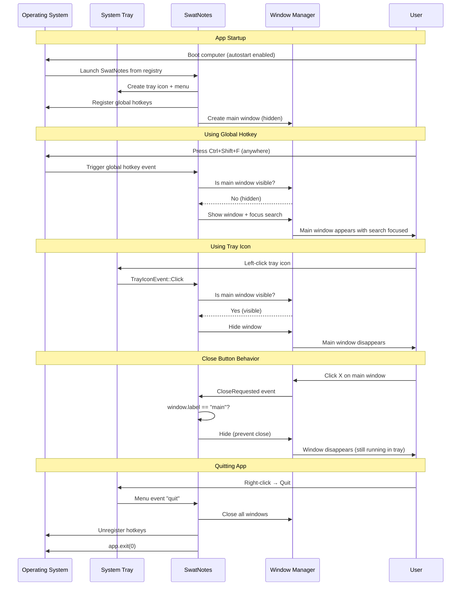

# Chapter 17: System Integration

**What You'll Learn**: How SwatNotes integrates deeply with your operating system through global hotkeys, system tray icons, window management,

 and autostart functionality—making it feel like a native part of your desktop environment, not just another app.

---

## Why System Integration Matters

Imagine using a notes app that:

- Requires you to Alt+Tab through all open windows to find it
- Has no keyboard shortcuts  
- Disappears completely when you click the X button
- Never appears in your system tray

You'd probably stop using it after a day.

**System integration** is what separates a professional desktop application from a clunky web app wrapper. It's the difference between an app that *works with* your workflow and one that *fights against* it.

**Mental Model**: Think of system integration as teaching your app the "local customs" of the operating system. Just like you'd learn social etiquette when visiting a new country, your app needs to learn how to behave like a native citizen of Windows.

---

## The Four Pillars of System Integration

SwatNotes integrates with the OS through four main mechanisms:

1. **Global Hotkeys**: Keyboard shortcuts that work even when the app isn't focused
2. **System Tray**: Icon in the notification area with right-click menu
3. **Window Management**: Hiding/showing windows without closing them
4. **Autostart**: Launching automatically when the OS boots

Each pillar serves a specific purpose in making the app feel "always available" without being intrusive.

---

## Global Hotkeys: System-Wide Keyboard Shortcuts

### What Are Global Hotkeys?

**Normal keyboard shortcuts** only work when the app is focused. Press `Ctrl+N` in your browser? New tab. Press it in VS Code? New file. Each app has its own shortcuts.

**Global hotkeys** (also called "system-wide shortcuts") work *regardless of which app is focused*. Press `Ctrl+Shift+N` anywhere on your desktop, and SwatNotes creates a new sticky note—even if you're currently in a browser, game, or video editor.

**Mental Model**: Global hotkeys are like a universal remote control for your app. You don't need to "switch channels" (Alt+Tab to the app) before pressing the button.

### How SwatNotes Implements Global Hotkeys

SwatNotes uses the `tauri-plugin-global-shortcut` plugin to register shortcuts with the operating system:

```rust
// src-tauri/src/app.rs
use tauri_plugin_global_shortcut::{GlobalShortcutExt, ShortcutState};

fn setup_global_hotkeys(app: &mut App) -> Result<()> {
    // Load user's configured hotkeys
    let hotkeys = settings_service.get_hotkeys().await?;

    // Register "New Note" hotkey (default: Ctrl+Shift+N)
    app.global_shortcut()
        .on_shortcut(&hotkeys.new_note, move |app, _shortcut, event| {
            if event.state == ShortcutState::Pressed {
                tracing::info!("New note hotkey triggered");
                
                // Create new sticky note window
                tauri::async_runtime::spawn(async move {
                    crate::commands::create_new_sticky_note(
                        app.clone(), 
                        app.state()
                    ).await?;
                });
            }
        })?;
    
    Ok(())
}
```

**Key Steps**:

1. **Load settings**: Read hotkey configuration from `settings.json`
2. **Register with OS**: Call `global_shortcut().on_shortcut()`
3. **Handle event**: Execute command when `ShortcutState::Pressed` fires
4. **Spawn async task**: Create window without blocking the event handler

### Default Hotkeys

SwatNotes ships with these default global hotkeys:

```rust
// src-tauri/src/services/settings.rs
impl Default for HotkeySettings {
    fn default() -> Self {
        Self {
            new_note: "Ctrl+Shift+N".to_string(),        // Create new sticky note
            toggle_note: "Ctrl+Shift+H".to_string(),     // Toggle last focused note
            open_search: "Ctrl+Shift+F".to_string(),     // Toggle main window
            open_settings: "Ctrl+Shift+,".to_string(),   // Toggle settings
            toggle_all_notes: "Ctrl+Shift+A".to_string(), // Show/hide all notes
            quick_capture: "Ctrl+Shift+V".to_string(),   // Create note from clipboard
        }
    }
}
```

**Why Ctrl+Shift+Letter?**

- `Ctrl+Letter` is usually taken by apps (Ctrl+C, Ctrl+V, etc.)
- `Ctrl+Shift+Letter` is less commonly used, reducing conflicts
- Consistent prefix (`Ctrl+Shift+`) makes shortcuts easier to remember

### Preventing Conflicts

What if another app is already using `Ctrl+Shift+N`? SwatNotes handles this:

```rust
// Unregister any existing hotkeys from previous instance or crash
for shortcut in [&hotkeys.new_note, &hotkeys.toggle_note, ...] {
    if app.global_shortcut().is_registered(shortcut) {
        tracing::warn!("Hotkey {} already registered, unregistering first", shortcut);
        app.global_shortcut().unregister(shortcut)?;
    }
}

// Now register our hotkeys
app.global_shortcut().on_shortcut(&hotkeys.new_note, handler)?;
```

**Why unregister first?**

- Previous app instance may have crashed without unregistering
- Another app might be squatting on "our" shortcut
- Clean slate ensures registration succeeds

**User control**: Users can change hotkeys in Settings to avoid conflicts. Changes require app restart to take effect.

### The Event Handler Pattern

Each hotkey handler follows the same pattern:

```rust
app.global_shortcut()
    .on_shortcut("Ctrl+Shift+N", move |app, _shortcut, event| {
        if event.state == ShortcutState::Pressed {  // Only on key press, not release
            tracing::info!("Hotkey triggered");
            
            // Spawn async task to avoid blocking
            tauri::async_runtime::spawn(async move {
                if let Err(e) = some_async_command(app.clone()).await {
                    tracing::error!("Command failed: {}", e);
                }
            });
        }
    })?;
```

**Pattern breakdown**:

1. **Check `ShortcutState::Pressed`**: Prevents double-triggering (press + release)
2. **Log the event**: Helps debugging ("Why didn't my hotkey work?")
3. **Spawn async task**: Avoid blocking the OS event loop
4. **Handle errors gracefully**: Log failures, don't crash

**Mental Model**: The hotkey handler is like a doorbell. When pressed, it spawns a worker to handle the request, then immediately returns to listening for the next ring.

---

## System Tray Integration

### What Is the System Tray?

The **system tray** is that section of your taskbar with tiny icons (Wi-Fi, volume, date/time, etc.). Apps that want to be "always accessible" place an icon there.

**SwatNotes' tray icon** provides:

- **Quick access**: Left-click toggles main window
- **Right-click menu**: All major functions without opening the app
- **Visual presence**: Reminder that the app is running in the background

**Mental Model**: The tray icon is like a butler who's always waiting in the corner. A quick gesture summons them, and they present you with options.

### Building the Tray Menu

SwatNotes creates a tray menu that mirrors the global hotkeys:

```rust
// src-tauri/src/app.rs
fn setup_tray(app: &mut App) -> Result<()> {
    use tauri::menu::{Menu, MenuItem};
    use tauri::tray::TrayIconBuilder;

    // Create menu items with hotkey hints
    let show_item = MenuItem::with_id(
        app, "show", "Toggle SwatNotes", true,
        Some("Ctrl+Shift+F")  // Show hotkey hint
    )?;
    
    let new_note_item = MenuItem::with_id(
        app, "new_note", "New Note", true,
        Some("Ctrl+Shift+N")
    )?;
    
    let settings_item = MenuItem::with_id(
        app, "settings", "Settings", true,
        Some("Ctrl+Shift+,")
    )?;
    
    let about_item = MenuItem::with_id(
        app, "about", "About", true, None
    )?;
    
    let separator = tauri::menu::PredefinedMenuItem::separator(app)?;
    
    let quit_item = MenuItem::with_id(
        app, "quit", "Quit", true, None
    )?;

    // Build menu
    let menu = Menu::with_items(app, &[
        &show_item,
        &new_note_item,
        &settings_item,
        &about_item,
        &separator,
        &quit_item,
    ])?;

    // Create tray icon
    let icon = app.default_window_icon()?.clone();
    
    TrayIconBuilder::new()
        .icon(icon)
        .menu(&menu)
        .show_menu_on_left_click(false)  // Menu only on right-click
        .tooltip("SwatNotes")
        .on_tray_icon_event(|tray, event| {
            // Handle clicks...
        })
        .on_menu_event(|app, event| {
            // Handle menu selections...
        })
        .build(app)?;

    Ok(())
}
```

**Menu structure**:

- **Toggle SwatNotes**: Show/hide main window
- **New Note**: Create sticky note
- **Settings**: Open settings window
- **About**: Show application info, version, and update check
- **---**: Separator (visual grouping)
- **Quit**: Exit application

**Why show hotkeys in the menu?**

- **Discoverability**: Users learn shortcuts exist
- **Memory aid**: Reminds users of the shortcut
- **Consistency**: Menu and hotkeys do the same thing

### Handling Tray Icon Clicks

The tray icon responds to both left-clicks and right-clicks:

```rust
.on_tray_icon_event(|tray, event| {
    use tauri::tray::{MouseButton, MouseButtonState, TrayIconEvent};
    
    match event {
        TrayIconEvent::Click {
            button: MouseButton::Left,
            button_state: MouseButtonState::Up,
            ..
        } => {
            // Left-click: Toggle main window
            let app = tray.app_handle();
            crate::commands::toggle_main_window(app)?;
        }
        TrayIconEvent::DoubleClick {
            button: MouseButton::Left,
            ..
        } => {
            // Double-click: Also toggle main window
            let app = tray.app_handle();
            crate::commands::toggle_main_window(app)?;
        }
        _ => {}  // Ignore other events
    }
})
```

**User expectations**:

- **Left-click**: Quick toggle (most common action)
- **Right-click**: Show menu (explore options)
- **Double-click**: Same as left-click (muscle memory from taskbar)

### Handling Menu Selections

When a user clicks a menu item, the `on_menu_event` handler fires:

```rust
.on_menu_event(|app, event| {
    match event.id.as_ref() {
        "show" => {
            crate::commands::toggle_main_window(app.clone())?;
        }
        "new_note" => {
            tauri::async_runtime::spawn(async move {
                crate::commands::create_new_sticky_note(
                    app.clone(), 
                    app.state()
                ).await?;
            });
        }
        "settings" => {
            crate::commands::toggle_settings_window(app.clone())?;
        }
        "about" => {
            crate::commands::toggle_about_window(app.clone())?;
        }
        "quit" => {
            app.exit(0);  // Graceful shutdown
        }
        _ => {}
    }
})
```

**Pattern**: Same commands as global hotkeys. The tray menu is just a graphical way to trigger the same functionality.

### The About Window

The About window provides application information accessible from the tray:

```rust
pub fn open_about_window(app: tauri::AppHandle) -> Result<()> {
    let config = WindowConfig {
        label: "about".to_string(),
        url: "about.html",
        title: "About - SwatNotes".to_string(),
        width: 400.0,
        height: 500.0,
        min_width: 350.0,
        min_height: 400.0,
    };

    let created = create_or_focus_window(&app, config)?;
    
    // Show window immediately (About is simple, no content to wait for)
    if created {
        if let Some(window) = app.get_webview_window("about") {
            let _ = window.show();
            let _ = window.set_focus();
        }
    }
    
    Ok(())
}
```

**About Window Contents**:

- Application name and icon
- Version number (from `Cargo.toml`)
- Brief description
- Developer information
- Data directory location (with button to open)
- Check for updates button

**Why a separate window instead of in Settings?**

- **Discoverability**: Users expect "About" in a separate location
- **Simplicity**: Settings focuses on configuration; About is informational
- **Convention**: Most apps separate Settings from About

---

## Window Management: Hide vs Close

### The Problem with "X" Closing the App

Traditional apps: Click **X** → app closes completely → have to relaunch from Start Menu.

This is fine for apps you use occasionally (Photoshop, Excel). It's **terrible** for apps you use constantly (Slack, Discord, notes apps).

**SwatNotes' approach**: Click **X** → window hides → app stays running in tray → click tray icon to restore.

**Mental Model**: Hiding is like putting your phone in your pocket. Closing is like turning it off. Most of the time, you want "in your pocket" not "off".

### Implementing Hide-to-Tray

Tauri provides a `CloseRequested` event that fires before a window closes:

```rust
// src-tauri/src/app.rs
app.on_window_event(|window, event| {
    if let tauri::WindowEvent::CloseRequested { api, .. } = event {
        let window_label = window.label();
        
        // Only hide main window, actually close others
        if window_label == "main" {
            window.hide().unwrap();
            api.prevent_close();  // Cancel the close operation
        }
        // Settings and sticky note windows close normally
    }
});
```

**Logic**:

- **Main window**: Hide instead of close
- **Other windows**: Close normally (settings, sticky notes)

**Why this distinction?**

- Main window is the "core" of the app (always needed)
- Settings/notes are "secondary" windows (can be recreated)

### Toggle vs Show/Hide

SwatNotes uses **toggle** behavior for most windows:

```rust
pub fn toggle_main_window(app: tauri::AppHandle) -> Result<()> {
    if let Some(window) = app.get_webview_window("main") {
        match window.is_visible() {
            Ok(true) => {
                // Currently visible → hide it
                window.hide()?;
            }
            Ok(false) => {
                // Currently hidden → show and focus
                window.emit("refresh-notes", ())?;  // Refresh data
                window.show()?;
                window.set_focus()?;
                window.emit("focus-search", ())?;  // Focus search bar
            }
            Err(_) => {}
        }
    }
    Ok(())
}
```

**Why toggle instead of separate show/hide commands?**

- **Simpler UX**: One hotkey does what you want (if visible → hide, if hidden → show)
- **Muscle memory**: Same key press works in both states
- **Fewer hotkeys needed**: No need for Ctrl+Shift+F to show AND Ctrl+Shift+G to hide

**Bonus**: When showing, emit events to refresh data and focus search. The window appears with up-to-date content and ready for input.

### Multi-Window Coordination

SwatNotes can have multiple windows open simultaneously:

- **1 main window**: Note list + search
- **N sticky note windows**: One per note
- **1 settings window**: Configuration

**Challenge**: How does "Toggle Note" know which note window to toggle?

**Solution**: Track the last focused note window:

```rust
// In AppState
pub last_focused_note_window: Arc<Mutex<Option<String>>>,

// When a note window gains focus
#[tauri::command]
pub fn set_last_focused_note_window(
    state: State<'_, AppState>,
    window_label: String,
) -> Result<()> {
    let mut last_focused = state.last_focused_note_window.lock()?;
    *last_focused = Some(window_label);
    Ok(())
}

// Toggle hotkey uses the stored label
#[tauri::command]
pub fn toggle_last_focused_note_window(
    app: tauri::AppHandle,
    state: State<'_, AppState>,
) -> Result<()> {
    let window_label = state.last_focused_note_window.lock()?.clone();
    
    if let Some(label) = window_label {
        if let Some(window) = app.get_webview_window(&label) {
            // Toggle visibility...
        }
    }
    Ok(())
}
```

**Flow**:

1. User clicks on sticky note window → window gains focus
2. Frontend calls `set_last_focused_note_window(window_label)`
3. Backend stores the label in AppState
4. Later, user presses `Ctrl+Shift+H` (toggle note hotkey)
5. Backend retrieves stored label and toggles that specific window

**Mental Model**: Like a browser's "Last Tab" feature. The app remembers which note you were working on and brings it back when you ask.

---

## Toggle All Notes: Grid Layout

The `Ctrl+Shift+A` hotkey shows all notes in a grid layout:

```rust
pub async fn toggle_all_note_windows(
    app: tauri::AppHandle,
    state: State<'_, AppState>,
) -> Result<()> {
    let notes = state.notes_service.list_notes().await?;
    
    // Determine if we should show or hide based on current state
    let should_show = /* check if any windows are visible */;
    
    if should_show {
        // Calculate grid layout
        let (screen_width, screen_height) = get_screen_dimensions(&app);
        let window_width = 400;
        let window_height = 500;
        let padding = 30;
        
        // How many columns fit on screen?
        let cols = ((screen_width - padding) / (window_width + padding)).max(1);
        
        // Position each window in a grid
        for (i, note) in notes.iter().enumerate() {
            let col = i % cols;
            let row = i / cols;
            let x = padding + (col * (window_width + padding));
            let y = padding + (row * (window_height + padding));
            
            // Create or show window at (x, y)
            let window = create_or_show_note_window(app, &note, x, y)?;
        }
    } else {
        // Hide all note windows
        for note in notes {
            if let Some(window) = app.get_webview_window(&format!("note-{}", note.id)) {
                window.hide()?;
            }
        }
    }
    
    Ok(())
}
```

**Grid calculation**:

- **Columns**: `screen_width / (window_width + padding)`
- **Row/Col for window i**: `row = i / cols`, `col = i % cols`
- **Position**: `x = padding + col * (width + padding)`, `y = padding + row * (height + padding)`

**Example** (1920x1080 screen, 400x500 windows, 30px padding):

- Columns: `(1920 - 30) / (400 + 30) = 4` columns per row
- Window 0: (30, 30)
- Window 1: (460, 30)
- Window 2: (890, 30)
- Window 3: (1320, 30)
- Window 4: (30, 560)
- ...

**Mental Model**: Like dealing cards into a grid. Start at top-left, move right until the row is full, then start a new row.

---

## Autostart: Launching on Boot

### Why Autostart Matters

Notes apps are most useful when they're **always available**. If you have to manually launch SwatNotes every time you boot your computer, you'll forget. Then you won't use it. Then it's useless.

**Autostart** = app launches automatically when the OS boots, ensuring it's always in the tray waiting for you.

### Windows Implementation

On Windows, autostart is controlled by the **Run registry key**:

```rust
#[cfg(target_os = "windows")]
fn set_autostart_impl(enabled: bool) -> Result<()> {
    use std::process::Command;

    let app_path = std::env::current_exe()?;
    let app_name = "SwatNotes";

    if enabled {
        // Add to startup registry
        let output = Command::new("reg")
            .args([
                "add",
                "HKCU\\Software\\Microsoft\\Windows\\CurrentVersion\\Run",
                "/v", app_name,
                "/t", "REG_SZ",
                "/d", &format!("\"{}\"", app_path.display()),
                "/f",  // Force (overwrite if exists)
            ])
            .output()?;

        if !output.status.success() {
            let error = String::from_utf8_lossy(&output.stderr);
            return Err(AppError::Generic(format!("Failed to enable autostart: {}", error)));
        }

        tracing::info!("Autostart enabled");
    } else {
        // Remove from startup registry
        let output = Command::new("reg")
            .args([
                "delete",
                "HKCU\\Software\\Microsoft\\Windows\\CurrentVersion\\Run",
                "/v", app_name,
                "/f",
            ])
            .output()?;

        // Don't fail if key doesn't exist (user never enabled autostart)
        if !output.status.success() {
            let error = String::from_utf8_lossy(&output.stderr);
            if !error.contains("unable to find") {
                tracing::warn!("Failed to disable autostart: {}", error);
            }
        }

        tracing::info!("Autostart disabled");
    }

    Ok(())
}
```

**Registry path**: `HKCU\Software\Microsoft\Windows\CurrentVersion\Run`

- **HKCU**: HKEY_CURRENT_USER (per-user, doesn't require admin)
- **Run**: Programs that launch at login

**Why use `reg.exe` instead of a Rust registry library?**

- **Reliability**: `reg.exe` ships with Windows, always works
- **Simplicity**: One command, no dependencies

---

## Settings UI: User Control

All system integration features are configurable via the Settings window:

### Hotkeys Tab

```typescript
// src/settings.ts
async function loadHotkeySettings() {
    const hotkeys = await invoke<HotkeySettings>('get_hotkey_settings');
    
    // Populate input fields
    document.getElementById('hotkey-new-note-input').value = hotkeys.new_note;
    document.getElementById('hotkey-toggle-note-input').value = hotkeys.toggle_note;
    // ... etc
}

async function saveHotkeySettings() {
    const hotkeys = {
        new_note: document.getElementById('hotkey-new-note-input').value,
        toggle_note: document.getElementById('hotkey-toggle-note-input').value,
        // ... collect all values
    };
    
    await invoke('update_hotkey_settings', { hotkeys });
    
    // Warn user that restart is required
    showAlert('Hotkey settings saved. Please restart the app for changes to take effect.', {
        title: 'Restart Required',
        type: 'warning'
    });
}
```

**User flow**:

1. Open Settings → Hotkeys tab
2. Click in "New Note" field
3. Press desired key combination (e.g., `Ctrl+Alt+N`)
4. Field displays "Ctrl+Alt+N"
5. Click "Save"
6. Restart app for changes to apply

**Why restart required?**

- Global hotkeys are registered once at app startup
- Re-registering during runtime is complex (unregister old, register new)
- Simpler to just require restart

### General Tab: Autostart

```typescript
// Load autostart status
const autostartCheckbox = document.getElementById('autostart-checkbox');
const settings = getSettings();  // From localStorage
autostartCheckbox.checked = settings.startWithWindows;

// Save autostart
autostartCheckbox.addEventListener('change', async (e) => {
    const enabled = e.target.checked;
    
    try {
        await invoke('set_autostart', { enabled });
        
        // Update local settings
        const settings = getSettings();
        settings.startWithWindows = enabled;
        saveSettings(settings);
        
        showAlert(
            enabled ? 'App will start with Windows' : 'App will not start with Windows',
            { type: 'success' }
        );
    } catch (error) {
        logger.error('Failed to set autostart', LOG_CONTEXT, error);
        showAlert('Failed to update autostart setting', { type: 'error' });
        // Revert checkbox
        e.target.checked = !enabled;
    }
});
```

**Pattern**: Optimistic UI with rollback on error.

1. User checks checkbox
2. Immediately call backend to update registry
3. If successful: Update localStorage, show success message
4. If failed: Uncheck checkbox, show error message

---

## Complete System Integration Flow

Here's how everything works together:



---

## Testing System Integration

### Manual Testing Checklist

**Global Hotkeys**:
- [ ] New note (`Ctrl+Shift+N`) creates sticky note from any app
- [ ] Toggle main window (`Ctrl+Shift+F`) shows/hides from desktop
- [ ] Custom hotkeys work after changing in Settings + restart
- [ ] Hotkeys don't conflict with other apps

**System Tray**:
- [ ] Icon appears in tray on startup
- [ ] Left-click toggles main window
- [ ] Right-click shows menu with correct hotkey hints
- [ ] "New Note" from menu creates sticky note
- [ ] "Quit" from menu exits app completely

**Window Management**:
- [ ] Clicking X on main window hides (doesn't close)
- [ ] App stays in tray after hiding main window
- [ ] Sticky notes close completely when X clicked
- [ ] Toggle all notes arranges windows in grid

**Autostart**:
- [ ] Checkbox in Settings enables/disables autostart
- [ ] App launches on boot when enabled
- [ ] App doesn't launch on boot when disabled

### Common Issues and Fixes

**Hotkey doesn't work**:
- Check if another app is using the same shortcut
- Restart app after changing hotkey settings
- Verify hotkey format (e.g., "Ctrl+Shift+N" not "Ctrl + Shift + N")

**Tray icon missing**:
- Check if OS has "hidden icons" tray (Windows 10/11)
- Ensure icon file exists in app resources
- Restart Windows Explorer (`taskkill /f /im explorer.exe`, `start explorer.exe`)

**Autostart not working**:
- Check registry: `reg query "HKCU\Software\Microsoft\Windows\CurrentVersion\Run"`
- Ensure path has no spaces (or is quoted)
- Try disabling/re-enabling autostart

**Window won't hide/show**:
- Check logs for `WindowEvent::CloseRequested` handling
- Verify window label matches expected value
- Ensure `window.is_visible()` returns correct state

---

## Performance and Resource Usage

### CPU Usage

**At idle** (app running in tray, no windows open):

- **CPU**: <0.1% (only listening for hotkey events)
- **Memory**: ~30-50 MB (Tauri WebView overhead)
- **Disk I/O**: 0 (no background tasks)

**Why so light?**

- Global hotkey listener is event-driven (not polling)
- Hidden windows consume minimal resources (WebView paused)
- No timers or intervals running at idle

**During active use** (main window open, typing):

- **CPU**: 1-3% (rendering, autosave debouncing)
- **Memory**: 100-150 MB (Quill editor, open notes)

### Startup Performance

**Cold start** (launching from zero):

- **Windows**: ~500-800ms
- **Main window ready**: +200-300ms (WebView initialization)

**Warm start** (already running, showing hidden window):

- **Window appears**: ~50-100ms (just unhiding)

**Why the difference?**

- Cold start: Load binary, initialize Tauri, create tray, register hotkeys, create window, load WebView
- Warm start: Just unhide existing window (already initialized)

**Optimization**: Keep main window created but hidden, rather than destroying/recreating it. Faster toggle response.

---

## Platform-Specific Considerations

### Windows

**Advantages**:
- Autostart works out of the box (registry)
- System tray is well-supported
- Global hotkeys work reliably

**Quirks**:
- Tray icon may appear in "hidden icons" overflow by default
- Some antivirus software flags registry writes (autostart)
- High DPI scaling can make tray icon blurry

---

## Key Takeaways

1. **Global hotkeys** make your app accessible from anywhere, eliminating Alt+Tab friction
2. **System tray** provides always-visible presence without cluttering the taskbar
3. **Hide-to-tray** behavior keeps the app running for instant access
4. **Toggle operations** simplify UX (one hotkey does "the right thing" based on state)
5. **Autostart** ensures the app is always available without manual launching
6. **Platform-specific code** is necessary for deep OS integration (Windows registry)
7. **User configurability** (Settings UI) gives power users control over hotkeys and behavior
8. **Event-driven architecture** keeps idle resource usage minimal
9. **Graceful degradation** handles conflicts (hotkey already registered, autostart fails)
10. **Restart requirements** are acceptable for system-level changes (hotkeys, autostart)

---

## What's Next?

You've now learned how SwatNotes integrates with the operating system to feel like a native citizen, not a foreign visitor. The app registers global hotkeys, lives in the system tray, manages multiple windows intelligently, and launches automatically on boot.

In the next chapter, we'll explore **Collections and Organization**: how SwatNotes lets users organize notes into hierarchical folders with colors, icons, and drag-and-drop sorting. You'll learn about parent-child relationships in databases, UI patterns for hierarchical data, and optimistic updates for smooth drag-and-drop experiences.
