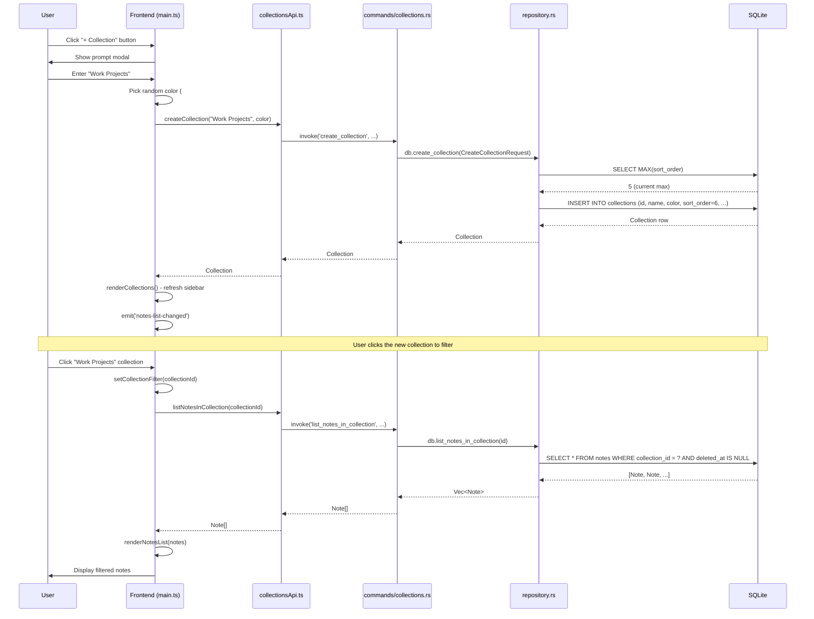

# Chapter 18: Collections and Organization

In previous chapters, we built a notes app that can create, edit, search, and remind. But as your notes grow from 10 to 100 to 1,000, you need a way to organize them. That's where **collections** come in.

Think of collections like folders on your desktop, but smarter. Each collection has a name, a color, and can hold any number of notes. Notes can exist without a collection (uncategorized), be moved between collections, and you can filter the entire app to show just one collection at a time.

In this chapter, we'll explore how SwatNotes implements a hierarchical organization system using collections, from the database schema to the dynamic sidebar UI.

---

## Why Collections Matter

**The Problem**: A flat list of notes is fine for 20 notes. At 200 notes, you're scrolling endlessly. Search helps, but only if you remember what you're looking for. You need *browsing*, not just *searching*.

**The Solution**: Collections provide visual structure:
- **Group by project**: "Work", "Personal", "Ideas"
- **Group by time**: "2026 Goals", "Q1 Tasks"
- **Group by topic**: "Recipes", "Meeting Notes", "Code Snippets"

Each collection gets a color-coded badge, making visual scanning instant. You see "12 notes in Work" and know where to look.

---

## The Collection Data Model

### Collection Struct

Located in `src-tauri/src/database/models.rs`:

```rust
/// A collection/folder for organizing notes
#[derive(Debug, Clone, Serialize, Deserialize, FromRow)]
pub struct Collection {
    pub id: String,                     // UUID
    pub name: String,                   // "Work Projects"
    pub description: Option<String>,    // Optional longer description
    pub color: String,                  // Hex color "#EF4444"
    pub icon: Option<String>,           // Icon name (future use)
    pub sort_order: i32,                // User-controlled ordering
    pub created_at: DateTime<Utc>,
    pub updated_at: DateTime<Utc>,
}
```

**Key Design Decisions**:

1. **`sort_order` field**: Users can reorder collections by dragging (not yet implemented in UI, but data model supports it). Each collection gets an incrementing `sort_order` value, and you can swap values to reorder.

2. **Color as hex string**: `"#EF4444"` instead of enum. Why? Flexibility. Users might want custom colors later. The frontend has a predefined palette, but the backend doesn't enforce it.

3. **Optional description**: Most users won't use it, but power users might add notes like "Client projects for Acme Corp".

4. **Optional icon**: Future feature. Currently defaults to `"folder"`, but could support emoji or icon names like `"briefcase"`, `"home"`, `"lightbulb"`.

### The Link: `collection_id` in Notes

Notes link to collections via a **nullable foreign key**:

```sql
ALTER TABLE notes ADD COLUMN collection_id TEXT 
    REFERENCES collections(id) ON DELETE SET NULL;
```

**What happens when a collection is deleted?**

```sql
ON DELETE SET NULL
```

All notes in that collection have `collection_id` set to `NULL`. They become uncategorized, not deleted. This prevents accidental data loss—deleting a folder shouldn't delete its contents.

**Index for performance**:

```sql
CREATE INDEX idx_notes_collection_id ON notes(collection_id);
```

Filtering 10,000 notes by collection? Without this index: full table scan (slow). With index: instant lookup.

---

## Database Schema: Migration 004

Located in `src-tauri/src/database/migrations/004_add_collections.sql`:

```sql
-- Collections/Folders table for organizing notes
CREATE TABLE IF NOT EXISTS collections (
    id TEXT PRIMARY KEY,
    name TEXT NOT NULL,
    description TEXT,
    color TEXT NOT NULL DEFAULT '#6B7280',  -- Default gray
    icon TEXT DEFAULT 'folder',
    sort_order INTEGER NOT NULL DEFAULT 0,
    created_at TEXT NOT NULL DEFAULT (datetime('now')),
    updated_at TEXT NOT NULL DEFAULT (datetime('now'))
);

-- Add collection_id to notes table
ALTER TABLE notes ADD COLUMN collection_id TEXT 
    REFERENCES collections(id) ON DELETE SET NULL;

-- Indexes for performance
CREATE INDEX IF NOT EXISTS idx_notes_collection_id ON notes(collection_id);
CREATE INDEX IF NOT EXISTS idx_collections_sort_order ON collections(sort_order);
```

**Why `idx_collections_sort_order`?**

When rendering the sidebar, we query:

```sql
SELECT * FROM collections ORDER BY sort_order ASC
```

Without the index, SQLite sorts all rows in memory. With the index, it reads them in order directly from the B-tree. For 100 collections, the difference is negligible. For 10,000 (unlikely but possible), the index matters.

---

## CRUD Operations: Commands and Repository

### 1. Create Collection

**Command** (`src-tauri/src/commands/collections.rs`):

```rust
#[tauri::command]
pub async fn create_collection(
    state: State<'_, AppState>,
    name: String,
    description: Option<String>,
    color: Option<String>,
    icon: Option<String>,
) -> Result<Collection> {
    tracing::info!("Creating collection: {}", name);

    let req = CreateCollectionRequest {
        name,
        description,
        color,
        icon,
    };

    let collection = state.db.create_collection(req).await?;
    tracing::info!("Collection created: {}", collection.id);
    Ok(collection)
}
```

**Repository** (`src-tauri/src/database/repository.rs`):

```rust
pub async fn create_collection(&self, req: CreateCollectionRequest) -> Result<Collection> {
    let id = Uuid::new_v4().to_string();
    let now = Utc::now();

    // Get the highest sort order and add 1
    let max_sort: Option<i32> = sqlx::query_scalar("SELECT MAX(sort_order) FROM collections")
        .fetch_optional(&self.pool)
        .await?
        .flatten();
    let sort_order = max_sort.unwrap_or(0) + 1;

    // Defaults for optional fields
    let color = req.color.unwrap_or_else(|| "#6B7280".to_string());
    let icon = req.icon.unwrap_or_else(|| "folder".to_string());

    let collection = sqlx::query_as::<_, Collection>(
        r#"
        INSERT INTO collections (id, name, description, color, icon, sort_order, created_at, updated_at)
        VALUES (?, ?, ?, ?, ?, ?, ?, ?)
        RETURNING *
        "#,
    )
    .bind(&id)
    .bind(&req.name)
    .bind(&req.description)
    .bind(&color)
    .bind(&icon)
    .bind(sort_order)
    .bind(now)
    .bind(now)
    .fetch_one(&self.pool)
    .await?;

    tracing::debug!("Created collection: {}", id);
    Ok(collection)
}
```

**Why calculate `sort_order` automatically?**

New collections should appear at the bottom of the list. We query `MAX(sort_order)` and add 1. If there are no collections, `max_sort` is `None`, so we default to 0 and the first collection gets `sort_order = 1`.

**Alternative approach**: Use `created_at` for ordering. But that prevents manual reordering. The `sort_order` field gives users control.

### 2. List Collections

**Query**:

```rust
pub async fn list_collections(&self) -> Result<Vec<Collection>> {
    let collections = sqlx::query_as::<_, Collection>(
        r#"
        SELECT * FROM collections ORDER BY sort_order ASC, created_at ASC
        "#,
    )
    .fetch_all(&self.pool)
    .await?;

    Ok(collections)
}
```

**Ordering**: First by `sort_order` (user-defined), then by `created_at` (tiebreaker). This ensures consistent ordering even if two collections have the same `sort_order` value.

### 3. Update Collection

Uses **dynamic SQL** with `QueryBuilder` (same pattern as updating notes):

```rust
pub async fn update_collection(&self, req: UpdateCollectionRequest) -> Result<Collection> {
    use sqlx::QueryBuilder;

    let now = Utc::now();

    let mut builder: QueryBuilder<sqlx::Sqlite> =
        QueryBuilder::new("UPDATE collections SET updated_at = ");
    builder.push_bind(now.to_rfc3339());

    if let Some(name) = &req.name {
        builder.push(", name = ");
        builder.push_bind(name.clone());
    }

    if let Some(description) = &req.description {
        builder.push(", description = ");
        builder.push_bind(description.clone());
    }

    if let Some(color) = &req.color {
        builder.push(", color = ");
        builder.push_bind(color.clone());
    }

    if let Some(icon) = &req.icon {
        builder.push(", icon = ");
        builder.push_bind(icon.clone());
    }

    if let Some(sort_order) = req.sort_order {
        builder.push(", sort_order = ");
        builder.push_bind(sort_order);
    }

    builder.push(" WHERE id = ");
    builder.push_bind(req.id.clone());

    let rows_affected = builder.build().execute(&self.pool).await?.rows_affected();

    if rows_affected == 0 {
        return Err(AppError::Generic(format!("Collection not found: {}", req.id)));
    }

    self.get_collection(&req.id).await
}
```

Only the fields provided in `UpdateCollectionRequest` are updated. Omitted fields stay unchanged.

### 4. Delete Collection

```rust
pub async fn delete_collection(&self, id: &str) -> Result<()> {
    let rows = sqlx::query("DELETE FROM collections WHERE id = ?")
        .bind(id)
        .execute(&self.pool)
        .await?
        .rows_affected();

    if rows == 0 {
        return Err(AppError::Generic(format!("Collection not found: {}", id)));
    }

    tracing::debug!("Deleted collection: {}", id);
    Ok(())
}
```

**What about the notes?**

Remember the foreign key constraint:

```sql
REFERENCES collections(id) ON DELETE SET NULL
```

SQLite automatically sets `collection_id = NULL` for all notes in the deleted collection. No orphaned data.

---

## Moving Notes Between Collections

### Update Note Collection

**Command**:

```rust
#[tauri::command]
pub async fn update_note_collection(
    state: State<'_, AppState>,
    note_id: String,
    collection_id: Option<String>,
) -> Result<Note> {
    tracing::info!("Updating note {} collection to {:?}", note_id, collection_id);
    state.db.update_note_collection(&note_id, collection_id.as_deref()).await
}
```

**Repository**:

```rust
pub async fn update_note_collection(
    &self,
    note_id: &str,
    collection_id: Option<&str>,
) -> Result<Note> {
    let now = Utc::now();

    let rows = sqlx::query(
        r#"
        UPDATE notes SET collection_id = ?, updated_at = ?
        WHERE id = ? AND deleted_at IS NULL
        "#,
    )
    .bind(collection_id)       // Can be Some("uuid") or None
    .bind(now)
    .bind(note_id)
    .execute(&self.pool)
    .await?
    .rows_affected();

    if rows == 0 {
        return Err(AppError::NoteNotFound(note_id.to_string()));
    }

    self.get_note(note_id).await
}
```

**Three use cases**:

1. **Move note to collection**: `collection_id = Some("uuid")`
2. **Remove note from collection**: `collection_id = None` (makes note uncategorized)
3. **Move note between collections**: `collection_id = Some("new-uuid")`

All handled by the same function. Passing `None` sets `collection_id = NULL` in SQL.

---

## Filtering: Viewing Notes by Collection

### List Notes in Collection

```rust
pub async fn list_notes_in_collection(&self, collection_id: &str) -> Result<Vec<Note>> {
    let notes = sqlx::query_as::<_, Note>(
        r#"
        SELECT * FROM notes
        WHERE collection_id = ? AND deleted_at IS NULL
        ORDER BY updated_at DESC
        "#,
    )
    .bind(collection_id)
    .fetch_all(&self.pool)
    .await?;

    Ok(notes)
}
```

### List Uncategorized Notes

```rust
pub async fn list_uncategorized_notes(&self) -> Result<Vec<Note>> {
    let notes = sqlx::query_as::<_, Note>(
        r#"
        SELECT * FROM notes
        WHERE collection_id IS NULL AND deleted_at IS NULL
        ORDER BY updated_at DESC
        "#,
    )
    .fetch_all(&self.pool)
    .await?;

    Ok(notes)
}
```

**Why a separate function for uncategorized?**

Could just filter in the frontend. But querying the database is more efficient:

- **Backend**: SQLite scans 10,000 notes, filters 200 uncategorized, sends 200 over IPC.
- **Frontend (alternative)**: Backend sends all 10,000 notes, JavaScript filters in memory.

Bandwidth and memory savings matter at scale.

### Count Notes in Collection

Used for displaying badge counts in the sidebar:

```rust
pub async fn count_notes_in_collection(&self, collection_id: &str) -> Result<i64> {
    let count: (i64,) = sqlx::query_as(
        r#"
        SELECT COUNT(*) FROM notes
        WHERE collection_id = ? AND deleted_at IS NULL
        "#,
    )
    .bind(collection_id)
    .fetch_one(&self.pool)
    .await?;

    Ok(count.0)
}
```

Returns a single integer. Tuple destructuring `count.0` extracts the value.

---

## Frontend: Collections UI

### Sidebar Structure

Located in `index.html`:

```html
<!-- Collections -->
<div class="mb-4">
  <div class="flex items-center justify-between mb-2">
    <button id="collections-toggle" class="flex items-center gap-1 hover:text-base-content">
      <svg id="collections-chevron" class="h-4 w-4 transition-transform text-base-content/70">
        <!-- Chevron icon -->
      </svg>
      <span class="font-bold text-base">Collections</span>
    </button>
    <button id="sidebar-add-collection-btn" class="btn btn-ghost btn-xs btn-circle">
      <!-- Plus icon -->
    </button>
  </div>

  <div id="collections-list" class="space-y-1 pb-2">
    <!-- Filter: All Notes -->
    <button id="filter-all-notes" class="w-full flex items-center justify-between px-3 py-1.5 rounded text-sm">
      <span>All Notes</span>
      <span id="all-notes-count" class="text-xs text-base-content/50">0</span>
    </button>

    <!-- Filter: Uncategorized -->
    <button id="filter-uncategorized" class="w-full flex items-center justify-between px-3 py-1.5 rounded text-sm">
      <span>Uncategorized</span>
      <span id="uncategorized-count" class="text-xs text-base-content/50">0</span>
    </button>

    <!-- Dynamic collections will be added here -->
    <div id="collections-items"></div>
  </div>
</div>
```

### Rendering Collections

Located in `src/main.ts`:

```typescript
async function renderCollections(): Promise<void> {
  try {
    const collections = await listCollections();
    const collectionsContainer = document.getElementById('collections-items');

    if (!collectionsContainer) return;

    // Get note counts
    const allNotes = await invoke<Note[]>('list_notes');
    const uncategorizedNotes = await listUncategorizedNotes();

    // Update counts
    const allNotesCount = document.getElementById('all-notes-count');
    const uncategorizedCount = document.getElementById('uncategorized-count');

    if (allNotesCount) allNotesCount.textContent = allNotes.length.toString();
    if (uncategorizedCount) uncategorizedCount.textContent = uncategorizedNotes.length.toString();

    // Render collection items
    collectionsContainer.innerHTML = collections.map(collection => {
      const count = allNotes.filter(n => n.collection_id === collection.id).length;
      const isActive = currentFilter === collection.id;

      return `
        <div class="collection-item group flex items-center gap-1" data-collection-id="${collection.id}">
          <button class="collection-btn flex-1 flex items-center gap-2 px-3 py-1.5 rounded text-sm text-base-content hover:bg-base-300 ${isActive ? 'bg-base-300' : ''}">
            <span class="w-3 h-3 rounded-full flex-shrink-0" style="background-color: ${collection.color}"></span>
            <span class="flex-1 text-left truncate">${escapeHtml(collection.name)}</span>
            <span class="text-xs text-base-content/50">${count}</span>
          </button>
          <button class="delete-collection-btn opacity-0 group-hover:opacity-100 btn btn-ghost btn-xs btn-circle text-error" title="Delete collection">
            <!-- Delete icon -->
          </button>
        </div>
      `;
    }).join('');

    // Add event listeners...
  } catch (error) {
    logger.error('Failed to render collections', LOG_CONTEXT, error);
  }
}
```

**Key UI patterns**:

1. **Color badge**: `<span style="background-color: ${collection.color}"></span>` creates a small colored circle next to each collection name. Visual scanning is instant.

2. **Note count**: Calculated in JavaScript by filtering `allNotes` array. Alternative: make separate backend calls to `count_notes_in_collection()` for each collection, but that's N queries instead of 1.

3. **Hover-to-delete**: Delete button is `opacity-0` by default, becomes visible on `.group:hover`. Prevents accidental clicks while keeping UI clean.

4. **Active state**: `currentFilter === collection.id` highlights the selected collection with `bg-base-300` background.

### Adding a Collection

```typescript
const addCollectionBtn = document.getElementById('sidebar-add-collection-btn');
addCollectionBtn?.addEventListener('click', async () => {
  const name = await showPrompt('Enter collection name:', {
    title: 'New Collection',
    input: { type: 'text', placeholder: 'Collection name' }
  });

  if (name && name.trim()) {
    try {
      // Pick a random color from the palette
      const color = COLLECTION_COLORS[Math.floor(Math.random() * COLLECTION_COLORS.length)];
      await createCollection(name.trim(), undefined, color);
      await renderCollections();
      await emit('notes-list-changed');
    } catch (error) {
      logger.error('Failed to create collection', LOG_CONTEXT, error);
      showAlert('Failed to create collection: ' + error, { title: 'Error', type: 'error' });
    }
  }
});
```

**Random color assignment**: 18 predefined colors in `COLLECTION_COLORS`. New collections get a random one. Users can change it later (when collection editing UI is implemented).

**Predefined Color Palette** (`src/utils/collectionsApi.ts`):

```typescript
export const COLLECTION_COLORS = [
  '#6B7280', // Gray (default)
  '#EF4444', // Red
  '#F97316', // Orange
  '#F59E0B', // Amber
  '#EAB308', // Yellow
  '#84CC16', // Lime
  '#22C55E', // Green
  '#10B981', // Emerald
  '#14B8A6', // Teal
  '#06B6D4', // Cyan
  '#0EA5E9', // Sky
  '#3B82F6', // Blue
  '#6366F1', // Indigo
  '#8B5CF6', // Violet
  '#A855F7', // Purple
  '#D946EF', // Fuchsia
  '#EC4899', // Pink
  '#F43F5E', // Rose
];
```

These are TailwindCSS color values. Chosen for good contrast against both light and dark themes.

### Filtering by Collection

```typescript
async function setCollectionFilter(filter: 'all' | 'uncategorized' | string): Promise<void> {
  currentFilter = filter;
  updateCollectionActiveStates();
  await refreshNotesList();
}
```

**How `refreshNotesList()` uses `currentFilter`**:

```typescript
async function refreshNotesList(): Promise<void> {
  let notes: Note[];

  if (currentFilter === 'all') {
    notes = await invoke('list_notes');
  } else if (currentFilter === 'uncategorized') {
    notes = await listUncategorizedNotes();
  } else {
    notes = await listNotesInCollection(currentFilter);
  }

  await renderNotesList(notes, notesListContainer, async (note) => {
    await loadNote(note.id);
  });
}
```

**Three code paths**:
- `'all'` → `list_notes()` (all notes)
- `'uncategorized'` → `listUncategorizedNotes()` (notes with `collection_id IS NULL`)
- UUID string → `listNotesInCollection(uuid)` (notes in specific collection)

Clean separation. No complex conditional logic.

---

## Complete Data Flow: Creating and Using a Collection

Here's the journey from user clicking "+ Collection" to filtering notes:



**Key moments**:

1. **sort_order calculation**: Query max, add 1. Ensures new collection appears at bottom.
2. **Random color**: Assigned in frontend, not backend. Backend just stores it.
3. **Filter state update**: `currentFilter = collectionId` changes app state, triggering re-render.
4. **SQL filtering**: Backend filters 10,000 notes down to 50, sends only 50 to frontend.

---

## Mental Models

### Collections as File Folders

**Real-world analogy**: Physical file folders in a filing cabinet.

- **Collection = Folder**: Each has a label ("Work", "Personal") and a color-coded tab.
- **Note = Document**: Can be in one folder or loose (uncategorized).
- **Moving note**: Pull document from one folder, put in another.
- **Deleting folder**: Documents spill out onto desk (become uncategorized), they're not thrown away.

This mental model explains `ON DELETE SET NULL`—deleting the folder doesn't destroy its contents.

### `sort_order` as Z-Index

**Programming analogy**: CSS `z-index` for layering.

- Each collection has a `sort_order` number (1, 2, 3, ...).
- Higher numbers appear later in the list (like higher z-index appears on top).
- Swapping two numbers swaps their visual positions.

Future feature: drag-and-drop reordering will swap `sort_order` values.

### Color as Visual Grep

**Unix tool analogy**: `grep` filters text, colors filter visually.

- Scanning a list of 50 notes is slow (reading each title).
- Scanning for red badges is instant (peripheral vision).
- "Where are my work notes?" → Look for red badges.

Human visual system processes color faster than text. Collections leverage this.

---

## Common Patterns and Best Practices

### 1. Counting vs Fetching

**Two ways to get note count for a collection**:

```typescript
// Option A: Fetch all notes, count in JavaScript
const notes = await listNotesInCollection(collectionId);
const count = notes.length;

// Option B: Ask database to count
const count = await countNotesInCollection(collectionId);
```

**When to use each?**

- **Option A**: If you need the notes anyway (e.g., displaying them).
- **Option B**: If you only need the count (e.g., sidebar badges).

SwatNotes uses **Option A** because it fetches all notes once for the sidebar counts, avoiding 10+ separate database calls.

### 2. Defensive Null Handling

**What if a note has `collection_id = "uuid-that-doesnt-exist"`?**

Scenario: User deletes collection, but a bug prevents `ON DELETE SET NULL` from firing. Orphaned reference.

**Frontend defense**:

```typescript
collections.forEach(collection => {
  const count = allNotes.filter(n => n.collection_id === collection.id).length;
  // If collection_id is invalid, filter returns 0, not error
});
```

JavaScript's loose equality (`===`) safely handles this. Invalid IDs just don't match, so count is 0.

**Backend defense**: The repository query for `list_notes_in_collection()` uses:

```sql
WHERE collection_id = ? AND deleted_at IS NULL
```

If the ID doesn't exist, you get an empty array, not an error. Graceful degradation.

### 3. XSS Prevention in Dynamic HTML

**Dangerous code**:

```typescript
// ❌ VULNERABLE to XSS
collectionsContainer.innerHTML = `
  <span>${collection.name}</span>
`;
```

If `collection.name = ""`, the script executes.

**Safe code**:

```typescript
// ✅ Escaped
collectionsContainer.innerHTML = `
  <span>${escapeHtml(collection.name)}</span>
`;
```

**escapeHtml function**:

```typescript
function escapeHtml(text: string): string {
  const div = document.createElement('div');
  div.textContent = text;  // Browser escapes automatically
  return div.innerHTML;
}
```

Clever trick: `textContent` treats input as plain text (no HTML parsing), then `innerHTML` retrieves the escaped version. Browser does the escaping for you.

---

## Edge Cases and Error Handling

### Edge Case 1: Deleting a Collection with Notes

**User action**: Delete "Work Projects" collection containing 50 notes.

**Expected behavior**:
1. Collection row deleted from `collections` table.
2. All 50 notes have `collection_id` set to `NULL`.
3. Notes appear in "Uncategorized" filter.

**Code**:

```rust
pub async fn delete_collection(&self, id: &str) -> Result<()> {
    let rows = sqlx::query("DELETE FROM collections WHERE id = ?")
        .bind(id)
        .execute(&self.pool)
        .await?
        .rows_affected();

    if rows == 0 {
        return Err(AppError::Generic(format!("Collection not found: {}", id)));
    }

    Ok(())
}
```

The `ON DELETE SET NULL` foreign key constraint handles step 2 automatically. SQLite triggers the cascade before the delete completes.

**Frontend handling**:

```typescript
await deleteCollection(collectionId);
if (currentFilter === collectionId) {
  currentFilter = 'all';  // Reset filter if viewing deleted collection
}
await renderCollections();
await refreshNotesList();
```

If you're viewing "Work Projects" when you delete it, the filter resets to "All Notes". Otherwise you'd see a blank screen.

### Edge Case 2: Moving Note to Non-Existent Collection

**User action**: API call `updateNoteCollection(noteId, "fake-uuid")`.

**What happens?**

```rust
UPDATE notes SET collection_id = ? WHERE id = ?
```

SQL executes successfully. The note now has `collection_id = "fake-uuid"`.

**Problem**: The note disappears from all collection filters (including uncategorized) because `collection_id IS NOT NULL` and doesn't match any real collection.

**Solution**: Add foreign key constraint validation:

```sql
ALTER TABLE notes ADD COLUMN collection_id TEXT 
    REFERENCES collections(id) ON DELETE SET NULL;
```

But SQLite doesn't enforce foreign keys by default! You must enable it:

```rust
sqlx::query("PRAGMA foreign_keys = ON")
    .execute(&pool)
    .await?;
```

SwatNotes enables this in `database/schema.rs`. With foreign keys enforced, trying to set `collection_id` to a non-existent UUID fails:

```
Error: FOREIGN KEY constraint failed
```

### Edge Case 3: Empty Collection Name

**User action**: Create collection with name `""` (empty string).

**Prevention**: Frontend validation:

```typescript
if (name && name.trim()) {
  await createCollection(name.trim(), ...);
}
```

Only non-empty strings (after trimming whitespace) are allowed.

**Backup validation**: Backend could add:

```rust
if req.name.trim().is_empty() {
    return Err(AppError::Generic("Collection name cannot be empty".to_string()));
}
```

Defense in depth—frontend prevents user error, backend prevents API abuse.

---

## Testing Collections

### Manual Test Checklist

```
[ ] Create collection "Work" with red color
[ ] Create collection "Personal" with blue color
[ ] Verify collections appear in sidebar ordered by creation
[ ] Create note in "Work" collection
[ ] Verify note appears when filtering by "Work"
[ ] Move note from "Work" to "Personal"
[ ] Verify note disappears from "Work" filter, appears in "Personal" filter
[ ] Remove note from collection (set collection_id to null)
[ ] Verify note appears in "Uncategorized"
[ ] Delete "Work" collection
[ ] Verify any notes in "Work" move to "Uncategorized"
[ ] Verify "Work" disappears from sidebar
[ ] Create 100 notes in "Personal"
[ ] Verify count badge shows "100"
[ ] Filter by "Personal"
[ ] Verify all 100 notes appear
[ ] Search within "Personal" filter
[ ] Verify search respects collection filter
```

### Unit Tests (Example)

**Testing `create_collection`**:

```rust
#[tokio::test]
async fn test_create_collection() {
    let db = setup_test_db().await;

    let req = CreateCollectionRequest {
        name: "Work Projects".to_string(),
        description: Some("Client work".to_string()),
        color: Some("#EF4444".to_string()),
        icon: Some("folder".to_string()),
    };

    let collection = db.create_collection(req).await.unwrap();

    assert_eq!(collection.name, "Work Projects");
    assert_eq!(collection.color, "#EF4444");
    assert_eq!(collection.sort_order, 1); // First collection

    // Create second collection
    let req2 = CreateCollectionRequest {
        name: "Personal".to_string(),
        description: None,
        color: None,
        icon: None,
    };

    let collection2 = db.create_collection(req2).await.unwrap();

    assert_eq!(collection2.sort_order, 2); // Second collection
    assert_eq!(collection2.color, "#6B7280"); // Default color
}
```

**Testing cascade delete**:

```rust
#[tokio::test]
async fn test_delete_collection_cascades_to_notes() {
    let db = setup_test_db().await;

    // Create collection
    let collection = db.create_collection(CreateCollectionRequest {
        name: "Test".to_string(),
        description: None,
        color: None,
        icon: None,
    }).await.unwrap();

    // Create note in collection
    let note = db.create_note(CreateNoteRequest {
        title: "Note in collection".to_string(),
        content_json: "{}".to_string(),
    }).await.unwrap();

    db.update_note_collection(&note.id, Some(&collection.id)).await.unwrap();

    // Verify note is in collection
    let note = db.get_note(&note.id).await.unwrap();
    assert_eq!(note.collection_id, Some(collection.id.clone()));

    // Delete collection
    db.delete_collection(&collection.id).await.unwrap();

    // Verify note collection_id is now NULL
    let note = db.get_note(&note.id).await.unwrap();
    assert_eq!(note.collection_id, None);
}
```

---

## Performance Considerations

### 1. Sidebar Rendering

**Naive approach**: For each collection, make a separate call to `count_notes_in_collection()`.

```typescript
// ❌ N+1 queries
for (const collection of collections) {
  const count = await countNotesInCollection(collection.id);
  // Render...
}
```

For 20 collections: 20 database queries over IPC. Slow.

**SwatNotes approach**: Fetch all notes once, count in JavaScript.

```typescript
// ✅ 1 query
const allNotes = await invoke<Note[]>('list_notes');
for (const collection of collections) {
  const count = allNotes.filter(n => n.collection_id === collection.id).length;
  // Render...
}
```

For 10,000 notes and 20 collections: JavaScript filtering is ~5ms total. Negligible.

**Trade-off**: Memory (send all notes over IPC) vs speed (1 query instead of 21). At 10,000 notes × 500 bytes each = 5 MB of JSON. Acceptable for desktop app.

### 2. Index on `collection_id`

Without index:

```sql
EXPLAIN QUERY PLAN SELECT * FROM notes WHERE collection_id = ?;
-- SCAN notes
```

Full table scan. For 10,000 notes: 10ms.

With index:

```sql
CREATE INDEX idx_notes_collection_id ON notes(collection_id);

EXPLAIN QUERY PLAN SELECT * FROM notes WHERE collection_id = ?;
-- SEARCH notes USING INDEX idx_notes_collection_id (collection_id=?)
```

Index seek. For 10,000 notes: <1ms.

**Disk space cost**: Each index entry is ~40 bytes (UUID + rowid). For 10,000 notes: 400 KB. Trivial.

### 3. `sort_order` for Manual Reordering

**Alternative**: Order by `created_at`.

```sql
SELECT * FROM collections ORDER BY created_at ASC;
```

Problem: User can't reorder collections.

**With `sort_order`**: Reordering is two UPDATEs:

```sql
-- Swap collection 1 (sort_order=3) and collection 2 (sort_order=7)
UPDATE collections SET sort_order = 7 WHERE id = 'collection1';
UPDATE collections SET sort_order = 3 WHERE id = 'collection2';
```

No need to renumber all collections. Just swap the two values.

---

## Future Enhancements

### 1. Nested Collections (Hierarchical Folders)

**Current limitation**: Collections are flat. No subcollections.

**Proposed schema**:

```sql
ALTER TABLE collections ADD COLUMN parent_id TEXT 
    REFERENCES collections(id) ON DELETE CASCADE;
```

Creates a tree:

```
Work Projects
  ├── Client A
  ├── Client B
Personal
  ├── 2026 Goals
  └── Recipes
```

**Complexity**: Recursive queries to get all descendants. SQLite supports Common Table Expressions (CTEs):

```sql
WITH RECURSIVE descendants AS (
  SELECT * FROM collections WHERE id = ?
  UNION ALL
  SELECT c.* FROM collections c
  JOIN descendants d ON c.parent_id = d.id
)
SELECT * FROM descendants;
```

Returns collection and all children/grandchildren.

### 2. Drag-and-Drop Reordering

**Current state**: Collections ordered by `sort_order`, but users can't change it.

**Proposed UI**: Drag collection up/down in sidebar, swap `sort_order` values.

**Implementation**:

```typescript
// On drop, swap sort_order values
const draggedCollection = collections.find(c => c.id === draggedId);
const targetCollection = collections.find(c => c.id === targetId);

await updateCollection(draggedId, { sort_order: targetCollection.sort_order });
await updateCollection(targetId, { sort_order: draggedCollection.sort_order });

await renderCollections(); // Refresh
```

Two updates, instant reorder.

### 3. Collection Color Picker

**Current state**: Random color on creation, no editing.

**Proposed UI**: Click collection → modal with color palette → update color.

**Implementation**: Already supported by backend:

```typescript
await updateCollection(collectionId, { color: '#EF4444' });
```

Just need UI.

### 4. Collection Icons

**Current state**: All collections have `icon = 'folder'`.

**Proposed feature**: Choose from icon set (briefcase, home, lightbulb, etc.) or emoji (📁, 💼, 💡).

**Implementation**:

```typescript
await createCollection("Work", undefined, "#EF4444", "💼");
```

Render in sidebar:

```html
<span class="text-lg">${collection.icon}</span>
```

Backend already supports it, just needs frontend UI.

---

## Key Takeaways

1. **Collections are folders with metadata**: name, color, sort_order, icon. Simple but powerful.

2. **Nullable foreign keys for safety**: `ON DELETE SET NULL` prevents data loss when deleting collections.

3. **Indexes for fast filtering**: `idx_notes_collection_id` makes collection queries instant even with thousands of notes.

4. **Dynamic SQL for flexible updates**: `QueryBuilder` handles partial updates cleanly.

5. **Frontend counting optimization**: Fetch all notes once, count in JavaScript. Avoids N+1 query problem.

6. **Color for visual scanning**: Human vision processes color faster than text. Use it.

7. **Defensive null handling**: Invalid collection IDs return empty arrays, not errors. Graceful degradation.

8. **XSS prevention**: Always escape user input in HTML. `escapeHtml()` is mandatory.

9. **`sort_order` enables flexibility**: Users can manually reorder collections without renumbering all.

10. **Cascade behavior is explicit**: `ON DELETE SET NULL` vs `ON DELETE CASCADE` choice matters. Document the decision.

---

## What We Built

In this chapter, we implemented a complete organizational system:

- **Backend**: CRUD operations for collections, note-to-collection linking, filtering queries.
- **Database**: `collections` table with foreign key constraints and indexes.
- **Frontend**: Dynamic sidebar with color-coded badges, filtering, and note counts.
- **UX**: Visual scanning via color, hover-to-delete, active state highlighting.

Collections transform SwatNotes from "a list of notes" to "an organized workspace". Notes can be grouped by project, topic, or time. The sidebar provides instant visual structure. And the entire system handles edge cases gracefully (deleting collections, invalid IDs, empty names).

**Next up**: Chapter 19 will cover the **auto-update system**—how SwatNotes checks for new versions, downloads updates, and safely installs them without corrupting the user's data.
