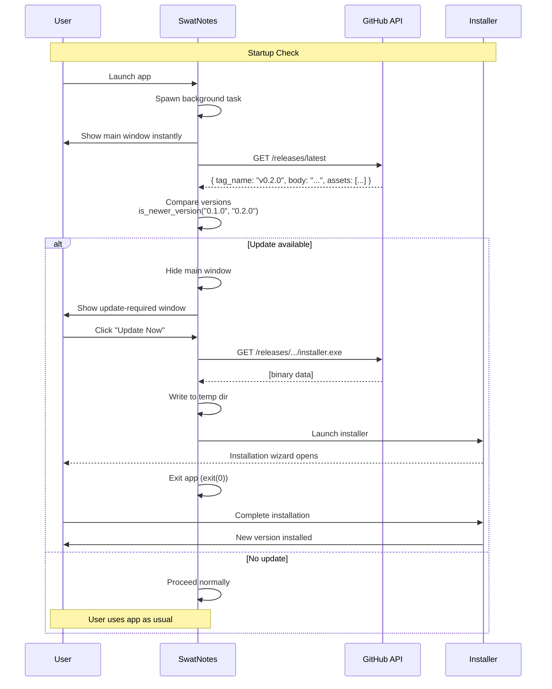

# Chapter 19: Auto-Update System

**What you'll build**: A complete auto-update system that checks for new versions from GitHub, downloads installers, and guides users through updates—all without requiring a separate update server.

---

## The Library Card Catalog Analogy

Imagine a library where:
- The **card catalog** (GitHub Releases) lists all available book editions
- Your **library card** (current version) shows which edition you have
- The **librarian** (update checker) compares your card to the catalog every time you visit
- If a newer edition exists, they **hand you a note** (update window) with details
- You can **check out the new book** (download installer) or continue with your current one

SwatNotes' update system works the same way: it checks GitHub for newer releases, compares versions, and presents users with a clear path to update.

---

## Why GitHub Releases Instead of a Custom Server?

You might wonder: "Why not host updates on our own server?" Let's compare:

### Traditional Update Server
```
┌─────────────┐     Check      ┌─────────────┐
│   Your App  │ ─────────────> │  Your Server│ (costs money)
└─────────────┘                └─────────────┘
                                      │
                                      v
                                ┌──────────┐
                                │ Database │ (track versions)
                                └──────────┘
                                      │
                                      v
                                ┌──────────┐
                                │  Storage │ (host installers)
                                └──────────┘
```

**Downsides:**
- Server hosting costs ($5-50/month)
- Database maintenance
- CDN for fast downloads
- Security patches
- Monitoring and uptime

### GitHub Releases (SwatNotes Approach)
```
┌─────────────┐    Check       ┌──────────────┐
│   Your App  │ ──────────────>│ GitHub API   │ (free, public repos)
└─────────────┘                └──────────────┘
                                      │
                                      v
                                ┌──────────────┐
                                │  Releases    │ (version tracking)
                                └──────────────┘
                                      │
                                      v
                                ┌──────────────┐
                                │  Artifacts   │ (installer hosting)
                                └──────────────┘
```

**Advantages:**
- Zero hosting costs (free for public repos)
- GitHub's CDN handles distribution globally
- Built-in version tracking
- Release notes storage
- 99.9% uptime guarantee
- Automatic checksums for security

For open-source apps, GitHub Releases is a no-brainer. Even for private repos, GitHub provides generous storage and bandwidth.

---

## Version Comparison: The Semver Strategy

Before downloading anything, we need to determine if a newer version exists. SwatNotes uses **semantic versioning** (semver):

```
v1.2.3
 │ │ └─ Patch (bug fixes)
 │ └─── Minor (new features, backward compatible)
 └───── Major (breaking changes)
```

### The Comparison Algorithm

Located in [`src-tauri/src/commands/updater.rs`](../src-tauri/src/commands/updater.rs#L52-L71):

```rust
/// Compare version strings (semver format: x.y.z)
fn is_newer_version(current: &str, remote: &str) -> bool {
    let parse_version = |v: &str| -> Vec<u32> {
        v.trim_start_matches('v')        // "v1.2.3" → "1.2.3"
            .split('.')                  // ["1", "2", "3"]
            .filter_map(|s| s.parse().ok())  // [1, 2, 3]
            .collect()
    };

    let current_parts = parse_version(current);  // [1, 2, 3]
    let remote_parts = parse_version(remote);    // [1, 3, 0]

    // Compare each part (major, minor, patch)
    for i in 0..3 {
        let c = current_parts.get(i).copied().unwrap_or(0);  // Current part or 0
        let r = remote_parts.get(i).copied().unwrap_or(0);   // Remote part or 0
        
        if r > c {
            return true;   // Remote is newer (e.g., 1.3.0 > 1.2.3)
        }
        if r < c {
            return false;  // Remote is older (e.g., 1.1.0 < 1.2.3)
        }
        // If equal, continue to next part
    }
    
    false  // Versions are identical
}
```

**Example Comparisons:**

| Current | Remote | Newer? | Reason |
|---------|--------|--------|--------|
| 1.2.3 | 1.3.0 | ✅ Yes | Minor version increased (2 → 3) |
| 1.2.3 | 1.2.4 | ✅ Yes | Patch version increased (3 → 4) |
| 1.2.3 | 2.0.0 | ✅ Yes | Major version increased (1 → 2) |
| 1.2.3 | 1.2.3 | ❌ No | Identical versions |
| 1.2.3 | 1.1.9 | ❌ No | Minor version decreased (2 → 1) |

### Why This Approach?

1. **Simple**: No external libraries needed (many crates exist, but this is 15 lines)
2. **Robust**: Handles missing parts (`v1` treated as `1.0.0`)
3. **Fast**: O(1) comparisons (always exactly 3 iterations)
4. **Predictable**: No edge cases with pre-release tags or build metadata

**Trade-off**: Doesn't handle pre-release versions like `1.2.3-alpha.1`. For production apps, that's usually fine since you only publish stable releases to GitHub.

---

## Fetching Release Data from GitHub

SwatNotes uses the **GitHub Releases API** to fetch the latest version. No authentication needed for public repositories.

### API Request Structure

Located in [`src-tauri/src/commands/updater.rs`](../src-tauri/src/commands/updater.rs#L73-L120):

```rust
/// Get the latest release from the GitHub API
async fn fetch_latest_release() -> Option<GitHubRelease> {
    tracing::info!("Checking for updates via GitHub API (public repository)...");

    let github_api_url = "https://api.github.com/repos/Swatto86/SwatNotes/releases/latest";

    // Create HTTP client with User-Agent (GitHub requires this)
    let client = match reqwest::Client::builder()
        .user_agent("SwatNotes-Updater")  // GitHub rejects requests without User-Agent
        .build()
    {
        Ok(client) => client,
        Err(e) => {
            tracing::warn!("Failed to create HTTP client: {}", e);
            return None;
        }
    };

    // Send GET request
    let response = match client.get(github_api_url).send().await {
        Ok(response) => response,
        Err(e) => {
            tracing::warn!("Failed to fetch from GitHub API: {}", e);
            return None;  // Gracefully degrade (no update notification)
        }
    };

    let status = response.status();
    if !status.is_success() {
        if status.as_u16() == 404 {
            tracing::info!("GitHub API returned 404 - no releases found");
        } else {
            tracing::warn!("GitHub API returned status: {}", status);
        }
        return None;
    }

    // Parse JSON response into GitHubRelease struct
    match response.json().await {
        Ok(release) => Some(release),
        Err(e) => {
            tracing::warn!("Failed to parse GitHub API response: {}", e);
            None
        }
    }
}
```

### GitHub Release JSON Structure

The API returns JSON like this (simplified):

```json
{
  "tag_name": "v0.2.0",
  "html_url": "https://github.com/Swatto86/SwatNotes/releases/tag/v0.2.0",
  "body": "- Added collections feature\n- Fixed search bug\n- Improved performance",
  "assets": [
    {
      "name": "SwatNotes_0.2.0_x64-setup.exe",
      "browser_download_url": "https://github.com/.../SwatNotes_0.2.0_x64-setup.exe"
    },
    {
      "name": "SwatNotes_0.2.0_x64.msi",
      "browser_download_url": "https://github.com/.../SwatNotes_0.2.0_x64.msi"
    }
  ]
}
```

### Deserializing to Rust Structs

SwatNotes defines structs to parse this JSON automatically via `serde`:

```rust
/// GitHub release information from the API
#[derive(Deserialize, Debug)]
struct GitHubRelease {
    tag_name: String,             // "v0.2.0"
    body: Option<String>,          // Release notes
    html_url: Option<String>,      // Link to release page
    #[serde(default)]
    assets: Vec<GitHubAsset>,      // Installer files
}

/// GitHub release asset
#[derive(Deserialize, Debug)]
struct GitHubAsset {
    name: String,                        // "SwatNotes_0.2.0_x64-setup.exe"
    browser_download_url: String,        // Direct download URL
}
```

**Key observations:**
- `body` and `html_url` are `Option<String>` (may be absent)
- `assets` defaults to empty vec if missing (`#[serde(default)]`)
- `serde` automatically maps JSON fields to struct fields (snake_case ↔ camelCase)

---

## The Update Check Command

The `check_for_update` command orchestrates the entire check process:

```rust
/// Check for available updates via the GitHub API
#[tauri::command]
pub async fn check_for_update(_app: AppHandle) -> Result<UpdateInfo> {
    tracing::info!("Checking for updates...");

    // Current version from Cargo.toml (injected at compile time)
    let current_version = env!("CARGO_PKG_VERSION").to_string();  // "0.1.0"
    let releases_url = "https://github.com/Swatto86/SwatNotes/releases".to_string();

    match fetch_latest_release().await {
        Some(release) => {
            let remote_version = release.tag_name.trim_start_matches('v').to_string();
            tracing::info!(
                "Current version: {}, Latest release: {}",
                current_version,
                remote_version
            );

            if is_newer_version(&current_version, &remote_version) {
                tracing::info!("Update available: v{}", remote_version);

                // Find the Windows installer asset (.msi or .exe)
                let installer_url = release
                    .assets
                    .iter()
                    .find(|a| {
                        a.name.ends_with(".msi")
                            || a.name.ends_with("-setup.exe")
                            || a.name.ends_with("_x64-setup.exe")
                    })
                    .map(|a| a.browser_download_url.clone());

                Ok(UpdateInfo {
                    available: true,
                    version: Some(remote_version),
                    body: release.body,              // Release notes
                    current_version,
                    release_url: release.html_url.or(Some(releases_url)),
                    installer_url,
                })
            } else {
                tracing::info!("No update available, current version is up to date");
                Ok(UpdateInfo {
                    available: false,
                    version: None,
                    body: None,
                    current_version,
                    release_url: Some(releases_url),
                    installer_url: None,
                })
            }
        }
        None => {
            tracing::info!("No release information available");
            Ok(UpdateInfo {
                available: false,
                version: None,
                body: Some("No releases found. You're running the latest development version.".to_string()),
                current_version,
                release_url: Some(releases_url),
                installer_url: None,
            })
        }
    }
}
```

### The UpdateInfo Response

Frontend receives this TypeScript interface ([`src/types.ts`](../src/types.ts#L110-L125)):

```typescript
export interface UpdateInfo {
  /** Whether an update is available */
  available: boolean;
  /** The version of the available update (if any) */
  version: string | null;
  /** Release notes/changelog for the update */
  body: string | null;
  /** Current application version */
  current_version: string;
  /** URL to the release page */
  release_url: string | null;
  /** URL to the installer asset (if available) */
  installer_url: string | null;
}
```

**Example response when update is available:**
```json
{
  "available": true,
  "version": "0.2.0",
  "body": "- Added collections\n- Fixed bugs",
  "current_version": "0.1.0",
  "release_url": "https://github.com/Swatto86/SwatNotes/releases/tag/v0.2.0",
  "installer_url": "https://github.com/.../SwatNotes_0.2.0_x64-setup.exe"
}
```

---

## Automatic Check on Startup

Every time SwatNotes starts, it checks for updates in the background. Located in [`src-tauri/src/app.rs`](../src-tauri/src/app.rs#L192-L251):

```rust
// Check for updates on startup
let app_handle = app.handle().clone();
tauri::async_runtime::spawn(async move {
    check_for_update_on_startup(app_handle).await;
});
```

**Why spawn a background task?**
- Update check is slow (network request, ~500ms-2s)
- App should start immediately, not wait for update check
- User sees main window instantly, update check happens silently

### The Startup Check Flow

```rust
async fn check_for_update_on_startup(app: tauri::AppHandle) {
    tracing::info!("Checking for updates on startup...");

    match crate::commands::check_for_update(app.clone()).await {
        Ok(update_info) => {
            if update_info.available {
                tracing::info!(
                    "Update available: {} -> {}",
                    update_info.current_version,
                    update_info.version.as_deref().unwrap_or("unknown")
                );

                // Hide the main window
                if let Some(main_window) = app.get_webview_window("main") {
                    let _ = main_window.hide();
                }

                // Create and show the update-required window
                match WebviewWindowBuilder::new(
                    &app,
                    "update-required",
                    WebviewUrl::App("update-required.html".into()),
                )
                .title("Update Required - SwatNotes")
                .inner_size(500.0, 550.0)
                .min_inner_size(450.0, 500.0)
                .resizable(false)
                .center()
                .visible(false)  // Hidden until JS calls show()
                .build()
                {
                    Ok(_window) => {
                        tracing::info!("Update-required window created successfully");
                    }
                    Err(e) => {
                        tracing::error!("Failed to create update-required window: {}", e);
                        // Fallback: show main window anyway
                        if let Some(main_window) = app.get_webview_window("main") {
                            let _ = main_window.show();
                        }
                    }
                }
            } else {
                // No update available, proceed normally
                tracing::info!("No update available");
            }
        }
        Err(e) => {
            // Check failed (network error, etc.), proceed normally
            tracing::warn!("Failed to check for updates: {}", e);
        }
    }
}
```

**Key behavior:**
1. Update check runs asynchronously (doesn't block app startup)
2. If update exists: hide main window, show update-required window
3. If no update: main window shows normally
4. If check fails: gracefully degrade (show main window, log warning)

**User experience:**
- User launches app
- Main window appears instantly
- ~1 second later, if update exists, main window hides and update prompt appears
- If network is down, app works normally (no annoying errors)

---

## The Update-Required Window

When an update is detected, SwatNotes shows a dedicated window blocking access until the user updates or quits.

### UI Layout

[`update-required.html`](../update-required.html) renders:

```
┌─────────────────────────────────────┐
│      🔔 Update Available            │
│  A new version of SwatNotes is ready│
│                                     │
│  Current: v0.1.0  →  New: v0.2.0   │
│                                     │
│  ┌─────────────────────────────┐   │
│  │ What's New:                  │   │
│  │                              │   │
│  │ - Added collections          │   │
│  │ - Fixed search bug           │   │
│  │ - Improved performance       │   │
│  └─────────────────────────────┘   │
│                                     │
│   [Quit]        [Update Now]       │
└─────────────────────────────────────┘
```

### Frontend Logic

Located in [`src/update-required.ts`](../src/update-required.ts):

```typescript
async function init(): Promise<void> {
  logger.info('Initializing update required window...', LOG_CONTEXT);

  // Apply saved theme
  const theme = localStorage.getItem('swatnotes-theme') || 'dark';
  document.documentElement.setAttribute('data-theme', theme);

  // Fetch update info from backend
  try {
    const updateInfo = await invoke<UpdateInfo>('check_for_update');

    // Populate version labels
    const currentVersionEl = document.getElementById('current-version');
    const newVersionEl = document.getElementById('new-version');
    const releaseNotesEl = document.getElementById('release-notes');

    if (currentVersionEl) {
      currentVersionEl.textContent = `v${updateInfo.current_version}`;
    }

    if (newVersionEl && updateInfo.version) {
      newVersionEl.textContent = `v${updateInfo.version}`;
    }

    if (releaseNotesEl) {
      const notes = updateInfo.body || 'No release notes available.';
      releaseNotesEl.textContent = notes;
    }
  } catch (error) {
    logger.error('Failed to load update info', LOG_CONTEXT, error);
  }

  setupEventHandlers();

  // Show window after content loads
  await currentWindow.show();
  await currentWindow.setFocus();
}
```

**Design choices:**
- Window starts hidden (`visible: false` in builder), shows after content loads (prevents flash)
- Theme applied from localStorage (consistent look across windows)
- Release notes displayed exactly as written in GitHub Release body
- Error handling: if update info fails to load, window still shows (with placeholder text)

---

## Downloading and Installing Updates

When the user clicks "Update Now", the `download_and_install_update` command runs:

```rust
#[tauri::command]
pub async fn download_and_install_update(app: AppHandle) -> Result<()> {
    tracing::info!("Starting update process...");

    // Re-check for updates (in case user waited hours before clicking)
    let update_info = check_for_update(app).await?;

    if !update_info.available {
        return Err(crate::error::AppError::Generic(
            "No update available".to_string(),
        ));
    }

    if let Some(installer_url) = update_info.installer_url {
        tracing::info!("Downloading installer from: {}", installer_url);

        // Extract filename from URL (e.g., "SwatNotes_0.2.0_x64-setup.exe")
        let filename = installer_url
            .split('/')
            .next_back()
            .unwrap_or("SwatNotes-setup.exe");

        // Download to temp directory
        let temp_dir = std::env::temp_dir();
        let installer_path = temp_dir.join(filename);

        tracing::info!("Downloading to: {:?}", installer_path);

        // Create HTTP client with redirect following and 5-minute timeout
        let client = reqwest::Client::builder()
            .user_agent("SwatNotes-Updater")
            .redirect(reqwest::redirect::Policy::limited(10))  // Follow up to 10 redirects
            .timeout(std::time::Duration::from_secs(300))      // 5-minute timeout
            .build()
            .map_err(|e| {
                crate::error::AppError::Generic(format!("Failed to create HTTP client: {}", e))
            })?;

        // Download installer
        tracing::info!("Sending download request...");
        let response = client.get(&installer_url).send().await.map_err(|e| {
            crate::error::AppError::Generic(format!("Failed to download installer: {}", e))
        })?;

        let status = response.status();
        tracing::info!("Download response status: {}", status);

        if !status.is_success() {
            return Err(crate::error::AppError::Generic(format!(
                "Download failed with status: {}",
                status
            )));
        }

        // Read response body as bytes
        let bytes = response.bytes().await.map_err(|e| {
            crate::error::AppError::Generic(format!("Failed to read installer bytes: {}", e))
        })?;

        tracing::info!("Downloaded {} bytes", bytes.len());

        // Write to temp file
        std::fs::write(&installer_path, &bytes).map_err(|e| {
            crate::error::AppError::Generic(format!("Failed to write installer: {}", e))
        })?;

        tracing::info!("Installer downloaded successfully, launching...");

        // Launch the installer (Windows-specific)
        let _ = Command::new("cmd")
            .args(["/C", "start", "", installer_path.to_str().unwrap_or("")])
            .spawn();

        return Ok(());
    }

    // Fallback: no installer found, open release page in browser
    if let Some(release_url) = update_info.release_url {
        tracing::info!("No installer found, opening release page: {}", release_url);

        let _ = Command::new("cmd")
            .args(["/C", "start", "", &release_url])
            .spawn();
    }

    Ok(())
}
```

### Why Download to Temp Directory?

```rust
let temp_dir = std::env::temp_dir();  // C:\Users\<user>\AppData\Local\Temp
let installer_path = temp_dir.join(filename);
```

**Advantages:**
1. **No permissions needed**: Users can always write to their temp directory
2. **Auto-cleanup**: Windows eventually deletes old temp files (or user can manually clean)
3. **Standard location**: Familiar to users, not hidden in app directories

**Alternative (rejected)**: Download to app data directory (`C:\Users\<user>\AppData\Roaming\swatnotes\updates\`)
- **Downside**: Manual cleanup required (orphaned installers accumulate)
- **Upside**: Easier to find for advanced users (but temp dir is fine for installers)

### Launching the Installer

Windows-specific command:

```rust
Command::new("cmd")
    .args(["/C", "start", "", installer_path.to_str().unwrap_or("")])
    .spawn();
```

**What this does:**
- `cmd /C` executes a single command and exits
- `start ""` opens the file with default handler (Windows shell)
- Empty string (`""`) is the window title (unused but required by `start` syntax)
- `installer_path` is the file to open (the `.exe` or `.msi`)

**Result:** Windows opens the installer, SwatNotes can exit, user completes installation manually.

**Cross-platform note:** On Linux/macOS, you'd use `xdg-open` or `open` respectively. SwatNotes currently targets Windows only, but the pattern is similar.

---

## Frontend Update Flow

The update button in [`src/update-required.ts`](../src/update-required.ts#L77-L115) handles the download UX:

```typescript
updateBtn?.addEventListener('click', async () => {
  try {
    // Disable button to prevent double-clicks
    updateBtn.setAttribute('disabled', 'true');
    
    // Show loading spinner
    updateBtn.innerHTML = `
      <svg class="animate-spin" xmlns="http://www.w3.org/2000/svg" width="16" height="16" viewBox="0 0 24 24">
        <circle cx="12" cy="12" r="10" stroke-opacity="0.25"></circle>
        <path d="M12 2a10 10 0 0 1 10 10" stroke-opacity="1"></path>
      </svg>
      Downloading...
    `;

    logger.info('Starting update download and install', LOG_CONTEXT);
    await invoke('download_and_install_update');

    // Success: installer launched
    updateBtn.innerHTML = `
      <svg xmlns="http://www.w3.org/2000/svg" width="16" height="16" viewBox="0 0 24 24">
        <path d="M22 11.08V12a10 10 0 1 1-5.93-9.14"></path>
        <polyline points="22 4 12 14.01 9 11.01"></polyline>
      </svg>
      Opening Download...
    `;

    // Give user time to see the message, then quit
    setTimeout(async () => {
      await exit(0);
    }, 2000);
    
  } catch (error) {
    const errorMessage = error instanceof Error ? error.message : String(error);
    logger.error('Failed to download update: ' + errorMessage, LOG_CONTEXT, error);
    
    // Re-enable button
    updateBtn.removeAttribute('disabled');
    updateBtn.innerHTML = `
      <svg xmlns="http://www.w3.org/2000/svg" width="16" height="16" viewBox="0 0 24 24">
        <circle cx="12" cy="12" r="10"></circle>
        <line x1="12" y1="8" x2="12" y2="12"></line>
        <line x1="12" y1="16" x2="12.01" y2="16"></line>
      </svg>
      Retry Download
    `;
    
    // Show error in release notes area
    const releaseNotesEl = document.getElementById('release-notes');
    if (releaseNotesEl) {
      releaseNotesEl.textContent = `Download failed: ${errorMessage}\n\nPlease try again or download manually from GitHub.`;
      releaseNotesEl.style.color = 'oklch(var(--er))';  // DaisyUI error color
    }
  }
});
```

**UX flow:**
1. User clicks "Update Now"
2. Button shows spinner + "Downloading..." (instant feedback)
3. Backend downloads installer (may take 10-60 seconds for 50-100 MB file)
4. Success: Button shows checkmark + "Opening Download..."
5. App waits 2 seconds (user sees success message)
6. App exits via `exit(0)` (user installs new version)

**Error handling:**
- If download fails (network error, 404, timeout), button re-enables as "Retry Download"
- Error message appears in red where release notes were
- User can retry or manually visit GitHub

---

## Release Notes Flow

One of the coolest parts of this system: release notes flow seamlessly from developer to user.

### The Complete Journey

```
Developer                    GitHub                     User
────────────────────────────────────────────────────────────────

1. Run script:
update-application.ps1
   -Version "0.2.0"
   -Notes "Fixed bugs"
                    ─────>  2. Creates Git tag
                            with annotation:
                            "Fixed bugs"
                            
                    ─────>  3. Pushes tag to GitHub
                            
                            4. GitHub Actions triggers
                            (build & release workflow)
                            
                            5. Creates GitHub Release:
                               - Tag: v0.2.0
                               - Body: "Fixed bugs"
                               - Assets: installers
                                                ────> 6. App checks API
                                                      GET /releases/latest
                                                      
                                                ────> 7. Displays in UI:
                                                      "What's New:
                                                       Fixed bugs"
```

### The Release Script

Located in [`update-application.ps1`](../../update-application.ps1):

```powershell
# Usage: .\update-application.ps1 -Version "0.2.0" -Notes "Bug fixes"

# Update Cargo.toml version
$cargoContent = Get-Content $cargoToml -Raw
$cargoContent = $cargoContent -replace '(?m)^version = "[^"]+"', "version = `"$Version`""
Set-Content $cargoToml $cargoContent

# Update tauri.conf.json version
$tauriJson = Get-Content $tauriConf | ConvertFrom-Json
$tauriJson.version = $Version
$tauriJson | ConvertTo-Json -Depth 10 | Set-Content $tauriConf

# Commit version bump
git add $cargoToml $tauriConf
git commit -m "chore: bump version to $Version"

# Create annotated Git tag with release notes
$tempFile = [System.IO.Path]::GetTempFileName()
Set-Content $tempFile $Notes -NoNewline
git tag -a "v$Version" -F $tempFile  # Annotated tag stores notes
Remove-Item $tempFile

# Push to GitHub (triggers CI/CD)
git push origin HEAD
git push origin "v$Version"
```

**Why annotated tags?**
- `git tag -a` stores a message (the release notes)
- GitHub Actions can extract this message: `git tag -l --format='%(contents)' $TAG`
- The CI/CD workflow copies it to the GitHub Release body
- The app fetches it via the API

**Alternative (rejected)**: Manually create GitHub Releases via web UI
- **Downside**: Error-prone, requires multiple steps, easy to forget notes
- **Upside**: None (script is faster and ensures consistency)

---

## Complete Update Flow Diagram



---

## Error Handling and Graceful Degradation

The update system is designed to **never break** the app experience.

### Failure Scenarios

| Failure | Behavior | User Impact |
|---------|----------|-------------|
| GitHub API unreachable | Return `None`, log warning | App starts normally |
| API returns 404 | Return `None`, log "no releases" | App starts normally |
| API returns invalid JSON | Return `None`, log parse error | App starts normally |
| Version comparison fails | Treat as "no update" | App starts normally |
| Installer download fails | Show "Retry" button + error message | User can retry or visit GitHub |
| Installer download timeout | Show timeout error | User can retry or download manually |
| No installer found | Open release page in browser | User downloads manually |

**Key principle**: Update failures are **warnings**, not **errors**. The app continues working.

### Logging for Debugging

Every step logs to `tracing`:

```rust
tracing::info!("Checking for updates via GitHub API...");
tracing::info!("Current version: {}, Latest release: {}", current, remote);
tracing::info!("Update available: v{}", version);
tracing::info!("Downloading installer from: {}", url);
tracing::info!("Downloaded {} bytes", size);
tracing::warn!("Failed to fetch from GitHub API: {}", error);
```

**Benefit for debugging:**
- User reports "update didn't work"
- Developer asks for logs (`swatnotes.log` in app data directory)
- Logs reveal exact failure: network timeout, 404, parse error, etc.
- Developer can reproduce or advise workaround

---

## Security Considerations

### HTTPS Only

```rust
let github_api_url = "https://api.github.com/...";  // Not http://
```

**Why:** HTTPS prevents man-in-the-middle attacks where an attacker could serve a malicious installer.

**GitHub guarantee:** All GitHub URLs use HTTPS with valid certificates.

### No Code Execution Until User Confirms

```rust
// Downloads file but doesn't auto-execute
std::fs::write(&installer_path, &bytes)?;

// User must manually run installer (or we launch it with consent)
Command::new("cmd").args(["/C", "start", "", path]).spawn();
```

**Pattern:** App downloads installer, user sees Windows UAC prompt, user approves installation.

**Why not auto-install silently?**
- Requires admin privileges (bad UX, security risk)
- Users should be aware of updates (transparency)
- Windows Installer handles rollback/repair (better than custom logic)

### Installer Signing (Future Work)

Currently, SwatNotes installers are **unsigned** (shows "Unknown Publisher" in Windows).

**To fix:**
1. Purchase code signing certificate ($200-400/year)
2. Sign installers in CI/CD: `signtool sign /f cert.pfx /p password installer.exe`
3. Windows shows "Verified Publisher: Your Name" instead of warning

**Trade-off:** Cost vs. user trust. For open-source projects, unsigned is common (users can inspect source code).

---

## Testing the Update System

### Manual Testing Checklist

1. **Simulate older version:**
   - Edit `src-tauri/Cargo.toml`: `version = "0.0.1"`
   - Run app
   - Should show update-required window (if GitHub has v0.1.0+)

2. **Test download:**
   - Click "Update Now"
   - Verify installer downloads to temp dir
   - Verify installer launches

3. **Test error handling:**
   - Disconnect internet
   - Launch app
   - Should start normally (no crash)
   - Logs should show "Failed to fetch from GitHub API"

4. **Test fallback:**
   - Temporarily rename installer asset on GitHub (or point to fake repo)
   - Click "Update Now"
   - Should open release page in browser (fallback)

5. **Test version comparison:**
   ```rust
   assert!(is_newer_version("0.1.0", "0.2.0"));  // true
   assert!(!is_newer_version("0.2.0", "0.1.0")); // false
   assert!(!is_newer_version("0.2.0", "0.2.0")); // false
   ```

### Automated Testing

You could write integration tests:

```rust
#[tokio::test]
async fn test_fetch_latest_release() {
    let release = fetch_latest_release().await;
    assert!(release.is_some(), "Should fetch GitHub release");
    
    let release = release.unwrap();
    assert!(release.tag_name.starts_with("v"), "Tag should start with 'v'");
    assert!(!release.assets.is_empty(), "Should have installer assets");
}

#[test]
fn test_version_comparison() {
    assert_eq!(is_newer_version("1.0.0", "1.0.1"), true);
    assert_eq!(is_newer_version("1.0.1", "1.0.0"), false);
    assert_eq!(is_newer_version("1.0.0", "1.0.0"), false);
    assert_eq!(is_newer_version("0.9.9", "1.0.0"), true);
}
```

**Note:** Testing real GitHub API requires network (flaky in CI). Consider mocking with `mockito` crate for deterministic tests.

---

## Performance Characteristics

### Update Check Timing

| Operation | Duration | Notes |
|-----------|----------|-------|
| GitHub API request | 200-1000ms | Depends on network latency |
| Version comparison | <1ms | Simple integer comparison |
| JSON parsing | <5ms | Small payload (~5 KB) |
| Total check | ~500ms | Usually under 1 second |

**Optimization:** Check happens in background, doesn't block app startup.

### Download Timing

| Installer Size | Download Time | Notes |
|----------------|---------------|-------|
| 50 MB (typical) | 5-30 seconds | Depends on internet speed |
| 100 MB (large) | 10-60 seconds | Heavy assets or debug builds |

**Timeout:** 5 minutes (300 seconds) prevents indefinite hangs.

### Memory Usage

- **Update check**: ~2 MB (HTTP client + JSON buffer)
- **Download**: ~50-100 MB (installer held in memory before writing to disk)
- **Peak total**: ~100 MB during download (acceptable for desktop app)

**Alternative (memory-optimized)**: Stream download directly to file instead of buffering in memory:

```rust
let mut file = File::create(&installer_path)?;
let mut stream = response.bytes_stream();
while let Some(chunk) = stream.next().await {
    file.write_all(&chunk?)?;
}
```

**Trade-off:** Streaming adds complexity, but current approach works fine for <100 MB files on modern PCs.

---

## Common Mistakes and Fixes

### Mistake 1: Blocking App Startup

```rust
// ❌ BAD: Blocks app startup for 1-2 seconds
pub fn run() {
    let update_info = check_for_update(app).await?;
    // App waits here before showing window
}
```

**Fix:** Spawn background task:

```rust
// ✅ GOOD: App starts instantly
tauri::async_runtime::spawn(async move {
    check_for_update_on_startup(app_handle).await;
});
```

### Mistake 2: Crashing on Network Errors

```rust
// ❌ BAD: Crashes if GitHub API is down
let response = client.get(url).send().await?;  // Propagates error to caller
```

**Fix:** Return `Option` and gracefully degrade:

```rust
// ✅ GOOD: Returns None, app continues
let response = match client.get(url).send().await {
    Ok(r) => r,
    Err(e) => {
        tracing::warn!("Failed to fetch: {}", e);
        return None;
    }
};
```

### Mistake 3: Forgetting User-Agent Header

```rust
// ❌ BAD: GitHub rejects requests without User-Agent
let response = reqwest::get(url).await?;
```

**Fix:** Set User-Agent:

```rust
// ✅ GOOD: GitHub accepts request
let client = reqwest::Client::builder()
    .user_agent("SwatNotes-Updater")
    .build()?;
```

**Why:** GitHub API requires `User-Agent` header to identify the client (prevents abuse).

### Mistake 4: Not Handling Missing Installers

```rust
// ❌ BAD: Panics if no installer found
let installer_url = release.assets[0].browser_download_url;
```

**Fix:** Use `.find()` and fallback:

```rust
// ✅ GOOD: Opens release page if no installer
let installer_url = release.assets.iter()
    .find(|a| a.name.ends_with(".exe"))
    .map(|a| a.browser_download_url.clone());

if let Some(url) = installer_url {
    // Download
} else {
    // Fallback to browser
}
```

---

## Future Enhancements

### 1. Delta Updates (Differential Patches)

**Current:** Download entire 50 MB installer even if only 1 MB changed.

**Improvement:** Binary diff between versions:
```
Old version: 50 MB
New version: 50 MB
Diff: 1.2 MB  ← Only download this
```

**Tools:** `bsdiff` (industry standard), `courgette` (Chrome's patcher)

**Trade-off:** Complexity vs. bandwidth savings (matter less with fast internet).

---

### 2. Automatic Background Installation

**Current:** User must manually run installer, restart app.

**Improvement:** Silent install + auto-restart:
```rust
// Windows-specific
Command::new("msiexec")
    .args(["/i", installer_path, "/quiet", "/qn"])
    .spawn();
```

**Challenges:**
- Requires admin privileges (UAC prompt)
- No rollback if installation fails mid-process
- Less transparent to user

**Verdict:** Current approach (user-initiated) is safer for desktop apps.

---

### 3. Rollback on Broken Updates

**Current:** If new version crashes, user must manually reinstall old version.

**Improvement:** Automatic rollback:
1. Before updating, copy current version to `app_data/rollback/`
2. On first launch, check if app crashes
3. If crash detected, restore from rollback directory

**Complexity:** Crash detection is tricky (infinite loops, silent failures, etc.).

---

### 4. Configurable Update Channel

**Current:** Single release channel (stable only).

**Improvement:** Let users opt into beta/nightly builds:
```rust
let channel = settings.update_channel;  // "stable", "beta", "nightly"
let api_url = match channel {
    "stable" => "/releases/latest",
    "beta" => "/releases?prerelease=true",
    "nightly" => "/actions/artifacts",  // CI builds
};
```

**Use case:** Power users testing new features, developers dogfooding changes.

---

### 5. Checksum Verification

**Current:** Trust GitHub CDN (HTTPS prevents tampering in transit).

**Improvement:** Verify installer checksum:
```rust
let expected_sha256 = release.assets[0].sha256;  // If GitHub provides this
let actual_sha256 = calculate_sha256(&installer_bytes);
assert_eq!(expected_sha256, actual_sha256, "Checksum mismatch!");
```

**Benefit:** Detect corrupted downloads (rare but possible).

**GitHub limitation:** GitHub doesn't provide checksums in API response (would need to store separately).

---

## Key Takeaways

1. **GitHub Releases = Free Update Server**: No hosting costs, global CDN, built-in versioning
2. **Semantic versioning**: Simple, predictable comparison (`x.y.z`)
3. **Background checking**: Never block app startup for network requests
4. **Graceful degradation**: Update failures don't break the app
5. **User-initiated installation**: Let users control when to update (transparency + safety)
6. **Release notes flow**: Git tag annotation → GitHub Release body → App UI (seamless)
7. **Platform-specific launchers**: Windows uses `cmd /C start`, Linux/macOS differ
8. **Logging is essential**: Trace every step for debugging user issues

---

## Testing Checklist

Before shipping an update system, verify:

- [ ] Update check doesn't block app startup
- [ ] App works offline (no crashes if GitHub unreachable)
- [ ] Version comparison handles edge cases (0.9.9 → 1.0.0, 1.2.3 → 1.2.3)
- [ ] Installer downloads to temp directory (not app directory)
- [ ] Installer launches correctly on Windows
- [ ] Update-required window shows release notes
- [ ] Download errors display retry button
- [ ] Logs contain enough detail for debugging
- [ ] User can quit app instead of updating (no forced updates)
- [ ] Release script updates Cargo.toml and tauri.conf.json

---

## Next Steps

You now have a production-ready auto-update system! But there's more to learn:

- **Chapter 20**: Error handling patterns (custom error types, propagation strategies)
- **Chapter 21**: Testing strategies (unit, integration, E2E tests)
- **Chapter 22**: Building and distribution (CI/CD, code signing, installers)

In the next chapter, we'll explore error handling in depth—how to design error types, propagate errors gracefully, and present actionable error messages to users.

---

**End of Chapter 19**
