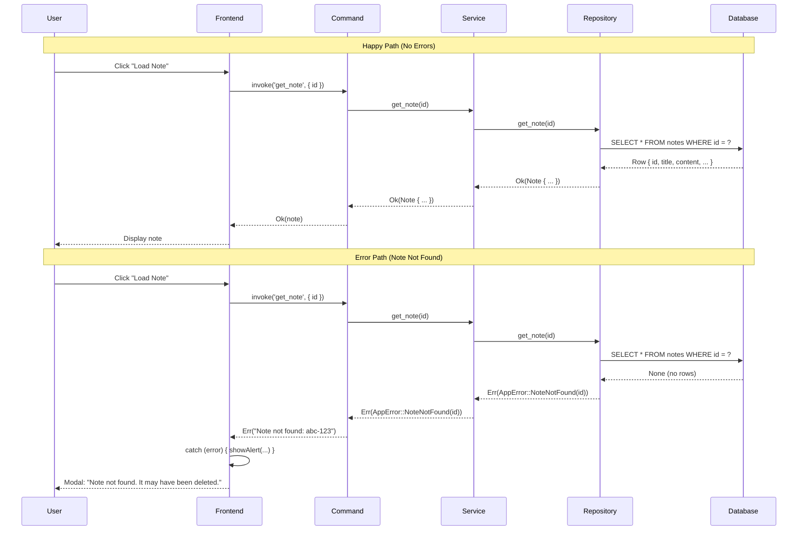

# Chapter 20: Error Handling Patterns

**What you'll learn**: How to design robust error types, propagate errors gracefully through layers, and present actionable error messages to users—without crashing your application.

---

## The Airport Luggage Analogy

Imagine you're traveling with checked luggage:

- **Happy path**: Your bag arrives at the destination carousel ✅
- **Error path**: Your bag doesn't arrive ❌

When errors occur, there are different levels of handling:

1. **Airline staff** (low-level): "Bag XYZ123 missing from flight UA456"  
   → Technical details, specific error codes

2. **Baggage claim agent** (mid-level): "Your bag didn't make the connection. We're tracking it."  
   → Translated to human terms, still accurate

3. **You** (end user): "Don't worry, we'll deliver it to your hotel by tomorrow morning."  
   → Actionable information, what happens next

SwatNotes error handling works the same way:
- **Repository** throws specific database errors (`sqlx::Error`)
- **Service** translates to domain errors (`AppError::NoteNotFound`)
- **Frontend** shows user-friendly messages ("Note not found. It may have been deleted.")

Good error handling means errors flow upward with the right amount of context at each level, and users get actionable guidance instead of stack traces.

---

## The Error Type Hierarchy

SwatNotes uses a custom error enum that wraps all possible failures. Located in [`src-tauri/src/error.rs`](../src-tauri/src/error.rs#L8-L41):

```rust
#[derive(Error, Debug)]
pub enum AppError {
    #[error("Database error: {0}")]
    Database(#[from] sqlx::Error),

    #[error("IO error: {0}")]
    Io(#[from] std::io::Error),

    #[error("Serialization error: {0}")]
    Serialization(#[from] serde_json::Error),

    #[error("Tauri error: {0}")]
    Tauri(#[from] tauri::Error),

    #[error("ZIP error: {0}")]
    Zip(#[from] zip::result::ZipError),

    #[error("Note not found: {0}")]
    NoteNotFound(String),

    #[error("Backup error: {0}")]
    Backup(String),

    #[error("Restore error: {0}")]
    Restore(String),

    #[error("Blob store error: {0}")]
    BlobStore(String),

    #[error("{0}")]
    Generic(String),
}
```

### Why `thiserror`?

The `#[derive(Error)]` and `#[error("...")]` macros come from the `thiserror` crate. This is industry-standard in Rust for custom error types.

**What it gives you:**

```rust
// Without thiserror (manual implementation)
impl std::fmt::Display for AppError {
    fn fmt(&self, f: &mut std::fmt::Formatter<'_>) -> std::fmt::Result {
        match self {
            AppError::Database(e) => write!(f, "Database error: {}", e),
            AppError::Io(e) => write!(f, "IO error: {}", e),
            // ... 10 more variants
        }
    }
}

impl std::error::Error for AppError {
    fn source(&self) -> Option<&(dyn std::error::Error + 'static)> {
        match self {
            AppError::Database(e) => Some(e),
            // ... 10 more variants
        }
    }
}

// With thiserror (automatic)
#[derive(Error, Debug)]
#[error("Database error: {0}")]
Database(#[from] sqlx::Error),
// Done! Display and Error traits auto-generated
```

**Benefits:**
- Less boilerplate (10 lines → 2 lines per variant)
- Compile-time validation of error messages
- Automatic error source chaining (preserves stack traces)

---

## Automatic Error Conversion with `#[from]`

The `#[from]` attribute enables automatic conversion from third-party errors:

```rust
#[error("Database error: {0}")]
Database(#[from] sqlx::Error),  // ← This attribute is magic
```

**What it does:**

```rust
// Auto-generates this impl:
impl From<sqlx::Error> for AppError {
    fn from(e: sqlx::Error) -> Self {
        AppError::Database(e)
    }
}
```

**In practice:**

```rust
// Without #[from] - manual conversion required
pub async fn get_note(&self, id: &str) -> Result<Note> {
    match sqlx::query_as(...).fetch_one(&self.pool).await {
        Ok(note) => Ok(note),
        Err(e) => Err(AppError::Database(e)),  // Manual wrapping
    }
}

// With #[from] - automatic via ? operator
pub async fn get_note(&self, id: &str) -> Result<Note> {
    let note = sqlx::query_as(...)
        .fetch_one(&self.pool)
        .await?;  // ← Automatically converts sqlx::Error → AppError::Database
    Ok(note)
}
```

**Key limitation**: You can only have ONE `#[from]` per source type. This prevents ambiguity:

```rust
// ❌ NOT ALLOWED - two variants with #[from sqlx::Error]
#[error("Database error: {0}")]
Database(#[from] sqlx::Error),

#[error("Query failed: {0}")]
QueryFailed(#[from] sqlx::Error),  // Compiler error: conflicting impl

// ✅ ALLOWED - different source types
#[error("Database error: {0}")]
Database(#[from] sqlx::Error),

#[error("IO error: {0}")]
Io(#[from] std::io::Error),
```

---

## The Result Type Alias

Every function that can fail returns `Result<T>`:

```rust
pub type Result<T> = std::result::Result<T, AppError>;
```

**This is a shorthand**. Instead of writing:

```rust
pub async fn create_note(&self, req: CreateNoteRequest) 
    -> std::result::Result<Note, AppError>  // Verbose
{
    // ...
}
```

You write:

```rust
pub async fn create_note(&self, req: CreateNoteRequest) 
    -> Result<Note>  // Clean!
{
    // ...
}
```

**Standard pattern in Rust:** Many libraries define this alias:
- `anyhow::Result<T>` = `Result<T, anyhow::Error>`
- `std::io::Result<T>` = `Result<T, std::io::Error>`
- `sqlx::Result<T>` = `Result<T, sqlx::Error>`

**Why it's powerful:**

```rust
// Same return type, different happy paths
fn read_config() -> Result<Config> { /* ... */ }
fn write_config() -> Result<()> { /* ... */ }  // Unit type = "success, no value"
fn count_notes() -> Result<usize> { /* ... */ }
```

All these functions can fail with `AppError`, but succeed with different types.

---

## Error Propagation with the `?` Operator

The `?` operator is Rust's secret weapon for clean error handling.

### What `?` Does

```rust
let note = self.repo.get_note(id).await?;
//                                     ↑
//                            "If this is Err, return early"
```

**Equivalent to:**

```rust
let note = match self.repo.get_note(id).await {
    Ok(n) => n,
    Err(e) => return Err(e),  // Early return
};
```

### Automatic Conversion

The `?` operator **automatically converts** errors using `From`:

```rust
// This function signature
pub async fn create_note(&self, req: CreateNoteRequest) -> Result<Note> {
    let id = Uuid::new_v4().to_string();
    let now = Utc::now();

    let note = sqlx::query_as::<_, Note>(...)
        .fetch_one(&self.pool)
        .await?;  // sqlx::Error → AppError::Database (automatic!)

    Ok(note)
}
```

**What happens under the hood:**

```
1. sqlx::query_as(...).await returns Result<Note, sqlx::Error>
2. ? extracts the Result
3. If Err(sqlx::Error):
   a. Calls AppError::from(sqlx::Error)  ← Generated by #[from]
   b. Returns Err(AppError::Database(...))
4. If Ok(Note), assigns to `note`
```

### When Not to Use `?`

Sometimes you need custom error handling:

```rust
// ❌ BAD - generic error message
let note = sqlx::query_as(...)
    .fetch_optional(&self.pool)
    .await?
    .ok_or(AppError::Generic("Not found".to_string()))?;

// ✅ GOOD - specific, helpful error
let note = sqlx::query_as(...)
    .fetch_optional(&self.pool)
    .await?
    .ok_or_else(|| AppError::NoteNotFound(id.to_string()))?;
    //         ↑ Lazy evaluation - only creates String if error occurs
```

**Pattern breakdown:**

1. `fetch_optional()` returns `Result<Option<Note>, sqlx::Error>`
2. `.await?` extracts `Option<Note>` (propagates DB errors)
3. `.ok_or_else(|| ...)` converts `None` → custom error
4. Final `?` propagates the custom error if needed

---

## Domain-Specific Errors

Generic errors are unhelpful. Compare:

```rust
// ❌ BAD - what went wrong? why? what should I do?
Err(AppError::Generic("Error".to_string()))

// ⚠️ BETTER - but still vague
Err(AppError::Generic("Note not found".to_string()))

// ✅ BEST - specific, actionable
Err(AppError::NoteNotFound(note_id.to_string()))
```

### Real Example from Repository

Located in [`src-tauri/src/database/repository.rs`](../src-tauri/src/database/repository.rs#L60-L69):

```rust
pub async fn get_note(&self, id: &str) -> Result<Note> {
    let note = sqlx::query_as::<_, Note>(
        r#"
        SELECT * FROM notes WHERE id = ? AND deleted_at IS NULL
        "#,
    )
    .bind(id)
    .fetch_optional(&self.pool)  // Returns Option<Note>
    .await?                       // Propagate DB errors
    .ok_or_else(|| AppError::NoteNotFound(id.to_string()))?;
    //             ↑ If None, create specific error with note ID

    Ok(note)
}
```

**Why this is good:**

1. **Specific**: `NoteNotFound` is a distinct error variant
2. **Contextual**: Includes the note ID that wasn't found
3. **Actionable**: Frontend can check variant and show appropriate message

**Frontend handling:**

```typescript
try {
  const note = await getNote(noteId);
  // Use note...
} catch (error) {
  const message = String(error);
  if (message.includes('Note not found')) {
    showAlert('This note was deleted or doesn\'t exist.');
  } else {
    showAlert('Failed to load note. Please try again.');
  }
}
```

---

## The `map_err` Pattern

Sometimes you need to add context to errors from external libraries:

```rust
let settings: Settings = std::fs::read_to_string(&path)
    .map_err(|e| AppError::Generic(format!("Failed to read settings file: {}", e)))?;
    // ↑ Transforms std::io::Error → AppError::Generic with context
```

**When to use:**

1. **Adding context**: "What were you doing when this failed?"
2. **Transforming errors**: Library error → domain error
3. **User-friendly messages**: Technical error → plain English

**Real example from settings service** ([`src-tauri/src/services/settings.rs`](../src-tauri/src/services/settings.rs#L187)):

```rust
let json_str = std::fs::read_to_string(&path)
    .map_err(|e| AppError::Generic(format!("Failed to read settings file: {}", e)))?;

let settings: Settings = serde_json::from_str(&json_str)
    .map_err(|e| AppError::Generic(format!("Failed to parse settings: {}", e)))?;
```

**Result for user:**

Instead of:
```
Error: No such file or directory (os error 2)
```

They see:
```
Failed to read settings file: No such file or directory (os error 2)
```

Much clearer what operation failed!

---

## Graceful Degradation Pattern

Not all errors should crash your app. Some features can fail gracefully.

### Example: FTS Synchronization

Located in [`src-tauri/src/services/notes.rs`](../src-tauri/src/services/notes.rs#L30-L39):

```rust
pub async fn create_note(&self, title: String, content_json: String) -> Result<Note> {
    tracing::info!("Creating new note: {}", title);

    let req = CreateNoteRequest {
        title: title.clone(),
        content_json: content_json.clone(),
    };

    let note = self.repo.create_note(req).await?;  // Critical - must succeed

    // Sync to FTS index
    if let Err(e) = self
        .repo
        .insert_note_fts(&note.id, &title, &content_json)
        .await
    {
        tracing::warn!("Failed to insert note into FTS index: {}", e);
        // Don't fail the whole operation if FTS fails ← Graceful degradation
    }

    tracing::info!("Note created successfully: {}", note.id);

    Ok(note)  // Return note even if FTS failed
}
```

**Key pattern:**

```rust
if let Err(e) = non_critical_operation().await {
    tracing::warn!("Failed to do X: {}", e);
    // Continue anyway
}
```

**Instead of:**

```rust
non_critical_operation().await?;  // ← Would abort on failure
```

**Decision matrix:**

| Operation | Critical? | Pattern |
|-----------|-----------|---------|
| Create note in DB | ✅ Yes | Use `?` (propagate errors) |
| Update FTS index | ❌ No | Use `if let Err` (log & continue) |
| Send notification | ❌ No | Log failure, don't crash |
| Save user data | ✅ Yes | Propagate errors, don't lose data |

---

## Error Serialization for IPC

Tauri commands send errors to the frontend as JSON. SwatNotes implements custom serialization:

```rust
impl serde::Serialize for AppError {
    fn serialize<S>(&self, serializer: S) -> std::result::Result<S::Ok, S::Error>
    where
        S: serde::Serializer,
    {
        serializer.serialize_str(&self.to_string())
    }
}
```

**What this does:**

1. `AppError` variants convert to `String` via `Display` trait
2. Strings serialize to JSON
3. Frontend receives error messages as strings

**Example flow:**

```
Backend:                     Frontend:
AppError::NoteNotFound      "Note not found: abc-123"
    ↓ to_string()          
"Note not found: abc-123"
    ↓ serialize()
"\"Note not found: abc-123\""
    ↓ IPC
                            catch (error) {
                              console.log(error);  
                              // "Note not found: abc-123"
                            }
```

**Why serialize as string, not JSON object?**

```json
// ❌ Complex - requires type checking on frontend
{"type": "NoteNotFound", "id": "abc-123"}

// ✅ Simple - just a string
"Note not found: abc-123"
```

For desktop apps, string errors are simpler. For APIs, structured errors (JSON objects) are better.

---

## Frontend Error Handling

### Pattern 1: Try-Catch with Logging

Located in [`src/main.ts`](../src/main.ts#L198-L201):

```typescript
try {
  const editor = createNoteEditor(editorContainer, note);
  // Use editor...
} catch (error) {
  logger.error('Failed to create editor', LOG_CONTEXT, error);
  showAlert('Failed to create note editor. Please refresh.');
}
```

**Structure:**
1. Try the operation
2. If error: log for debugging + show user-friendly message
3. Optional: cleanup or retry logic

### Pattern 2: Nested Try-Catch for Cleanup

Located in [`src/main.ts`](../src/main.ts#L64-L90):

```typescript
async function cleanupEmptyNotes() {
  try {
    const allNotes = await listNotes();
    
    for (const note of allNotes) {
      try {
        const delta = JSON.parse(note.content_json);
        const isEmpty = /* check if empty */;
        
        if (isEmpty && !isNoteOpen(note.id)) {
          await deleteNote(note.id);
        }
      } catch (e) {
        logger.error(`Failed to check note ${note.id}`, LOG_CONTEXT, e);
        // Continue to next note instead of stopping
      }
    }
  } catch (error) {
    logger.error('Failed to cleanup empty notes', LOG_CONTEXT, error);
  }
}
```

**Pattern:**
- Outer try-catch: handles overall operation failure
- Inner try-catch: handles individual item failures
- **Benefit**: One corrupt note doesn't prevent cleaning up others

### Pattern 3: User-Friendly Error Messages

Located in [`src/update-required.ts`](../src/update-required.ts#L114-L128):

```typescript
updateBtn?.addEventListener('click', async () => {
  try {
    await invoke('download_and_install_update');
    // Success flow...
  } catch (error) {
    const errorMessage = error instanceof Error ? error.message : String(error);
    logger.error('Failed to download update: ' + errorMessage, LOG_CONTEXT, error);
    
    updateBtn.removeAttribute('disabled');
    updateBtn.innerHTML = `
      <svg>...</svg>
      Retry Download
    `;
    
    // Show error to user
    const releaseNotesEl = document.getElementById('release-notes');
    if (releaseNotesEl) {
      releaseNotesEl.textContent = `Download failed: ${errorMessage}\n\nPlease try again or download manually from GitHub.`;
      releaseNotesEl.style.color = 'oklch(var(--er))';  // Red error color
    }
  }
});
```

**User-facing error components:**
1. **What happened**: "Download failed"
2. **Technical detail** (optional): `${errorMessage}`
3. **What to do next**: "Please try again or download manually"
4. **Visual indicator**: Red text, retry button enabled

---

## Modal-Based Error Display

SwatNotes uses custom DaisyUI modals instead of browser `alert()`:

```typescript
// ❌ BAD - ugly browser alert, blocks entire tab
alert('Error: Note not found');

// ✅ GOOD - styled modal, non-blocking
import { showAlert } from './utils/modal';
showAlert('Note not found. It may have been deleted.', {
  type: 'error',
  title: 'Error'
});
```

**Implementation** ([`src/utils/modal.ts`](../src/utils/modal.ts#L20-L36)):

```typescript
export function showAlert(message: string, options: Partial<ModalOptions> = {}): Promise<void> {
  return new Promise((resolve) => {
    const modal = createModal({
      title: options.title || 'Alert',
      message,
      type: options.type || 'info',  // 'info' | 'warning' | 'error' | 'success'
      confirmText: 'OK',
      onConfirm: () => {
        closeModal(modal);
        resolve();
      }
    });
    document.body.appendChild(modal);
    showModal(modal);
  });
}
```

**Error types with visual styling:**

```typescript
// Info (blue)
showAlert('Note saved', { type: 'info' });

// Warning (yellow)
showAlert('Note is empty', { type: 'warning' });

// Error (red)
showAlert('Failed to load note', { type: 'error' });

// Success (green)
showAlert('Backup created successfully', { type: 'success' });
```

**Benefits:**
- Consistent styling across app
- Async/await support (wait for user acknowledgment)
- Non-blocking (user can interact with other windows)
- Accessible (keyboard navigation, screen readers)

---

## Complete Error Flow Diagram



---

## Error Handling Best Practices

### 1. Be Specific

```rust
// ❌ BAD
Err(AppError::Generic("Failed".to_string()))

// ⚠️ OKAY
Err(AppError::Generic("Backup failed".to_string()))

// ✅ GOOD
Err(AppError::Backup("Disk full".to_string()))

// 🌟 EXCELLENT
Err(AppError::Backup(format!(
    "Disk full: {}/{} bytes used",
    used, total
)))
```

### 2. Include Context

```rust
// ❌ BAD - what file?
std::fs::read_to_string(&path)?;

// ✅ GOOD
std::fs::read_to_string(&path)
    .map_err(|e| AppError::Generic(
        format!("Failed to read config file '{}': {}", path.display(), e)
    ))?;
```

### 3. Don't Swallow Errors

```rust
// ❌ BAD - error disappears
if let Err(_) = save_settings() {
    // Oops, nothing happens
}

// ✅ GOOD - log for debugging
if let Err(e) = save_settings() {
    tracing::warn!("Failed to save settings: {}", e);
}
```

### 4. Propagate Critical Errors

```rust
// ❌ BAD - silently fails to create note
pub async fn create_note(&self, req: CreateNoteRequest) -> Result<Note> {
    if let Ok(note) = self.repo.create_note(req).await {
        Ok(note)
    } else {
        Ok(Note::default())  // ← Returns fake note!
    }
}

// ✅ GOOD - propagates error
pub async fn create_note(&self, req: CreateNoteRequest) -> Result<Note> {
    self.repo.create_note(req).await?  // Caller handles error
}
```

### 5. User-Facing Messages Should Be Actionable

```typescript
// ❌ BAD
showAlert('Error: sqlx::Error: Connection refused');

// ⚠️ OKAY
showAlert('Database error');

// ✅ GOOD
showAlert('Failed to save note. Please try again.');

// 🌟 EXCELLENT
showAlert(
  'Failed to save note. Your changes are not saved.\n\n' +
  'Try:\n' +
  '1. Check your disk space\n' +
  '2. Restart the application\n' +
  '3. Contact support if the problem persists'
);
```

---

## Testing Error Scenarios

### Unit Tests for Error Types

Located in [`src-tauri/src/error.rs`](../src-tauri/src/error.rs#L52-L151):

```rust
#[test]
fn test_note_not_found_error() {
    let error = AppError::NoteNotFound("test-id-123".to_string());
    assert_eq!(error.to_string(), "Note not found: test-id-123");
}

#[test]
fn test_error_serialization() {
    let error = AppError::NoteNotFound("abc".to_string());
    let serialized = serde_json::to_string(&error).unwrap();
    assert_eq!(serialized, "\"Note not found: abc\"");
}

#[test]
fn test_io_error_conversion() {
    let io_error = std::io::Error::new(std::io::ErrorKind::NotFound, "file not found");
    let app_error: AppError = io_error.into();  // Tests #[from] conversion
    assert!(app_error.to_string().contains("IO error"));
}
```

### Integration Tests for Error Propagation

```rust
#[tokio::test]
async fn test_get_note_not_found() {
    let repo = setup_test_repo().await;
    
    let result = repo.get_note("non-existent-id").await;
    
    assert!(result.is_err());
    match result.unwrap_err() {
        AppError::NoteNotFound(id) => {
            assert_eq!(id, "non-existent-id");
        }
        _ => panic!("Expected NoteNotFound error"),
    }
}
```

### E2E Tests for User-Visible Errors

WebdriverIO tests can verify error messages appear correctly:

```typescript
it('should show error when note not found', async () => {
  await browser.url('/');
  
  // Try to open non-existent note via URL manipulation
  await browser.execute(() => {
    window.appState.openNote('fake-note-id');
  });
  
  // Wait for error modal
  await browser.waitForExist('.modal', { timeout: 2000 });
  
  const errorText = await $('.modal-body').getText();
  expect(errorText).toContain('Note not found');
});
```

---

## Common Mistakes and Fixes

### Mistake 1: Using `unwrap()` in Production

```rust
// ❌ BAD - crashes app if error occurs
let note = self.repo.get_note(id).await.unwrap();

// ✅ GOOD
let note = self.repo.get_note(id).await?;
```

**When `unwrap()` is OK:**
- Tests (intentional crash on failure)
- Truly impossible errors (document why with `.expect("Reason")`)

```rust
let app_dir = app.path()
    .app_data_dir()
    .expect("App data directory should always exist on supported platforms");
```

### Mistake 2: Ignoring Errors in Background Tasks

```rust
// ❌ BAD
tokio::spawn(async {
    let _ = risky_operation().await;  // Error silently ignored
});

// ✅ GOOD
tokio::spawn(async {
    if let Err(e) = risky_operation().await {
        tracing::error!("Background task failed: {}", e);
    }
});
```

### Mistake 3: Not Testing Unhappy Paths

```rust
// ❌ BAD - only tests success
#[tokio::test]
async fn test_create_note() {
    let note = service.create_note("Title", "{}").await.unwrap();
    assert_eq!(note.title, "Title");
}

// ✅ GOOD - tests both paths
#[tokio::test]
async fn test_create_note_success() {
    let note = service.create_note("Title", "{}").await.unwrap();
    assert_eq!(note.title, "Title");
}

#[tokio::test]
async fn test_create_note_with_invalid_json() {
    let result = service.create_note("Title", "{invalid}").await;
    assert!(result.is_err());
}
```

### Mistake 4: Returning Errors with Stack Traces to Users

```typescript
// ❌ BAD - shows internal implementation details
catch (error) {
  showAlert(error.toString());  // "Error: sqlx::Error at src/database/repository.rs:42"
}

// ✅ GOOD - shows user-friendly message, logs technical details
catch (error) {
  logger.error('Failed to load note', LOG_CONTEXT, error);
  showAlert('Failed to load note. Please try again.');
}
```

---

## Performance Considerations

### Error Creation is Not Free

```rust
// ❌ EXPENSIVE - creates error string every call
pub fn validate(&self) -> Result<()> {
    if self.is_valid {
        Ok(())
    } else {
        Err(AppError::Generic(format!(  // Allocates String
            "Invalid state: {} items, {} bytes",
            self.items.len(),
            self.size
        )))
    }
}
```

**If called in hot loop:**

```rust
for item in &huge_list {
    item.validate()?;  // 1 million String allocations if all invalid!
}
```

**Optimization:**

```rust
// ✅ BETTER - static error for common case
pub fn validate(&self) -> Result<()> {
    if self.is_valid {
        Ok(())
    } else {
        Err(AppError::Generic("Invalid state".to_string()))  // Simple message
    }
}
```

**Or use lazy evaluation:**

```rust
// ✅ BEST - only creates string if error propagated
fn expensive_check(&self) -> Result<()> {
    self.items.first()
        .ok_or_else(|| AppError::Generic(format!(  // Closure only runs if None
            "Empty list (expected {} items)",
            self.expected_count
        )))
}
```

### Error Logging Overhead

```rust
// ⚠️ OKAY for rare errors
if let Err(e) = operation() {
    tracing::error!("Failed: {}", e);  // Logs every time
}

// ✅ BETTER for frequent errors
if let Err(e) = operation() {
    tracing::debug!("Failed: {}", e);  // Only logs if RUST_LOG=debug
}
```

**Guideline:**
- ERROR: User-impacting failures (save failed, note not found)
- WARN: Recoverable issues (FTS sync failed, cache miss)
- INFO: Normal operations (note created, backup started)
- DEBUG: Detailed diagnostics (query executed, file read)

---

## Key Takeaways

1. **Use `thiserror`**: Less boilerplate, compile-time validation, better error messages
2. **`#[from]` enables automatic conversion**: `?` operator just works with external errors
3. **Domain-specific errors**: `NoteNotFound(id)` > `Generic("Error")`
4. **`map_err` adds context**: "Failed to read file X" > "IO error"
5. **Graceful degradation**: Not all errors should crash (FTS failures, notifications)
6. **Frontend error handling**: Try-catch + log + user-friendly modal
7. **Testing error paths**: Unit tests for error types, integration tests for propagation
8. **User-facing messages**: Actionable > Technical details
9. **Performance**: Lazy error creation, appropriate log levels
10. **Never `unwrap()` in production**: Use `?` or `.expect("Reason")`

---

## Testing Checklist

Before shipping error handling, verify:

- [ ] All errors serialize correctly to JSON (test with `serde_json::to_string`)
- [ ] User-facing messages are actionable ("Try X" not "Error 0x8000FFFF")
- [ ] Critical operations propagate errors (user data never silently lost)
- [ ] Non-critical operations degrade gracefully (FTS, notifications, etc.)
- [ ] Errors are logged with appropriate levels (ERROR/WARN/INFO/DEBUG)
- [ ] Frontend try-catch blocks exist for all Tauri invoke() calls
- [ ] Error modals match app theme and are keyboard-accessible
- [ ] Tests cover both happy paths and error paths
- [ ] No `unwrap()` or `expect()` in production code (except documented impossible cases)
- [ ] Error messages don't leak sensitive information (file paths, user data)

---

## Next Steps

You now have robust error handling in your Tauri app! But there's more to learn:

- **Chapter 21**: Testing strategies (unit, integration, E2E)
- **Chapter 22**: Building and distribution (installers, code signing, CI/CD)
- **Chapter 23**: Performance optimization (profiling, query tuning)

In the next chapter, we'll explore testing strategies—how to write tests that catch bugs before users do, from unit tests to full end-to-end scenarios.

---

**End of Chapter 20**
