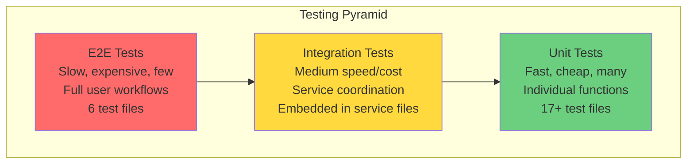

# Chapter 21: Testing Strategies

## Introduction

You've built a production-grade desktop notes application with rich features: database persistence, full-text search, encryption, auto-updates, and more. But how do you know it actually works? More importantly, how do you know it *keeps* working as you add new features and refactor code?

That's where testing comes in. Without tests, every change is a gamble. With tests, you can refactor with confidence, catch regressions before users do, and document how your code is supposed to behave.

In this chapter, we'll explore SwatNotes' multi-layered testing strategy: **unit tests** for individual functions, **integration tests** for services coordinating multiple components, and **end-to-end (E2E) tests** for real user workflows. You'll learn when to use each type, how to write effective tests, and how SwatNotes achieves test coverage without slowing down development.

---

## The Safety Net Analogy

Think of your codebase as a **circus tightrope walker** performing high above the ground.

- **No tests**: Walking the tightrope with no safety net. Every change is terrifying. One mistake and everything crashes.
  
- **Unit tests**: Safety nets positioned under each section of the rope. If you fall during a specific trick (function), the net catches you immediately. But they don't protect you if the rope itself (integration) breaks.
  
- **Integration tests**: Larger nets that catch falls involving multiple tricks working together (services coordinating). They verify the rope is properly connected.
  
- **E2E tests**: A giant net below the entire circus tent. If anything goes catastrophically wrong from start to finish, this catches it. It's the slowest to set up but catches the most dramatic failures.

The best circus has **all three nets**. Unit tests catch most falls quickly. Integration tests catch coordination failures. E2E tests ensure the whole show works from the audience's perspective.

SwatNotes uses this three-layer approach: 17 unit test files, integration tests for services, and 6 E2E test suites covering real user workflows.

---

## The Testing Pyramid

The testing pyramid is a strategy for balancing speed, cost, and coverage:



**Why this shape?**

- **Unit tests (base)**: Fast (milliseconds), cheap to write, easy to debug. Write *lots* of these.
- **Integration tests (middle)**: Slower (seconds), test interactions between components. Write *fewer* of these.
- **E2E tests (top)**: Slowest (10-60 seconds each), brittle, expensive. Write only for *critical* user paths.

**SwatNotes distribution**:
- ~100+ unit tests (TypeScript + Rust)
- ~15 integration tests (service-level)
- ~50 E2E tests (user workflows)

---

## Unit Tests: Testing Individual Functions

Unit tests verify **one function or module in isolation**. They're fast, focused, and easy to debug.

### TypeScript Unit Tests with Vitest

**Vitest** is a modern test framework for Vite projects. It's fast, has great DX, and supports TypeScript natively.

#### Configuration

From [`vitest.config.ts`](../vitest.config.ts):

```typescript
import { defineConfig } from 'vitest/config';
import path from 'path';

export default defineConfig({
  test: {
    environment: 'happy-dom',           // Simulated browser DOM
    globals: true,                      // No need to import describe/it/expect
    coverage: {
      provider: 'v8',
      reporter: ['text', 'json', 'html'],
      exclude: [
        'node_modules/',
        'src-tauri/',
        'dist/',
        '**/*.spec.ts',                // Exclude E2E tests
        '**/*.test.ts',                // Exclude from coverage report
      ],
    },
  },
  resolve: {
    alias: {
      '@': path.resolve(__dirname, './src'),  // Path mapping
    },
  },
});
```

**Key settings**:
- **`environment: 'happy-dom'`**: Lightweight DOM simulation (faster than jsdom)
- **`globals: true`**: `describe`, `it`, `expect` available without imports
- **`coverage`**: V8 coverage provider with HTML reports

#### Example: Testing Pure Functions

From [`src/utils/formatters.test.ts`](../src/utils/formatters.test.ts):

```typescript
import { describe, it, expect } from 'vitest';
import { escapeHtml, formatFileSize } from './formatters';

describe('formatters', () => {
  describe('escapeHtml', () => {
    it('should escape HTML special characters', () => {
      expect(escapeHtml('<script>alert("xss")</script>')).toBe(
        '&lt;script&gt;alert("xss")&lt;/script&gt;'
      );
    });

    it('should escape ampersands', () => {
      expect(escapeHtml('Tom & Jerry')).toBe('Tom &amp; Jerry');
    });

    it('should handle empty string', () => {
      expect(escapeHtml('')).toBe('');
    });

    it('should handle unicode characters', () => {
      expect(escapeHtml('Hello 世界 🌍')).toBe('Hello 世界 🌍');
    });
  });

  describe('formatFileSize', () => {
    it('should format zero bytes', () => {
      expect(formatFileSize(0)).toBe('0 B');
    });

    it('should format bytes', () => {
      expect(formatFileSize(500)).toBe('500 B');
    });

    it('should format kilobytes', () => {
      expect(formatFileSize(1024)).toBe('1.00 KB');
    });

    it('should format megabytes', () => {
      expect(formatFileSize(1048576)).toBe('1.00 MB');
    });

    it('should round to two decimals', () => {
      expect(formatFileSize(1536)).toBe('1.50 KB');
    });
  });
});
```

**What makes this a good unit test?**
- **Isolated**: No dependencies on database, filesystem, or network
- **Fast**: Entire file runs in <50ms
- **Deterministic**: Same input always produces same output
- **Readable**: Test name describes expected behavior
- **Edge cases**: Tests empty string, zero bytes, unicode

#### Example: Testing Stateful Components

From [`src/state/appState.test.ts`](../src/state/appState.test.ts):

```typescript
import { describe, it, expect, vi, beforeEach } from 'vitest';
import { appState } from './appState';
import type { Note } from '../types';

// Mock dependencies
vi.mock('../components/noteEditor', () => ({
  NoteEditorInstance: {},
}));

// Helper to create test data
function createMockNote(overrides: Partial<Note> = {}): Note {
  return {
    id: 'test-note-id',
    title: 'Test Note',
    content_json: '{"ops":[{"insert":"Hello"}]}',
    created_at: '2024-01-01T00:00:00Z',
    updated_at: '2024-01-01T00:00:00Z',
    deleted_at: null,
    title_modified: false,
    ...overrides,
  };
}

describe('appState', () => {
  beforeEach(() => {
    // Reset state before each test
    appState.closeNote();
    appState.clearSearch();
  });

  describe('initial state', () => {
    it('should have null currentNote initially', () => {
      expect(appState.currentNote).toBeNull();
    });

    it('should have empty searchQuery initially', () => {
      expect(appState.searchQuery).toBe('');
    });
  });

  describe('setCurrentNote', () => {
    it('should set the current note', () => {
      const note = createMockNote();
      appState.setCurrentNote(note);

      expect(appState.currentNote).toEqual(note);
    });

    it('should also update selectedNoteId', () => {
      const note = createMockNote({ id: 'note-123' });
      appState.setCurrentNote(note);

      expect(appState.selectedNoteId).toBe('note-123');
    });

    it('should clear selectedNoteId when note is null', () => {
      const note = createMockNote();
      appState.setCurrentNote(note);
      appState.setCurrentNote(null);

      expect(appState.selectedNoteId).toBeNull();
    });
  });

  describe('openNote (atomic compound operation)', () => {
    it('should set both note and editor atomically', () => {
      const note = createMockNote();
      const editor = { quill: {} as any, destroy: vi.fn() };

      appState.openNote(note, editor);

      expect(appState.currentNote).toEqual(note);
      expect(appState.currentEditor).toBe(editor);
      expect(appState.selectedNoteId).toBe(note.id);
    });
  });

  describe('closeNote (cleanup)', () => {
    it('should destroy editor and clear state', () => {
      const note = createMockNote();
      const editor = { quill: {} as any, destroy: vi.fn() };

      appState.openNote(note, editor);
      appState.closeNote();

      expect(editor.destroy).toHaveBeenCalled();
      expect(appState.currentNote).toBeNull();
      expect(appState.currentEditor).toBeNull();
    });
  });
});
```

**Testing patterns**:
- **`beforeEach`**: Reset state before each test (isolation)
- **`vi.mock()`**: Mock dependencies (noteEditor) to avoid real DOM manipulation
- **Helper functions**: `createMockNote()` reduces boilerplate
- **Atomic operations**: Test compound state changes (`openNote`)
- **Cleanup**: Verify `destroy()` is called to prevent memory leaks

#### Example: Testing Modals with DOM Interaction

From [`src/utils/modal.test.ts`](../src/utils/modal.test.ts):

```typescript
import { describe, it, expect, vi, beforeEach, afterEach } from 'vitest';
import { showAlert, showConfirm, showPrompt } from './modal';

describe('modal', () => {
  beforeEach(() => {
    document.body.innerHTML = '';  // Clean DOM
    vi.useFakeTimers();            // Mock setTimeout/setInterval
  });

  afterEach(() => {
    document.body.innerHTML = '';
    vi.useRealTimers();
  });

  describe('showAlert', () => {
    it('should create and show alert modal', async () => {
      const promise = showAlert('Test message');

      // Modal should be in DOM
      const modal = document.querySelector('dialog');
      expect(modal).toBeTruthy();
      expect(modal?.textContent).toContain('Test message');

      // Click OK button
      const okButton = modal?.querySelector('button[id$="-confirm"]') as HTMLButtonElement;
      okButton?.click();

      // Fast-forward timers (animation delay)
      vi.advanceTimersByTime(300);
      await promise;
    });

    it('should escape HTML in message (XSS prevention)', async () => {
      const promise = showAlert('<script>alert("xss")</script>');

      const modal = document.querySelector('dialog');
      // Should not contain executable script tag
      expect(modal?.innerHTML).not.toContain('<script>');
      // But should contain escaped text
      expect(modal?.textContent).toContain('<script>');

      const okButton = modal?.querySelector('button[id$="-confirm"]') as HTMLButtonElement;
      okButton?.click();
      vi.advanceTimersByTime(300);
      await promise;
    });

    it('should remove modal from DOM after closing', async () => {
      const promise = showAlert('Message');

      expect(document.querySelectorAll('dialog').length).toBe(1);

      const modal = document.querySelector('dialog');
      const okButton = modal?.querySelector('button[id$="-confirm"]') as HTMLButtonElement;
      okButton?.click();

      vi.advanceTimersByTime(300);
      await promise;

      // Modal removed to prevent memory leaks
      expect(document.querySelectorAll('dialog').length).toBe(0);
    });
  });

  describe('showConfirm', () => {
    it('should return true when confirmed', async () => {
      const promise = showConfirm('Are you sure?');

      const modal = document.querySelector('dialog');
      const confirmButton = modal?.querySelector('button[id$="-confirm"]') as HTMLButtonElement;
      confirmButton?.click();

      vi.advanceTimersByTime(300);
      const result = await promise;

      expect(result).toBe(true);
    });

    it('should return false when cancelled', async () => {
      const promise = showConfirm('Are you sure?');

      const modal = document.querySelector('dialog');
      const cancelButton = modal?.querySelector('button[id$="-cancel"]') as HTMLButtonElement;
      cancelButton?.click();

      vi.advanceTimersByTime(300);
      const result = await promise;

      expect(result).toBe(false);
    });
  });
});
```

**Advanced patterns**:
- **`vi.useFakeTimers()`**: Control `setTimeout` for animation delays
- **DOM queries**: `querySelector` to find modal elements
- **Async testing**: `await promise` for modal resolution
- **Memory leak prevention**: Verify modal removed from DOM
- **Security testing**: XSS prevention via HTML escaping

### Rust Unit Tests

Rust has built-in testing with `#[cfg(test)]` modules. Tests run with `cargo test` and are compiled only in test mode.

#### Example: Testing Error Types

From [`src-tauri/src/error.rs`](../src-tauri/src/error.rs):

```rust
#[cfg(test)]
mod tests {
    use super::*;

    #[test]
    fn test_note_not_found_error() {
        let error = AppError::NoteNotFound("test-id-123".to_string());
        assert_eq!(error.to_string(), "Note not found: test-id-123");
    }

    #[test]
    fn test_backup_error() {
        let error = AppError::Backup("Disk full".to_string());
        assert_eq!(error.to_string(), "Backup error: Disk full");
    }

    #[test]
    fn test_error_serialization() {
        let error = AppError::NoteNotFound("abc".to_string());
        let serialized = serde_json::to_string(&error).unwrap();
        assert_eq!(serialized, "\"Note not found: abc\"");
    }

    #[test]
    fn test_io_error_conversion() {
        let io_error = std::io::Error::new(std::io::ErrorKind::NotFound, "file not found");
        let app_error: AppError = io_error.into();
        assert!(app_error.to_string().contains("IO error"));
    }

    #[test]
    fn test_serialization_error_conversion() {
        let json_result: serde_json::Result<i32> = serde_json::from_str("not valid json");
        if let Err(json_error) = json_result {
            let app_error: AppError = json_error.into();
            assert!(app_error.to_string().contains("Serialization error"));
        }
    }
}
```

**Testing patterns**:
- **`#[test]`**: Mark function as test (discovered by `cargo test`)
- **`assert_eq!`**: Verify equality with helpful diff on failure
- **`assert!`**: Boolean assertion with panic on failure
- **Error conversion**: Test `#[from]` attribute conversions
- **Serialization**: Verify error messages cross IPC boundary correctly

**Running Rust tests**:
```bash
cargo test                    # Run all tests
cargo test test_backup_error  # Run specific test
cargo test --lib              # Only library tests (no integration)
```

---

## Integration Tests: Testing Component Interactions

Integration tests verify **multiple components working together**. In SwatNotes, this means testing services that coordinate repository + FTS + logging.

### Example: Testing NotesService

From [`src-tauri/src/services/notes.rs`](../src-tauri/src/services/notes.rs):

```rust
#[cfg(test)]
mod tests {
    use super::*;
    use crate::database::{initialize_database, Repository};
    use sqlx::sqlite::SqlitePoolOptions;

    // Helper to create in-memory test database
    async fn create_test_service() -> NotesService {
        let pool = SqlitePoolOptions::new()
            .connect("sqlite::memory:")  // In-memory DB (fast, isolated)
            .await
            .unwrap();

        initialize_database(&pool).await.unwrap();  // Run migrations

        let repo = Repository::new(pool);
        NotesService::new(repo)
    }

    #[tokio::test]
    async fn test_create_and_get_note() {
        let service = create_test_service().await;

        // Create note
        let note = service
            .create_note("Test".to_string(), "{}".to_string())
            .await
            .unwrap();

        // Verify created
        assert_eq!(note.title, "Test");
        assert!(!note.id.is_empty());

        // Fetch note
        let fetched = service.get_note(&note.id).await.unwrap();

        // Verify fields
        assert_eq!(fetched.id, note.id);
        assert_eq!(fetched.title, "Test");
        assert_eq!(fetched.content_json, "{}");
    }

    #[tokio::test]
    async fn test_update_note() {
        let service = create_test_service().await;

        let note = service.create_note("Original".to_string(), "{}".to_string()).await.unwrap();

        // Update title only
        let updated = service
            .update_note(&note.id, Some("Updated".to_string()), None, None)
            .await
            .unwrap();

        assert_eq!(updated.title, "Updated");
        assert_eq!(updated.content_json, "{}");  // Unchanged
    }

    #[tokio::test]
    async fn test_delete_note() {
        let service = create_test_service().await;

        let note = service.create_note("To Delete".to_string(), "{}".to_string()).await.unwrap();

        // Delete (soft delete)
        service.delete_note(&note.id).await.unwrap();

        // Should not appear in list
        let notes = service.list_notes().await.unwrap();
        assert!(!notes.iter().any(|n| n.id == note.id));

        // But should still exist in DB with deleted_at
        let deleted = service.get_note(&note.id).await.unwrap();
        assert!(deleted.deleted_at.is_some());
    }

    #[tokio::test]
    async fn test_fts_search() {
        let service = create_test_service().await;

        // Create notes with searchable content
        service.create_note("Rust Tutorial".to_string(), r#"{"ops":[{"insert":"Learn Rust"}]}"#.to_string()).await.unwrap();
        service.create_note("JavaScript Guide".to_string(), r#"{"ops":[{"insert":"Learn JS"}]}"#.to_string()).await.unwrap();

        // Search for "Rust"
        let results = service.search_notes("Rust").await.unwrap();

        assert_eq!(results.len(), 1);
        assert_eq!(results[0].title, "Rust Tutorial");
    }
}
```

**Integration test characteristics**:
- **Real database**: Uses SQLite in-memory (fast, no file I/O)
- **Real migrations**: Runs full schema setup
- **Multiple layers**: Tests service → repository → SQLx → SQLite
- **`#[tokio::test]`**: Async test with Tokio runtime
- **Isolated**: Each test gets fresh database via `create_test_service()`

**Why integration tests matter**:
- Unit tests verify `create_note()` logic, but do they verify SQL syntax?
- Integration tests catch: wrong column names, missing indexes, FTS sync failures, transaction issues

---

## End-to-End Tests: Testing User Workflows

E2E tests simulate **real user interactions** with the fully built application. SwatNotes uses **WebdriverIO** to automate the Windows app via WebView2 remote debugging.

### WebdriverIO Configuration

From [`wdio.conf.cjs`](../wdio.conf.cjs):

```javascript
const { spawn, spawnSync } = require('child_process');
const path = require('path');

const DEBUG_PORT = 9222;  // WebView2 remote debugging port

function getAppBinaryPath() {
  return path.join(__dirname, 'target', 'release', 'swatnotes.exe');
}

let edgeDriver = null;
let tauriApp = null;

exports.config = {
  hostname: '127.0.0.1',
  port: 4444,

  specs: ['./e2e/**/*.spec.ts'],
  maxInstances: 1,  // Only one WebView2 instance allowed

  capabilities: [{
    maxInstances: 1,
    browserName: 'webview2',
    'ms:edgeOptions': {
      debuggerAddress: `localhost:${DEBUG_PORT}`,  // Connect to running app
    },
  }],

  framework: 'mocha',
  mochaOpts: {
    ui: 'bdd',
    timeout: 60000,  // 60 seconds per test
  },

  reporters: ['spec'],
  logLevel: 'warn',

  onPrepare: async function () {
    console.log('Starting SwatNotes with remote debugging...');

    // Launch Tauri app with WebView2 debugging enabled
    const appPath = getAppBinaryPath();
    tauriApp = spawn(appPath, [], {
      stdio: ['ignore', 'pipe', 'pipe'],
      env: {
        ...process.env,
        WEBVIEW2_ADDITIONAL_BROWSER_ARGUMENTS: `--remote-debugging-port=${DEBUG_PORT}`,
      },
    });

    // Wait for app to start
    await new Promise(resolve => setTimeout(resolve, 5000));

    // Start msedgedriver
    edgeDriver = spawn('msedgedriver.exe', ['--port=4444', '--verbose']);

    await new Promise(resolve => setTimeout(resolve, 2000));
    console.log('Ready to run tests');
  },

  onComplete: async function () {
    console.log('Stopping processes...');

    // Kill driver and app
    if (edgeDriver) {
      spawnSync('taskkill', ['/F', '/T', '/PID', String(edgeDriver.pid)]);
    }

    if (tauriApp) {
      spawnSync('taskkill', ['/F', '/T', '/PID', String(tauriApp.pid)]);
    }
  },
};
```

**Key setup steps**:
1. **Build app**: `npm run tauri build` (creates `target/release/swatnotes.exe`)
2. **Launch app**: Start with `WEBVIEW2_ADDITIONAL_BROWSER_ARGUMENTS` flag
3. **Start driver**: `msedgedriver.exe` (Microsoft Edge WebDriver for WebView2)
4. **Connect**: WebdriverIO connects to `debuggerAddress` on port 9222
5. **Run tests**: Execute test files in `e2e/` directory
6. **Cleanup**: Kill app and driver processes

### Example: Testing Application Launch

From [`e2e/app.spec.ts`](../e2e/app.spec.ts):

```typescript
describe('SwatNotes Application', () => {
  describe('Launch', () => {
    it('should launch the application', async () => {
      const app = await $('#app');
      await expect(app).toBeDisplayed();
    });

    it('should display the notes list panel', async () => {
      const notesList = await $('#notes-list');
      await expect(notesList).toBeDisplayed();
    });

    it('should display the new note button', async () => {
      const newNoteBtn = await $('#new-note-btn');
      await expect(newNoteBtn).toBeDisplayed();
      await expect(newNoteBtn).toBeClickable();
    });

    it('should display the search input', async () => {
      const searchInput = await $('#search-input');
      await expect(searchInput).toBeDisplayed();
    });

    it('should display version badge with correct format', async () => {
      const versionBadge = await $('#version-badge');
      await expect(versionBadge).toBeDisplayed();

      const text = await versionBadge.getText();
      expect(text).toMatch(/^v\d+\.\d+\.\d+/);  // Regex: v1.2.3
    });
  });

  describe('Window Size and Layout', () => {
    it('should have adequate main window dimensions', async () => {
      const windowSize = await browser.getWindowSize();

      // Minimum from tauri.conf.json: 800x600
      expect(windowSize.width).toBeGreaterThanOrEqual(800);
      expect(windowSize.height).toBeGreaterThanOrEqual(600);
    });

    it('should display sidebar at proper width', async () => {
      const sidebar = await $('aside');
      await expect(sidebar).toBeDisplayed();

      const sidebarSize = await sidebar.getSize();
      expect(sidebarSize.width).toBeGreaterThanOrEqual(200);
      expect(sidebarSize.width).toBeLessThanOrEqual(300);
    });

    it('should not have horizontal overflow', async () => {
      const hasHorizontalScroll = await browser.execute(() => {
        const appEl = document.getElementById('app');
        if (!appEl) return false;
        return appEl.scrollWidth > appEl.clientWidth;
      });

      expect(hasHorizontalScroll).toBe(false);
    });
  });
});
```

**E2E test patterns**:
- **`$('#element-id')`**: Find element by CSS selector
- **`await expect(element).toBeDisplayed()`**: Assertion with auto-wait
- **`browser.getWindowSize()`**: Query window dimensions
- **`browser.execute()`**: Run JavaScript in app context

### Example: Testing Note CRUD Operations

From [`e2e/notes.spec.ts`](../e2e/notes.spec.ts):

```typescript
describe('Notes CRUD Operations', () => {
  describe('Create Note', () => {
    it('should create a new note when clicking New Note button', async () => {
      const initialCards = await $$('.note-card');
      const initialCount = initialCards.length;

      // Click new note button
      const newNoteBtn = await $('#new-note-btn');
      await newNoteBtn.click();

      // Wait for note creation
      await browser.pause(1500);

      // Verify notes list is still displayed (not hidden)
      const notesList = await $('#notes-list');
      await expect(notesList).toBeDisplayed();
    });

    it('should show the note in the list after creation', async () => {
      const newNoteBtn = await $('#new-note-btn');
      await newNoteBtn.click();
      await browser.pause(1500);

      const noteCards = await $$('.note-card');
      expect(noteCards.length).toBeGreaterThan(0);
    });

    it('should increment note count', async () => {
      const allNotesCount = await $('#all-notes-count');
      const initialCountText = await allNotesCount.getText();
      const initialCount = parseInt(initialCountText);

      // Create note
      const newNoteBtn = await $('#new-note-btn');
      await newNoteBtn.click();
      await browser.pause(1500);

      // Check count increased
      const newCountText = await allNotesCount.getText();
      const newCount = parseInt(newCountText);
      expect(newCount).toBeGreaterThanOrEqual(initialCount);
    });
  });

  describe('Note Cards', () => {
    it('should display note cards with title and preview', async () => {
      // Ensure at least one note exists
      const noteCards = await $$('.note-card');

      if (noteCards.length === 0) {
        const newNoteBtn = await $('#new-note-btn');
        await newNoteBtn.click();
        await browser.pause(1500);
      }

      const noteCards2 = await $$('.note-card');
      expect(noteCards2.length).toBeGreaterThan(0);

      // Check first card has title element
      const firstCard = noteCards2[0];
      const titleEl = await firstCard.$('.note-card-title');
      await expect(titleEl).toBeDisplayed();
    });

    it('should show relative date for each note', async () => {
      const noteCards = await $$('.note-card');

      if (noteCards.length > 0) {
        const firstCard = noteCards[0];
        const dateEl = await firstCard.$('.note-card-date');
        await expect(dateEl).toBeDisplayed();

        const dateText = await dateEl.getText();
        // Should contain relative time (e.g., "2 minutes ago", "just now")
        expect(dateText.length).toBeGreaterThan(0);
      }
    });
  });
});
```

**Real-world E2E patterns**:
- **Setup**: Create test data if needed (conditional note creation)
- **Action**: Simulate user clicks (`newNoteBtn.click()`)
- **Wait**: `browser.pause()` for async operations (note window opens)
- **Assertion**: Verify visible results (count increased, card displayed)
- **Cleanup**: Tests run against real DB, so subsequent tests see previous state

---

## Test Organization and Best Practices

### Directory Structure

```
SwatNotes/
├── src/                           # Frontend code
│   ├── utils/
│   │   ├── formatters.ts
│   │   ├── formatters.test.ts    # Unit tests next to source
│   │   ├── modal.ts
│   │   └── modal.test.ts
│   ├── state/
│   │   ├── appState.ts
│   │   └── appState.test.ts
│   └── components/
│       ├── noteEditor.ts
│       └── noteEditor.test.ts
├── src-tauri/src/                 # Backend code
│   ├── error.rs
│   ├── services/
│   │   ├── notes.rs              # Integration tests at bottom
│   │   ├── backup.rs             # Integration tests at bottom
│   │   └── reminders.rs          # Integration tests at bottom
│   └── database/
│       └── repository.rs         # Integration tests at bottom
├── e2e/                           # End-to-end tests (separate)
│   ├── app.spec.ts
│   ├── notes.spec.ts
│   ├── collections.spec.ts
│   ├── settings.spec.ts
│   ├── reminders.spec.ts
│   └── windows.spec.ts
├── vitest.config.ts               # Vitest configuration
└── wdio.conf.cjs                  # WebdriverIO configuration
```

**Naming conventions**:
- TypeScript unit tests: `*.test.ts` (next to source file)
- E2E tests: `*.spec.ts` (separate `e2e/` directory)
- Rust tests: `#[cfg(test)] mod tests` at end of file

### Running Tests

**TypeScript unit tests** (Vitest):
```bash
npm test                          # Run all unit tests
npm run test:ui                   # Interactive UI
npm run test:coverage             # Generate coverage report
```

**Rust tests** (Cargo):
```bash
cargo test                        # Run all Rust tests
cargo test --lib                  # Only library tests
cargo test notes_service          # Tests matching pattern
```

**E2E tests** (WebdriverIO):
```bash
npm run tauri build               # Build release app first
npm run test:e2e                  # Run E2E tests
```

### Test Coverage Goals

SwatNotes targets:
- **Unit tests**: 80%+ coverage for utilities, components, services
- **Integration tests**: All service methods with database interaction
- **E2E tests**: Critical user paths (create, search, delete, backup, reminders)

**Check coverage**:
```bash
npm run test:coverage
# Opens coverage/index.html in browser
```

Coverage excludes:
- `node_modules/`
- `src-tauri/` (Rust has separate coverage tools)
- `dist/` (compiled output)
- Test files themselves

---

## Mocking and Test Doubles

Mocking replaces real dependencies with controlled fakes for isolation.

### Mocking TypeScript Dependencies

**Example**: Mocking Tauri's `invoke()` for API wrappers

From [`src/utils/notesApi.test.ts`](../src/utils/notesApi.test.ts) (conceptual):

```typescript
import { describe, it, expect, vi, beforeEach } from 'vitest';
import { createNote, getNote } from './notesApi';

// Mock the entire @tauri-apps/api module
vi.mock('@tauri-apps/api', () => ({
  invoke: vi.fn(),
}));

import { invoke } from '@tauri-apps/api';

describe('notesApi', () => {
  beforeEach(() => {
    vi.clearAllMocks();  // Reset mock state
  });

  describe('createNote', () => {
    it('should call create_note command with correct params', async () => {
      const mockNote = { id: 'note-123', title: 'Test', content_json: '{}' };

      // Setup mock to return fake note
      (invoke as any).mockResolvedValue(mockNote);

      const result = await createNote('Test', '{}');

      // Verify invoke called with right arguments
      expect(invoke).toHaveBeenCalledWith('create_note', {
        title: 'Test',
        contentJson: '{}',
      });

      // Verify result
      expect(result).toEqual(mockNote);
    });

    it('should propagate errors from backend', async () => {
      // Setup mock to reject
      (invoke as any).mockRejectedValue(new Error('Database error'));

      await expect(createNote('Test', '{}')).rejects.toThrow('Database error');
    });
  });
});
```

**Why mock `invoke()`?**
- **Isolation**: Unit test focuses on API wrapper logic, not Tauri backend
- **Speed**: No need to start Tauri app
- **Control**: Test error paths by making mock throw errors

### Mocking Rust Dependencies

Rust doesn't have built-in mocking, but you can use **dependency injection** and **trait objects**.

**Example**: Mocking repository in service tests (already shown above)

```rust
// Instead of mocking, use in-memory database
async fn create_test_service() -> NotesService {
    let pool = SqlitePoolOptions::new()
        .connect("sqlite::memory:")  // Fast, isolated
        .await
        .unwrap();

    initialize_database(&pool).await.unwrap();
    let repo = Repository::new(pool);
    NotesService::new(repo)
}
```

**Alternative**: Use traits for dependency injection

```rust
// Define trait for repository
trait NoteRepository {
    async fn create_note(&self, req: CreateNoteRequest) -> Result<Note>;
    async fn get_note(&self, id: &str) -> Result<Note>;
}

// Real implementation
impl NoteRepository for Repository {
    async fn create_note(&self, req: CreateNoteRequest) -> Result<Note> {
        // Real SQL
    }
}

// Mock implementation for tests
struct MockRepository {
    notes: Arc<Mutex<HashMap<String, Note>>>,
}

impl NoteRepository for MockRepository {
    async fn create_note(&self, req: CreateNoteRequest) -> Result<Note> {
        // Store in HashMap instead of SQLite
    }
}

// Service accepts trait object
struct NotesService {
    repo: Box<dyn NoteRepository>,
}
```

**SwatNotes uses in-memory SQLite** instead of mocking because:
- SQLite in-memory is fast (<10ms per test)
- Tests real SQL queries (catch syntax errors)
- No need for complex mock setup

---

## Testing Asynchronous Code

Both Rust and TypeScript use `async/await`, but testing differs.

### TypeScript Async Tests

Vitest supports `async` test functions:

```typescript
describe('async operations', () => {
  it('should wait for promise to resolve', async () => {
    const result = await fetchData();
    expect(result).toBe('data');
  });

  it('should handle promise rejection', async () => {
    await expect(failingOperation()).rejects.toThrow('Failed');
  });

  it('should test with fake timers', async () => {
    vi.useFakeTimers();

    const callback = vi.fn();
    setTimeout(callback, 1000);

    // Fast-forward time
    vi.advanceTimersByTime(1000);

    expect(callback).toHaveBeenCalled();

    vi.useRealTimers();
  });
});
```

### Rust Async Tests

Use `#[tokio::test]` for async tests:

```rust
#[cfg(test)]
mod tests {
    use super::*;

    #[tokio::test]
    async fn test_async_operation() {
        let result = fetch_data().await.unwrap();
        assert_eq!(result, "data");
    }

    #[tokio::test]
    async fn test_error_propagation() {
        let result = failing_operation().await;
        assert!(result.is_err());
    }

    #[tokio::test]
    async fn test_concurrent_operations() {
        let (a, b) = tokio::join!(
            fetch_data_a(),
            fetch_data_b(),
        );

        assert!(a.is_ok());
        assert!(b.is_ok());
    }
}
```

**`#[tokio::test]` vs `#[test]`**:
- `#[test]`: Synchronous test
- `#[tokio::test]`: Async test with Tokio runtime
- Requires `tokio = { version = "1", features = ["macros", "rt"] }` in `Cargo.toml`

---

## Testing Edge Cases and Error Paths

Good tests cover **happy paths** (normal usage) and **edge cases** (unusual inputs, errors).

### Example: Testing Error Handling

```typescript
describe('createNote error handling', () => {
  it('should handle empty title gracefully', async () => {
    const result = await createNote('', '{}');
    expect(result.title).toBe('Untitled');  // Default title
  });

  it('should reject invalid JSON', async () => {
    await expect(createNote('Test', 'not json')).rejects.toThrow('Invalid content');
  });

  it('should handle database errors', async () => {
    // Mock database failure
    (invoke as any).mockRejectedValue(new Error('Database locked'));

    await expect(createNote('Test', '{}')).rejects.toThrow('Database locked');
  });

  it('should handle extremely long titles', async () => {
    const longTitle = 'a'.repeat(10000);
    const result = await createNote(longTitle, '{}');

    // Should truncate or reject
    expect(result.title.length).toBeLessThanOrEqual(255);
  });
});
```

### Example: Testing Boundary Conditions

```typescript
describe('formatFileSize boundary conditions', () => {
  it('should handle zero bytes', () => {
    expect(formatFileSize(0)).toBe('0 B');
  });

  it('should handle 1 byte', () => {
    expect(formatFileSize(1)).toBe('1 B');
  });

  it('should handle exactly 1 KB', () => {
    expect(formatFileSize(1024)).toBe('1.00 KB');
  });

  it('should handle negative numbers (invalid input)', () => {
    expect(formatFileSize(-100)).toBe('0 B');  // Graceful handling
  });

  it('should handle very large numbers', () => {
    const result = formatFileSize(1099511627776);  // 1 TB
    expect(result).toMatch(/TB$/);
  });
});
```

**Edge cases to test**:
- Empty inputs (`""`, `[]`, `null`, `undefined`)
- Boundary values (0, 1, max, min)
- Invalid inputs (negative, wrong type, malformed)
- Large inputs (long strings, big arrays)
- Concurrent operations (race conditions)

---

## Testing Best Practices

### 1. Arrange-Act-Assert (AAA) Pattern

Structure tests in three phases:

```typescript
it('should update note title', async () => {
  // Arrange: Set up test data
  const note = await createNote('Original', '{}');

  // Act: Perform action
  const updated = await updateNote(note.id, 'Updated', null, null);

  // Assert: Verify results
  expect(updated.title).toBe('Updated');
  expect(updated.content_json).toBe('{}');
});
```

### 2. One Assertion Per Test (Guideline)

Prefer focused tests:

```typescript
// ❌ Too many assertions
it('should create note correctly', async () => {
  const note = await createNote('Test', '{}');
  expect(note.id).toBeTruthy();
  expect(note.title).toBe('Test');
  expect(note.content_json).toBe('{}');
  expect(note.created_at).toBeTruthy();
  expect(note.updated_at).toBeTruthy();
  expect(note.deleted_at).toBeNull();
});

// ✅ Focused tests
it('should generate ID for new note', async () => {
  const note = await createNote('Test', '{}');
  expect(note.id).toBeTruthy();
});

it('should set title from parameter', async () => {
  const note = await createNote('Test', '{}');
  expect(note.title).toBe('Test');
});

it('should set created_at timestamp', async () => {
  const note = await createNote('Test', '{}');
  expect(note.created_at).toBeTruthy();
});
```

**Exception**: Related assertions for same object are fine.

### 3. Descriptive Test Names

Test names should describe **expected behavior**:

```typescript
// ❌ Vague
it('works', async () => { ... });
it('test1', async () => { ... });

// ✅ Descriptive
it('should escape HTML special characters', () => { ... });
it('should return false when user cancels confirmation', async () => { ... });
it('should remove modal from DOM after closing to prevent memory leak', async () => { ... });
```

**Format**: `should [expected behavior] [when/given condition]`

### 4. Test Independence

Each test should run independently (no shared state):

```typescript
// ❌ Tests depend on order
let sharedNote: Note;

it('creates a note', async () => {
  sharedNote = await createNote('Test', '{}');
});

it('updates the note', async () => {
  // Fails if previous test didn't run
  await updateNote(sharedNote.id, 'Updated', null, null);
});

// ✅ Independent tests
it('creates a note', async () => {
  const note = await createNote('Test', '{}');
  expect(note.id).toBeTruthy();
});

it('updates a note', async () => {
  const note = await createNote('Test', '{}');  // Create own test data
  const updated = await updateNote(note.id, 'Updated', null, null);
  expect(updated.title).toBe('Updated');
});
```

**Use `beforeEach` for setup**, not shared state across tests.

### 5. Fast Tests

Keep unit tests fast (<100ms):

```typescript
// ❌ Slow test
it('should debounce input', async () => {
  const callback = vi.fn();
  const debounced = debounce(callback, 500);

  debounced();
  await new Promise(resolve => setTimeout(resolve, 600));  // Real delay

  expect(callback).toHaveBeenCalled();
});

// ✅ Fast test with fake timers
it('should debounce input', async () => {
  vi.useFakeTimers();

  const callback = vi.fn();
  const debounced = debounce(callback, 500);

  debounced();
  vi.advanceTimersByTime(500);  // Instant

  expect(callback).toHaveBeenCalled();

  vi.useRealTimers();
});
```

---

## Continuous Integration

SwatNotes could run tests automatically on every commit using GitHub Actions:

**`.github/workflows/test.yml`** (example):

```yaml
name: Tests

on:
  push:
    branches: [ main ]
  pull_request:
    branches: [ main ]

jobs:
  test-frontend:
    runs-on: ubuntu-latest
    steps:
      - uses: actions/checkout@v3
      - uses: actions/setup-node@v3
        with:
          node-version: 20

      - name: Install dependencies
        run: npm ci

      - name: Run unit tests
        run: npm test

      - name: Generate coverage
        run: npm run test:coverage

      - name: Upload coverage
        uses: codecov/codecov-action@v3

  test-backend:
    runs-on: ubuntu-latest
    steps:
      - uses: actions/checkout@v3
      - uses: actions-rs/toolchain@v1
        with:
          toolchain: stable

      - name: Run Rust tests
        run: cargo test

  test-e2e:
    runs-on: windows-latest  # E2E needs Windows for Tauri
    steps:
      - uses: actions/checkout@v3
      - uses: actions/setup-node@v3
      - uses: actions-rs/toolchain@v1

      - name: Install dependencies
        run: npm ci

      - name: Build Tauri app
        run: npm run tauri build

      - name: Run E2E tests
        run: npm run test:e2e
```

**Benefits**:
- Tests run automatically on every commit
- Pull requests blocked if tests fail
- Coverage tracking over time
- Catch regressions before merging

---

## Common Testing Mistakes

### 1. Testing Implementation Details

```typescript
// ❌ Testing internal state
it('should set loading flag', () => {
  const component = new Component();
  component.fetchData();
  expect(component._isLoading).toBe(true);  // Internal detail
});

// ✅ Testing observable behavior
it('should show loading spinner while fetching', async () => {
  render(<Component />);
  const spinner = await screen.findByRole('progressbar');
  expect(spinner).toBeInTheDocument();
});
```

**Principle**: Test **what users see**, not how code works internally.

### 2. Brittle Selectors in E2E Tests

```typescript
// ❌ Brittle selector (breaks if styling changes)
const button = await $('.btn.btn-primary.rounded-lg.px-4');

// ✅ Stable selector (semantic ID)
const button = await $('#new-note-btn');
```

**Use**: `data-testid`, `id`, `role` attributes for stability.

### 3. Not Cleaning Up

```typescript
// ❌ Memory leak (listeners not removed)
it('should handle click', () => {
  const button = document.createElement('button');
  button.addEventListener('click', () => { ... });
  // Never removed
});

// ✅ Cleanup
it('should handle click', () => {
  const button = document.createElement('button');
  const handler = vi.fn();

  button.addEventListener('click', handler);
  button.click();

  expect(handler).toHaveBeenCalled();

  // Cleanup
  button.removeEventListener('click', handler);
});
```

**Better**: Use `beforeEach`/`afterEach` to reset DOM.

### 4. Ignoring Flaky Tests

```typescript
// ❌ Adding delays to "fix" flakiness
it('should show notification', async () => {
  showNotification('Hello');
  await new Promise(resolve => setTimeout(resolve, 100));  // Hope it's enough
  const notif = document.querySelector('.notification');
  expect(notif).toBeTruthy();
});

// ✅ Wait for actual condition
it('should show notification', async () => {
  showNotification('Hello');

  // Wait for element to appear
  await waitFor(() => {
    const notif = document.querySelector('.notification');
    expect(notif).toBeTruthy();
  });
});
```

**Fix root cause**, don't mask with timeouts.

### 5. Testing the Framework

```typescript
// ❌ Testing Quill, not your code
it('should support bold formatting', () => {
  const editor = createNoteEditor(container);
  editor.quill.formatText(0, 5, 'bold', true);

  const delta = editor.quill.getContents();
  expect(delta.ops[0].attributes.bold).toBe(true);
});

// ✅ Testing your integration
it('should persist bold formatting on save', async () => {
  const editor = createNoteEditor(container);
  editor.quill.formatText(0, 5, 'bold', true);

  const savedContent = await saveNote(editor);
  expect(savedContent).toContain('"bold":true');
});
```

**Don't test third-party libraries**—trust they're tested. Test **your code**.

---

## Key Takeaways

1. **Testing pyramid**: Lots of fast unit tests, fewer integration tests, minimal E2E tests.

2. **Unit tests**: Test pure functions in isolation. Mock dependencies. Fast feedback (<100ms per test).

3. **Integration tests**: Test components working together (service + repository + database). Use in-memory SQLite for speed.

4. **E2E tests**: Test critical user workflows with real app. Slow but catches regressions users would see.

5. **Test organization**: Unit tests next to source, E2E tests in separate directory, integration tests at end of file.

6. **Mocking**: Use `vi.mock()` in TypeScript, dependency injection in Rust. Mock to isolate, not to avoid writing real tests.

7. **Async testing**: Use `async/await` in tests, `vi.useFakeTimers()` for time-based logic, `#[tokio::test]` in Rust.

8. **Edge cases**: Test happy paths AND error paths (empty inputs, invalid data, boundary conditions).

9. **Best practices**: AAA pattern, descriptive names, test independence, fast tests, cleanup.

10. **Avoid**: Testing implementation details, brittle selectors, memory leaks, flaky tests, testing the framework.

---

## Next Steps

You now understand SwatNotes' three-layer testing strategy. In the next chapter, we'll explore **Building and Distribution**: creating installers, code signing for Windows, and automating releases with CI/CD pipelines. You'll learn how to package your tested application for end-users and distribute updates seamlessly.
