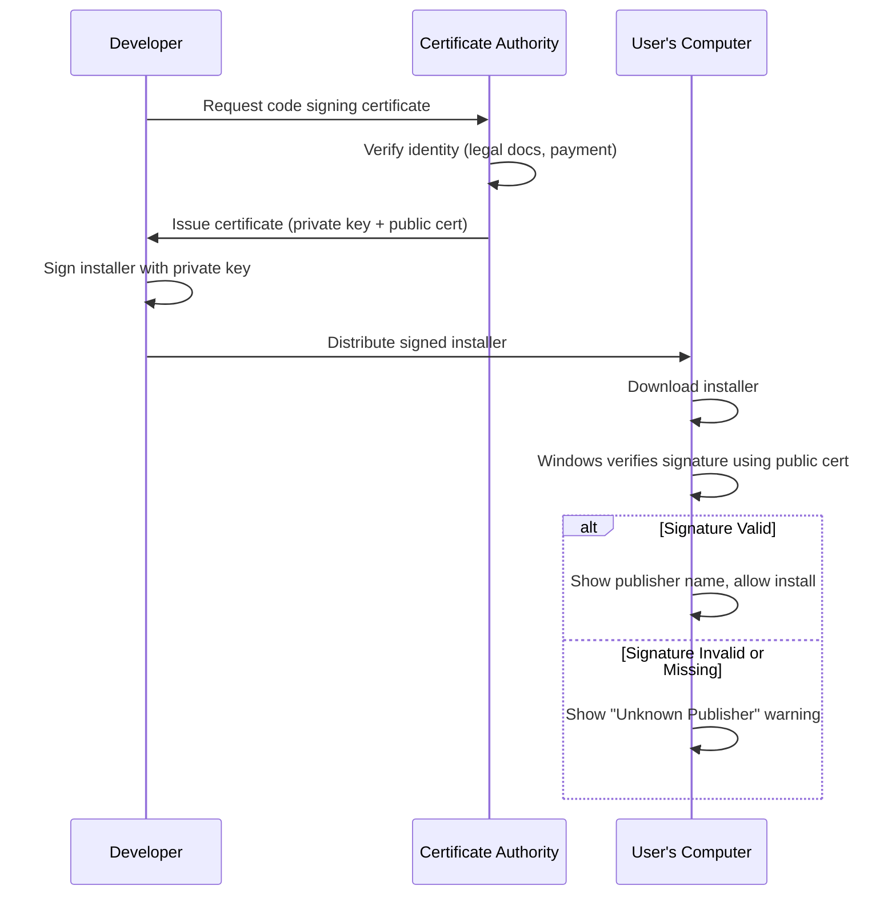
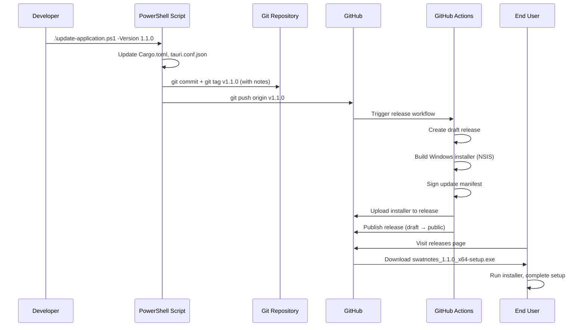

# Chapter 22: Building and Distribution

## Introduction

You've built a feature-complete desktop application with tests, error handling, and auto-updates. But how do you transform your codebase into something users can download and install? How do you prevent "Unknown Publisher" warnings? How do you automate releases so deploying version 1.1.0 doesn't require manual work?

That's what this chapter covers: **building production installers**, **code signing** to prove authenticity, and **automating the entire release process** with GitHub Actions. You'll learn how SwatNotes goes from `git push` to a downloadable installer on GitHub Releases with zero manual steps.

---

## The Publishing House Analogy

Think of distributing software like **publishing a book**:

- **Writing the book** (development): You write chapters, fix typos, add illustrations. This is your codebase.

- **Typesetting** (building): Convert manuscript into print-ready format. In software, this is compilation: TypeScript → JavaScript, Rust → binary executable.

- **Binding** (installer creation): Package printed pages into a physical book with cover. In software, this is bundling: executable + assets + installer wrapper.

- **Author signature** (code signing): Sign the book to prove you're the real author, not a forger. In software, this is digital signing with a certificate.

- **Distribution** (GitHub Releases): Send books to retailers (bookstores, Amazon). In software, host installers on GitHub Releases for users to download.

- **Automated printing press** (CI/CD): Instead of manually running the printing press for each edition, you set up automation. When you submit a new manuscript (git tag), the press automatically typesets, binds, signs, and distributes. That's GitHub Actions.

SwatNotes uses this complete pipeline: push a tag → automated build → signed installer → GitHub Release.

---

## The Build Process Overview

Building a Tauri app involves multiple stages:

```mermaid
graph LR
    A[Source Code] --> B[TypeScript Compilation]
    B --> C[Vite Bundling]
    C --> D[Rust Compilation]
    D --> E[Binary Executable]
    E --> F[Bundle Resources]
    F --> G[Create Installer]
    G --> H[Code Signing]
    H --> I[Upload to GitHub]
    
    style A fill:#e1f5ff
    style C fill:#fff4e1
    style D fill:#ffe1e1
    style G fill:#e1ffe1
    style H fill:#ffe1ff
    style I fill:#f0f0f0
```



**Stages explained**:

1. **TypeScript compilation**: `tsc` checks types (no output with `noEmit: true`)
2. **Vite bundling**: Bundles frontend (TypeScript → JavaScript, tree shaking, minification)
3. **Rust compilation**: `cargo build --release` with optimizations
4. **Binary executable**: Single `.exe` file with embedded resources
5. **Bundle resources**: Icons, manifests, dependencies copied to bundle directory
6. **Create installer**: NSIS or MSI wraps executable into installer
7. **Code signing**: Digital signature added to installer
8. **Upload**: Installer uploaded to GitHub Releases

**Commands**:
```bash
npm run tauri build   # Runs all stages
```

This single command orchestrates everything.

---

## Tauri Build Configuration

The build process is configured in [`tauri.conf.json`](../src-tauri/tauri.conf.json).

### Build Commands

From [`tauri.conf.json`](../src-tauri/tauri.conf.json) lines 5-9:

```json
{
  "build": {
    "beforeDevCommand": "npm run dev",
    "devUrl": "http://localhost:5173",
    "beforeBuildCommand": "npm run build",
    "frontendDist": "../dist"
  }
}
```

**Fields explained**:

- **`beforeDevCommand`**: Command run before starting dev mode (starts Vite dev server)
- **`devUrl`**: URL Tauri connects to in dev mode (Vite's HMR server)
- **`beforeBuildCommand`**: Command run before building (builds frontend to `dist/`)
- **`frontendDist`**: Directory with built frontend files (relative to `src-tauri/`)

**Dev vs Build flow**:

**Dev mode** (`npm run tauri dev`):
1. Run `beforeDevCommand` → starts Vite dev server on port 5173
2. Launch Tauri app connecting to `http://localhost:5173`
3. Frontend has HMR (instant updates on file save)
4. Backend recompiles on Rust file changes

**Build mode** (`npm run tauri build`):
1. Run `beforeBuildCommand` → `npm run build` → Vite builds to `dist/`
2. Compile Rust in release mode with optimizations
3. Bundle frontend files into executable
4. Create installer

### Bundle Configuration

From [`tauri.conf.json`](../src-tauri/tauri.conf.json) lines 11-30:

```json
{
  "bundle": {
    "active": true,
    "targets": ["nsis"],
    "publisher": "Swatto",
    "icon": [
      "icons/32x32.png",
      "icons/128x128.png",
      "icons/128x128@2x.png",
      "icons/icon.icns",
      "icons/icon.ico"
    ],
    "windows": {
      "certificateThumbprint": null,
      "digestAlgorithm": "sha256",
      "timestampUrl": ""
    }
  }
}
```

**Fields explained**:

- **`active`**: Enable bundling (creates installer, not just binary)
- **`targets`**: Installer types to build (`"nsis"`, `"msi"`, or both)
- **`publisher`**: Company/author name (shown in installer and Windows properties)
- **`icon`**: Icon files for different platforms
  - `.png`: Linux
  - `.icns`: macOS
  - `.ico`: Windows (embedded in `.exe`)
- **`certificateThumbprint`**: Certificate ID for code signing (null = no signing)
- **`digestAlgorithm`**: Hash algorithm for signature (`sha256`)
- **`timestampUrl`**: Timestamp server URL (proves when signing occurred)

### NSIS vs MSI

SwatNotes uses **NSIS** (Nullsoft Scriptable Install System):

| Feature | NSIS | MSI |
|---------|------|-----|
| **Customization** | Highly customizable with scripting | Limited customization |
| **File size** | Smaller (3-5 MB) | Larger (5-10 MB) |
| **Install UI** | Custom wizard | Standard Windows installer |
| **Uninstall** | Custom uninstaller | Windows Add/Remove Programs |
| **Auto-update** | Works with Tauri updater | Works with Tauri updater |
| **Corporate policies** | May be blocked | Preferred by enterprises |

**Why NSIS for SwatNotes?**
- Smaller file size (faster downloads)
- Modern, customizable installer UI
- Sufficient for consumer/small business users

**When to use MSI?**
- Enterprise deployment
- Group Policy requirements
- IT admin preference

**Using both**:
```json
"targets": ["nsis", "msi"]
```

This builds both installer types. GitHub Actions can upload both as release assets.

---

## Code Signing

Code signing adds a **digital signature** to your installer, proving:
1. **Authenticity**: The software comes from you (verified publisher)
2. **Integrity**: The installer hasn't been tampered with since signing

**Without code signing**:
```
┌─────────────────────────────────────┐
│  Windows Protected your PC          │
│                                     │
│  Microsoft Defender SmartScreen     │
│  prevented an unrecognized app     │
│  from starting.                     │
│                                     │
│  Publisher: Unknown Publisher       │
│  App: swatnotes_1.0.0_setup.exe    │
│                                     │
│  [ Don't run ]  [ More info ]      │
└─────────────────────────────────────┘
```

Users must click "More info" → "Run anyway" (scary and annoying).

**With code signing**:
```
┌─────────────────────────────────────┐
│  Install SwatNotes                  │
│                                     │
│  Publisher: Swatto                  │
│  Verified Publisher ✓               │
│                                     │
│  [ Install ]  [ Cancel ]            │
└─────────────────────────────────────┘
```

Clean, professional installation experience.

### How Code Signing Works



**Key concepts**:

1. **Certificate Authority (CA)**: Trusted third party (DigiCert, Sectigo, etc.) that verifies your identity
2. **Private key**: Secret key you use to sign installers (keep this secure!)
3. **Public certificate**: Public key embedded in signed installer (users' computers verify this)
4. **Trust chain**: Windows trusts the CA, CA vouches for you, therefore Windows trusts your signature

### Getting a Code Signing Certificate

**Options**:

1. **Extended Validation (EV) Code Signing** ($300-500/year):
   - Highest trust level
   - No SmartScreen warnings (immediate trust)
   - Requires hardware token (USB key)
   - Extensive identity verification (legal documents, D&B verification)
   - **Recommended for commercial software**

2. **Standard Code Signing** ($100-200/year):
   - Lower cost
   - SmartScreen warnings until reputation built
   - Software-based certificate (PFX file)
   - Less verification
   - **Suitable for open-source/indie projects**

3. **Open Source Projects**:
   - Some CAs offer free certificates for open source (e.g., DigiCert via GitHub Sponsors)
   - Tauri has signing keys for auto-update integrity (different from OS-level code signing)

**SwatNotes approach**:
- Uses **Tauri updater signing** (free, protects update integrity)
- Optional Windows code signing for professional distribution

### Tauri Updater Signing (Not OS Code Signing)

Tauri has its own signing system for **update integrity** (different from Windows code signing):

```bash
# Generate key pair
npx @tauri-apps/cli signer generate -w ~/.tauri/swatnotes.key

# Output:
# Private key: /home/user/.tauri/swatnotes.key
# Public key: dW50cnVzdGVkIGNvbW1lbnQ6...
```

This creates:
- **Private key**: Stored securely (GitHub Secrets), used by CI to sign update manifests
- **Public key**: Embedded in app, used to verify updates are from you

From [`tauri.conf.json`](../src-tauri/tauri.conf.json) lines 149-156:

```json
{
  "plugins": {
    "updater": {
      "endpoints": [
        "https://github.com/Swatto86/SwatNotes/releases/latest/download/latest.json"
      ],
      "pubkey": "dW50cnVzdGVkIGNvbW1lbnQ6IG1pbmlzaWduIHB1YmxpYyBrZXk6IDBBMUMwRjJFRTA0NzVBMzEKUldReFdrZmdMZzhjQ216STA2UVd0SlJyZ0hCVHBoazZRQWxlMFdBL29FMStuRG82RjN2cFlGN3IK"
    }
  }
}
```

**`pubkey`**: Base64-encoded public key. When the app checks for updates:
1. Download `latest.json` manifest
2. Verify signature using `pubkey`
3. If signature valid → download update
4. If signature invalid → reject (prevents malicious updates)

**This doesn't replace Windows code signing**—it only secures the auto-update mechanism.

---

## The Release Process

SwatNotes automates releases with a PowerShell script + GitHub Actions.

### Manual Release (PowerShell Script)

The [`update-application.ps1`](../../update-application.ps1) script handles version bumping and Git tagging:

```powershell
# Usage:
.\update-application.ps1 -Version "1.1.0" -Notes "Bug fixes and performance improvements"
```

**What it does**:

1. **Validate version** (semantic versioning: `x.y.z`)
2. **Update version files**:
   - `src-tauri/Cargo.toml`: `version = "1.1.0"`
   - `src-tauri/tauri.conf.json`: `"version": "1.1.0"`
3. **Commit changes**: `git commit -m "chore: bump version to 1.1.0"`
4. **Create annotated tag** with release notes:
   ```bash
   git tag -a v1.1.0 -F notes.txt
   ```
5. **Push to GitHub**:
   ```bash
   git push origin HEAD
   git push origin v1.1.0
   ```

**Key insight**: The **annotated Git tag stores the release notes**. GitHub Actions later extracts them.

From [`update-application.ps1`](../../update-application.ps1) lines 157-164:

```powershell
# Create annotated tag with release notes
# Write notes to temp file to handle multi-line messages properly
$tempFile = [System.IO.Path]::GetTempFileName()
Set-Content $tempFile $Notes -NoNewline
git tag -a "v$Version" -F $tempFile
Remove-Item $tempFile
Write-Success "  Created annotated tag v$Version"
```

**Why temp file?** Git needs multi-line notes from a file (`-F`) for proper formatting.

### Automated Release (GitHub Actions)

When you push a tag (e.g., `v1.1.0`), GitHub Actions automatically:
1. Build Windows installer
2. Sign update manifest
3. Create GitHub Release with notes from tag
4. Upload installer as release asset
5. Publish release (make it public)

**Workflow file**: [`.github/workflows/release.yml`](../.github/workflows/release.yml)

#### Job 1: Create Release

From [`release.yml`](../.github/workflows/release.yml) lines 18-98:

```yaml
name: Release

on:
  push:
    tags:
      - 'v*'   # Trigger on any tag starting with "v"

jobs:
  create-release:
    runs-on: ubuntu-latest
    outputs:
      release_id: ${{ steps.create-release.outputs.result }}
      version: ${{ steps.get-version.outputs.version }}
    steps:
      - name: Checkout repository
        uses: actions/checkout@v4
        with:
          fetch-depth: 0   # Fetch all history (needed for git tag)

      - name: Get version
        id: get-version
        run: |
          echo "version=${GITHUB_REF#refs/tags/v}" >> $GITHUB_OUTPUT

      - name: Get release notes from tag
        id: get-notes
        run: |
          TAG_NAME="v${{ steps.get-version.outputs.version }}"
          RAW_NOTES=$(git tag -l -n1000 "$TAG_NAME" 2>/dev/null || echo "")
          
          if [ -n "$RAW_NOTES" ]; then
            NOTES=$(echo "$RAW_NOTES" | sed "s/^${TAG_NAME}[[:space:]]*//")
          else
            NOTES="Release $TAG_NAME"
          fi
          
          {
            echo 'notes<<EOF'
            echo "$NOTES"
            echo 'EOF'
          } >> $GITHUB_OUTPUT

      - name: Create Release
        id: create-release
        uses: actions/github-script@v7
        env:
          RELEASE_NOTES: ${{ steps.get-notes.outputs.notes }}
          RELEASE_VERSION: ${{ steps.get-version.outputs.version }}
        with:
          script: |
            const { data } = await github.rest.repos.createRelease({
              owner: context.repo.owner,
              repo: context.repo.repo,
              tag_name: `v${process.env.RELEASE_VERSION}`,
              name: `SwatNotes v${process.env.RELEASE_VERSION}`,
              body: process.env.RELEASE_NOTES,
              draft: true,     # Created as draft (not public yet)
              prerelease: false
            });
            return data.id
```

**Key steps**:

1. **Extract version** from tag name (`refs/tags/v1.1.0` → `1.1.0`)
2. **Extract release notes** from tag annotation (`git tag -l -n1000`)
3. **Create GitHub Release** as draft (not visible to users yet)
4. **Output `release_id`** for next job to use

**Why draft?** We don't publish until the installer is uploaded and verified.

#### Job 2: Build Tauri App

From [`release.yml`](../.github/workflows/release.yml) lines 100-133:

```yaml
build-tauri:
  needs: create-release
  runs-on: windows-latest   # Must use Windows for Windows builds
  steps:
    - name: Checkout repository
      uses: actions/checkout@v4

    - name: Setup Rust
      uses: dtolnay/rust-toolchain@stable

    - name: Rust cache
      uses: swatinem/rust-cache@v2
      with:
        workspaces: './src-tauri -> target'

    - name: Setup Node.js
      uses: actions/setup-node@v4
      with:
        node-version: 'lts/*'
        cache: 'npm'

    - name: Install frontend dependencies
      run: npm ci

    - name: Build Tauri app
      uses: tauri-apps/tauri-action@v0
      env:
        GITHUB_TOKEN: ${{ secrets.GITHUB_TOKEN }}
        TAURI_SIGNING_PRIVATE_KEY: ${{ secrets.TAURI_SIGNING_PRIVATE_KEY }}
        TAURI_SIGNING_PRIVATE_KEY_PASSWORD: ${{ secrets.TAURI_SIGNING_PRIVATE_KEY_PASSWORD }}
      with:
        releaseId: ${{ needs.create-release.outputs.release_id }}
```

**Key steps**:

1. **Setup Rust**: Install latest stable Rust toolchain
2. **Rust cache**: Cache `target/` directory (speeds up subsequent builds)
3. **Setup Node.js**: Install LTS Node.js with npm caching
4. **Install dependencies**: `npm ci` (clean install from package-lock.json)
5. **Build Tauri app**: `tauri-apps/tauri-action` handles everything:
   - Run `npm run build` (frontend)
   - Run `cargo build --release` (backend)
   - Create NSIS installer
   - Sign update manifest with `TAURI_SIGNING_PRIVATE_KEY`
   - Upload installer to the draft release

**Environment variables**:

- **`GITHUB_TOKEN`**: Provided by GitHub Actions (for uploading to release)
- **`TAURI_SIGNING_PRIVATE_KEY`**: Your updater private key (from repository secrets)
- **`TAURI_SIGNING_PRIVATE_KEY_PASSWORD`**: Password for private key (from secrets)

**Setting up secrets**:

1. Generate key pair: `npx @tauri-apps/cli signer generate -w ~/.tauri/swatnotes.key`
2. GitHub repo → Settings → Secrets → Actions → New repository secret
3. Add `TAURI_SIGNING_PRIVATE_KEY` (paste private key content)
4. Add `TAURI_SIGNING_PRIVATE_KEY_PASSWORD` (paste password)

#### Job 3: Publish Release

From [`release.yml`](../.github/workflows/release.yml) lines 135-152:

```yaml
publish-release:
  runs-on: ubuntu-latest
  needs: [create-release, build-tauri]   # Wait for both jobs
  steps:
    - name: Publish release
      uses: actions/github-script@v7
      env:
        release_id: ${{ needs.create-release.outputs.release_id }}
      with:
        script: |
          github.rest.repos.updateRelease({
            owner: context.repo.owner,
            repo: context.repo.repo,
            release_id: process.env.release_id,
            draft: false,       # Make public
            prerelease: false
          })
```

**What it does**:

- Change release from draft to published
- Users can now see it on GitHub Releases page
- Auto-update mechanism can fetch `latest.json` manifest

### Complete Release Flow Diagram



---

## Build Output and Artifacts

After `npm run tauri build`, you get:

**Build directory**: `src-tauri/target/release/`

```
src-tauri/target/release/
├── swatnotes.exe              # Unsigned executable (8-12 MB)
├── bundle/
│   └── nsis/
│       ├── swatnotes_1.0.0_x64-setup.exe    # NSIS installer (10-15 MB)
│       └── swatnotes_1.0.0_x64.nsis.zip     # Portable ZIP
└── ...
```

**Installer details** (`swatnotes_1.0.0_x64-setup.exe`):

- **Size**: ~10-15 MB (includes runtime dependencies, WebView2 bootstrapper)
- **Format**: NSIS executable
- **Architecture**: x64 (64-bit Windows)
- **Install location**: `C:\Program Files\SwatNotes\`
- **Uninstaller**: `C:\Program Files\SwatNotes\Uninstall SwatNotes.exe`
- **Start menu shortcuts**: Created automatically
- **Desktop shortcut**: Optional during install

### WebView2 Distribution

SwatNotes uses **WebView2** (Chromium-based browser) for rendering UI. Distribution options:

1. **Bootstrapper** (default, recommended):
   - Installer checks if WebView2 is installed
   - If missing, downloads and installs it (~100 MB)
   - Installer stays small (~10 MB)

2. **Fixed version** (larger installer):
   - Bundle specific WebView2 version (~130 MB)
   - No internet required for installation
   - Installer becomes ~140 MB

3. **Evergreen** (assume pre-installed):
   - Assume Windows 11 or user already has WebView2
   - Fail if not found

SwatNotes uses **bootstrapper** (configured in `tauri.conf.json`). Windows 10 users auto-download WebView2 on first install.

---

## Release Versioning Best Practices

### Semantic Versioning (SemVer)

Format: `MAJOR.MINOR.PATCH`

- **MAJOR** (1.0.0 → 2.0.0): Breaking changes (incompatible with previous version)
- **MINOR** (1.0.0 → 1.1.0): New features (backward compatible)
- **PATCH** (1.0.0 → 1.0.1): Bug fixes (backward compatible)

**Examples**:

- `1.0.0` → `1.0.1`: Fixed crash when deleting notes
- `1.0.1` → `1.1.0`: Added dark mode theme
- `1.1.0` → `2.0.0`: Changed database schema (requires migration)

**Pre-release versions**:

- `1.0.0-alpha.1`: Alpha (unstable, missing features)
- `1.0.0-beta.2`: Beta (feature-complete, testing)
- `1.0.0-rc.1`: Release candidate (final testing)

### Git Tagging Strategy

**Annotated tags** (recommended):
```bash
git tag -a v1.1.0 -m "Release notes here"
```

Contains:
- Tag name (`v1.1.0`)
- Tagger info (name, email, date)
- Message (release notes)
- GPG signature (optional)

**Lightweight tags** (not recommended for releases):
```bash
git tag v1.1.0
```

Just a pointer to a commit. No metadata.

**SwatNotes uses annotated tags** so GitHub Actions can extract release notes.

### Release Notes Guidelines

Good release notes answer: **"Why should I update?"**

**Bad**:
```
Release 1.1.0

- Bug fixes
- Performance improvements
```

**Good**:
```
Release 1.1.0

New Features:
- Added dark mode theme (toggle in Settings)
- Collections can now be reordered via drag-and-drop

Bug Fixes:
- Fixed crash when pasting images larger than 10 MB
- Fixed search not highlighting matches in note content

Performance:
- Note list rendering is now 3x faster for large collections
- Reduced memory usage by 25% during long editing sessions

Breaking Changes:
- None (backward compatible)
```

**Format**: Group by category, be specific, mention user impact.

---

## Continuous Integration (CI) Best Practices

### Caching Dependencies

GitHub Actions charges by build minutes. Caching saves time and money.

**Rust cache** (`rust-cache@v2`):
```yaml
- uses: swatinem/rust-cache@v2
  with:
    workspaces: './src-tauri -> target'
```

Caches:
- `~/.cargo/registry` (crate downloads)
- `~/.cargo/git` (Git dependencies)
- `target/` (compiled artifacts)

**First build**: ~10 minutes (download + compile all dependencies)
**Subsequent builds**: ~2 minutes (only recompile changed code)

**npm cache** (`setup-node@v4`):
```yaml
- uses: actions/setup-node@v4
  with:
    cache: 'npm'
```

Caches `node_modules/`. First install: ~2 minutes. Subsequent: ~10 seconds.

### Build Matrix (Multi-Platform)

SwatNotes currently builds only for Windows, but you can add macOS and Linux:

```yaml
build-tauri:
  strategy:
    matrix:
      platform: [windows-latest, macos-latest, ubuntu-latest]
  runs-on: ${{ matrix.platform }}
  steps:
    # ... (rest of build steps)
```

This creates 3 jobs running in parallel, producing installers for all platforms.

**Platform-specific installers**:
- Windows: `.exe` (NSIS or MSI)
- macOS: `.dmg` (disk image) or `.app` (application bundle)
- Linux: `.AppImage`, `.deb`, or `.rpm`

### Testing Before Release

Add a test job before building:

```yaml
jobs:
  test:
    runs-on: windows-latest
    steps:
      - uses: actions/checkout@v4
      - uses: dtolnay/rust-toolchain@stable
      - uses: actions/setup-node@v4
      - run: npm ci
      - run: npm test
      - run: cargo test
  
  create-release:
    needs: test   # Only create release if tests pass
    # ...
```

This prevents releasing broken builds.

---

## Distribution Channels

### GitHub Releases (Primary)

SwatNotes uses **GitHub Releases** as the distribution channel.

**Advantages**:
- Free hosting (unlimited bandwidth for public repos)
- Automatic download tracking (GitHub shows download counts)
- Release notes + changelog visible to users
- Works seamlessly with Tauri updater
- No authentication required for public repos

**Users download via**:
1. **GitHub Releases page**: https://github.com/Swatto86/SwatNotes/releases
2. **Direct link**: https://github.com/Swatto86/SwatNotes/releases/latest
3. **Auto-update**: App checks for updates and downloads automatically

### Alternative Distribution Channels

**Microsoft Store**:
- **Pros**: Trusted by enterprise users, automatic updates, better discoverability
- **Cons**: $20 one-time fee, review process (1-3 days), restricted APIs
- **How**: Use `tauri-plugin-store` and submit MSIX package

**Chocolatey** (Windows package manager):
- **Pros**: IT admins use it, simple `choco install swatnotes`
- **Cons**: Manual package maintenance
- **How**: Create Chocolatey package pointing to GitHub Release

**Winget** (Windows Package Manager):
- **Pros**: Built into Windows 11, growing popularity
- **Cons**: Manual manifest creation
- **How**: Submit manifest to `microsoft/winget-pkgs` repo

**Self-hosted**:
- **Pros**: Full control, custom analytics
- **Cons**: Hosting costs, bandwidth costs, manual update manifest management
- **How**: Upload to S3/DigitalOcean Spaces, update Tauri endpoints

---

## Security Considerations

### Signing Keys

**Protect your private keys**:

1. **Never commit to Git**: Add to `.gitignore`
   ```gitignore
   *.key
   *.pfx
   *.p12
   ```

2. **Use GitHub Secrets**: Store in repo settings, not in code
3. **Rotate regularly**: Generate new keys yearly
4. **Use strong passwords**: 20+ character random passwords
5. **Backup securely**: Encrypted backups in password manager

**Key compromise**: If private key leaks:
1. Revoke certificate immediately
2. Generate new key pair
3. Re-sign all releases
4. Notify users via GitHub Security Advisory

### Build Environment

**GitHub Actions is secure by default**:

- **Isolated runners**: Each build runs in fresh VM (no state persists)
- **Secret redaction**: Secrets are masked in logs (`***`)
- **HTTPS only**: All network traffic encrypted
- **Audit logs**: Who triggered which build, when

**Best practices**:

1. **Pin action versions**: Use `@v4` not `@latest` (prevents supply chain attacks)
2. **Review dependencies**: Audit `package.json` and `Cargo.toml` regularly
3. **Use `dependabot`**: Auto-update dependencies with security patches
4. **Limit permissions**: Use least privilege for `GITHUB_TOKEN`

### Update Integrity

Tauri updater uses **signature verification**:

1. **Build**: CI signs `latest.json` manifest with private key
2. **Download**: App downloads manifest from GitHub
3. **Verify**: App verifies signature using public key (embedded in binary)
4. **Install**: Only if signature valid

**This prevents**:
- **Man-in-the-middle attacks**: Attacker can't inject fake update
- **GitHub compromise**: Even if GitHub is hacked, signature verification fails
- **DNS hijacking**: Attacker redirects URL, but signature won't match

---

## Troubleshooting Build Issues

### Common Build Errors

**Error: "WebView2 not found"**

```
Error: WebView2 runtime not installed
```

**Solution**: Install WebView2 Runtime:
```bash
# Download bootstrapper from Microsoft
# https://developer.microsoft.com/en-us/microsoft-edge/webview2/
```

**Error: "Failed to bundle project"**

```
Error: Failed to bundle project: No such file or directory (os error 2)
```

**Solution**: Frontend not built. Run:
```bash
npm run build
```

**Error: "Signing failed: Certificate not found"**

```
Error: Certificate with thumbprint 'xxx' not found
```

**Solution**: Either:
1. Remove `certificateThumbprint` from `tauri.conf.json` (no signing)
2. Install certificate in Windows Certificate Store

**Error: "Rust compilation failed"**

```
error[E0425]: cannot find value `foo` in this scope
```

**Solution**: Fix Rust code error. Use:
```bash
cargo check   # Fast syntax check
cargo build   # Full compilation
```

**Error: "GitHub Actions: Artifact upload failed"**

```
Error: Unable to upload asset to release
```

**Solution**: Check `GITHUB_TOKEN` permissions. Needs `contents: write`.

### Build Performance Issues

**Slow Rust compilation** (10+ minutes):

**Solutions**:
1. **Use caching**: `swatinem/rust-cache@v2`
2. **Link optimization**: Disable LTO in dev builds
   ```toml
   [profile.dev]
   lto = false
   ```
3. **Incremental compilation**: Enabled by default in dev mode
4. **Parallel compilation**: Use faster CPUs or more cores

**Slow npm install** (3+ minutes):

**Solutions**:
1. **Use caching**: `setup-node@v4` with `cache: 'npm'`
2. **Clean install**: `npm ci` instead of `npm install` (faster, deterministic)
3. **Reduce dependencies**: Audit `package.json`, remove unused packages

**Large installer size** (50+ MB):

**Solutions**:
1. **Tree shaking**: Vite does this automatically
2. **Remove debug symbols**: Release builds strip them
3. **Compress assets**: Use WebP for images, minify SVGs
4. **Lazy loading**: Don't bundle everything upfront

---

## Advanced Topics

### Cross-Compilation

Building for multiple architectures from single machine:

**Windows x64 → ARM64**:
```bash
rustup target add aarch64-pc-windows-msvc
cargo build --release --target aarch64-pc-windows-msvc
```

Requires cross-compilation toolchain. GitHub Actions supports this with build matrix.

### Custom Installer Scripts

NSIS allows custom installer scripts for:
- Custom UI themes
- Pre-install checks (disk space, dependencies)
- Post-install tasks (create shortcuts, register file types)
- Silent installation (`/S` flag)

**Example**: Check for .NET requirement before install

Create `installer.nsi`:
```nsis
!include "MUI2.nsh"

Section "CheckDotNet"
  # Check if .NET 6.0 is installed
  ReadRegStr $0 HKLM "SOFTWARE\dotnet\Setup\InstalledVersions\x64\sharedhost" "Version"
  StrCmp $0 "" 0 +3
    MessageBox MB_OK ".NET 6.0 is required. Please install it first."
    Abort
SectionEnd
```

Reference in `tauri.conf.json`:
```json
{
  "bundle": {
    "windows": {
      "nsis": {
        "installerScript": "installer.nsi"
      }
    }
  }
}
```

### Silent Installation

Allow IT admins to deploy silently:

```bash
swatnotes_1.0.0_x64-setup.exe /S
```

NSIS supports this by default. MSI requires custom configuration.

**Group Policy Deployment**:

1. Place installer on network share
2. Create GPO: Computer Configuration → Software Installation
3. Assign package: `\\server\share\swatnotes_1.0.0_x64-setup.exe`
4. Computers auto-install on next login

---

## Key Takeaways

1. **Build process**: TypeScript → Vite → Rust → Bundle → Installer (automated by `tauri build`)

2. **Installer types**: NSIS (smaller, customizable) vs MSI (enterprise-friendly)

3. **Code signing**: Windows code signing prevents SmartScreen warnings (requires paid certificate)

4. **Tauri updater signing**: Free signing for update integrity (different from OS code signing)

5. **Release automation**: PowerShell script updates versions → GitHub Actions builds + publishes

6. **GitHub Actions workflow**: Create release → Build installer → Sign manifest → Upload → Publish

7. **Versioning**: Semantic versioning (MAJOR.MINOR.PATCH), annotated Git tags with release notes

8. **Distribution**: GitHub Releases (free, unlimited bandwidth, auto-update support)

9. **Security**: Protect private keys, use GitHub Secrets, signature verification for updates

10. **Caching**: Rust and npm caching dramatically speed up CI builds (10 min → 2 min)

---

## Next Steps

You now understand how SwatNotes goes from source code to downloadable installer with automated CI/CD. In the next chapter, we'll explore **Performance Optimization**: profiling Rust and TypeScript, query optimization, memory management, and measuring real-world performance metrics. You'll learn how to identify bottlenecks and make SwatNotes faster.
